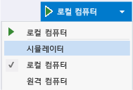
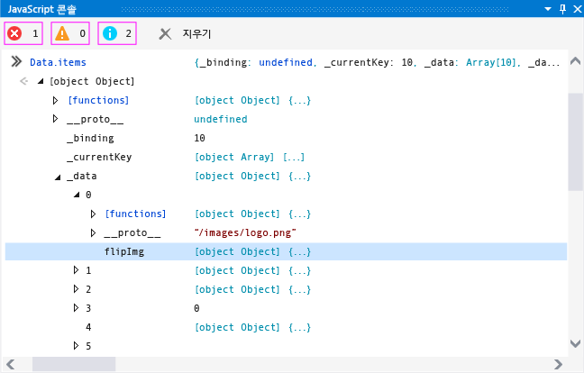
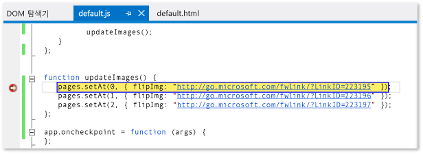
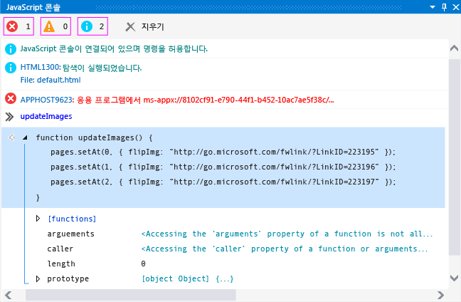
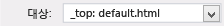

# <a name="debug-javascript-using-the-console-in-visual-studio"></a>Visual Studio에서 콘솔을 사용한 JavaScript 디버그
  
 JavaScript로 작성 된 UWP 앱을 디버그와 상호 작용 하는 JavaScript 콘솔 창을 사용할 수 있습니다. 이러한 기능은 UWP 앱 및 Apache Cordova 용 도구 Visual Studio를 사용 하 여 만든 앱에 대해 지원 됩니다. 콘솔 명령 참조는 [JavaScript Console commands](../debugger/javascript-console-commands.md)을 참조하세요.  
  
 JavaScript 콘솔 창에서는 다음 작업을 수행할 수 있습니다.  
  
-   앱에서 콘솔 창으로 개체, 값 및 메시지를 전송합니다.  
  
-   실행 중인 앱에서 로컬 및 전역 변수의 값을 보고 수정합니다.  
  
-   개체 시각화 도우미를 봅니다.  
  
-   현재 스크립트 컨텍스트에서 실행되는 JavaScript 코드를 실행합니다.  
  
-   DOM(Document Object Model) 및 Windows 런타임 오류 외에도 JavaScript 오류 및 예외를 봅니다.  
  
-   화면을 지우는 등의 다른 작업을 수행합니다. 전체 명령 목록을 보려면 [JavaScript Console commands](../debugger/javascript-console-commands.md) 을 참조하세요.  
  
> [!TIP]
>  JavaScript 콘솔 창이 닫힌 **디버그**> **Windows** > **JavaScript 콘솔** 다시 엽니다. 창은 스크립트 디버깅 세션 중에만 표시됩니다.  
  
 JavaScript 콘솔 창에서는 디버거를 중지 및 다시 시작하지 않고 앱과 상호 작용할 수 있습니다. 자세한 내용은 참조 하십시오. [(JavaScript) 앱 새로 고침](../debugger/refresh-an-app-javascript.md)합니다. 다른 JavaScript 디버깅 예: DOM 탐색기 사용 및 중단점 설정, 기능에 대 한 정보 참조 [퀵 스타트: HTML 및 CSS 디버깅](../debugger/quickstart-debug-html-and-css.md) 및 [Visual Studio에서 앱 디버깅](../debugger/debug-store-apps-in-visual-studio.md)합니다.  
  
##  <a name="InteractiveConsole"></a> JavaScript 콘솔 창을 사용하여 디버깅  
 다음 단계를 수행하면 `FlipView` 앱이 생성되고, 대화식으로 JavaScript 코딩 오류를 디버그하는 방법이 표시됩니다.  
  
> [!NOTE]
>  여기서 샘플 앱은 UWP 앱입니다. 그러나 여기에 설명된 콘솔 기능은 Visual Studio Tools for Apache Cordova를 사용하여 만든 앱에도 적용됩니다.  
  
#### <a name="to-debug-javascript-code-in-the-flipview-app"></a>FlipView 앱에서 JavaScript 코드를 디버그하려면  
  
1.  선택 하 여 Visual Studio에서 새 솔루션을 만들어 **파일** > **새 프로젝트**합니다.  
  
2.  선택 **JavaScript** > **Windows 유니버설**를 선택한 후 **WinJS 앱**합니다.  
  
3.  프로젝트의 이름(예: `FlipViewApp`)을 입력하고 **확인** 을 클릭하여 앱을 만듭니다.  
  
4.  Index.html의 BODY 요소에서 기존 HTML 코드를이 코드로 바꿉니다.  
  
    ```html  
    <div id="flipTemplate" data-win-control="WinJS.Binding.Template"  
             style="display:none">  
        <div class="fixedItem" >  
              
        </div>  
    </div>  
    <div id="fView" data-win-control="WinJS.UI.FlipView" data-win-options="{  
        itemDataSource: Data.items.dataSource, itemTemplate: flipTemplate }">  
    </div>  
    ```  
  
5.  다음과 같이 default.css를 열고 `#fView` 선택기로 CSS를 추가합니다.  
  
    ```css  
    #fView {  
        background-color:#0094ff;  
        height: 500px;  
        margin: 25px;  
    }  
    ```  
  
6.  default.js를 열고 코드를 다음 JavaScript 코드로 바꿉니다.  
  
    ```javascript  
    (function () {  
        "use strict";  
  
        var app = WinJS.Application;  
        var activation = Windows.ApplicationModel.Activation;  
  
        var myData = [];  
        for (var x = 0; x < 4; x++) {  
            myData[x] = { flipImg: "/images/logo.png" }  
        };  
  
        var pages = new WinJS.Binding.List(myData, { proxy: true });  
  
        app.onactivated = function (args) {  
            if (args.detail.kind === activation.ActivationKind.launch) {  
                if (args.detail.previousExecutionState !==  
                activation.ApplicationExecutionState.terminated) {  
                    // TODO: . . .  
                } else {  
                    // TODO: . . .  
                }  
                args.setPromise(WinJS.UI.processAll());  
  
                updateImages();  
            }  
        };  
  
        function updateImages() {  
  
            pages.push(0, { flipImg: "http://public-domain-photos.com/free-stock-photos-1/flowers/cactus-76.jpg" });  
            pages.push(1, { flipImg: "http://public-domain-photos.com/free-stock-photos-1/flowers/cactus-77.jpg" });  
            pages.push(2, { flipImg: "http://public-domain-photos.com/free-stock-photos-1/flowers/cactus-78.jpg" });  
  
        };  
  
        app.oncheckpoint = function (args) {  
        };  
  
        app.start();  
  
        var publicMembers = {  
            items: pages  
        };  
  
        WinJS.Namespace.define("Data", publicMembers);  
  
    })();  
    ```  
  
7.  디버깅 대상이 아직 선택 되지 않은, 선택 **로컬 컴퓨터** 옆에 있는 드롭다운 목록에서 **장치** 단추는 **디버그** 도구 모음:  
  
       
  
8.  F5 키를 눌러 디버거를 시작합니다.  
  
     앱이 실행되지만 이미지가 누락되었습니다. JavaScript 콘솔 창의 APPHOST 오류는 이미지가 없음을 나타냅니다.  
  
9. 와 `FlipView` 앱이 실행 되 고 형식 `Data.items` 콘솔 창 입력 프롬프트에에서 (옆에 ">>" 기호) Enter 키를 누릅니다.  
  
     `items` 개체의 시각화 도우미가 콘솔 창에 표시됩니다. 즉, `items` 개체가 인스턴스화되어, 현재 스크립트 컨텍스트에서 사용할 수 있음을 나타냅니다. 콘솔 창에서, 개체의 노드를 클릭하여 속성 값을 볼 수 있습니다(또는 화살표 키 사용). `items._data` 개체로 클릭해 내려가면 이 그림에서와 같이 이미지 소스 참조가 예상대로 올바르지 않음을 알게 됩니다. 아직 개체에 기본 이미지(logo.png)가 있고 누락된 이미지가 예상 이미지와 섞여 있습니다.  
  
       
  
     또한 `items._data` 개체에는 예상보다 훨씬 더 많은 항목이 있습니다.  
  
10. 프롬프트에서 `Data.items.push` 를 입력하고 Enter 키를 누릅니다. 콘솔 창에 `push` 프로젝트 파일에서 구현되는 [!INCLUDE[winjs_long](../debugger/includes/winjs_long_md.md)] 함수의 시각화 도우미가 표시됩니다. 이 앱에서는 `push` 를 사용하여 올바른 항목을 추가합니다. IntelliSense를 사용하여 조금만 조사하면 `setAt` 을 사용하여 기본 이미지를 바꿔야 함을 알 수 있습니다.  
  
11. 디버깅 세션을 중지하지 않고 이 문제를 대화식으로 수정하려면, default.js를 열고 `updateImages` 함수에서 이 코드를 선택합니다.  
  
    ```javascript  
    pages.push(0, { flipImg: "http://public-domain-photos.com/free-stock-photos-1/flowers/cactus-76.jpg" });  
    pages.push(1, { flipImg: "http://public-domain-photos.com/free-stock-photos-1/flowers/cactus-77.jpg" });  
    pages.push(2, { flipImg: "http://public-domain-photos.com/free-stock-photos-1/flowers/cactus-78.jpg" });  
    ```  
  
     이 코드를 복사하여 JavaScript 콘솔 입력 프롬프트에 붙여 넣습니다.  
  
    > [!TIP]
    >  여러 줄로 된 코드를 JavaScript 콘솔 입력 프롬프트에 붙여 넣으면 콘솔 입력 프롬프트가 자동으로 여러 줄 모드로 전환됩니다. Ctrl+Alt+M을 눌러 여러 줄 모드를 설정 및 해제할 수 있습니다. 여러 줄 모드에서 스크립트를 실행하려면 Ctrl+Enter를 누르거나 창의 오른쪽 아래에 있는 화살표 기호를 선택합니다. 자세한 내용은 [JavaScript 콘솔 창의 한 줄 모드 및 여러 줄 모드](#SinglelineMultilineMode)을 참조하세요.  
  
12. 프롬프트에서 `push` 함수 호출을 수정하여 `pages.push` 를 `Data.items.setAt`으로 바꿉니다. 수정된 코드는 다음과 같습니다.  
  
    ```javascript  
    Data.items.setAt(0, { flipImg: "http://public-domain-photos.com/free-stock-photos-1/flowers/cactus-76.jpg" });  
    Data.items.setAt(1, { flipImg: "http://public-domain-photos.com/free-stock-photos-1/flowers/cactus-77.jpg" });  
    Data.items.setAt(2, { flipImg: "http://public-domain-photos.com/free-stock-photos-1/flowers/cactus-78.jpg" });  
    ```  
  
    > [!TIP]
    >  `pages` 대신 `Data.items`개체를 사용하려는 경우 `pages` 개체가 범위 내에 계속 포함되도록 코드에서 중단점을 설정해야 합니다.  
  
13. 스크립트를 실행하려면 녹색 화살표 기호를 선택합니다.  
  
14. 콘솔 입력 프롬프트를 한 줄 모드로 전환 하 고 다음을 선택 하려면 Ctrl + Alt + M을 눌러 **입력 지우기** (빨간색 "X")를 입력된 프롬프트에서 코드를 삭제 합니다.  
  
15. 프롬프트에서 `Data.items.length = 3` 를 입력하고 Enter 키를 누릅니다. 그러면 데이터에서 불필요한 요소가 제거됩니다.  
  
16. 응용 프로그램을 다시 확인 하 고 올바른 이미지가 있는 올바른에 표시 됩니다 `FlipView` 페이지입니다.  
  
17. DOM 탐색기에서 업데이트된 DIV 요소가 표시되고, 예상된 IMG 요소를 찾기 위해 하위 트리로 이동할 수 있습니다.  
  
18. **디버그** > **Stop 디버그ging** 를 선택하거나 Shift+F5를 눌러 디버깅을 중지한 다음 소스 코드를 수정합니다.  
  
     수정 된 샘플 코드가 들어 있는 전체 default.html 페이지를 참조 하세요. [디버그 HTML, CSS 및 JavaScript 샘플 코드](../debugger/debug-html-css-and-javascript-sample-code.md)합니다.  
  
##  <a name="InteractiveDebuggingBreakMode"></a> 대화형 디버깅 및 중단 모드  
 JavaScript 콘솔 창과 같은 JavaScript 디버깅 도구를 사용하는 동안 중단점을 사용하여 코드를 한 단계씩 실행할 수 있습니다. 디버거에서 실행 중인 프로그램이 중단점에 도달하면 디버거에서 프로그램의 실행을 일시적으로 중단합니다. 실행이 중단되는 경우 프로그램이 실행 모드에서 중단 모드로 전환합니다. 언제든지 실행을 재개할 수 있습니다.  
  
 프로그램이 중단 모드에 있으면, JavaScript 콘솔 창을 사용하여 현재 스크립트 실행 컨텍스트에서 사용할 수 있는 명령 및 스크립트를 실행할 수 있습니다. 이 절차에서, 이전에 만든 고정 버전의 `FlipView` 앱을 사용하여 중단 모드 사용을 보여줍니다.  
  
#### <a name="to-set-a-breakpoint-and-debug-the-app"></a>중단점 설정 및 앱 디버깅  
  
1.  이전에 만든 `FlipView` 앱의 default.html 파일에서, `updateImages()` 함수의 바로 가기 메뉴를 열고 **중단점** > **중단점 삽입**을 참조하세요.  
  
2.  선택 **로컬 컴퓨터** 옆에 있는 드롭다운 목록에서 **디버깅 시작** 단추는 **디버그** 도구 모음입니다.  
  
3.  **디버그** > **Start 디버그ging**을 선택하거나 F5를 선택합니다.  
  
     실행이 `updateImages()` 함수에 도달하면 응용 프로그램이 중단 모드로 들어가며, 현재 프로그램 실행 줄은 노란색으로 강조 표시됩니다.  
  
       
  
     현재 디버깅 세션을 끝내지 않고 프로그램 상태에 바로 영향을 주도록 변수 값을 변경할 수 있습니다.  
  
4.  프롬프트에서 `updateImages` 을 입력하고 Enter 키를 누릅니다. 함수의 시각화 도우미가 콘솔 창에 나타납니다.  
  
5.  콘솔 창에서 함수를 선택하여 함수 구현을 표시합니다.  
  
     다음 그림에서는 이 시점의 콘솔 창을 보여 줍니다.  
  
       
  
6.  함수의 한 줄을 프롬프트 창에서 입력 프롬프트로 복사하고 인덱스 값을 3으로 변경합니다.  
  
    ```javascript  
    pages.setAt(3, { flipImg: "http://public-domain-photos.com/free-stock-photos-1/flowers/cactus-76.jpg" });  
    ```  
  
7.  Enter를 눌러 코드 줄을 실행합니다.  
  
     코드를 한 줄씩 단계별로 실행하려면 F11을 누르거나 F5를 눌러 프로그램 실행을 계속합니다.  
  
8.  F5를 눌러 프로그램 실행을 계속합니다. `FlipView` 앱이 표시되고, 이제 네 개의 페이지 모두에서 기본값이 아닌 이미지 중 하나를 표시합니다.  
  
     Visual Studio로 다시 전환하려면 F12 또는 Alt+Tab을 누릅니다.  
  
##  <a name="SinglelineMultilineMode"></a> JavaScript 콘솔 창의 한 줄 모드 및 여러 줄 모드  
 JavaScript 콘솔 창의 입력 프롬프트에서는 한 줄 모드와 여러 줄 모드를 모두 지원합니다. 이 항목의 대화형 디버깅 절차는 두 모드를 모두 사용하는 예제를 제공합니다. Ctrl+Alt+M을 눌러 모드를 전환할 수 있습니다.  
  
 한 줄 모드에서는 입력 기록을 제공합니다. 위쪽 화살표 및 아래쪽 화살표 키를 사용하여 입력 기록을 탐색할 수 있습니다. 한 줄 모드에서는 스크립트를 실행할 때 입력 프롬프트를 지웁니다. 한 줄 모드에서 스크립트를 실행하려면 Enter를 누릅니다.  
  
 여러 줄 모드에서는 스크립트를 실행할 때 입력 프롬프트를 지우지 않습니다. 여러 줄 모드에서 한 줄 모드로 전환 하면 키를 눌러 입력된 줄을 지울 **입력 지우기** (빨간색 "X"). 여러 줄 모드에서 스크립트를 실행하려면 Ctrl+Enter를 누르거나 창의 오른쪽 아래에 있는 화살표 기호를 선택합니다.  
  
##  <a name="Switching"></a> 스크립트 실행 컨텍스트 전환  
 JavaScript 콘솔 창을 사용하면 한번에 웹 플랫폼 호스트 (WWAHost.exe)의 단일 인스턴스를 나타내는 단일 실행 컨텍스트와 상호작용할 수 있습니다. 일부 시나리오에서는, 예를 들어 `iframe`, 공유 계약, 웹 작업자 또는 `WebView` 컨트롤을 사용하는 경우 앱에서 호스트의 다른 인스턴스를 시작할 수 있습니다. 호스트의 다른 인스턴스가 실행 중인 경우, 앱을 실행하는 동안 **대상** 목록에서 실행 컨텍스트를 선택하여 다른 실행 컨텍스트를 선택할 수 있습니다.  
  
 다음 그림에는 JavaScript 콘솔 창의 대상 목록이 나와 있습니다.  
  
   
  
 또한 `cd` 명령을 사용하여 실행 컨텍스트를 전환할 수도 있지만, 다른 실행 컨텍스트의 이름을 알아야 하고 사용하는 참조가 범위 내에 있어야 합니다. **대상** 목록에서 다른 실행 컨텍스트에 액세스하기가 더 쉽습니다.   
  
## <a name="see-also"></a>참고 항목  
 [Debug apps in Visual Studio](../debugger/debug-store-apps-in-visual-studio.md)   
 [JavaScript 콘솔 명령](../debugger/javascript-console-commands.md)   
 [(JavaScript) 앱 새로 고침](../debugger/refresh-an-app-javascript.md)   
 [바로 가기 키](../debugger/keyboard-shortcuts-html-and-javascript.md)   
 [HTML, CSS 및 JavaScript 샘플 코드 디버깅](../debugger/debug-html-css-and-javascript-sample-code.md)   
 [빠른 시작: HTML 및 CSS 디버그](../debugger/quickstart-debug-html-and-css.md)   
 [WebView 컨트롤 디버깅](../debugger/debug-a-webview-control.md)   
 [기술 지원 및 접근성](http://msdn.microsoft.com/library/tzbxw1af\(VS.120\).aspx)