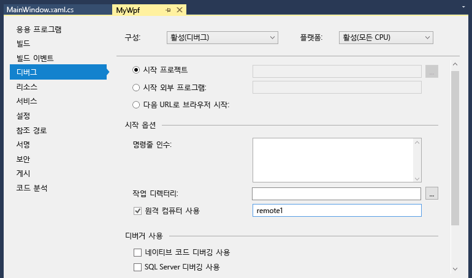

# 원격 Visual Studio에서 C# 또는 Visual Basic 프로젝트 디버깅
다른 컴퓨터에 배포 된 Visual Studio 응용 프로그램을 디버깅 하려면 설치 하 고 앱을 배포한 컴퓨터에서 원격 도구를 실행, Visual Studio에서 원격 컴퓨터에 연결 하 여 프로젝트를 구성 및 응용 프로그램을 실행 합니다.

  
원격 디버깅 앱 UWP (유니버설 Windows)에 대 한 정보를 참조 하십시오. [설치 된 응용 프로그램 패키지 디버그](debug-installed-app-package.md)합니다.

## 요구 사항

원격 디버거는 Windows 7에서 지원 되며 최신 (전화 번호) 및 Windows Server 2008 서비스 팩 2부터 Windows Server의 버전입니다. 요구 사항 목록은 전체 참조 [요구 사항](../debugger/remote-debugging.md#requirements_msvsmon)합니다.

> [!NOTE]
> 프록시를 통해 연결 된 두 컴퓨터 간에 디버깅이 지원 되지 않습니다. 국가 간 대기 시간이 긴 또는 전화 접속, 인터넷 등 낮은 대역폭 연결을 통해 또는 인터넷을 통해 디버깅 권장 되지 않습니다 및 실패 하거나 느리고 수입니다.
  
## 원격 도구 다운로드 및 설치

[!INCLUDE [remote-debugger-download](../debugger/includes/remote-debugger-download.md)]

> [!TIP]
> 일부 시나리오에서는 파일 공유에서 원격 디버거를 실행 하는 가장 효율적인 수 있습니다. 자세한 내용은 참조 [파일 공유에서 원격 디버거를 실행](../debugger/remote-debugging.md#fileshare_msvsmon)합니다.
  
## 원격 디버거 설정

[!INCLUDE [remote-debugger-configuration](../debugger/includes/remote-debugger-configuration.md)]

> [!NOTE]
> 추가 사용자에 대 한 사용 권한을 추가 하는 인증 모드를 변경 하거나 원격 디버거에 대 한 포트 번호에 필요한 경우 참조 [원격 디버거 구성](../debugger/remote-debugging.md#configure_msvsmon)합니다.
  
## 프로젝트 원격 디버그
디버거는 원격 컴퓨터에 Visual C# 또는 Visual Basic 데스크톱 응용 프로그램을 배포할 수 없지만 다음과 같이 원격으로 계속 디버그할 수 있습니다. 라는 컴퓨터에서 디버깅 하려면 다음 절차에서는 **MJO DL**아래 그림에 표시 된 것 처럼 합니다.
  
1.  라는 WPF 프로젝트 **MyWpf**합니다.  
  
2.  쉽게 도달할 수 있는 코드의 임의 위치에 중단점을 설정합니다.  
  
     예를 들어 단추 처리기에 중단점을 설정할 수 있습니다. 이 위해 MainWindow.xaml을 열고 도구 상자에서 단추 컨트롤을 추가할 한 다음 처리기의 하 고 단추를 두 번 클릭 합니다.
  
3.  솔루션 탐색기에서 프로젝트를 마우스 오른쪽 단추로 클릭 하 고 선택 **속성**합니다.  
  
4.  에 **속성** 페이지에서 선택 된 **디버그** 탭 합니다.  
  
       
  
5.  있는지 확인은 **작업 디렉터리** 텍스트 상자가 비어 있습니다.  
  
6.  선택 **원격 컴퓨터 사용**, 유형과 **MJO-DL:4022** 텍스트 상자에 있습니다. (4022는 원격 디버거 창에 표시 된 포트 번호입니다. 포트 번호를 증가 시킵니다 각 버전의 Visual Studio에서 값 2를).
  
7.  다음 사항을 확인 **네이티브 코드 디버깅 사용** 선택 하지 않으면 합니다.  
  
8.  프로젝트를 빌드합니다.  
  
9. 와 같은 경로 원격 컴퓨터에서 폴더를 만듭니다는 **디버그** Visual Studio 컴퓨터의 폴더:  **\<소스 경로 > \MyWPF\MyWPF\bin\Debug**합니다.  
  
10. Visual Studio 컴퓨터에서 방금 빌드한 실행 파일을 원격 컴퓨터에서 새로 만든 폴더에 복사합니다.
  
    > [!CAUTION]
    >  코드 또는 rebuild를 변경 하지 않고 (또는이 단계를 반복 해야) 합니다. 원격 컴퓨터에 복사한 실행 파일은 로컬 소스 및 기호와 정확히 일치해야 합니다.

    프로젝트를 수동으로 복사, Xcopy, Robocopy, Powershell 또는 기타 옵션을 사용할 수 있습니다.
  
11. 원격 디버거가 대상 컴퓨터에서 실행 되 고 있는지 확인 (없는 경우 검색할 **원격 디버거** 에 **시작** 메뉴). 원격 디버거 창은 다음과 같습니다.  
  
       
  
12. Visual Studio에서 디버깅 시작 (**디버그 > 디버깅 시작**, 또는 **F5**).  
  
13. 메시지가 표시 되 면 원격 컴퓨터에 연결 하려면 네트워크 자격 증명을 입력 합니다.  
  
     필요한 자격 증명은 네트워크의 보안 구성에 따라 달라 집니다. 예를 들어 도메인 컴퓨터에 도메인 이름 및 암호를 입력할 수 있습니다. 도메인이 아닌 컴퓨터에서 입력할 수 있습니다 컴퓨터 이름 및 유효한 사용자 계정 이름 같은  **MJO-DL\name@something.com** , 올바른 암호와 함께 합니다.

     WPF 응용 프로그램의 주 창이 원격 컴퓨터에서 열려 있다고 표시 됩니다.
  
14. 필요한 경우 중단점이 적중 하는 작업을 수행 합니다. 중단점이 활성화된 것으로 표시되어야 합니다. 그렇지 않다면 응용 프로그램에 대 한 기호 로드 하지 않았습니다. 다시 시도 및 작동 하지 않으면 기호를 로드 하는 방법에 대 한 정보를 가져올 고에서 문제를 해결 방법을 [이해 기호 파일 및 Visual Studio의 기호 설정](http://blogs.msdn.com/b/visualstudioalm/archive/2015/01/05/understanding-symbol-files-and-visual-studio-s-symbol-settings.aspx)합니다.
  
15. Visual Studio 컴퓨터에서 실행이 중단점에서 중지된 것이 표시됩니다.
  
 응용 프로그램에서 사용해야 하는 비코드 파일이 있는 경우 Visual Studio 프로젝트에 포함해야 합니다. 추가 파일을 프로젝트 폴더를 만듭니다 (에 **솔루션 탐색기**, 클릭 **추가 > 새 폴더**). 다음 폴더에 파일 추가 (에 **솔루션 탐색기**, 클릭 **추가 > 기존 항목**, 파일을 선택). 에 **속성** 각 파일에 대 한 페이지에서 설정 **출력 디렉터리로 복사** 를 **항상 복사**합니다.

## 원격 기호를 사용한 디버깅 설정 

[!INCLUDE [remote-debugger-symbols](../debugger/includes/remote-debugger-symbols.md)]  
  
## 참고 항목  
 [Visual Studio의 디버깅](../debugger/index.md)  
 [디버거 기능 둘러보기](../debugger/debugger-feature-tour.md)   
 [원격 디버깅용 Windows 방화벽 구성](../debugger/configure-the-windows-firewall-for-remote-debugging.md)   
 [원격 디버거 포트 할당](../debugger/remote-debugger-port-assignments.md)   
 [원격 IIS 컴퓨터의 원격 디버깅 ASP.NET](../debugger/remote-debugging-aspnet-on-a-remote-iis-computer.md)  
 [원격 디버깅 오류 및 문제 해결](../debugger/remote-debugging-errors-and-troubleshooting.md)