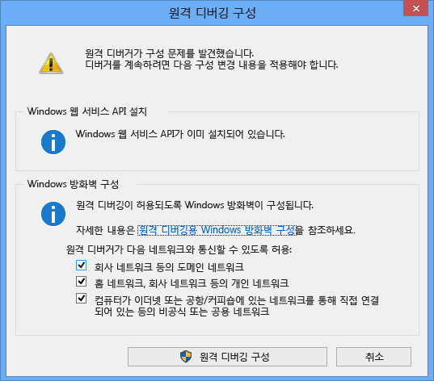
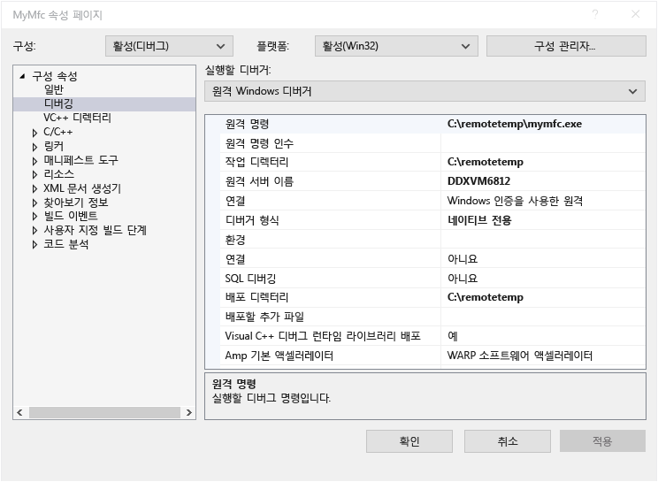
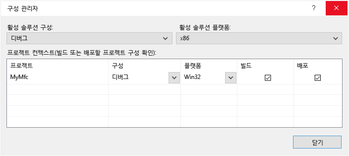

# 원격 디버깅
[!INCLUDE[vs2017banner](../code-quality/includes/vs2017banner.md)]

다른 컴퓨터에 배포된 Visual Studio 응용 프로그램을 디버그할 수 있습니다.  이렇게 하려면 Visual Studio 원격 디버거를 사용합니다.  
  
 여기에 제공된 정보는 Windows 데스크톱 응용 프로그램 및 ASP.NET 응용 프로그램에 적용됩니다.  Windows 스토어 앱 및 Azure 앱의 원격 디버깅에 대한 자세한 내용은 [Windows 스토어 및 Azure 앱의 원격 디버깅](#bkmk_winstoreAzure)을 참조하세요.  
  
## 원격 도구 다운로드 및 설치  
 디버깅을 위한 원격 도구는 [Visual Studio용 원격 도구 2015](https://www.microsoft.com/en-us/download/details.aspx?id=48155)에서 다운로드할 수 있습니다. x86, x64 및 ARM 버전의 도구를 선택할 수 있습니다. 실행 파일을 다운로드했으면 지침에 따라 원격 컴퓨터에 응용 프로그램을 설치합니다.  
  
 [Visual Studio 2015 업데이트 1용 원격 도구](https://www.microsoft.com/en-us/download/details.aspx?id=49986&44F86079-8679-400C-BFF2-9CA5F2BCBDFC=1)에서 원격 도구의 업데이트 1 버전을 다운로드할 수 있습니다.  
  
> [!IMPORTANT]
>  Visual Studio 설치 버전과 일치하는 버전의 원격 도구를 설치해야 합니다. 일치하지 않는 버전은 지원되지 않습니다. 또한 디버그하려는 응용 프로그램과 동일한 아키텍처를 가진 원격 도구를 설치해야 합니다. 즉, 64비트 응용 프로그램을 디버그하려는 경우 64비트 버전의 원격 도구를 설치해야 합니다.  
  
 원격 컴퓨터에 Visual Studio 2015 Community, Professional 또는 Enterprise가 이미 설치되어 있는 경우 원격 디버거\(**msvsmon.exe**\)가 이미 설치되어 있으며 해당 디렉터리에서 시작할 수 있습니다.  
  
 **\<Visual Studio 설치 디렉터리\>\\Common7\\IDE\\Remote Debugger\\\(x64, x86, Appx\)\\msvsmon.exe**  
  
 그러나 **원격 디버거 구성 마법사**\(**rdbgwiz.exe**\)는 도구를 다운로드하여 설치한 경우에만 설치되며, 특히 원격 디버거를 서비스로 실행하려는 경우 나중에 해당 마법사를 구성에 사용해야 할 수도 있습니다. 자세한 내용은 아래의 [원격 디버거를 서비스로 구성](#bkmk_configureService)을 참조하세요.  
  
## 지원되는 운영 체제  
 원격 컴퓨터에서 다음 운영 체제 중 하나를 실행해야 합니다.  
  
-   Windows 10  
  
-   Windows 8 또는 8.1  
  
-   Windows 7 서비스 팩 1  
  
-   Windows Server 2012 또는 Windows Server 2012 R2  
  
-   Windows Server 2008 서비스 팩 2, Windows Server 2008 R2 서비스 팩 1  
  
## 지원되는 하드웨어 구성  
  
-   1.6GHz 이상의 프로세서  
  
-   1GB RAM\(가상 컴퓨터에서 실행하는 경우 1.5GB\)  
  
-   1GB의 하드 디스크 여유 공간  
  
-   5400RPM 하드 드라이브  
  
-   1024x768 이상 디스플레이 해상도로 실행되는 DirectX 9 지원 비디오 카드  
  
## 네트워크 구성  
 원격 컴퓨터와 Visual Studio 컴퓨터는 네트워크, 작업 그룹 또는 홈 그룹을 통해 연결되거나 이더넷 케이블을 통해 직접 연결되어야 합니다. 인터넷을 통한 디버깅은 지원되지 않습니다.  
  
## 원격 디버거 설치  
 원격 컴퓨터에서 관리자 권한이 있어야 합니다.  
  
1.  원격 디버거 응용 프로그램을 찾습니다.**시작** 메뉴에서 **원격 디버거**를 검색할 수 있습니다.  
  
2.  처음으로\(또는 구성하기 전에\) 원격 도구를 시작하는 경우 **원격 디버깅 구성** 대화 상자가 나타납니다.  
  
       
  
3.  Windows 서비스 API가 설치되어 있지 않으면\(Windows Server 2008 R2에서만 발생함\) **설치** 단추를 선택합니다.  
  
4.  원격 도구를 사용하려는 네트워크 종류를 선택합니다. 하나 이상의 네트워크 형식을 선택해야 합니다. 컴퓨터가 도메인을 통해 연결된 경우 첫 번째 항목을 선택해야 합니다. 컴퓨터가 작업 그룹 또는 홈 그룹을 통해 연결된 경우 두 번째 또는 세 번째 항목을 적절하게 선택해야 합니다.  
  
5.  **원격 디버깅 구성**을 선택하여 방화벽을 구성하고 도구를 시작합니다.  
  
6.  구성이 완료되면 원격 디버거 창이 나타납니다.  
  
       
  
 창에서 **파일 \/ 종료**를 클릭하여 원격 디버거를 중지할 수 있습니다.**시작** 메뉴 또는 명령줄에서 다시 시작할 수 있습니다.  
  
 **\<Visual Studio 설치 디렉터리\>\\Common7\\IDE\\Remote Debugger\\\<x86, x64 또는 Appx\\msvsmon.exe**.  
  
## 원격 디버거 구성  
 원격 디버거를 처음으로 시작한 후에 원격 디버거 구성의 일부 측면을 변경할 수 있습니다.  
  
-   다른 사용자가 원격 디버거에 연결할 수 있게 하려면 **도구 \/ 사용 권한**을 선택합니다. 사용 권한을 부여하거나 거부하려면 관리자 권한이 있어야 합니다.  
  
-   인증 모드 또는 포트 번호를 변경하거나 원격 도구의 시간 제한 값을 지정하려면 도구 \/ 옵션을 선택합니다.  
  
     기본적으로 사용되는 포트 번호 목록은 [원격 디버거 포트 할당](../debugger/remote-debugger-port-assignments.md)을 참조하세요.  
  
> [!WARNING]
>  원격 도구를 인증 안 함 모드에서 실행할 수도 있지만 이 모드는 사용하지 않는 것이 좋습니다. 이 모드에서 실행할 때는 네트워크 보안이 없습니다. 네트워크에 악의적인 트래픽이나 유해 트래픽 위험이 확실히 없는 경우에만 인증 안 함 모드를 선택하세요.  
  
##   원격 디버거를 서비스로 구성  
 ASP.NET 및 기타 서버 환경에서 디버그하는 경우 원격 디버거를 서비스로 실행해야 합니다.  
  
1.  **원격 디버거 구성 마법사**\(rdbgwiz.exe\)를 찾습니다. 이는 원격 디버거와 별도의 응용 프로그램입니다. 원격 도구를 설치한 경우에만 사용할 수 있습니다. Visual Studio와 함께 설치되지 않습니다.  
  
2.  구성 마법사 실행을 시작합니다. 첫 페이지가 표시되면 **다음**을 클릭합니다.  
  
3.  **Visual Studio 2015 원격 디버거를 서비스로 실행** 확인란을 선택합니다.  
  
4.  사용자 계정 및 암호의 이름을 추가합니다.  
  
     이 계정에 **서비스로 로그온** 사용자 권한을 추가해야 할 수도 있습니다.**시작** 페이지 또는 창에서 **로컬 보안 정책**\(secpol.msc\)을 찾습니다\(또는 명령 프롬프트에서 **secpol** 입력\). 창이 나타나면 **사용자 권한 할당**을 두 번 클릭한 다음 오른쪽 창에서 **서비스로 로그온**을 찾습니다. 폴더를 두 번 클릭합니다.**속성** 창에 사용자 계정을 추가하고 **확인**을 클릭합니다.**다음**을 클릭합니다.  
  
5.  원격 도구가 통신하는 데 사용할 네트워크 유형을 선택합니다. 하나 이상의 네트워크 형식을 선택해야 합니다. 컴퓨터가 도메인을 통해 연결된 경우 첫 번째 항목을 선택해야 합니다. 컴퓨터가 작업 그룹 또는 홈 그룹을 통해 연결된 경우 두 번째 또는 세 번째 항목을 선택해야 합니다.**다음**을 클릭합니다.  
  
6.  서비스를 시작할 수 있는 경우 **Visual Studio 원격 디버거 구성 마법사를 성공적으로 완료했습니다.**가 표시됩니다. 서비스를 시작할 수 없는 경우 **Visual Studio 원격 디버거 구성 마법사 완료 실패**가 표시됩니다. 이 페이지에서는 서비스를 시작하기 위해 수행할 몇 가지 팁도 제공합니다.  
  
7.  **마침**을 클릭합니다.  
  
 이제 원격 디버거가 서비스로 실행됩니다.**제어판 \/ 서비스**로 이동한 다음 **Visual Studio 2015 원격 디버거**를 찾아 이를 확인할 수 있습니다.  
  
 **제어판 \/ 서비스**에서 원격 디버거 서비스를 중지 및 시작할 수 있습니다.  
  
## 다른 사용자 계정으로 원격 디버거 실행  
 Visual Studio 컴퓨터에서 사용하는 사용자 계정과 다른 사용자 계정으로 원격 디버거를 실행할 수 있지만 원격 디버거의 사용 권한에 다른 사용자 계정을 추가해야 합니다.  
  
-   **\/allow \<사용자 이름\>** 매개 변수를 사용하여 명령줄에서 원격 디버거를 시작할 수 있습니다\(**msvsmon \/allow \<username@computer\>**\).  
  
-   원격 디버거 창\(**도구 \/ 사용 권한**\)에서 원격 디버거의 사용 권한에 사용자를 추가할 수 있습니다.  
  
## Visual C\+\+ 프로젝트 원격 디버그  
 다음 절차에서 프로젝트의 이름 및 경로는 C:\\remotetemp\\MyMfc이고 원격 컴퓨터의 이름은 **remote1**입니다.  
  
1.  **mymfc**라는 MFC 응용 프로그램을 만듭니다.  
  
2.  `CMainFrame::OnCreate`의 시작 부분에서 쉽게 도달할 수 있는 응용 프로그램의 임의 위치\(예: **MainFrm.cpp**\)에 중단점을 설정합니다.  
  
3.  Visual Studio의 **프로젝트** 메뉴에서 **속성**을 선택합니다.**디버깅** 탭을 엽니다.  
  
4.  **실행할 디버거**를 **원격 Windows 디버거**로 설정합니다.  
  
       
  
5.  다음과 같이 속성을 변경합니다.  
  
    |||  
    |-|-|  
    |**설정**|**값**|  
    |원격 명령|C:\\remotetemp\\mymfc.exe|  
    |작업 디렉터리|C:\\remotetemp|  
    |원격 서버 이름|remote1|  
    |연결|Windows 인증을 사용한 원격|  
    |디버거 형식|네이티브 전용|  
    |배포 디렉터리|C:\\remotetemp.|  
    |배포할 추가 파일|C:\\data\\mymfcdata.txt.|  
  
6.  도구 모음에서 **솔루션 구성** 드롭다운 메뉴를 열고 **구성 관리자**를 선택합니다.  
  
7.  **디버그** 구성의 경우 **배포** 확인란을 선택합니다.  
  
       
  
8.  디버깅을 시작합니다\(**디버그 \/ 디버깅 시작** 또는 **F5**\).  
  
9. 실행 파일이 원격 컴퓨터에 자동으로 배포됩니다.  
  
10. Visual Studio 컴퓨터에서 실행이 중단점에서 중지된 것이 표시됩니다.  
  
    > [!TIP]
    >  또는 별도의 단계로 파일을 배포할 수 있습니다.**솔루션 탐색기**에서 **mymfc** 노드를 마우스 오른쪽 단추로 클릭하고 **배포**를 선택합니다.  
  
 응용 프로그램에서 사용해야 하는 비코드 파일이 있는 경우 Visual Studio 프로젝트에 포함해야 합니다. 추가 파일을 위한 프로젝트 폴더를 만듭니다\(**솔루션 탐색기**에서 **추가 \/ 새 폴더** 클릭\). 그런 다음 폴더에 파일을 추가합니다\(**솔루션 탐색기**에서 **추가 \/ 기존 항목**을 클릭한 다음 파일 선택\). 각 파일에 대한 **속성** 페이지에서 **출력 디렉터리에 복사**를 **항상 복사**로 설정합니다.  
  
## Visual C\# 또는 Visual Basic 프로젝트 원격 디버그  
 디버거는 원격 컴퓨터에 Visual C\# 또는 Visual Basic 데스크톱 응용 프로그램을 배포할 수 없지만 다음과 같이 원격으로 계속 디버그할 수 있습니다. 다음 절차에서는 **remote1**이라는 컴퓨터에서 디버그한다고 가정합니다.  
  
1.  **MyWpf**라는 WPF 프로젝트를 만듭니다.  
  
2.  쉽게 도달할 수 있는 코드의 임의 위치에 중단점을 설정합니다. 예를 들어 단추 처리기에 중단점을 설정할 수 있습니다.  
  
3.  **프로젝트** 메뉴에서 **속성**을 선택합니다.  
  
4.  **속성** 페이지에서 **디버그** 탭을 선택합니다.  
  
       
  
5.  **작업 디렉터리** 텍스트 상자가 비어 있는지 확인합니다.  
  
6.  **원격 컴퓨터 사용**을 선택하고 텍스트 상자에 **remote1**을 입력합니다.  
  
7.  **네이티브 코드 디버깅 사용**이 선택되지 않았는지 확인합니다.  
  
8.  프로젝트를 빌드합니다.  
  
9. Visual Studio 컴퓨터의 **디버그** 폴더와 동일한 경로인 폴더를 원격 컴퓨터에 만듭니다\(**\<소스 경로\>\\MyWPF\\MyWPF\\bin\\Debug**\).  
  
10. Visual Studio 컴퓨터에서 방금 빌드한 실행 파일을 원격 컴퓨터에서 새로 만든 폴더에 복사합니다.  
  
    > [!CAUTION]
    >  이 단계 전에는 코드를 변경하거나 다시 빌드하지 마세요. 원격 컴퓨터에 복사한 실행 파일은 로컬 소스 및 기호와 정확히 일치해야 합니다.  
  
11. Visual Studio에서 디버깅을 시작합니다\(**디버그 \/ 디버깅 시작** 또는 **F5**\).  
  
12. 중단점을 확인합니다. 중단점이 활성화된 것으로 표시되어야 합니다. 활성화되지 않은 경우 응용 프로그램에 대한 기호가 로드되지 않은 것입니다. 기호를 로드하고 문제를 해결하는 방법에 대한 자세한 내용은 [기호 파일 및 Visual Studio의 기호 설정 이해](http://blogs.msdn.com/b/visualstudioalm/archive/2015/01/05/understanding-symbol-files-and-visual-studio-s-symbol-settings.aspx)를 참조하세요.  
  
13. WPF 응용 프로그램의 주 창이 원격 컴퓨터에서 열려 있다고 표시됩니다. 중단점이 적중되게 하는 작업을 수행합니다.  
  
14. Visual Studio 컴퓨터에서 실행이 중단점에서 중지된 것이 표시됩니다.  
  
 응용 프로그램에서 사용해야 하는 비코드 파일이 있는 경우 Visual Studio 프로젝트에 포함해야 합니다. 추가 파일을 위한 프로젝트 폴더를 만듭니다\(**솔루션 탐색기**에서 **추가 \/ 새 폴더** 클릭\). 그런 다음 폴더에 파일을 추가합니다\(**솔루션 탐색기**에서 **추가 \/ 기존 항목**을 클릭한 다음 파일 선택\). 각 파일에 대한 **속성** 페이지에서 **출력 디렉터리에 복사**를 **항상 복사**로 설정합니다.  
  
## ASP.NET 응용 프로그램 원격 디버그  
 IIS를 실행하는 원격 컴퓨터에 ASP.NET 응용 프로그램을 배포하는 경우 운영 체제 및 IIS 버전에 따라 다른 단계가 있습니다. IIS 8 이상이 설치되어 있는 Windows 8 이상 또는 Windows Server 2012 운영 체제를 실행하는 원격 컴퓨터의 경우 [IIS에 게시](https://docs.asp.net/en/latest/publishing/iis.html)를 참조하세요.  
  
 IIS 7.5가 설치되어 있는 Windows 7 또는 Windows Server 2008을 실행하는 원격 컴퓨터의 경우 [원격 IIS 7.5 컴퓨터의 원격 디버깅 ASP.NET](../debugger/remote-debugging-aspnet-on-a-remote-iis-7-5-computer.md)를 참조하세요.  
  
## 원격 기호를 사용한 디버깅 설정  
 Visual Studio 컴퓨터에서 생성하는 기호를 사용하여 코드를 디버그할 수 있습니다. 로컬 기호를 사용하는 경우 원격 디버거의 성능이 훨씬 더 빠릅니다. 원격 기호를 사용해야 경우 원격 컴퓨터에서 기호를 찾도록 원격 디버깅 모니터에 지시해야 합니다.  
  
 Visual Studio 2013 Update 2부터 다음 msvsmon 명령줄 스위치를 통해 관리 코드에 원격 기호를 사용할 수 있습니다. `Msvsmon / /FallbackLoadRemoteManagedPdbs`  
  
 자세한 내용은 원격 디버깅 도움말을 참조하세요\(원격 디버거 창에서 **F1** 키를 누르거나 **도움말 \/ 사용법** 클릭\).[Visual Studio 2012 및 2013의 .NET 원격 기호 로드 변경 내용](http://blogs.msdn.com/b/visualstudioalm/archive/2013/10/16/net-remote-symbol-loading-changes-in-visual-studio-2012-and-2013.aspx)에서 자세한 내용을 확인할 수 있습니다.  
  
##   Windows 스토어 및 Azure 앱의 원격 디버깅  
 Windows 스토어 앱을 사용한 원격 디버깅에 대한 자세한 내용은 [Visual Studio를 사용하여 원격 장치의 Windows 스토어 앱 디버그 및 테스트](http://msdn.microsoft.com/library/windows/apps/hh441469.aspx)를 참조하세요.  
  
 Azure의 디버깅에 대한 자세한 내용은 다음 항목 중 하나를 참조하세요.  
  
-   [Visual Studio에서 클라우드 서비스 또는 가상 컴퓨터 디버그](http://msdn.microsoft.com/library/azure/ff683670.aspx)  
  
-   [Visual Studio에서 .NET 백 엔드 디버그](http://blogs.msdn.com/b/azuremobile/archive/2014/03/14/debugging-net-backend-in-visual-studio.aspx)  
  
-   Azure 웹 사이트의 원격 디버깅 소개\([1부](http://azure.microsoft.com/blog/2014/05/06/introduction-to-remote-debugging-on-azure-web-sites/), [2부](http://azure.microsoft.com/blog/2014/05/07/introduction-to-remote-debugging-azure-web-sites-part-2-inside-remote-debugging/), [3부](http://azure.microsoft.com/blog/2014/05/08/introduction-to-remote-debugging-on-azure-web-sites-part-3-multi-instance-environment-and-git/)\)  
  
## 참고 항목  
 [Visual Studio의 디버깅](../debugger/debugging-in-visual-studio.md)   
 [원격 디버깅을 위해 Windows 방화벽 구성](../debugger/configure-the-windows-firewall-for-remote-debugging.md)   
 [원격 디버거 포트 할당](../debugger/remote-debugger-port-assignments.md)   
 [원격 IIS 7.5 컴퓨터의 원격 디버깅 ASP.NET](../debugger/remote-debugging-aspnet-on-a-remote-iis-7-5-computer.md)   
 [원격 디버깅 오류 및 문제 해결](../debugger/remote-debugging-errors-and-troubleshooting.md)