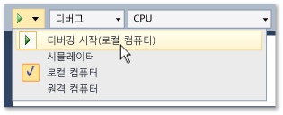

# Visual Studio에서 UWP 앱 실행
UWP 앱은 광범위 한 장치에서 실행 하 고 Visual Studio에서는 다양 한 방법으로 실행 하 고 해당 앱과 상호 작용 있는 제공 합니다. "F5" 기능이 향상되어 개발하는 동안 앱을 쉽게 디버깅하고 프로파일링 및 테스트할 수 있게 되었습니다.  
  
   
  
## 단원 내용  
  
|||  
|-|-|  
|[UWP 앱에서 로컬 컴퓨터에서 실행](../debugger/run-windows-store-apps-on-the-local-machine.md)|Visual Studio 장치에서 UWP 앱을 실행 합니다.|  
|[시뮬레이터에서 UWP 앱을 실행 합니다.](../debugger/run-windows-store-apps-in-the-simulator.md)|UWP 앱을 시뮬레이션 하는 데스크톱 창에서 실행 [!INCLUDE[win8_appname_long](../debugger/includes/win8_appname_long_md.md)] 터치 및 방향과 같은 기능입니다.|  
|[UWP 앱을 원격 컴퓨터에서 실행](../debugger/run-windows-store-apps-on-a-remote-machine.md)|배포 하 고 네트워크를 통해 네트워크나 이더넷 케이블을 통해 직접 Visual Studio 컴퓨터에 연결 된 장치에서 UWP 앱을 실행 합니다.|  
|[에뮬레이터에서 Windows Phone 앱 실행](../debugger/run-windows-phone-apps-in-the-emulator.md)|UWP 앱을 Windows Phone 시뮬레이트하는 데스크톱 창에서 실행 합니다.|  
|[Visual Studio에서 UWP 앱 배포](../debugger/deploy-windows-store-apps-from-visual-studio.md)|배포 하 고 임시 테스트에 대 한 장치에서 UWP 앱을 등록 합니다.|