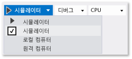

# 시뮬레이터에서 UWP 및 Windows 8.1 앱을 실행 합니다.
UWP 및 Windows 8.1 앱에 대 한 Visual Studio 시뮬레이터는 UWP 또는 Windows 8.1 앱을 시뮬레이션 하는 데스크톱 응용 프로그램입니다. 실행할 수는 실제 화면 크기와 해상도 에뮬레이트 하려면 응용 프로그램을 선택 합니다. 일반적인 터치 및 회전 이벤트를 시뮬레이션 하 고 네트워크 연결 속성을 시뮬레이트할 수도 있습니다.
  
 시뮬레이터를 있습니다 수 설계, 개발, 디버그 및 UWP 앱을 테스트 환경을 제공 합니다. 그러나 Microsoft 스토어에 앱을 게시 하기 전에 실제 장치에서 앱을 테스트 해야 합니다.  
  
 UWP 앱 용 Visual Studio 시뮬레이터는 로컬 컴퓨터의 격리 된 환경에서 실행 되지 않습니다. 따라서 복구할 수 없는 시스템 차원의 오류처럼 시뮬레이터에서 발생하는 오류가 전체 컴퓨터에 영향을 줄 수 있습니다.  
  
 Windows Phone 정보는 [Run Windows Phone apps in the emulator](../debugger/run-windows-phone-apps-in-the-emulator.md) 을 참조하세요.  
  
> [!IMPORTANT]
>  Visual Studio 2015 시뮬레이터에는 지리적 위치 단추가 없습니다. 이는 Windows 10 시뮬레이터에 지리적 위치 시뮬레이션이 없기 때문입니다. 이와 같은 시뮬레이션을 수행해야 하면 Windows 8.1 이하 운영 체제에서 Visual Studio 2013 시뮬레이터를 사용할 수 있습니다.  
  
##   시뮬레이터를 대상으로 설정  
 시뮬레이터에서 UWP 앱을 실행 하려면 선택 **시뮬레이터** 옆에 있는 드롭다운 목록에서 **디버깅 시작** 디버거 단추 **표준** 도구 모음입니다.  
  
   
  
##   상호 작용 모드 선택  
 다음 조작 모드를 선택할 수 있습니다.  
  
-    마우스 모드: 조작 모드를 마우스 제스처로 설정 합니다. 마우스 제스처에는 클릭, 두 번 클릭 및 끌기가 포함됩니다.  
  
-    터치 에뮬레이션 시작: 조작 모드를 한 손가락 터치 제스처로 설정 합니다. 한 손가락 이벤트에는 누르기, 끌기 및 넘기기가 포함됩니다.  
  
      단일 대상 아이콘은 시뮬레이터에 있는 이벤트의 위치를 나타냅니다. 마우스를 사용하여 포인터를 배치할 수 있습니다.  
  
      는 마우스 왼쪽된 단추를 누르면 터치 모드가 활성화 됩니다. 예를 들어 단추를 클릭하여 탭을 시뮬레이션하거나 단추를 누른 상태로 끌거나 살짝 밉니다.  
  
## 축소 및 확대  
 상호 작용 모드를 두 손가락의 축소 및 확대 제스처로 설정합니다.  
  
-     
  
     이중 대상 아이콘은 장치 화면에서 두 손가락의 위치를 나타냅니다.  
  
    -   마우스를 이동하여 아이콘을 장치 화면의 개체 위에 배치합니다.  
  
    -   축소 또는 확대하기 전에 마우스 휠을 앞쪽이나 뒤쪽으로 돌려 두 손가락의 시뮬레이션된 거리를 변경합니다.  
  
-   -     
  
         왼쪽 단추를 누르고 휠을 뒤쪽(사용자 쪽)으로 돌려 확대(축소)합니다.  
  
    -   왼쪽 단추를 누르고 마우스 휠을 앞쪽(사용자 반대쪽)으로 돌려 축소(확대)합니다.  
  
## 개체 방향  
 
             **터치 에뮬레이션 회전** 단추는 조작 모드를 두 손가락을 사용한 회전 제스처로 설정합니다.  
  
-   -   마우스를 이동하여 아이콘을 장치 화면의 개체 위에 배치합니다.  
  
    -   개체를 회전하기 전에 마우스 휠을 앞쪽이나 뒤쪽으로 돌려 두 손가락의 시뮬레이션된 방향을 변경합니다.  
  
-   -   왼쪽 단추를 누르고 휠을 뒤쪽(사용자 쪽)으로 돌려 개체를 시계 반대 방향으로 회전합니다. 마우스 휠을 돌리면 두 개의 대상 아이콘 중 하나가 나머지 아이콘 주위로 회전하여 상대적인 회전 크기를 나타냅니다.  
  
    -   왼쪽 단추를 누르고 마우스 휠을 앞쪽(사용자 반대쪽)으로 돌려 개체를 시계 방향으로 회전합니다.  
  
##   항상 위 모드 사용 또는 사용 안 함  
 시뮬레이터 창이 항상 다른 창의 위쪽에 오도록 설정할 수 있습니다. **맨 위 창 설정/해제** 단추는 시뮬레이터 창의 **항상 위** 모드를 사용하거나 사용하지 않도록 설정합니다.  
  
##   장치 방향 변경  
 시뮬레이터를 임의의 방향으로 90도 회전하여 장치 방향을 가로와 세로 간에 전환할 수 있습니다.  
  
> [!NOTE]
>  시뮬레이터는 프로젝트의 [DisplayProperties.AutoRotationPreferences](http://go.microsoft.com/fwlink/?LinkId=249460) 속성을 무시합니다. 예를 들어 프로젝트에서 방향이 `Landscape`로 설정된 상태에서 시뮬레이터를 세로 방향으로 회전하면 시뮬레이터 표시 이미지도 회전되고 크기가 조정됩니다. 실제 장치에서 이러한 설정을 테스트합니다.  
  
> [!NOTE]
>  시뮬레이터의 한 쪽 가장자리가 시뮬레이터가 표시되는 화면보다 크도록 시뮬레이터를 회전하면 시뮬레이터 크기가 화면 안에 맞도록 자동으로 조정됩니다. 시뮬레이터를 다시 회전하는 경우 원래 크기로 조정되지 않습니다.  
  
##   시뮬레이션된 화면 크기 및 해상도 변경  
 시뮬레이트된 화면 크기 및 해상도를 변경하려면 색상표에서 **해상도 변경** 단추를 선택하고 목록에서 새 크기와 해상도를 선택합니다.  
  
 화면 크기 및 해상도는 *Screen width inches, pixel width X pixel height*로 나열됩니다. 화면 크기와 해상도 모두 시뮬레이션됩니다. 시뮬레이터에서의 위치 좌표는 선택한 장치 크기 및 해상도의 좌표로 변환됩니다.  
  
> [!NOTE]
>  비트맵 이미지의 배율이 조정된 버전을 응용 프로그램에 저장할 수 있으며 그러면 Windows에서 현재 배율에 맞는 올바른 이미지가 로드됩니다. 자세한 내용은 참조 [디자인과 UI 소개](/windows/uwp/layout/design-and-ui-intro)합니다. 그러나 Windows에서 해상도에 맞는 다른 이미지를 선택하도록 시뮬레이터 해상도를 변경하면 디버그 세션을 중지한 후 다시 시작해야만 새 이미지를 볼 수 있습니다.  
  
##  Microsoft 스토어에 제출할 응용 프로그램의 스크린 샷 캡처  
 Microsoft 스토어에 앱을 제출할 때 앱의 스크린 샷을 포함 해야 합니다.  
  
> [!NOTE]
>  스크린샷은 시뮬레이터의 현재 해상도로 저장됩니다. 해상도를 변경하려면 **해상도 변경** 단추를 선택합니다.  
  
-   시뮬레이터에서 응용 프로그램의 스크린샷을 만들려면 **클립보드에 스크린샷 캡처** 단추를 선택합니다.  
  
-   스크린샷이 있는 위치를 설정하려면 **스크린샷 설정** 단추를 선택하고 바로 가기 메뉴에서 위치를 선택합니다.  
  
       
  
##   네트워크 연결 속성 시뮬레이트  
 응용 프로그램의 사용자가 지속적으로 네트워크 연결 비용이 나 데이터 계획 상태 변경 인지 하 고 앱에서이 정보를 사용 하 여 로밍 또는 초과 대 한 추가 비용이 발생 하지 않도록 하 여 요금제 네트워크 연결 비용을 관리할 수 있습니다는 지정 된 데이터 전송 제한 합니다. [Windows.Networking.Connectivity](/uwp/api/windows.networking.connectivity) Api에 응답할 수 있도록 [NetworkStatusChanged](/uwp/api/windows.networking.connectivity.networkinformation) 및 [TriggerType](/uwp/api/windows.applicationmodel.background.systemtrigger) 서명 하는 이벤트입니다. [빠른 시작: 데이터 통신 연결 네트워크 비용 제약 조건의 관리](http://msdn.microsoft.com/library/windows/apps/Hh750310.aspx)을 참조하세요.  
  
 시뮬레이터를 디버그 하거나 테스트 네트워크 비용 인식 코드를 통해 노출 되는 네트워크의 속성을 모방 하면는 [ConnectionProfile](/uwp/api/windows.networking.connectivity.connectionprofile) 에서 반환 된 개체 [GetInternetConnectionProfile](/uwp/api/windows.networking.connectivity.networkinformation)합니다.
  
 네트워크 속성을 시뮬레이트하려면  
  
1.  시뮬레이터 도구 모음에서 **네트워크 속성 변경** 단추를 선택합니다.  
  
2.  **네트워크 속성 설정** 대화 상자에서 **시뮬레이션된 네트워크 속성 사용**을 선택합니다.  
  
     확인란을 선택 취소하여 시뮬레이션을 제거하고 현재 연결된 인터페이스의 네트워크 속성으로 돌아갑니다.  
  
3.  시뮬레이트된 네트워크의 **프로필 이름** 을 입력합니다. 시뮬레이션을 식별 하는 데 사용할 수 있는 고유 이름을 사용 하는 것이 좋습니다는 [ProfileName](/uwp/api/windows.networking.connectivity.connectionprofile) 의 속성은 [ConnectionProfile](/uwp/api/windows.networking.connectivity.connectionprofile) 개체입니다.  
  
4.  선택 된 [NetworkCostType](/uwp/api/windows.networking.connectivity.networkcosttype) 에서 프로필에 대 한 값의 **네트워크 비용 형식** 목록입니다.  
  
5.  **데이터 한계 상태 플래그** 목록을 설정할 수 있습니다는 [ApproachingDataLimit](/uwp/api/windows.networking.connectivity.connectioncost) 속성 또는 [OverDataLimit](/uwp/api/windows.networking.connectivity.connectioncost) 속성을 true로 선택할 수 있습니다 또는  **데이터 제한에서** 두 값이 false로 설정 합니다.  
  
6.  **로밍 상태** 목록에서 설정 된 [로밍](/uwp/api/windows.networking.connectivity.connectioncost) 속성입니다.  
  
7.  선택 **속성 설정** 포그라운드를 트리거하여 네트워크 속성을 시뮬레이트할 수 [NetworkStatusChanged](/uwp/api/windows.networking.connectivity.networkinformation) 이벤트 및 백그라운드 [SystemTrigger](/uwp/api/windows.applicationmodel.background.systemtrigger) 형식의 **NetworkStateChange**합니다.  
  
 **네트워크 연결 관리에 대한 자세한 내용**  
  
 [빠른 시작: 데이터 통신 연결 네트워크 비용 제약 조건의 관리](http://msdn.microsoft.com/library/windows/apps/Hh750310.aspx)  
  
 [네트워크 정보 샘플](http://code.msdn.microsoft.com/windowsapps/Network-Information-Sample-63aaa201)  
  
 [에너지 사용 분석](../profiling/analyze-energy-use-in-store-apps.md)  
  
 [Windows.Networking.Connectivity](/uwp/api/windows.networking.connectivity)  
  
 [백그라운드 작업과 함께 시스템 이벤트에 응답하는 방법](http://msdn.microsoft.com/en-us/f7c86e86-a7ae-4abb-a923-76b03337a80a)  
  
 [UWP 앱에서 일시 중단, 다시 시작 및 백그라운드 이벤트를 트리거하는 방법](http://msdn.microsoft.com/library/windows/apps/hh974425.aspx)  
  
##   키보드로 시뮬레이터 탐색  
 눌러 시뮬레이터 도구 모음을 이동할 수 있습니다 **CTRL + ALT + 위쪽 화살표** 으로 포커스를 전환 시뮬레이터 창에서 시뮬레이터 도구 모음입니다. **위쪽 화살표** 및 **아래쪽 화살표** 를 사용하여 도구 모음 단추 간에 이동합니다.  
  
 키를 눌러 시뮬레이터를 종료할 수 **CTRL + ALT + F4**합니다.  
  
## 참고 항목  
 [Visual Studio에서 앱 실행](../debugger/run-store-apps-from-visual-studio.md)