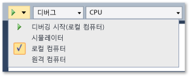
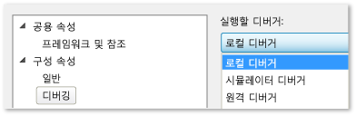

# 로컬 컴퓨터에서 Windows 스토어 앱 실행
[!INCLUDE[vs2017banner](../code-quality/includes/vs2017banner.md)]

  
  
 Windows 스토어 앱에 대한 성능 분석을 디버깅, 테스트 또는 실행하려면 Visual Studio를 호스트하는 동일한 컴퓨터에서 앱을 실행하면 됩니다.  장치의 디스플레이에서 터치 기능을 사용할 수 있으면 앱의 전체 기능을 실행할 수 있습니다. 그렇지 않으면 마우스 및 키보드 제스처만 사용할 수 있습니다.  
  
##   항목 내용  
 다음 내용을 배울 수 있습니다.  
  
 [로컬 컴퓨터에서 실행하는 방법](#BKMK_How_to_run_on_a_local_machine)  
  
 [단일 모니터에서 Windows 스토어 앱과 Visual Studio를 서로 전환하는 방법](#BKMK_How_to_switch_between_a_Windows_Store_app_and_Visual_Studio_on_a_single_monitor)  
  
##   로컬 컴퓨터에서 실행하는 방법  
 로컬 컴퓨터에서 앱을 실행하려면 디버거 **표준** 도구 모음의 디버깅 시작 단추 옆에 있는 드롭다운 목록에서 **로컬 컴퓨터**를 선택합니다.  
  
   
  
 **표준** 도구 모음이 보이지 않으면 **보기** 메뉴를 클릭하고 **도구 모음**을 가리킨 다음 **표준**을 클릭합니다.  
  
 드롭다운 목록에서 선택한 항목은 프로젝트 속성 파일에서 유지되고 기본 실행 대상이 됩니다.  
  
 또한 프로젝트 속성 파일에서 직접 실행 대상을 설정할 수 있습니다.  **솔루션 탐색기**에서 프로젝트 이름을 마우스 오른쪽 단추로 클릭한 다음 **속성**을 선택합니다.  다음 작업 중 하나를 수행합니다.  
  
-   C\# 및 Visual Basic 프로젝트에서 **디버그**를 클릭한 다음 **대상 장치** 드롭다운 목록에서 **로컬 컴퓨터**를 선택합니다.  
  
       
  
-   C\+\+ 및 JavaScript 프로젝트에서 **구성 속성** 노드를 확장하고, **디버깅**을 클릭한 다음 **실행할 디버거** 목록에서 **로컬 디버거**를 선택합니다.  
  
       
  
##   단일 모니터에서 Windows 스토어 앱과 Visual Studio를 서로 전환하는 방법  
 **실행 중인 Windows 스토어 앱 인스턴스에서 Visual Studio로 전환하려면**  
  
 로컬 컴퓨터에서 Windows 스토어 앱을 실행하고 단일 모니터만 사용하는 경우 앱을 실행 중인 상태로 두고 Visual Studio로 다시 전환하려고 할 수 있습니다.  예를 들어 이벤트를 대기 중이거나 긴 루프 또는 무한 루프에 갇힌 경우처럼 앱이 중단점에 도달할 수 없는 상태가 될 수 있습니다.  Visual Studio로 되돌아가려면 Alt\+Tab을 누릅니다.