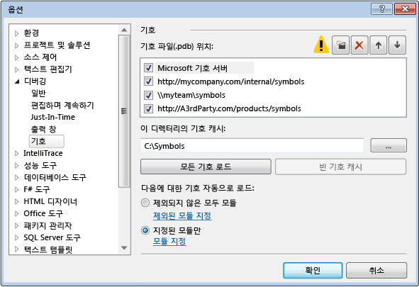
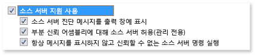

# Visual Studio 디버거에서 기호 파일(.pdb) 및 원본 파일 지정
[!INCLUDE[vs2017banner](../code-quality/includes/vs2017banner.md)]

프로그램 데이터베이스\(.pdb\) 파일로, 기호 파일이라고도 하며 클래스, 메서드 및 기타 코드의 소스 파일을 만드는 식별자를 프로젝트의 컴파일된 실행 파일에 사용되는 식별자에 매핑합니다. .pdb 파일은 소스 코드의 문을 실행 파일의 실행 명령에 매핑합니다. 디버거는 이 정보를 사용하여 두 가지 주요 정보를 확인합니다. 즉, Visual Studio IDE에 표시되는 소스 파일 및 줄 번호와 중단점을 설정할 때 중지될 실행 파일 내 위치를 확인합니다. 기호 파일에는 소스 파일의 원래 위치도 포함되어 있으며 소스 파일을 검색할 수 있는 소스 서버의 위치도 필요에 따라 포함되어 있습니다.  
  
 Visual Studio IDE에서 프로젝트를 디버깅할 때 디버거는 코드에 대한 .pdb 및 소스 파일의 기본 위치를 알고 있습니다. 프로젝트에서 호출하는 Windows 또는 타사 코드와 같은 프로젝트 소스 코드 외부의 코드를 디버깅하려는 경우, .pdb\(및 필요에 따라 외부 코드의 소스 파일\)의 위치를 지정해야 하며 이러한 파일은 실행 파일의 빌드와 정확히 일치해야 합니다.  
  
 Visual Studio 2012 이전에는 원격 장치에서 관리 코드를 디버그하는 경우 원격 컴퓨터에 기호 파일을 넣어야 했습니다. 이제는 그렇지 않습니다. 모든 기호 파일은 로컬 컴퓨터 또는 **도구\/옵션\/디버깅\/기호** 페이지에 지정된 위치에 있어야 합니다.  
  
##   디버거에서 .pdb 파일을 검색하는 위치  
  
1.  DLL 또는 실행 파일 내의 지정된 위치  
  
     기본적으로 컴퓨터에서 DLL 또는 실행 파일을 빌드한 경우 링커는 DLL 또는 실행 파일 내에 관련 .pdb 파일의 전체 경로와 파일 이름을 배치합니다. 디버거는 기호 파일이 DLL 또는 실행 파일 내의 지정된 위치에 존재하는지 여부를 먼저 확인합니다. 이는 컴파일한 코드에 사용할 수 있는 기호가 항상 컴퓨터에 있기 때문에 유용합니다.  
  
2.  DLL 또는 실행 파일과 동일한 폴더에 있을 수 있는 .pdb 파일  
  
3.  로컬 기호 캐시 폴더  
  
4.  활성화된 경우 Microsoft 기호 서버와 같은 지정된 네트워크, 인터넷 또는 로컬 기호 서버 및 위치  
  
###   기호 파일이 실행 파일과 정확하게 일치해야 하는 이유  
 디버거는 실행 파일을 빌드할 때 만든 .pdb 파일과 정확히 일치하는 실행 파일의 .pdb 파일만 로드합니다. 즉, .pdb는 원본이거나 원본 .pdb 파일의 복사본이어야 합니다. 올바르고 효율적인 코드를 작성하는 주요 작업 외에 컴파일 속도에 대해 컴파일러가 최적화되므로 실행 파일의 실제 레이아웃은 코드 자체가 변경되지 않은 경우에도 변경될 수 있습니다. 자세한 내용은 [Why does Visual Studio require debugger symbol files to exactly match the binary files that they were built with?](https://blogs.msdn.microsoft.com/jimgries/2007/07/06/why-does-visual-studio-require-debugger-symbol-files-to-exactly-match-the-binary-files-that-they-were-built-with/)\(영문\)를 참조하십시오.  
  
###   기호 위치 및 로드 동작 지정  
 VS IDE에서 프로젝트를 디버깅할 때 디버거는 프로젝트 디렉터리에 있는 기호 파일을 자동으로 로드합니다.**도구\/옵션\/디버깅\/기호**에서 Microsoft, Windows 또는 타사 구성 요소의 대체 검색 경로 및 기호 서버를 지정할 수 있습니다. 디버거에서 자동으로 기호를 로드할 특정 모듈을 지정할 수도 있습니다. 그런 다음 본격적으로 디버깅하는 동안 이러한 설정을 수동으로 변경할 수 있습니다.  
  
1.  Visual Studio에서 **도구\/옵션\/디버깅\/기호** 페이지를 엽니다.  
  
       
  
2.  폴더  아이콘을 선택합니다. 편집 가능한 텍스트가 **기호 파일\(.pdb\) 위치** 상자에 나타납니다.  
  
3.  기호 서버 또는 기호 위치에 대한 URL 또는 디렉터리 경로를 입력합니다. 문 완성 기능으로 올바른 형식을 찾을 수 있습니다.  
  
4.  기호 로드 성능을 향상시키려면 기호가 기호 서버에 의해 복사될 수 있는 로컬 디렉터리의 경로를 **이 디렉터리의 기호 캐시** 상자에 입력합니다.  
  
    > [!NOTE]
    >  보호되는 폴더\(예: C:\\Windows 폴더 또는 하위 폴더 중 하나\)에 기호 캐시를 배치하지 마십시오. 대신 읽기\/쓰기 폴더를 사용하십시오.  
  
 **기호 로드 동작 지정**  
  
 디버깅을 시작할 때 **기호 파일\(.pdb\) 위치** 상자 위치에서 자동으로 로드될 파일을 지정할 수 있습니다. 프로젝트 디렉터리에 있는 기호 파일은 항상 로드됩니다.  
  
1.  **제외된 모듈 지정** 링크를 선택할 때 지정하는 모듈을 제외하고 모든 모듈에 대한 모든 기호를 로드하려면 **제외되지 않은 모두 모듈**을 선택합니다.  
  
2.  **지정된 모듈만** 옵션을 선택한 다음 **모듈 지정**을 선택하여 자동으로 로드하려는 기호 파일 모듈을 나열합니다. 다른 모듈의 기호 파일은 무시됩니다.  
  
 **추가 기호 옵션 지정**  
  
 **도구\/옵션\/디버깅\/기호** 페이지에서 다음 옵션을 설정할 수도 있습니다.  
  
 **시작할 때 기호가 없으면 경고\(네이티브 전용\)**  
  
 이 옵션을 선택하면 디버거에 기호 정보가 없는 프로그램을 디버깅하려고 할 때 경고 대화 상자가 표시됩니다.  
  
 **DLL 내보내기 로드**  
  
 이 옵션을 선택하면 DLL 내보내기 테이블이 로드됩니다. Windows 메시지, Windows 프로시저\(WindowProcs\), COM 개체, 마샬링 또는 기호가 없는 DLL을 사용하여 작업하는 경우 DLL 내보내기 테이블의 기호 정보가 유용할 수 있지만, DLL 내보내기 정보를 읽으면 오버헤드가 발생합니다. 따라서 이 기능은 기본적으로 해제되어 있습니다.  
  
 DLL의 내보내기 테이블에서 사용할 수 있는 기호를 확인하려면 `dumpbin /exports`를 사용하십시오. 모든 32비트 시스템 DLL에 기호를 사용할 수 있습니다.`dumpbin /exports` 출력을 읽으면 영숫자가 아닌 문자를 포함하여 정확한 함수 이름을 확인할 수 있습니다. 이 방법은 함수에 중단점을 설정하는 데 유용합니다. DLL 내보내기 테이블에 있는 함수 이름은 디버거에서 일부가 잘린 상태로 나타날 수 있습니다. 호출은 현재 함수\(가장 안쪽에 중첩된\)가 맨 위에 표시되어 호출한 순서로 나열됩니다. 자세한 내용은 [dumpbin \/exports](/visual-cpp/build/reference/dash-exports)를 참조하십시오.  
  
###   기호 서버를 사용하여 로컬 컴퓨터에 없는 기호 파일 찾기  
 [!INCLUDE[vsprvs](../code-quality/includes/vsprvs_md.md)]는 symsrv 프로토콜을 구현하는 기호 서버에서 디버깅 기호 파일을 다운로드할 수 있습니다.[Visual Studio Team Foundation Server](../Topic/Index%20and%20publish%20symbol%20data.md)와 [Windows용 디버깅 도구](http://msdn.microsoft.com/library/windows/hardware/ff551063\(v=VS.85\).aspx)는 기호 서버를 구현할 수 있는 두 가지 도구입니다. VS **옵션** 대화 상자에서 사용할 기호 서버를 지정합니다.  
  
 사용할 수 있는 기호 서버는 다음과 같습니다.  
  
 **Microsoft 공용 기호 서버**  
  
 시스템 DLL이나 타사 라이브러리를 호출하는 동안 발생하는 충돌을 디버깅하려면 Windows DLL, EXE 및 장치 드라이버에 대한 기호가 포함된 시스템 .pdb 파일이 필요한 경우가 많습니다. 이러한 기호는 Microsoft 공용 기호 서버에서 가져올 수 있습니다. Microsoft 공용 기호 서버는 MDAC, IIS, ISA 및 [!INCLUDE[dnprdnshort](../code-quality/includes/dnprdnshort_md.md)] 외에도 Windows 운영 체제용 기호를 제공합니다.  
  
 Microsoft 기호 서버를 사용하려면 **디버그** 메뉴의 **옵션 및 설정**을 선택한 다음 **기호**를 선택합니다.**Microsoft 기호 서버**를 선택합니다.  
  
 **내부 네트워크 또는 로컬 컴퓨터의 기호 서버**  
  
 팀이나 회사는 사용자 고유 제품에 사용하기 위해서나 외부 소스의 기호에 대한 캐시로 기호 서버를 만들 수 있습니다. 기호 서버가 사용자의 컴퓨터에 있을 수도 있습니다. 기호 서버의 위치를 URL 또는 VS **옵션** 대화 상자의 **디버깅**\/**기호** 페이지에 있는 경로로 입력할 수 있습니다.  
  
 **타사 기호 서버**  
  
 Windows 응용 프로그램 및 라이브러리의 타사 공급자는 인터넷에 있는 기호 서버에 대한 액세스를 제공할 수 있습니다.**디버깅**\/**기호** 페이지에도 이러한 기호 서버의 URL을 입력할 수 있습니다.  
  
> [!NOTE]
>  Microsoft 공용 기호 서버 이외의 기호 서버를 사용할 경우 기호 서버와 해당 경로를 신뢰할 수 있는지 확인합니다. 기호 파일은 임의의 실행 코드를 포함할 수 있으므로 보안 위협에 노출될 수 있습니다.  
  
###   디버깅하는 동안 기호 찾기 및 로드  
 디버거가 중단 모드에 있을 때는 디버거 옵션에 의해 이전에 제외되었거나 컴파일러가 찾을 수 없었던 모듈의 기호를 로드할 수 있습니다. 호출 스택, 모듈, 지역, 자동 및 모든 조사식 창의 바로 가기 메뉴에서 기호를 로드할 수 있습니다. 디버거가 기호 또는 소스 파일을 사용할 수 없는 코드에서 중단되는 경우 문서 창이 나타납니다. 여기에서 누락된 파일에 대한 정보를 찾고 이러한 파일을 찾고 로드하기 위해 조치를 취할 수 있습니다.  
  
 **로드된 기호 없음 문서 페이지를 사용하여 기호 찾기**  
  
 디버거가 기호를 사용할 수 없는 코드를 중단할 수 있는 방법은 여러 가지가 있습니다.  
  
1.  한 단계씩 코드를 실행합니다.  
  
2.  중단점 또는 예외에서 코드를 중단합니다.  
  
3.  다른 스레드로 전환합니다.  
  
4.  호출 스택 창의 프레임을 두 번 클릭하여 스택 프레임을 변경합니다.  
  
 이러한 이벤트 중 하나가 발생하면 디버거는 **로드된 기호 없음** 페이지를 표시하여 필요한 기호를 찾고 로드할 수 있게 해 줍니다.  
  
   
  
-   검색 경로를 변경하려면 선택되지 않은 경로를 선택하거나 **새로 만들기**를 선택하고 새 경로를 입력합니다. 경로를 다시 검색하고 발견되는 기호 파일을 로드하려면 **로드**를 선택합니다.  
  
-   *실행 파일 이름* **찾아보기 ...**를 선택하여 기호 옵션을 재정의하고 검색 경로를 다시 시도합니다. 기호 파일이 발견되는 경우 로드되거나, 파일 탐색기가 표시되어 기호 파일을 수동으로 선택할 수 있습니다.  
  
-   **기호 설정 변경...**을 선택하여 VS 옵션 대화 상자의 **디버깅** \/ **기호** 페이지를 표시합니다.  
  
-   새 창에서 디스어셈블리를 한 번 표시하려면 **디스어셈블리 보기**를 선택합니다.  
  
-   소스 또는 기호 파일을 찾을 수 없는 경우 항상 디스어셈블리를 표시하려면 **옵션 대화 상자** 링크를 선택하고 **주소 수준 디버깅 사용** 및 **소스를 사용할 수 없을 경우 디스어셈블리 표시**를 둘 다 선택합니다.  
  
       
  
 **바로 가기 메뉴에서 기호 옵션 변경**  
  
 중단 모드에 있는 동안 호출 스택, 모듈, 지역, 자동 및 모든 조사식 창에 표시되는 항목에 대한 기호를 찾아 로드할 수 있습니다. 창에서 항목을 선택한 다음 바로 가기 메뉴를 열고 다음 옵션 중 하나를 선택합니다.  
  
|옵션|설명|  
|--------|--------|  
|**기호 로드**|**옵션** 대화 상자의 **디버깅** \/ **기호** 페이지에 지정된 위치에서 기호를 로드하려고 시도합니다. 기호 파일을 찾을 수 없는 경우 검색할 새 위치를 지정할 수 있도록 파일 탐색기가 시작됩니다.|  
|**기호 로드 정보**|로드된 기호 파일의 위치 또는 디버거가 파일을 찾을 수 없는 경우 검색된 위치를 보여주는 정보를 제공합니다.|  
|**기호 설정...**|VS **옵션** 대화 상자의 **디버깅** \/ **기호** 페이지를 엽니다.|  
|**항상 자동으로 로드**|기호 파일을 디버거에서 자동으로 로드되는 파일 목록에 추가합니다.|  
  
###   기호 파일에 대한 컴파일러 옵션 설정  
 VS IDE에서 프로젝트를 빌드하고 표준 **디버그** 빌드 구성을 사용하면, C\+\+ 및 관리되는 컴파일러에서 코드에 대한 적절한 기호 파일을 만듭니다. 또한 명령줄에 컴파일러 옵션을 설정하여 기호 파일을 만들 수도 있습니다.  
  
 **C\+\+ 옵션**  
  
 프로그램 데이터베이스\(.pdb\) 파일에는 프로그램에 대한 디버그 구성의 증분 링크를 허용하는 디버깅 및 프로젝트 상태 정보가 저장됩니다. .pdb 파일은 [\/ZI 또는 \/Zi](/visual-cpp/build/reference/z7-zi-zi-debug-information-format)를 사용하여 빌드할 때 만들어집니다\(C\/C\+\+의 경우\).  
  
 [!INCLUDE[vcprvc](../debugger/includes/vcprvc_md.md)]의 [\/Fd](/visual-cpp/build/reference/fd-program-database-file-name)는 컴파일러에서 만드는 .pdb 파일의 이름을 지정하는 옵션입니다. 마법사를 사용하여 [!INCLUDE[vsprvs](../code-quality/includes/vsprvs_md.md)]에서 프로젝트를 만드는 경우, 이름이 *project*.pdb인 .pdb 파일을 만들도록 **\/Fd** 옵션이 설정됩니다.  
  
 메이크파일을 사용하여 C\/C\+\+ 응용 프로그램을 빌드하는 경우, **\/Fd** 없이 **\/ZI** 또는 **\/Zi**를 지정하여 .pdb 파일 2개가 만들어집니다.  
  
-   VC*x*.pdb. 여기서 *x*는 Visual C\+\+의 버전을 나타냅니다\(예: VC11.pdb\). 이 파일에는 각 OBJ 파일에 대한 디버깅 정보가 모두 들어 있으며, 프로젝트 메이크파일과 동일한 디렉터리에 저장됩니다.  
  
-   project.pdb. 이 파일에는 .exe 파일에 대한 디버그 정보가 모두 저장됩니다. C\/C\+\+의 경우에는 \\debug 하위 디렉터리에 이 파일이 저장됩니다.  
  
 C\/C\+\+ 컴파일러는 OBJ 파일을 만들 때마다 VC*x*.pdb에 디버그 정보를 병합합니다. 삽입되는 정보에는 유형 정보가 포함되지만 함수 정의와 같은 기호 정보는 포함되지 않습니다. 따라서 \<windows.h\>와 같은 공통 헤더 파일은 모든 소스 파일에 포함되지만, 해당 헤더의 typedef는 모든 OBJ 파일에 포함되지 않고 한 번만 저장됩니다.  
  
 링커는 프로젝트의 EXE 파일에 대한 디버그 정보가 포함된 project.pdb를 만듭니다. project.pdb 파일에는 VC*x*.pdb에 있는 형식 정보뿐만 아니라 함수 프로토타입을 비롯한 전체 디버그 정보가 포함됩니다. 두 .pdb 파일 모두 증분 업데이트가 가능합니다. 링커에서는 작성되는 .exe 파일이나 .dll 파일에 .pdb 파일의 경로도 포함합니다.  
  
 [!INCLUDE[vsprvs](../code-quality/includes/vsprvs_md.md)] 디버거는 project.pdb 파일을 찾기 위해 EXE 또는 DLL 파일에서 .pdb 파일의 경로를 사용합니다. 디버거가 해당 위치에서 .pdb 파일을 찾지 못하거나 프로젝트를 다른 컴퓨터로 옮긴 경우와 같이 경로가 올바르지 않은 경우, 디버거는 EXE가 포함된 경로를 검색한 다음 **옵션** 대화 상자\(**기호** 노드의 **디버깅** 폴더\)에 지정된 기호 경로를 검색합니다. 디버거는 디버깅 중인 실행 파일과 일치하지 않는 .pdb 파일은 로드하지 않습니다. 디버거가 .pdb 파일을 찾지 못하면 기호를 검색하거나 검색 경로에 위치를 더 추가할 수 있는 **기호 찾기** 대화 상자가 나타납니다.  
  
 **.NET Framework 옵션**  
  
 프로그램 데이터베이스\(.pdb\) 파일에는 프로그램에 대한 디버그 구성의 증분 링크를 허용하는 디버깅 및 프로젝트 상태 정보가 저장됩니다. .pdb 파일은 **\/debug**로 빌드하는 경우 만들어집니다.**\/debug:full** 또는 **\/debug:pdbonly**를 사용하여 응용 프로그램을 빌드할 수 있습니다.**\/debug:full**을 사용하여 빌드하면 디버깅 가능한 코드가 생성됩니다.**\/debug:pdbonly**를 사용하여 빌드하면 .pdb 파일이 생성되지만 디버그 정보를 사용할 수 있다는 사실을 JIT 컴파일러에 알리는 `DebuggableAttribute`는 생성되지 않습니다. 디버깅할 수 없도록 하려는 릴리스 빌드에 대해 .pdb 파일을 생성하려면 **\/debug:pdbonly**를 사용합니다. 자세한 내용은 [\/debug \(Emit Debugging Information\)](/dotnet/csharp/language-reference/compiler-options/debug-compiler-option) 또는 [\/debug](/dotnet/visual-basic/reference/command-line-compiler/debug)를 참조하세요.  
  
 [!INCLUDE[vsprvs](../code-quality/includes/vsprvs_md.md)] 디버거는 project.pdb 파일을 찾기 위해 EXE 또는 DLL 파일에서 .pdb 파일의 경로를 사용합니다. 디버거가 해당 위치에서 .pdb 파일을 찾을 수 없거나 경로가 올바르지 않은 경우, 디버거는 EXE가 포함된 경로를 검색한 다음 **옵션** 대화 상자에 지정된 기호 경로를 검색합니다. 이 경로는 일반적으로 **기호** 노드의 **디버깅** 폴더입니다. 디버거는 디버깅 중인 실행 파일과 일치하지 않는 .pdb 파일은 로드하지 않습니다. 디버거가 .pdb 파일을 찾지 못하면 기호를 검색하거나 검색 경로에 위치를 더 추가할 수 있는 **기호 찾기** 대화 상자가 나타납니다.  
  
 **웹 응용 프로그램**  
  
 응용 프로그램의 구성 파일\(Web.config\)이 디버그 모드로 설정되어 있어야 합니다. 디버그 모드에서는 동적으로 생성된 파일에 대한 기호가 ASP.NET에서 생성되며 디버거가 ASP.NET 응용 프로그램에 연결될 수 있습니다. 웹 프로젝트 템플릿에서 프로젝트를 만든 경우 디버깅을 시작하면 VS가 이를 자동으로 설정합니다.  
  
##   소스 파일 찾기  
  
###   디버거에서 소스 파일을 검색하는 위치  
 디버거는 다음 위치에서 소스 파일을 찾습니다.  
  
1.  디버거를 시작한 Visual Studio 인스턴스의 IDE에 열려 있는 파일  
  
2.  Visual Studio 인스턴스에 열려 있는 솔루션의 파일  
  
3.  솔루션의 속성에서 **공용 속성** \/ **소스 파일 디버그** 페이지에 지정된 디렉터리 \( **솔루션 탐색기** 에서 솔루션 노드를 선택하고, 마우스 오른쪽 단추를 클릭하고, **속성**을 선택합니다. \)  
  
4.  모듈의 .pdb에 대한 소스 정보. 모듈이 빌드된 경우 소스 파일의 위치이거나, 소스 서버에 대한 명령일 수 있습니다.  
  
###   로드된 소스 없음\/로드된 기호 없음 페이지를 사용하여 소스 파일 찾기 및 로드  
 소스 파일을 사용할 수 없는 위치에서 디버거가 실행을 중단하면 소스 파일을 찾는 데 유용할 수 있는 **로드된 소스 없음** 또는 **로드된 기호 없음** 페이지가 표시됩니다. 디버거에서 실행 파일에 대한 기호\(.pdb\) 파일을 찾아 검색을 완료할 수 없는 경우 **로드된 기호 없음**이 표시됩니다. 로드된 기호 없음 페이지는 파일을 검색하는 옵션을 제공합니다. 옵션 중 하나를 실행한 후 .pdb가 발견되고 디버거가 기호 파일에 있는 정보를 사용하여 소스 파일을 검색할 수 있는 경우 소스가 표시됩니다. 그렇지 않은 경우에는 문제를 설명하는 **로드된 소스 없음** 페이지가 나타납니다. 이 페이지에는 문제를 해결할 수 있는 작업을 수행할 수 있는 옵션 링크가 표시됩니다.  
  
###   솔루션에 소스 파일 검색 경로 추가  
 소스 파일을 검색할 네트워크 또는 로컬 디렉터리를 지정할 수 있습니다.  
  
1.  솔루션 탐색기에서 솔루션을 선택한 후 바로 가기 메뉴에서 **속성**을 선택합니다.  
  
2.  **공용 속성** 노드에서 **소스 파일 디버그**를 선택합니다.  
  
3.  폴더  아이콘을 클릭합니다. 편집 가능한 텍스트가 **소스 코드가 포함되어 있는 디렉터리** 목록에 나타납니다.  
  
4.  검색할 경로를 추가합니다.  
  
 지정된 디렉터리만 검색됩니다. 검색하려는 하위 디렉터리에 대한 항목을 추가해야 합니다.  
  
###   소스 서버 사용  
 로컬 컴퓨터에 소스 코드가 없거나 .pdb 파일이 소스 코드와 일치하지 않는 경우 소스 서버를 사용하여 응용 프로그램을 디버깅할 수 있습니다. 소스 서버에서는 파일에 대한 요청을 전달받고 실제 파일을 반환합니다. 소스 서버를 실행하는 데는 srcsrv.dll이라는 DLL 파일이 사용됩니다. 소스 서버는 응용 프로그램의 .pdb 파일을 읽습니다. 이 PDB 파일에는 소스 코드 리포지토리에 대한 포인터와 리포지토리에서 소스 코드를 검색하는 데 사용되는 명령이 포함되어 있습니다. srcsrv.ini라는 파일 내에 허용되는 명령의 목록을 지정하여 응용 프로그램의 .pdb 파일에서 실행할 수 있는 명령을 제한할 수 있습니다. 이 파일은 srcsrv.dll 및 devenv.exe와 동일한 디렉터리에 있어야 합니다.  
  
> [!IMPORTANT]
>  임의의 명령이 응용 프로그램의 .pdb 파일에 포함될 수 있으므로 실행하려는 명령만 srcsrv.ini 파일에 삽입해야 합니다. srcsvr.ini 파일에 포함되지 않은 명령을 실행하려고 하면 확인 대화 상자가 나타납니다. 자세한 내용은 [보안 경고: 디버거가 신뢰할 수 없는 명령을 실행해야 합니다.](../debugger/security-warning-debugger-must-execute-untrusted-command.md)을 참조하세요. 명령 매개 변수에 대해서는 유효성 검사를 수행하지 않으므로 신뢰되는 명령에 대해 주의를 기울여야 합니다. 예를 들어 cmd.exe를 신뢰한 경우 악의적인 사용자가 이 명령을 위험하게 만드는 매개 변수를 지정할 수도 있습니다.  
  
 **소스 서버를 사용하도록 설정하려면**  
  
1.  이전 단원에서 설명한 보안 지침에 따라 컴파일했는지 확인합니다.  
  
2.  **도구** 메뉴에서 **옵션**을 선택합니다.  
  
     **옵션** 대화 상자가 표시됩니다.  
  
3.  **디버깅** 노드에서 **일반**을 선택합니다.  
  
4.  **소스 서버 지원 사용** 확인란을 선택합니다.  
  
       
  
5.  \(선택 사항\) 원하는 자식 옵션을 선택합니다.  
  
     **부분 트러스트 어셈블리에 대한 소스 서버 허용\(관리만 해당\)** 및 **항상 묻지 않고 신뢰하지 않는 소스 서버 명령 실행**은 위에서 설명한 보안 위험을 증가시킬 수 있습니다.  
  
## 참고 항목  
 [Visual Studio 2012 및 2013의 .NET 원격 기호 로드 변경 내용](http://blogs.msdn.com/b/visualstudioalm/archive/2013/10/16/net-remote-symbol-loading-changes-in-visual-studio-2012-and-2013.aspx)