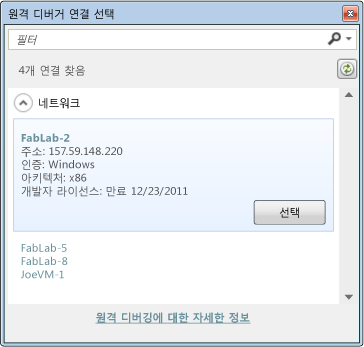

# Visual Studio에서 스토어 앱에 대한 디버깅 세션 시작(JavaScript)
[!INCLUDE[vs2017banner](../code-quality/includes/vs2017banner.md)]

  
  
 이 항목에서는 JavaScript 및 HTML5로 작성된 Windows 스토어 앱에 대한 디버깅 세션을 시작하는 방법을 설명합니다. 키를 한 번 입력하여 디버깅을 시작할 수도 있고, 특정 시나리오에 대한 디버깅 세션을 구성하여 앱을 시작할 수도 있습니다.  
  
> [!NOTE]
>  XAML 및 Visual C\#, Visual C\+\+ 또는 Visual Basic으로 작성된 앱의 경우 [디버그 세션 시작\(VB, C\#, C\+\+ 및 XAML\)](../debugger/start-a-debugging-session-for-a-store-app-in-visual-studio-vb-csharp-cpp-and-xaml.md)을 참조하세요.  
  
##   항목 내용  
 [항목 내용](#BKMK_In_this_topic)  
  
 [디버깅을 쉽게 시작하는 방법](#BKMK_The_easy_way_to_start_debugging)  
  
 [디버깅 세션 구성](#BKMK_Configure_the_debugging_session)  
  
-   [프로젝트에 대한 디버깅 속성 페이지 열기](#BKMK_Open_the_debugging_property_page_for_the_project)  
  
-   [빌드 구성 옵션 선택](#BKMK_Choose_the_build_configuration_options)  
  
-   [배포 대상 선택](#BKMK_Choose_the_deployment_target)  
  
-   [사용할 디버거 선택](#BKMK_Choose_the_debugger_to_use)  
  
-   [(선택 사항) 디버그 세션에서 앱 시작 지연](#BKMK__Optional__Delay_starting_app_in_the_debug_session)  
  
-   [(선택 사항) 네트워크 루프백 비활성화](#BKMK__Optional__Disable_network_loopbacks)  
  
 [디버깅 세션을 시작합니다.](#BKMK_Start_the_debugging_session)  
  
-   [디버깅 시작(F5)](#BKMK_Start_debugging__F5_)  
  
-   [디버깅을 시작하되F5) 응용 프로그램 시작 지연](#BKMK_Start_debugging__F5__but_delay_the_app_start)  
  
 [디버거에서 설치된 응용 프로그램 시작](#BKMK_Start_an_installed_app_in_the_debugger)  
  
 [실행 중인 응용 프로그램에 디버거 연결](#BKMK_Attach_the_debugger_to_a_running_app_)  
  
-   [응용 프로그램이 디버그 모드에서 실행되도록 설정](#BKMK_Set_the_app_to_run_in_debug_mode)  
  
-   [디버거 연결](#BKMK_Attach_the_debugger)  
  
##   디버깅을 쉽게 시작하는 방법  
   
  
1.  Visual Studio에서 앱 솔루션을 엽니다.  
  
2.  솔루션에 Windows 스토어 및 Windows 스토어 Phone 앱의 프로젝트가 모두 포함된 경우 디버깅하려는 프로젝트가 시작 프로젝트인지 확인합니다. 솔루션 탐색기에서 프로젝트를 선택한 다음 컨텍스트 메뉴에서 **시작 프로젝트로 설정**을 선택합니다.  
  
3.  F5 키를 누릅니다.  
  
   
  
 Visual Studio가 디버거가 연결된 앱을 빌드하고 시작합니다. 중단점에 도달하거나 수동으로 실행을 일시 중단하거나 처리되지 않은 예외가 발생하거나 응용 프로그램이 끝날 때까지 계속해서 실행됩니다. 자세한 내용은 [퀵 스타트: HTML 및 CSS 디버그](../debugger/quickstart-debug-html-and-css.md)을 참조하세요.  
  
##   디버깅 세션 구성  
 스크립트가 컴파일되지 않았으므로 빌드 구성 및 플랫폼 설정이 적용되지 않습니다. C\+\+ 또는 관리되는 구성 요소를 디버깅하는 경우 **구성**을 **디버그**로 설정하고 **구성** 대화 상자에서 대상 플랫폼을 선택합니다.  
  
###   프로젝트에 대한 디버깅 속성 페이지 열기  
  
1.  솔루션 탐색기에서 프로젝트를 선택합니다. 바로 가기 메뉴에서 **속성**을 선택합니다.  
  
2.  **구성 속성** 노드를 확장한 다음 **디버깅**을 선택합니다.  
  
###   빌드 구성 옵션 선택  
  
1.  **구성** 목록에서 **디버그** 또는 **\(활성\) 디버그**를 선택합니다.  
  
2.  **플랫폼** 목록에서 빌드할 대상 플랫폼을 선택합니다. 대부분의 경우 **모든 CPU**를 선택하는 것이 가장 좋습니다.  
  
###   배포 대상 선택  
 Visual Studio 컴퓨터, 로컬 컴퓨터의 Visual Studio 시뮬레이터 또는 원격 컴퓨터에서 앱을 배포하고 디버깅할 수 있습니다. 프로젝트의 **디버깅** 속성 페이지에 있는 **실행할 디버거** 목록에서 대상을 선택합니다.  
  
   
  
 Windows 스토어 앱의 경우 **대상 장치** 목록에서 다음 옵션 중 하나를 선택합니다.  
  
|||  
|-|-|  
|**로컬 컴퓨터**|로컬 컴퓨터의 현재 세션에서 앱을 디버깅합니다. [로컬 컴퓨터에서 Windows 스토어 앱 실행](../debugger/run-windows-store-apps-on-the-local-machine.md)을 참조하세요.|  
|**시뮬레이터**|[!INCLUDE[win8_appname_long](../debugger/includes/win8_appname_long_md.md)] 앱에 대한 Visual Studio 시뮬레이터에서 앱을 디버깅합니다. 시뮬레이터는 로컬 컴퓨터에서 사용할 수 없는 터치 제스처 및 장치 회전과 같은 장치 기능을 디버깅할 수 있도록 하는 데스크톱 창입니다. [시뮬레이터에서 Windows 스토어 앱 실행](../debugger/run-windows-store-apps-in-the-simulator.md)을 참조하세요.|  
|**원격 컴퓨터**|인트라넷을 통해 로컬 컴퓨터에 연결되거나 이더넷 케이블을 사용하여 직접 연결된 장치에서 앱을 디버깅합니다. 원격으로 디버깅하려면 Visual Studio 원격 도구가 원격 장치에 설치되어 실행되고 있어야 합니다. [원격 컴퓨터에서 Windows 스토어 앱 실행](../debugger/run-windows-store-apps-on-a-remote-machine.md)을 참조하세요.|  
  
 **원격 컴퓨터**를 선택하는 경우 다음 방법 중 하나를 사용하여 원격 컴퓨터의 이름 또는 IP 주소를 지정합니다.  
  
-   **컴퓨터 이름** 상자에 원격 컴퓨터의 이름 또는 IP 주소를 입력합니다.  
  
-   **컴퓨터 이름** 상자에서 아래쪽 화살표를 선택하고 **\<찾기...\>**를 선택합니다. 그런 다음 **원격 디버거 연결 선택** 대화 상자에서 원격 컴퓨터를 선택합니다.  
  
       
  
    > [!NOTE]
    >  원격 디버거 연결 선택 대화 상자에는 로컬 서브넷에 있는 컴퓨터와 이더넷 케이블을 통해 Visual Studio 컴퓨터에 직접 연결되어 있는 컴퓨터가 표시됩니다. 다른 컴퓨터를 지정하려면 **컴퓨터 이름** 상자에 이름을 입력합니다.  
  
   
  
 Windows 스토어 Phone 앱의 경우 **대상 장치** 목록에서 에뮬레이터 중 하나를 선택하거나 **장치**를 선택합니다.  
  
###   사용할 디버거 선택  
 기본적으로 앱에서 디버거는 JavaScript 코드에 연결됩니다. JavaScript 코드 대신 기본 C\+\+ 및 앱 구성 요소의 관리되는 코드를 디버깅하도록 선택할 수 있습니다. 앱 프로젝트의 **디버깅** 속성 페이지에 있는 **디버거 형식** 목록에서 디버깅할 코드를 지정합니다.  
  
 **디버거 형식** 목록에서 다음 디버거 중 하나를 선택합니다.  
  
|||  
|-|-|  
|**스크립트만**|앱에서 JavaScript 코드를 디버깅합니다. 관리 코드와 네이티브 코드는 무시됩니다.|  
|**네이티브 전용**|앱에서 네이티브 C\/C\+\+ 코드를 디버깅합니다. 관리 코드와 JavaScript 코드는 무시됩니다.|  
|**스크립트가 포함된 네이티브 코드**|앱에서 네이티브 C\+\+ 코드 및 JavaScript 코드를 디버깅합니다.|  
|**관리 전용**|앱에서 관리 코드를 디버깅합니다. JavaScript 코드와 네이티브 C\/C\+\+ 코드는 무시됩니다.|  
|**혼합\(관리\/네이티브\)**|앱에서 네이티브 C\/C\+\+ 코드 및 관리 코드를 디버깅합니다. JavaScript 코드는 무시됩니다.|  
  
###   \(선택 사항\) 디버그 세션에서 앱 시작 지연  
 기본적으로 디버깅을 시작하면 바로 앱이 시작됩니다. 디버그 세션을 시작하되 응용 프로그램 시작을 지연할 수도 있습니다. 앱이 시작 메뉴 또는 활성화 계약에서 시작되거나, 다른 프로세스 또는 메서드에서 시작되는 경우 디버거에서 앱이 시작됩니다. 또한 지연된 시작 기능을 사용하여 앱이 실행되지 않은 경우 앱에서 발생시키려는 백그라운드 이벤트를 디버깅할 수 있습니다.  
  
 앱 프로젝트의 **디버깅** 속성 페이지에 있는 **응용 프로그램 시작** 목록에서 앱 시작을 지연할지를 지정합니다. 다음 옵션 중 하나를 선택합니다.  
  
-   앱 시작을 지연시키려면 **아니요**를 선택합니다.  
  
-   앱을 즉시 시작하려면 **예**를 선택합니다.  
  
###   \(선택 사항\) 네트워크 루프백 비활성화  
   
  
 보안상의 이유로 일반적인 방식으로 설치된 Windows 스토어 앱은 앱이 설치된 장치에 대한 네트워크 호출을 수행할 수 없습니다. 기본적으로 Visual Studio를 배포하면 배포된 응용 프로그램에 대한 이 규칙의 예외가 만들어 집니다. 이 예외로 인해 사용자는 단일 컴퓨터에서 통신 프로시저를 테스트할 수 있습니다. 앱을 Windows 스토어에 제출하기 전에 제외 없이 앱을 테스트해야 합니다.  
  
 네트워크 루프백 제외를 제거하려면 **디버깅** 속성 페이지의 **네트워크 루프백 허용** 목록에서 **아니요**를 선택합니다.  
  
##   디버깅 세션을 시작합니다.  
  
###   디버깅 시작\(F5\)  
 **디버그** 메뉴에서 **디버깅 시작**\(키보드: F5\)을 선택하면 디버거가 연결된 앱이 시작됩니다. 중단점에 도달하거나 수동으로 실행을 일시 중단하거나 처리되지 않은 예외가 발생하거나 앱이 끝날 때까지 계속해서 실행됩니다.  
  
###   디버깅을 시작하되F5\) 응용 프로그램 시작 지연  
 디버그 모드에서 실행되도록 앱을 설정할 수 있지만 디버거가 아닌 방법으로 앱을 시작할 수 있습니다. 예를 들어 시작 메뉴에서 앱 시작을 디버깅하거나 앱을 시작하지 않고 앱에서 백그라운드 프로세스를 디버깅할 수 있습니다. 앱 시작을 지연하려면 다음을 수행합니다.  
  
1.  앱 프로젝트 속성의 **디버그** 페이지에 있는 **응용 프로그램 시작** 목록에서 **아니요**를 선택합니다.  
  
2.  **디버그** 메뉴에서 **디버깅 시작**\(키보드: F5\)을 선택합니다.  
  
3.  시작 메뉴, 실행 계약 또는 다른 프로시저를 통해 앱을 시작합니다.  
  
 디버그 모드에서 앱이 시작됩니다. 중단점에 도달하거나 수동으로 실행을 일시 중단하거나 처리되지 않은 예외가 발생하거나 앱이 끝날 때까지 계속해서 실행됩니다.  
  
 백그라운드 작업 디버깅에 대한 자세한 내용은 [Windows 스토어에 대한 일시 중단, 다시 시작 및 백그라운드 이벤트 트리거](../debugger/how-to-trigger-suspend-resume-and-background-events-for-windows-store-apps-in-visual-studio.md)을 참조하세요.  
  
##   디버거에서 설치된 응용 프로그램 시작  
 F5 키를 사용하여 디버깅을 시작할 때 Visual Studio에서는 앱을 빌드 및 배포하고 디버그 모드에서 실행되도록 앱을 설정한 다음 앱을 시작합니다. 장치에 이미 설치된 응용 프로그램을 시작하려면 설치된 응용 프로그램 패키지 디버그 대화 상자를 사용합니다. 이 절차는 Windows 스토어에서 설치된 응용 프로그램을 디버깅해야 하는 경우나 응용 프로그램의 소스 파일은 있지만 응용 프로그램에 대한 Visual Studio 프로젝트가 없는 경우에 유용합니다. 예를 들어 Visual Studio 프로젝트 또는 솔루션을 사용하지 않는 사용자 지정 빌드 시스템이 있을 수 있습니다.  
  
 앱은 로컬 장치에 설치하거나 원격 장치에 설치할 수 있습니다. 응용 프로그램을 즉시 시작하거나 시작 메뉴나 활성화 계약 등의 다른 프로세스나 방법으로 시작될 때 디버거에서 실행되도록 응용 프로그램을 설정할 수 있습니다. 응용 프로그램을 시작하지 않고 백그라운드 프로세스를 디버깅하려는 경우에도 디버그 모드에서 실행되도록 응용 프로그램을 설정할 수 있습니다. 자세한 내용은 [Windows 스토어에 대한 일시 중단, 다시 시작 및 백그라운드 이벤트 트리거](../debugger/how-to-trigger-suspend-resume-and-background-events-for-windows-store-apps-in-visual-studio.md)을 참조하세요.  
  
 설치된 앱을 디버그 모드에서 실행되도록 설정하려면 다음을 수행하세요.  
  
> [!NOTE]
>  이 절차를 시작할 때 앱이 실행되고 있지 않아야 합니다.  
  
1.  **디버그** 메뉴에서 **설치된 앱 패키지 디버그**를 선택합니다.  
  
2.  목록에서 다음 옵션 중 하나를 선택합니다.  
  
    |||  
    |-|-|  
    |**로컬 컴퓨터**|로컬 컴퓨터의 현재 세션에서 앱을 디버깅합니다. [로컬 컴퓨터에서 Windows 스토어 앱 실행](../debugger/run-windows-store-apps-on-the-local-machine.md)을 참조하세요.|  
    |**시뮬레이터**|[!INCLUDE[win8_appname_long](../debugger/includes/win8_appname_long_md.md)] 앱에 대한 Visual Studio 시뮬레이터에서 앱을 디버깅합니다. 시뮬레이터는 로컬 컴퓨터에서 사용할 수 없는 터치 제스처 및 장치 회전과 같은 장치 기능을 디버깅할 수 있도록 하는 데스크톱 창입니다. [시뮬레이터에서 Windows 스토어 앱 실행](../debugger/run-windows-store-apps-in-the-simulator.md)을 참조하세요.|  
    |**원격 컴퓨터**|인트라넷을 통해 로컬 컴퓨터에 연결되거나 이더넷 케이블을 사용하여 직접 연결된 장치에서 앱을 디버깅합니다. 원격으로 디버깅하려면 Visual Studio 원격 도구가 원격 장치에 설치되어 실행되고 있어야 합니다. [원격 컴퓨터에서 Windows 스토어 앱 실행](../debugger/run-windows-store-apps-on-a-remote-machine.md)을 참조하세요.|  
  
3.  **설치된 앱 패키지** 목록에서 앱을 선택합니다.  
  
4.  **다음 코드 형식 디버깅** 목록에서 사용할 디버그 엔진을 선택합니다.  
  
5.  \(선택 사항\). 다른 방법으로 시작될 때 앱을 디버깅하거나 백그라운드 프로세스를 디버깅하려면 **시작하지 않음\(시작 시 코드 디버그\)**을 택합니다.  
  
 **시작**을 클릭하면 앱이 시작되거나 디버그 모드로 실행되도록 설정됩니다.  
  
##   실행 중인 응용 프로그램에 디버거 연결  
 [!INCLUDE[win8_appname_long](../debugger/includes/win8_appname_long_md.md)]앱에 디버거를 연결하려면 디버깅 가능 패키지 관리자를 사용하여 앱이 디버그 모드로 실행되도록 설정합니다. 디버깅 가능 패키지 관리자는 Visual Studio 원격 도구와 함께 설치됩니다.  
  
 앱에 디버거를 연결하는 기능은 Windows 스토어에서 설치된 앱처럼 이미 설치된 앱을 디버깅해야 하는 경우에 유용합니다. 응용 프로그램의 소스 파일은 있지만 응용 프로그램에 대한 Visual Studio 프로젝트가 없는 경우 연결해야 합니다. 예를 들어 Visual Studio 프로젝트 또는 솔루션을 사용하지 않는 사용자 지정 빌드 시스템이 있을 수 있습니다.  
  
 앱에 연결하려면  
  
1.  앱이 디버그 모드로 실행되도록 설정합니다. 이 작업은 앱이 실행되고 있지 않을 때 수행해야 합니다.  
  
2.  앱을 시작합니다. 시작 메뉴, 실행 계약 또는 일부 다른 메서드를 통해 앱을 시작할 수 있습니다.  
  
3.  실행 중인 앱에 디버거를 연결합니다.  
  
###   응용 프로그램이 디버그 모드에서 실행되도록 설정  
  
1.  앱이 설치된 장치에 Visual Studio 원격 도구를 설치합니다. [원격 도구 설치](http://msdn.microsoft.com/library/windows/apps/hh441469.aspx#BKMK_Installing_the_Remote_Tools)를 참조하세요.  
  
2.  시작 메뉴에서 `Debuggable Package Manager`를 검색한 다음 시작합니다.  
  
     AppxDebug cmdlet에 맞게 올바르게 구성된 PowerShell 창이 나타납니다.  
  
3.  앱의 디버깅을 사용하도록 설정하려면 앱의 PackageFullName 식별자를 지정해야 합니다. PackageFullName이 포함되어 있는 모든 앱의 목록을 보려면 PowerShell 프롬프트에서 `Get-AppxPackage`를 입력합니다.  
  
4.  PowerShell 프롬프트에서 `Enable-AppxDebug` *PackageFullName*을 입력합니다. 여기서 *PackageFullName*은 앱의 PackageFullName 식별자입니다.  
  
###   디버거 연결  
  
> [!TIP]
>  JavaScript 앱은 wwahost.exe 프로세스의 인스턴스에서 실행됩니다. 앱에 연결할 때 다른 JavaScript 앱이 실행 중인 경우 해당 앱이 실행 중인 wwahost.exe의 숫자 PID\(프로세스 ID\)를 알아야 합니다.  
>   
>  이러한 상황을 처리하는 가장 쉬운 방법은 다른 JavaScript 앱을 모두 닫는 것입니다. 그러지 않으면 앱을 시작하기 전에 Windows 작업 관리자를 열고 wwahost.exe 프로세스의 ID를 메모해 두면 됩니다. **사용 가능한 프로세스** 대화 상자에서 연결할 프로세스를 지정할 때 앱의 wwahost.exe ID는 기록한 ID와 다릅니다.  
  
 디버거를 연결하려면  
  
1.  **디버그** 메뉴에서 **프로세스에 연결**을 선택합니다.  
  
     **프로세스에 연결** 대화 상자가 나타납니다.  
  
2.  원격 장치의 앱에 연결하려면 **한정자** 상자에 원격 장치를 지정합니다. 다음과 같은 작업을 수행할 수 있습니다.  
  
    -   **한정자** 상자에 이름을 입력합니다.  
  
    -   **한정자** 상자에서 아래쪽 화살표를 선택한 다음 앞에서 연결한 장치의 목록에서 장치를 선택합니다.  
  
    -   **찾기**를 선택하여 로컬 서브넷의 장치 목록에서 장치를 선택합니다.  
  
3.  **연결 대상** 상자에서 디버깅할 코드의 형식을 지정합니다.  
  
     **선택**을 선택하고 다음 중 하나를 수행합니다.  
  
    -   **디버깅할 코드 형식을 자동으로 결정**을 선택합니다.  
  
    -   **다음 코드 형식 디버깅**을 선택한 다음 목록에서 하나 이상의 형식을 선택합니다.  
  
4.  **사용 가능한 프로세스** 목록에서 해당 **wwahost.exe** 프로세스를 선택합니다. **제목** 열을 사용하여 앱을 식별합니다.  
  
5.  **연결**을 선택합니다.  
  
 프로세스에 디버거가 연결됩니다. 중단점에 도달하거나 수동으로 실행을 일시 중단하거나 처리되지 않은 예외가 발생하거나 앱이 끝날 때까지 계속해서 실행됩니다.  
  
## 참고 항목  
 [디버그 세션에서 실행 제어\(JavaScript\)](../debugger/control-execution-of-a-store-app-in-a-visual-studio-debug-session-for-windows-store-apps-javascript.md)   
 [퀵 스타트: HTML 및 CSS 디버그](../debugger/quickstart-debug-html-and-css.md)   
 [Windows 스토어에 대한 일시 중단, 다시 시작 및 백그라운드 이벤트 트리거](../debugger/how-to-trigger-suspend-resume-and-background-events-for-windows-store-apps-in-visual-studio.md)   
 [Visual Studio에서 앱 디버깅](../debugger/debug-store-apps-in-visual-studio.md)