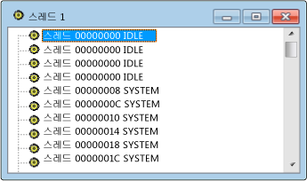

# Threads View
[!INCLUDE[vs2017banner](../code-quality/includes/vs2017banner.md)]

스레드 뷰는 시스템의 창과 연결된 모든 스레드의 단순 목록입니다.  여기에는 각 스레드의 스레드 ID와 모듈 이름이 표시됩니다.  프로세스는 표시되지 않지만 선택된 스레드를 소유하고 있는 프로세스는 쉽게 찾을 수 있습니다.  
  
## 절차  
  
#### 스레드 뷰를 열려면  
  
1.  **Spy** 메뉴에서 **스레드**를 선택합니다.  
  
   
Spy\+\+ 스레드 뷰  
  
 위 그림은 스레드 뷰를 보여 줍니다.  
  
## 단원 내용  
 [스레드 뷰에서 스레드 검색](../debugger/how-to-search-for-a-thread-in-threads-view.md)  
 스레드 뷰에서 특정 스레드를 찾는 방법에 대해 설명합니다.  
  
 [스레드 속성 표시](../debugger/how-to-display-thread-properties.md)  
 스레드 대한 자세한 내용을 표시하는 방법에 대해 설명합니다.  
  
## 관련 단원  
 [Spy\+\+ 뷰](../debugger/spy-increment-views.md)  
 창, 메시지, 프로세스 및 스레드의 Spy\+\+ 트리 뷰에 대해 설명합니다.  
  
 [Spy\+\+ 사용](../debugger/using-spy-increment.md)  
 Spy\+\+ 도구를 소개하고 사용 방법에 대해 설명합니다.  
  
 [스레드 검색 대화 상자](../debugger/thread-search-dialog-box.md)  
 스레드 뷰에서 특정 스레드의 노드를 찾는 데 사용됩니다.  
  
 [스레드 속성 대화 상자](../debugger/message-properties-dialog-box.md)  
 스레드 뷰나 메시지 뷰에서 선택한 스레드의 속성을 표시합니다.  
  
 [Spy\+\+ 참조](../debugger/spy-increment-reference.md)  
 각 Spy\+\+ 메뉴 및 대화 상자에 대해 설명하는 단원이 포함되어 있습니다.