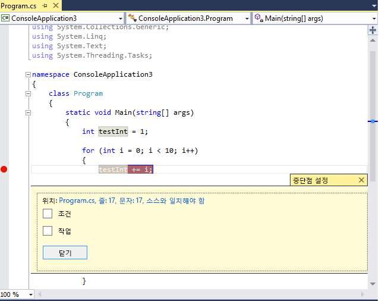
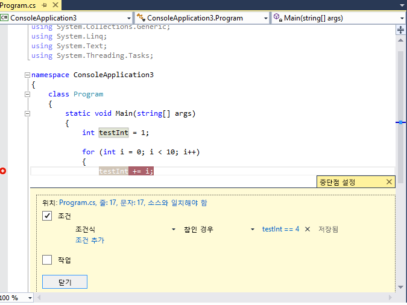
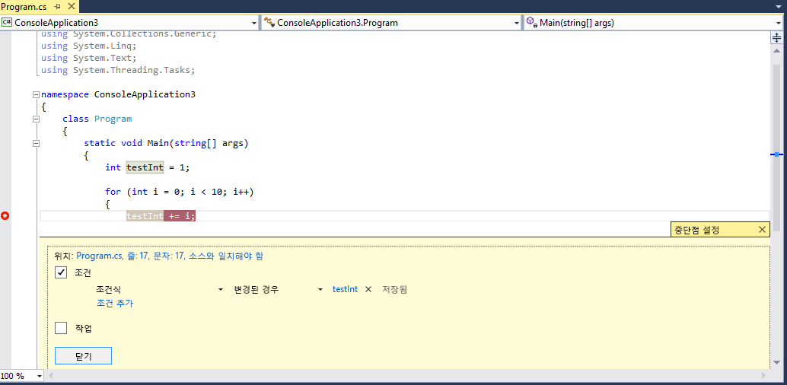
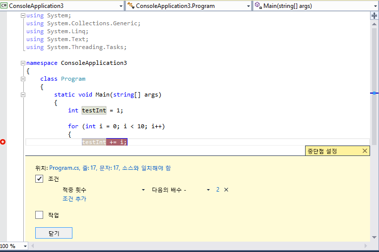

# <a name="use-breakpoints-in-the-visual-studio-debugger"></a>Visual Studio 디버거에서 중단점을 사용 합니다.
예를 들어 코드 변수의 상태를 확인하거나 호출 스택을 검토하기 위해 디버거 실행을 중지하려는 경우 중단점을 설정할 수 있습니다. 개발자 도구 상자에 가장 중요한 디버깅 기술 중 하나가 있습니다.  
  
##  <a name="BKMK_Overview"></a> 소스 코드에서 줄 중단점을 설정합니다.  
 소스 코드 파일의 왼쪽된 여백을 클릭 하 여 또는 코드의 줄에 커서를 배치 하 고 F9 키를 눌러 소스 코드에서 줄 중단점을 설정 합니다. 중단점이 왼쪽 여백에 빨간 점으로 나타나고 코드 줄도 색이 지정됩니다.  
  
   
  
 디버거에서 이 코드를 실행하면 중단점이 적중될 때마다 해당 줄의 코드가 실행되기 전에 실행이 중지됩니다. 소스 코드에서 해당 줄이 노란색으로 표시됩니다.  
  
   
  
 이때 `testInt`의 값은 여전히 1입니다.  
  
 변수 값 및 호출 스택을 포함하여 응용 프로그램의 현재 상태를 확인할 수 있습니다. 호출 스택에 대한 자세한 내용은 [How to: Use the Call Stack Window](../debugger/how-to-use-the-call-stack-window.md)을 참조하세요.  
  
 실행 코드의 임의의 줄에서 중단점을 설정할 수 있습니다. 예를 들어 위의 C# 코드에서 변수 선언이나 `for` 루프 또는 `for` 루프 내의 모든 코드에서 중단점을 설정할 수 있지만 네임스페이스, 클래스 선언 또는 메서드 서명에서는 중단점을 설정할 수 없습니다.  
  
##  <a name="BKMK_Set_a_breakpoint_in_a_source_file"></a> 함수 중단점 설정  
  함수가 호출 될 때 실행을 중단할 수 있습니다.
  
1. 열기는 **중단점** 창을 선택 하 고 **새로 만들기 > 함수 중단점**합니다.

2. 함수 이름 입력는 **함수 이름** 상자입니다. 

   범위를 좁히려면 함수 사양:
   
   정규화 된 함수 이름을 사용 합니다. 
   예: Namespace1.ClassX.MethodA()
   
   매개 변수 형식의 오버 로드 된 함수를 추가 합니다. 
   예: 여 MethodA (int, string)
   
   사용 하는 '!' 기호 모듈을 지정 합니다.
   예: App1.dll! 여 MethodA
   
   네이티브 c + +에서 컨텍스트 연산자를 사용 합니다.
   {함수, [module]을 (를) [+&lt;메서드의 시작 로부터의 오프셋&gt;] 예: {여 MethodA, App1.dll}+2

3. 에 **언어** 드롭다운에서 함수에서 중단 하려는 특정 언어를 선택 합니다.
  
##  <a name="BKMK_Set_a_breakpoint_in_a_function"></a> 다른 종류의 중단점 설정  
 호출 스택, 디스어셈블리 창 및 네이티브 C++ 코드에서 데이터 조건 또는 메모리 주소에 중단점을 설정할 수도 있습니다.  
  
## <a name="BKMK_Set_a_breakpoint_in_the_call_stack_window"></a> 호출 스택 창에서 중단점 설정  
 **호출 스택** 창에서 중단점을 설정하여 호출 함수가 반환되는 명령이나 줄에서 실행을 중단할 수 있습니다. 호출 스택에 대한 자세한 내용은 [How to: Use the Call Stack Window](../debugger/how-to-use-the-call-stack-window.md)을 참조하세요. 디버거의 실행을 중지해야 합니다.  
  
1.  응용 프로그램 디버그를 시작하고 실행이 중지(예: 중단점에서)되도록 대기합니다. 열기는 **호출 스택** 창 (**디버그 > Windows > 호출 스택**, 또는 **CTRL + ALT + C**).  
  
2.  호출 하는 함수를 마우스 오른쪽 단추로 클릭 한 다음 선택 **중단점 > 중단점 삽입**, 바로 가기 키 사용 또는 **F9**합니다.  
  
3.  호출 스택의 왼쪽 여백에서 함수 호출 이름 옆에 중단점 기호가 표시됩니다.  
  
 **중단점** 창에서 호출 스택 중단점은 함수의 다음 실행 명령에 해당하는 메모리 위치가 포함된 주소로 나타납니다. 디버거는 해당 명령에서 실행을 중단합니다.  
  
 시각적으로 추적 코드 실행 중 중단점, 참조 [디버깅 하는 동안 호출 스택의 메서드 매핑할](../debugger/map-methods-on-the-call-stack-while-debugging-in-visual-studio.md)합니다.  
  
## <a name="setting-a-breakpoint-in-the-disassembly-window"></a>디스어셈블리 창에서 중단점 설정  
 어셈블리 명령에 중단점을 설정하려면 디버거가 중단 모드여야 합니다.  
  
1.  응용 프로그램 디버그를 시작하고 실행이 중지(예: 중단점에서)되도록 대기합니다. 열기는 **디스어셈블리** 창 (**디버그 > Windows > 디스어셈블리**, 또는 **Ctrl + Alt + D**).  
  
2.  실행을 중단할 명령에서 왼쪽 여백을 클릭하거나 명령에 커서를 설정하고 **F9**키를 누릅니다.  
  
## <a name="BKMK_set_a_data_breakpoint_native_cplusplus_only"></a>데이터 중단점 설정(네이티브 C++에만 해당)  
 데이터 중단점은 지정된 메모리 주소에 저장된 값이 변경되면 실행을 중단합니다. 값을 읽기만 하고 변경하지는 않을 때는 실행이 중단되지 않습니다. 데이터 중단점을 설정하려면 디버거가 중단 모드여야 합니다.  
  
1.  응용 프로그램 디버그를 시작하고 중단점에 도달할 때까지 대기합니다. 에 **디버그** 메뉴 선택 **새 중단점 > 데이터 중단점** (열거나는 **중단점** 창 선택 **새로 만들기 > 데이터 중단점**.  
  
2.  **주소** 상자에 메모리 주소를 입력하거나 메모리 주소로 계산되는 식을 입력합니다. 예를 들어, 변수 `&avar` 의 내용이 변경되면 중단하려면 `avar` 을 입력합니다.  
  
3.  디버거에서 조사할 바이트 수를 **바이트 계산** 드롭다운에서 선택합니다. 예를 들어, **4**를 선택하면 디버거가 `&avar` 에서 시작되는 4바이트를 조사하여 해당 바이트의 값이 변경되면 중단됩니다.  
  
 데이터 중단점은 특정 메모리 주소를 적용할 수 있는지 여부에 의존한다는 점에 유의하세요.  
  
-   변수의 주소는 디버깅 세션별로 달라집니다. 데이터 중단점은 각 디버깅 세션이 끝날 때 자동으로 해제됩니다.  
  
-   데이터 중단점을 지역 변수에 설정한 경우에는 함수가 종료되어도 중단점이 설정된 상태로 유지되지만 메모리 주소는 더 이상 적용할 수 없게 되며 중단점의 동작을 예측할 수 없습니다. 데이터 중단점을 지역 변수에 설정한 경우에는 함수가 종료되기 전에 중단점을 제거하거나 해제해야 합니다.  
  
 다음 조건에서는 데이터 중단점이 작동하지 않습니다.  
  
-   디버그 중이 아닌 프로세스가 메모리 위치에 쓰는 경우  
  
-   둘 이상의 프로세스가 메모리 위치를 공유하는 경우  
  
-   커널 내에서 메모리 위치가 업데이트되는 경우. 예를 들어 32비트 Windows `ReadFile` 함수에 메모리가 전달된 경우 커널 모드에서 메모리가 업데이트되므로 메모리에 쓸 때 디버거는 실행을 중단하지 않습니다.  
  
## <a name="setting-a-breakpoint-with-a-memory-address-native-c-only"></a>메모리 주소를 사용하여 중단점 설정(네이티브 C++에만 해당)  
 개체의 주소를 사용하여 클래스의 특정 인스턴스에서 호출되는 메서드에 중단점을 설정할 수도 있습니다.  예를 들면 다음과 같습니다.  
  
 예를 들어 주소를 가진 `my_class` 형식의 개체가 제공된 경우 해당 인스턴스에서 호출된 `my_method` 라는 메서드에 함수 중단점을 설정할 수 있습니다.  
  
1.  클래스의 해당 인스턴스가 인스턴스화된 후 어딘가에 중단점을 설정합니다.  
  
2.  인스턴스의 주소를 찾습니다(`0xcccccccc`라고 함).  
  
3.  클릭 **디버그 > 새 중단점 > 함수 중단점** (또는 **ALT + F9, B**).  
  
4.  **함수 이름** 상자에 다음 텍스트를 추가합니다.  
  
    ```C++  
    ((my_class *) 0xcccccccc)->my_method  
    ```  
  
##  <a name="BKMK_Specify_advanced_properties_of_a_breakpoint_"></a> 중단점 관리  
 사용할 수 있습니다는 **중단점** 창 (**디버그 > Windows > 중단점**, 또는 **CTRL + ALT + B**) 솔루션에 설정한 모든 중단점을 볼 수 있습니다.  
  
   
  
 **중단점** 창은 모든 중단점을 관리하는 중심적인 곳이므로 중단점이 중요한 대규모 솔루션이나 복잡한 디버깅 시나리오에서 특히 유용할 수 있습니다. 중단점 집합의 상태 및 위치를 저장하거나 공유해야 하는 경우 **중단점** 창에서만 중단점을 내보내고 가져올 수 있습니다.  
  
##  <a name="BKMK_Specify_a_breakpoint_condition_using_a_code_expression"></a> 고급 중단점  
  
## <a name="breakpoint-conditions"></a>중단점 조건  
 조건을 설정하여 중단점 실행 시점과 위치를 제어할 수 있습니다.  
  
1.  중단점을 마우스 오른쪽 단추로 클릭하거나 중단점 위로 마우스를 가져가 설정 아이콘을 선택합니다.  
  
2.  상황에 맞는 메뉴에서 **조건**을 선택합니다. **중단점 설정** 창이 열립니다.  
  
   
  
 **조건** 상자를 선택하면 창이 확장되어 다른 종류의 조건이 표시됩니다.  
  
 **조건식:** 조건식을 선택하고 나면 **참인 경우** 및 **변경된 경우**등의 두 조건을 선택할 수 있습니다. 식을 만족할 때 중단하려면 **참인 경우** 를 선택하고, 식의 값이 변경되었을 때 중단하려면 **변경된 경우** 를 선택합니다.  
  
 다음 예제에서는 `testInt` 의 값이 **4**일 때만 중단점이 적중되도록 설정합니다.  
  
   
  
 다음 예제에서는 `testInt`의 값이 변경되는 경우에만 중단점이 적중되도록 설정합니다.  
  
   
  
 변경된 경우 필드의 동작은 프로그래밍 언어별로 서로 다릅니다. 네이티브 코드에 대해 **변경된 경우** 를 선택하는 경우 디버거는 조건의 첫 번째 계산을 변경으로 간주하지 않으므로 첫 번째 계산에서는 중단점이 적중되지 않습니다. 선택 하면 **변경 될 때** 후 첫 번째 계산에서 중단점이 적중 될 관리 코드에 대 한 **변경 될 때** 을 선택 합니다.  
  
 잘못된 구문을 사용하여 중단점 조건을 설정하면 경고 메시지가 나타납니다. 올바르지만 의미가 잘못된 구문을 사용하여 중단점 조건을 지정하면 중단점이 처음 적중될 때 경고 메시지가 나타납니다. 두 경우 모두 잘못된 중단점이 적중되면 디버거에서 실행을 중단합니다. 조건이 올바르고 `false`가 되는 경우에만 중단점을 건너뜁니다.  
  
 디버거에서 인식하는 모든 유효한 식은 조건이 될 수 있습니다. 유효한 식에 대한 자세한 내용은 [Expressions in the Debugger](../debugger/expressions-in-the-debugger.md)을 참조하세요.  

> [!NOTE]
> 사용할 수 있습니다 **CTRL + Enter** 를 닫으려면는 **중단점 설정** 창.
  
## <a name="using-object-ids-in-breakpoint-conditions-c-and-f"></a>중단점 조건에서 개체 ID 사용(C# 및 F#)  
 특정 개체의 동작을 관찰하려는 경우가 있습니다. 예를 들어 개체가 컬렉션에 두 번 이상 삽입된 이유를 확인할 수 있습니다. C# 및 F#에서 [참조 형식](/dotnet/csharp/language-reference/keywords/reference-types) 의 특정 인스턴스에 대한 개체 ID를 만들고 중단점 조건에서 사용할 수 있습니다. 개체 ID는 CLR(공용 언어 런타임) 디버깅 서비스에 의해 생성되고 개체와 연결됩니다.  개체 ID를 만들려면 다음을 수행합니다.  
  
1.  개체를 만들고 일정 시간 후에 코드에서 중단점을 설정합니다.  
  
2.  디버깅을 시작하고, 실행이 중단점에서 중지되면 **지역** 창에서 중단점을 찾아 마우스 오른쪽 단추로 클릭한 다음 **개체 ID 만들기**를 선택합니다.  
  
     **$** 창에 **지역** 창에서 중단점을 설정하여 호출 함수가 반환되는 명령이나 줄에서 실행을 중단할 수 있습니다. 이는 개체 ID입니다.  
  
3.  조사하려는 지점(예: 컬렉션에 개체를 추가해야 하는 경우)에 새 조건부 중단점을 추가합니다.  
  
4.  조건부 식 필드에 개체 ID를 사용합니다. 예를 들어 컬렉션에 추가해야 하는 개체를 참조하는 `item` 변수가 있는 경우 **item == $n**을 추가합니다. 여기서 **n** 은 개체 ID 번호입니다.  
  
     컬렉션에 개체를 추가해야 하는 지점에서 실행이 중단됩니다.  
  
 나중에 개체 ID를 삭제하려면 **지역** 창에서 변수를 마우스 오른쪽 단추로 클릭하고 **개체 ID 삭제**를 선택합니다.  
  
 개체 ID는 약한 참조를 만들고 개체가 가비지 수집되지 않도록 차단하지 않습니다. 현재 디버깅 세션에 대해서만 유효합니다.  
  
## <a name="hit-count"></a>적중 횟수  
 코드의 루프가 특정 횟수 이후에 것을 시작 하는 의심 되는 경우 지정 된 횟수를 반복 해 서 누릅니다 하는 것이 아니라 코드를 관련된 줄에 적중 후 실행을 중지 하도록 중단점을 설정할 수 있습니다 **F5**  반복 수준에 도달 하 합니다.  
  
 **중단점 설정** 창에서 조건을 **적중 횟수**로 설정합니다. 그런 다음 반복 횟수를 지정할 수 있습니다. 다음 예제에서는 반복 2회당 한 번 중단점이 적중되도록 설정합니다.  
  
   
  
## <a name="filter"></a>필터  
 지정된 장치에서만 발생하거나 지정된 프로세스 및 스레드에서만 발생하도록 중단점을 제한할 수 있습니다.  
  
 **중단점 설정**창에서 조건을 **필터**로 설정합니다. 다음 식 중 하나 이상을 입력합니다.  
  
-   MachineName = "이름"  
  
-   ProcessId = 값  
  
-   ProcessName = "이름"  
  
-   ThreadId = 값  
  
-   ThreadName = "이름"  
  
 문자열 값은 큰따옴표로 묶습니다. `&`(AND), `||`(OR), `!`(NOT), 괄호를 사용하여 절을 결합할 수 있습니다.  
  
##  <a name="BKMK_Print_to_the_Output_window_with_tracepoints"></a> 중단점 작업 및 추적점  
 추적점은 출력 창에 메시지를 인쇄하는 중단점입니다. 추적점은 프로그래밍 언어의 임시 추적 문처럼 작동할 수 있습니다.  
  
 **중단점 설정** 창에서 **작업** 상자를 선택합니다. **작업** 그룹에서 **출력 창에 메시지 기록** 을 선택합니다. **테스트입니다**와 같은 일반 문자열을 인쇄할 수 있습니다. 변수의 값 또는 식을 포함하려면 중괄호로 묶습니다.  형식 지정자를 사용할 수도 있습니다 ([C#](../debugger/format-specifiers-in-csharp.md) 및 [c + +](../debugger/format-specifiers-in-cpp.md)) 추적점에 포함 된 값에 대 한 합니다.
  
 추적점이 적중될 때 실행을 중단하려면 **계속 실행** 확인란을 선택 취소합니다. **계속 실행** 을 선택하면 실행이 중단되지 않습니다. 두 경우 모두 메시지가 인쇄됩니다.  
  
 **메시지**에 다음과 같은 특수 키워드를 사용할 수 있습니다.  
  
|||  
|-|-|  
|**$ADDRESS**|현재 명령|  
|**$CALLER**|호출 함수 이름|  
|**$CALLSTACK**|호출 스택|  
|**$FUNCTION**|현재 함수 이름|  
|**$PID**|프로세스 ID|  
|**$PNAME**|프로세스 이름|  
|**$TID**|스레드 ID|  
|**$TNAME**|스레드 이름|  
|**$TICK**||  
|**$TNAME**||  
  
##  <a name="BKMK_Set_a_breakpoint_at_a_function_return_in_the_Call_Stack_window"></a> 중단점 레이블  
 중단점 레이블은 중단점 목록을 정렬하고 필터링하기 위해 **중단점** 창에서만 사용됩니다. 중단점에 레이블을 추가하려면 중단점 행을 선택한 다음 상황에 맞는 메뉴에서 **레이블** 을 선택합니다.  
  
## <a name="export-and-import-breakpoints"></a>중단점 내보내기 및 가져오기  
 중단점을 마우스 오른쪽 단추로 클릭하고 **내보내기**를 선택하여 중단점을 XML 파일로 내보낼 수 있습니다. 파일은 기본적으로 솔루션 디렉터리에 저장됩니다. 중단점을 가져오려면 **중단점** 창을 열고(**CTRL + ALT + B**) 도구 모음에서 오른쪽 화살표(도구 설명: **파일에서 중단점 가져오기**)를 클릭합니다.  
  
## <a name="see-also"></a>참고 항목  
[Visual Studio 디버거에서 중단점 문제 해결](../debugger/troubleshooting-breakpoints.md)  
[디버거로 코드 탐색](../debugger/navigating-through-code-with-the-debugger.md)
