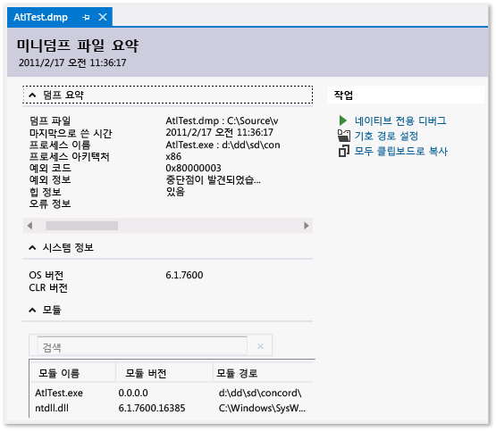

# Visual Studio와 함께 사용 하 여 덤프 파일
또는 힙을; 포함 하지 않는 덤프 파일 덤프 파일; 만들기 덤프 파일; 열기 이진 파일, pdb의 및 덤프 파일에 대 한 소스 파일을 찾습니다.
  
##  덤프 파일 이란 무엇 인가요?  
 A *덤프 파일* 는 지점에 응용 프로그램의 스냅숏 덤프가 수행 되는 시간입니다. 이 파일에서는 실행 중이던 프로세스와 로드된 모듈을 보여 줍니다. 덤프를 힙 정보와 함께 저장하는 경우 덤프 파일에는 해당 시점에 응용 프로그램 메모리에 있던 것의 스냅샷이 포함됩니다. Visual Studio에서 힙을 포함하는 덤프 파일을 여는 것은 디버그 세션의 중단점에서 중지하는 것과 같습니다. 실행을 계속할 수 없지만 덤프가 발생한 시간에 응용 프로그램의 스택, 스레드 및 변수 값을 검사할 수 있습니다.  
  
 덤프에는 개발자에 액세스할 수 없는 컴퓨터에서 발생 하는 문제를 디버깅을 위해 주로 사용 됩니다. 예를 들어 고객이 경험한 충돌을 재현 없거나 컴퓨터에 중단 경우 고객의 컴퓨터에서 덤프 파일을 사용할 수 있습니다. 또한 테스터가 충돌 또는 중단 데이터를 저장하기 위해 덤프를 만들 수도 있으며, 이 경우 테스트 컴퓨터에서 더 많은 테스트를 수행할 수 있습니다. Visual Studio 디버거는 관리 코드 또는 네이티브 코드에 대한 덤프 파일을 저장할 수 있습니다. 디버거 Visual Studio에서 또는 파일에 저장 하는 다른 프로그램에서 생성 된 덤프 파일을 로드할 수는 *미니 덤프* 형식입니다.  
  
##  또는 힙을 포함 하지 않는 덤프 파일  
 힙 정보를 포함하거나 포함하지 않고 덤프 파일을 만들 수 있습니다.  
  
-   **덤프 파일 힙 포함** 응용 프로그램의 메모리 스냅숏을 포함 합니다. 여기에는 덤프가 만들어진 시점의 변수 값이 포함됩니다. 힙과 함께 저장된 덤프 파일을 로드하는 경우에는 응용 프로그램 이진 파일을 찾을 수 없더라도 Visual Studio에서 기호를 로드할 수 있습니다. 또한 Visual Studio에서는 로드된 네이티브 모듈의 이진 파일을 덤프 파일에 저장하므로 디버깅을 훨씬 쉽게 수행할 수 있습니다.  
  
-   **덤프 파일 힙 포함 하지 않는** 힙 정보를 포함 하는 덤프 보다 훨씬 작습니다. 그러나 디버거는 기호 정보를 찾기 위해 응용 프로그램 이진 파일을 로드해야 합니다. 이 이진 파일은 덤프가 만들어졌을 때 사용된 이진 파일과 정확히 일치해야 합니다. 스택 변수의 값만 힙 데이터를 포함하지 않는 덤프 파일에 저장됩니다.  
  
##  요구 사항 및 제한 사항  
  
-   최적화된 코드의 덤프 파일 디버깅은 혼란을 줄 수 있습니다. 예를 들어 함수의 컴파일러 인라인 처리로 예기치 않은 호출 스택이 발생할 수 있으며 다른 최적화로 변수의 수명이 변경될 수 있습니다.  
  
-   64비트 컴퓨터의 덤프 파일은 64비트 컴퓨터에서 실행 중인 Visual Studio 인스턴스에서 디버깅되어야 합니다.  
  
-   VS 2013 이전 버전의 Visual Studio에서는 일부 도구(예: 작업 관리자 및 64비트 WinDbg)로 수집된 64비트 컴퓨터에서 실행된 32비트 응용 프로그램의 덤프를 Visual Studio에서 열 수 없었습니다. 하지만 VS 2013에서는 이러한 제한이 사라졌습니다.  
  
-   Visual Studio에서는 ARM 장치에서 네이티브 응용 프로그램의 덤프 파일을 디버깅할 수 있습니다. 또한 Visual Studio에서는 ARM 장치에서 관리되는 응용 프로그램의 응용 프로그램 덤프 파일을 디버깅할 수 있지만 이는 네이티브 디버거에서만 가능합니다.  
  
-   디버깅 하려면 [커널 모드](http://msdn.microsoft.com/library/windows/hardware/ff551880.aspx) 덤프 파일을의 일부인 Windows 용 디버깅 도구를 다운로드 하는 [키트 WDK (Windows 드라이버)](/windows/hardware/windows-driver-kit)합니다. 
  
-   Visual Studio로 알려진 이전 덤프 형식으로 저장 된 덤프 파일을 디버깅할 수 없습니다는 [전체 사용자 모드 덤프](http://msdn.microsoft.com/library/windows/hardware/ff545506.aspx)합니다. 전체 사용자 모드 덤프는 힙을 포함하는 덤프와 동일하지 않습니다.  
  
-   사용 하 여 디버그 하는 [SOS.dll (SOS 디버깅 확장)](/dotnet/framework/tools/sos-dll-sos-debugging-extension) Visual Studio에서의 일부인 Windows 용 디버깅 도구를 설치 해야는 [키트 WDK (Windows 드라이버)](/windows/hardware/windows-driver-kit) 
  
##  덤프 파일 만들기  
 Visual Studio에서 덤프 파일을 만들려면  
  
-   Visual Studio에서 프로세스를 디버깅하는 동안 디버거가 예외 또는 중단점에서 중지되었을 때 덤프 파일을 저장할 수 있습니다. 선택 **디버그**, 다음 **으로 덤프 저장**, 다음 **디버그**합니다. **이름으로 덤프 저장** 대화 상자는 **파일 형식** 선택할 수 있습니다 목록 **미니 덤프** 또는 **힙 사용 미니 덤프** (기본값).  
  
-   와 [Just-In-Time 디버깅](../debugger/just-in-time-debugging-in-visual-studio.md) 활성화 디버거, 외부에서 실행 되는 충돌된 프로세스에 디버거 연결을 덤프 파일을 저장 합니다. 참조 [실행 중인 프로세스에 연결](../debugger/attach-to-running-processes-with-the-visual-studio-debugger.md)  
  
 또한 Windows 미니덤프 형식을 지원하는 프로그램으로 덤프 파일을 만들 수도 있습니다. 예를 들어는 **Procdump** 명령줄 유틸리티는 [Windows Sysinternals](http://technet.microsoft.com/sysinternals/default) 트리거 또는 요청 시에 따라 프로세스 크래시 덤프 파일을 만들 수 있습니다. 참조 [요구 사항 및 제한 사항](../debugger/using-dump-files.md#BKMK_Requirements_and_limitations) 다른 도구를 사용 하 여 덤프 파일을 만들도록 하는 방법에 대 한 자세한 내용은이 항목의 합니다. 
  
##  덤프 파일 열기  
  
1.  Visual Studio에서 선택 **파일**, **열려**, **파일**합니다.  
  
2.  에 **열려 있는 파일** 대화 상자, 찾아 덤프 파일을 선택 합니다. 덤프 파일의 확장명은 일반적으로 .dmp입니다. 그런 다음 선택 **확인**합니다.  
  
3.  **덤프 파일 요약** 창이 나타납니다. 이 창에서는 덤프 파일의 디버깅 요약 정보를 보고 기호 경로를 설정하고 디버깅을 시작하고 요약 정보를 클립보드로 복사할 수 있습니다.  
  
       
  
4.  디버깅을 시작 하려면로 이동는 **동작** 섹션 중 하나를 선택 하 고 **만 관리를 사용 하 여 디버그**, **로 네이티브 전용 디버그** 또는 **혼합를사용하여디버그**.  
  
##  이진 파일, 기호 (.pdb) 파일 및 소스 파일 찾기  
 덤프 파일을 디버깅하기 위해 Visual Studio의 전체 기능을 사용하려면 다음에 액세스해야 합니다.  
  
-   덤프가 만들어진 .exe 파일과 덤프 프로세스에서 사용된 다른 이진 파일(DLL 등)  
  
     힙 데이터를 포함하는 덤프를 디버깅하는 경우 Visual Studio에서는 일부 모듈의 누락된 이진 파일 문제를 처리할 수 있지만 유효한 호출 스택을 생성하는 데 충분한 모듈의 이진 파일이 있어야 합니다. Visual Studio에서는 힙을 포함하는 덤프 파일에 네이티브 모듈을 포함합니다.  
  
-   .exe 및 기타 이진 파일에 대한 기호(.pdb) 파일  
  
-   관심 있는 모듈의 소스 파일  
  
     실행 파일과 .pdb 파일은 덤프가 만들어졌을 때 사용된 파일의 버전 및 빌드와 정확히 일치해야 합니다.  
  
     소스 파일을 찾을 수 없는 경우에 모듈의 디스어셈블리를 사용 하 여 디버깅할 수 있습니다.  
  
 **실행 파일의 기본 검색 경로**  
  
 Visual Studio는 덤프 파일에 포함 되지 않은 실행 파일에 대 한 이러한 위치를 자동으로 검색 합니다.  
  
1.  덤프 파일이 포함된 디렉터리  
  
2.  덤프 파일에서 지정된 모듈의 경로. 덤프가 수집된 컴퓨터의 모듈 경로입니다.  
  
3.  에 지정 된 기호 경로 **디버깅**, **옵션**, **기호** 페이지는 Visual Studio의 **도구**, **옵션**  대화 상자. 이 페이지에서 검색할 위치를 더 추가할 수 있습니다.  
  
 **No 이진을 사용 하 여 > 기호 > 소스 페이지**  
  
 적절 한 페이지를 표시 Visual Studio에서 덤프의 모듈을 디버깅 하는 데 필요한 파일을 찾을 수 없으면 (**이진 파일 없음**, **기호 없음**, 또는 **소스 없음**). 이러한 페이지에서는 문제의 원인에 대한 자세한 정보를 제공하고 파일의 올바른 위치를 식별하는 데 도움이 되는 작업 링크를 제공합니다. 참조 [기호 (.pdb)을 지정 하 고 소스 파일과](../debugger/specify-symbol-dot-pdb-and-source-files-in-the-visual-studio-debugger.md)합니다.  
  
## 참고 항목  
 [Just-in-time 디버깅](../debugger/just-in-time-debugging-in-visual-studio.md)   
 [기호 (.pdb)을 지정 하 고 소스 파일](../debugger/specify-symbol-dot-pdb-and-source-files-in-the-visual-studio-debugger.md)   
 [IntelliTrace](../debugger/intellitrace.md)