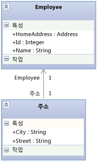

# <a name="using-the-intellitrace-stand-alone-collector"></a>IntelliTrace 독립 실행형 수집기 사용
**IntelliTrace 독립 실행형 수집기** 를 사용하면 대상 컴퓨터에 Visual Studio를 설치하거나 대상 시스템 환경을 변경하지 않고도 프로덕션 서버 또는 기타 환경에서 앱에 대해 IntelliTrace 진단 데이터를 수집할 수 있습니다. IntelliTrace 독립 실행형 수집기는 웹, SharePoint, WPF 및 Windows Forrms 앱에서 작동합니다. 데이터 수집을 마쳤으면 컬렉터를 삭제하여 제거하면 됩니다.  
  
 IntelliTrace의 실제 작동 방식은 [디버깅을 위해 프로덕션에서 IntelliTrace 데이터 수집 및 분석(Channel 9 비디오)](http://go.microsoft.com/fwlink/?LinkID=251851)을 참조하세요.  
  
> [!NOTE]
>  **추적** 모드에서 **Microsoft Monitoring Agent** 를 사용하면 원격 컴퓨터에서 실행되는 SharePoint 앱 및 웹에 대해 같은 IntelliTrace 데이터를 수집할 수도 있습니다.  
>   
>  **모니터** 모드에서 에이전트를 실행하면 IntelliTrace 데이터에서 성능 관련 이벤트를 수집할 수 있습니다. **모니터** 모드는 **추적** 모드 또는 **IntelliTrace 독립 실행형 수집기**에 비해 성능에 주는 영향이 적습니다. Microsoft Monitoring Agent는 설치 시 대상 시스템 환경을 변경합니다. 참조 [Microsoft Monitoring Agent를 사용 하 여](../debugger/using-the-microsoft-monitoring-agent.md)합니다.  
  
 **Requirements**  
  
-   .NET Framework 3.5, 4 또는 4.5  
  
-   .iTrace 파일을 열기 위한 개발 컴퓨터 또는 다른 컴퓨터의 Visual Studio Enterprise(Professional 또는 Community Edition 아님)  
  
    > [!NOTE]
    >  기호(.pdb) 파일을 저장해야 합니다. IntelliTrace를 사용하여 코드를 디버그하고 단계별로 실행하려면 일치하는 소스 파일과 기호 파일이 있어야 합니다. 참조 [배포 후 문제 진단](../debugger/diagnose-problems-after-deployment.md)합니다.  
  
 **FAQ**  
  
-   [컬렉터를 사용할 수 있는 앱](#WhatApps)  
  
-   [시작하는 방법](#GetStarted)  
  
-   [앱 속도를 그대로 유지하면서 데이터를 최대한 수집하는 방법](#Minimizing)  
  
-   [IntelliTrace 데이터를 가져올 수 있는 다른 위치](#WhereElse)  
  
##  <a name="WhatApps"></a> 컬렉터를 사용할 수 있는 앱  
  
-   IIS(인터넷 정보 서비스) 버전 7.0, 7.5, 8.0에서 호스트되는 ASP.NET 웹앱  
  
-   SharePoint 2010 및 SharePoint 2013 응용 프로그램  
  
-   WPF(Windows Presentation Foundation) 및 Windows Forms 앱  
  
##  <a name="GetStarted"></a> 시작하는 방법  
  
1.  [수집기 설치](#BKMK_Install_the_IntelliTrace_Stand_Alone_Collector)  
  
2.  [수집기 디렉터리에 대한 사용 권한 설정](#ConfigurePermissionsRunningCollector)  
  
3.  [IntelliTrace PowerShell cmdlet을 설치하고 웹앱 또는 SharePoint 응용 프로그램에 대한 데이터를 수집](#BKMK_Set_up_the_IntelliTrace_PowerShell_commandlets)  
  
4.  [.iTrace 파일 디렉터리에 대한 사용 권한 설정](#BKMK_Create_and_Configure_a_Log_File_Directory)  
  
5.  [웹 응용 프로그램 또는 SharePoint 응용 프로그램에서 데이터 수집](#BKMK_Collect_Data_from_IIS_Application_Pools)  
  
     또는  
  
     [관리되는 앱에서 데이터를 수집합니다.](#BKMK_Collect_Data_from_Executables)  
  
6.  [Visual Studio Enterprise에서 .iTrace 파일을 엽니다.](#BKMK_View_IntelliTrace_Log_Files)  
  
##  <a name="BKMK_Install_the_IntelliTrace_Stand_Alone_Collector"></a> 수집기 설치  
  
1.  앱의 서버에 수집기 디렉터리를 예를 들어 만듭니다: **C:\IntelliTraceCollector**  
  
2.  Microsoft 다운로드 센터에서 또는 Visual Studio 2013 업데이트 3 설치 폴더에서 수집기를 가져옵니다. [Visual Studio 2013 Update 4을 위한 IntelliTrace 수집기](https://www.microsoft.com/en-us/download/details.aspx?id=44909)::  
  
    -   **Microsoft 다운로드 센터**:  
  
        1.  **IntelliTraceCollector.exe**옆의 **다운로드**를 선택합니다.  
  
        2.  IntelliTraceCollector.exe를 **C:\IntelliTraceCollector**와 같은 수집기 디렉터리에 저장합니다.  
  
        3.  IntelliTraceCollector.exe를 실행합니다. 그러면 IntelliTraceCollection.cab 파일이 추출됩니다.  
  
         \- 또는 -  
  
    -   **Visual Studio 설치 폴더**:  
  
        1.  IntelliTraceCollection.cab를 다음 폴더에 복사합니다.  
  
             **.. \Microsoft visual Studio 12.0\Common7\IDE\CommonExtensions\Microsoft\IntelliTrace\12.0.0**  
  
        2.  IntelliTraceCollection.cab를 **C:\IntelliTraceCollector**와 같은 수집기 디렉터리에 저장합니다.  
  
3.  다음 단계를 수행하여 IntelliTraceCollection.cab를 확장합니다.  
  
    1.  앱의 서버에서 관리자 권한으로 명령 프롬프트 창을 엽니다.  
  
    2.  **C:\IntelliTraceCollector**와 같은 수집기 디렉터리로 이동합니다.  
  
    3.  끝의 마침표( **.** )를 포함한 다음**expand**명령을 사용하여 IntelliTraceCollection.cab를 확장합니다.  
  
         `expand  /f:* IntelliTraceCollection.cab .`  
  
        > [!NOTE]
        >  마침표(**.**)는 지역화된 수집 계획을 포함하는 하위 폴더를 보존합니다.  
  
##  <a name="ConfigurePermissionsRunningCollector"></a> 수집기 디렉터리에 대한 사용 권한 설정  
  
1.  앱의 서버에서 관리자 권한으로 명령 프롬프트 창을 엽니다.  
  
2.  Windows **icacls** 명령을 사용하여 서버 관리자에게 수집기 디렉터리에 대한 모든 권한을 제공합니다. 예:  
  
     `icacls "C:\IntelliTraceCollector" /grant "` *\<Domain\AdministratorID >*`":F`  
  
3.  웹앱 또는 SharePoint 응용 프로그램에서 데이터를 수집하려면 다음 단계를 수행합니다.  
  
    1.  IntelliTrace PowerShell cmdlet을 실행하는 사용자에게 수집기 디렉터리에 대한 모든 권한을 제공합니다.  
  
         예:  
  
         `icacls "C:\IntelliTraceCollector" /grant "` *\<도메인 >*`":F`  
  
    2.  웹앱 또는 SharePoint 응용 프로그램의 응용 프로그램 풀에 수집기 디렉터리에 대한 읽기 및 실행 권한을 제공합니다.  
  
         예를 들면 다음과 같습니다.  
  
        -   **DefaultAppPool** 응용 프로그램 풀의 웹앱:  
  
             `icacls "C:\IntelliTraceCollector" /grant "IIS APPPOOL\DefaultAppPool":RX`  
  
        -   **SharePoint - 80** 응용 프로그램 풀의 SharePoint 응용 프로그램:  
  
             `icacls "C:\IntelliTraceCollector" /grant "IIS APPPOOL\SharePoint - 80":RX`  
  
##  <a name="BKMK_Set_up_the_IntelliTrace_PowerShell_commandlets"></a> IntelliTrace PowerShell cmdlet을 설치하고 웹앱 또는 SharePoint 응용 프로그램에 대한 데이터를 수집  
  
1.  앱 서버에서 PowerShell 활성화 되어 있는지를 확인 합니다. 대부분 Windows Server 버전에서는 **서버 관리자** 관리 도구에서 이 기능을 추가할 수 있습니다.  
  
       
  
2.  IntelliTrace PowerShell cmdlet을 설치합니다.  
  
    1.  관리자 권한으로 PowerShell 명령 창을 엽니다.  
  
        1.  **시작**, **모든 프로그램**, **보조프로그램**, **Windows PowerShell**을 차례로 선택합니다.  
  
        2.  다음 단계 중 하나를 선택합니다.  
  
            -   64비트 운영 체제에서는 **Windows PowerShell**의 바로 가기 메뉴를 엽니다. **관리자 권한으로 실행**을 선택합니다.  
  
            -   32비트 운영 체제에서는 **Windows PowerShell(x86)**의 바로 가기 메뉴를 엽니다. **관리자 권한으로 실행**을 선택합니다.  
  
    2.  PowerShell 명령 창에서 **Import-Module** 명령을 사용하여 **Microsoft.VisualStudio.IntelliTrace.PowerShell.dll**을 가져옵니다.  
  
         예를 들면 다음과 같습니다.  
  
         `Import-Module "C:\IntelliTraceCollector\Microsoft.VisualStudio.IntelliTrace.PowerShell.dll"`  
  
##  <a name="BKMK_Create_and_Configure_a_Log_File_Directory"></a> .iTrace 파일 디렉터리에 대한 사용 권한 설정  
  
1.  앱의 서버에서.iTrace 파일 디렉터리를을 같은 만듭니다: **C:\IntelliTraceLogFiles**  
  
    > [!NOTE]
    >  -   앱 속도 저하를 방지 하려면 매우 활성화 되지 않은 로컬 고속 디스크의 위치를 선택 합니다.  
    > -   .ITrace 파일과 수집기 파일은 같은 위치에 배치할 수 있습니다. 그러나 웹앱 또는 SharePoint 응용 프로그램이 있는 경우에는 이 위치가 응용 프로그램을 호스트하는 디렉터리 외부에 있어야 합니다.  
  
    > [!IMPORTANT]
    >  -   .ITrace 파일 디렉터리는 수집기에서 사용해야 하는 ID만으로 제한합니다. IntelliTrace는 메서드 매개 변수로 또는 반환 값으로 전달되는 데이터를 기록할 수 있으므로 .iTrace 파일은 사용자, 데이터베이스, 기타 소스 정보 및 연결 문자열의 데이터와 같은 중요한 정보를 포함할 수 있습니다.  
    > -   .ITrace 파일을 열 수 있는 사용자에게 중요한 데이터를 볼 수 있는 권한이 있는지 확인합니다. .ITrace 파일을 공유할 때는 주의해야 합니다. 다른 사람이 액세스해야 하는 파일은 안전한 공유 위치에 복사합니다.  
  
2.  웹앱 또는 SharePoint 응용 프로그램의 경우에는 .iTrace 파일 디렉터리에 대한 모든 권한을 해당 응용 프로그램 풀에 제공합니다. Windows **icacls** 명령이나 Windows 탐색기 또는 파일 탐색기를 사용할 수 있습니다.  
  
     예를 들면 다음과 같습니다.  
  
    -   Windows **icacls** 명령을 통해 사용 권한을 설정하려면 다음 명령을 사용합니다.  
  
        -   **DefaultAppPool** 응용 프로그램 풀의 웹앱:  
  
             `icacls "C:\IntelliTraceLogFiles" /grant "IIS APPPOOL\DefaultAppPool":F`  
  
        -   **SharePoint - 80** 응용 프로그램 풀의 SharePoint 응용 프로그램:  
  
             `icacls "C:\IntelliTraceLogFiles" /grant "IIS APPPOOL\SharePoint - 80":F`  
  
         또는  
  
    -   Windows 탐색기 또는 파일 탐색기를 통해 사용 권한을 설정하려면 다음 단계를 수행합니다.  
  
        1.  .iTrace 파일 디렉터리의 **속성** 을 엽니다.  
  
        2.  **보안** 탭에서 **편집**, **추가**를 차례로 선택합니다.  
  
        3.  **개체 유형을 선택하세요.** 상자에 **기본 제공 보안 계정** 이 표시되는지 확인하고 선택 하지 **개체 유형** 추가 합니다.  
  
        4.  **찾을 위치를 선택하세요.** 상자에 로컬 컴퓨터가 표시되는지 확인하고 선택 하지 **위치** 변경할 수 있습니다.  
  
        5.  **선택할 개체 이름을 입력하세요.** 상자에 웹앱 또는 SharePoint 응용 프로그램의 응용 프로그램 풀을 추가합니다.  
  
        6.  **이름 확인** 을 선택하여 이름을 확인합니다. **확인**을 선택합니다.  
  
        7.  응용 프로그램 풀에 **모든 권한**이 있는지 확인합니다.  
  
##  <a name="BKMK_Collect_Data_from_IIS_Application_Pools"></a> 웹 응용 프로그램 또는 SharePoint 응용 프로그램에서 데이터 수집  
  
1.  데이터 수집을 시작하려면 관리자 권한으로 PowerShell 명령 창을 열고 다음 명령을 실행합니다.  
  
     `Start-IntelliTraceCollection``"`  *\<ApplicationPool >* `"`  *\<PathToCollectionPlan >*  *\< FullPathToITraceFileDirectory >*  
  
    > [!IMPORTANT]
    >  이 명령을 실행한 후 **Y** 를 입력하여 데이터 수집 시작을 확인합니다.  
  
     예를 들어 **SharePoint - 80** 응용 프로그램 풀의 SharePoint 응용 프로그램에서 데이터를 수집하려면 다음 명령을 실행합니다.  
  
     `Start-IntelliTraceCollection "SharePoint - 80" "C:\IntelliTraceCollector\collection_plan.ASP.NET.default.xml" "C:\IntelliTraceLogFiles"`  
  
    |||  
    |-|-|  
    |*ApplicationPool*|응용 프로그램이 실행되는 응용 프로그램 풀의 이름입니다.|  
    |*PathToCollectionPlan*|수집 계획(수집기의 설정을 구성하는 .xml 파일)의 경로입니다.<br /><br /> 수집기와 함께 제공되는 계획을 지정할 수 있습니다. 다음 계획은 웹앱 및 SharePoint 응용 프로그램에 대해 사용할 수 있습니다.<br /><br /> -collection_plan.ASP.NET.default.xml<br />     예외, 데이터베이스 호출 및 웹 서버 요청을 포함한 IntelliTrace 이벤트 및 SharePoint 이벤트만 수집합니다.<br />-collection_plan.ASP.NET.trace.xml<br />     함수 호출과 collection_plan.ASP.NET.default.xml의 모든 데이터를 수집합니다. 이 계획은 상세 분석의 경우에는 효율적이지만 collection_plan.ASP.NET.default.xml에 비해 앱의 속도는 더 느려질 수 있습니다.<br /><br /> 앱 속도 저하를 방지하려면 이러한 계획을 사용자 지정하거나 계획을 직접 만듭니다. 보안을 유지하려면 수집기 파일과 같은 안전한 위치에 사용자 지정 계획을 저장합니다. [IntelliTrace 수집 계획 만들기 및 사용자 지정](http://go.microsoft.com/fwlink/?LinkId=227871) 및 [앱 속도를 그대로 유지하면서 데이터를 최대한 수집하는 방법](#Minimizing) **참고:** 기본적으로.iTrace 파일의 최대 크기는 100MB입니다. .ITrace 파일이이 한도 도달 하면 수집기는 파일의 최신 항목을 위한 공간 확보 하기 위해 가장 오래 된 항목을 삭제 합니다. 이 제한을 변경 하려면 수집 계획 편집 `MaximumLogFileSize` 특성입니다. <br /><br /> *수집 계획의 지역화된 버전을 찾을 수 있는 위치*<br /><br /> 수집기 하위 폴더에서 지역화된 계획을 찾을 수 있습니다.|  
    |*FullPathToITraceFileDirectory*|.ITrace 파일 디렉터리의 전체 경로입니다. **보안 정보:** 상대 경로가 아닌 전체 경로 제공 합니다.|  
  
     수집기는 응용 프로그램 풀에 연결되어 데이터 수집을 시작합니다.  
  
     *지금은 .iTrace 파일을 열 수 없습니다.* 데이터 수집 중에는 파일이 잠겨 있습니다.  
  
2.  문제를 재현합니다.  
  
3.  .iTrace 파일의 스냅숏을 만들려면 다음 구문을 사용합니다.  
  
     `Checkpoint-IntelliTraceCollection``"`  *\<ApplicationPool >*`"`  
  
4.  컬렉션 상태를 확인하려면 다음 구문을 사용합니다.  
  
     `Get-IntelliTraceCollectionStatus`  
  
5.  데이터 수집을 중지하려면 다음 구문을 사용합니다.  
  
     `Stop-IntelliTraceCollection``"`  *\<ApplicationPool >*`"`  
  
    > [!IMPORTANT]
    >  이 명령을 실행한 후 **Y** 를 입력하여 데이터 수집 중지를 확인합니다. 그렇지 않으면 수집기가 데이터를 계속 수집하거나 iTrace 파일이 잠긴 상태로 유지되거나 파일에 유용한 데이터가 포함되지 않을 수 있습니다.  
  
6.  [Visual Studio Enterprise에서 .iTrace 파일을 엽니다.](#BKMK_View_IntelliTrace_Log_Files)  
  
##  <a name="BKMK_Collect_Data_from_Executables"></a> 관리되는 앱에서 데이터를 수집합니다.  
  
1.  앱을 시작하는 동시에 데이터를 수집하려면 다음 구문을 사용합니다.  
  
     *\<FullPathToIntelliTraceCollectorExecutable >* `\IntelliTraceSC.exe launch /cp:`  *\<PathToCollectionPlan >* `/f:`  *\< FullPathToITraceFileDirectoryAndFileName >*  *\<PathToAppExecutableFileAndFileName >*  
  
     예를 들어 **MyApp**앱에서 데이터를 수집하려면 다음 명령을 실행합니다.  
  
     `C:IntelliTraceCollectorIntelliTraceSC.exe launch /cp:"C:IntelliTraceCollectorcollection_plan.ASP.NET.default.xml" /f:"C:IntelliTraceLogFilesMyApp.itrace" "C:MyAppMyApp.exe"`  
  
    |||  
    |-|-|  
    |*FullPathToIntelliTraceCollectorExecutable*|수집기 실행 파일인 IntelliTraceSC.exe의 전체 경로입니다.|  
    |*PathToCollectionPlan*|수집 계획(수집기의 설정을 구성하는 .xml 파일)의 경로입니다.<br /><br /> 수집기와 함께 제공되는 계획을 지정할 수 있습니다. 관리되는 앱에 사용할 수 있는 계획은 다음과 같습니다.<br /><br /> -collection_plan.ASP.NET.default.xml<br />     예외, 데이터베이스 호출 및 웹 서버 요청을 포함한 IntelliTrace 이벤트만 수집합니다.<br />-collection_plan.ASP.NET.trace.xml<br />     함수 호출과 collection_plan.ASP.NET.default.xml의 모든 데이터를 수집합니다. 이 계획은 상세 분석의 경우에는 효율적이지만 collection_plan.ASP.NET.default.xml에 비해 앱의 속도는 더 느려질 수 있습니다.<br /><br /> 앱 속도 저하를 방지하려면 이러한 계획을 사용자 지정하거나 계획을 직접 만듭니다. 보안을 유지하려면 수집기 파일과 같은 안전한 위치에 사용자 지정 계획을 저장합니다. [IntelliTrace 수집 계획 만들기 및 사용자 지정](http://go.microsoft.com/fwlink/?LinkId=227871) 및 [앱 속도를 그대로 유지하면서 데이터를 최대한 수집하는 방법](#Minimizing) **참고:** 기본적으로.iTrace 파일의 최대 크기는 100MB입니다. .ITrace 파일이이 한도 도달 하면 수집기는 파일의 최신 항목을 위한 공간 확보 하기 위해 가장 오래 된 항목을 삭제 합니다. 이 제한을 변경 하려면 수집 계획 편집 `MaximumLogFileSize` 특성입니다. <br /><br /> *수집 계획의 지역화된 버전을 찾을 수 있는 위치*<br /><br /> 수집기 하위 폴더에서 지역화된 계획을 찾을 수 있습니다.|  
    |*FullPathToITraceFileDirectoryAndFileName*|.iTrace 파일 디렉터리의 전체 경로와 확장명이 **.itrace** 인 .iTrace 파일 이름입니다. **보안 정보:** 상대 경로가 아닌 전체 경로 제공 합니다.|  
    |*PathToAppExecutableFileAndFileName*|관리되는 앱의 경로 및 파일 이름입니다.|  
  
2.  앱을 종료하여 데이터 수집을 중지합니다.  
  
3.  [Visual Studio Enterprise에서 .iTrace 파일을 엽니다.](#BKMK_View_IntelliTrace_Log_Files)  
  
##  <a name="BKMK_View_IntelliTrace_Log_Files"></a> Visual Studio Enterprise에서 .iTrace 파일을 엽니다.  
  
> [!NOTE]
>  IntelliTrace를 사용하여 코드를 디버그하고 단계별로 실행하려면 일치하는 소스 파일과 기호 파일이 있어야 합니다. 참조 [배포 후 문제 진단](../debugger/diagnose-problems-after-deployment.md)합니다.  
  
1.  .iTrace 파일을 Visual Studio Enterprise(Professional 또는 Community Edition 아님)가 설치된 컴퓨터로 이동하거나 복사합니다.  
  
2.  Visual Studio 외부에서 .iTrace 파일을 두 번 클릭하거나 Visual Studio 내부에서 파일을 엽니다.  
  
     Visual Studio에 **IntelliTrace 요약** 페이지가 표시됩니다. 대부분의 섹션에서 이벤트나 기타 항목을 검토하고, 항목을 선택하고, 이벤트가 발생한 시간 및 위치에 해당하는 지점에서 IntelliTrace를 사용하여 디버깅을 시작할 수 있습니다. 참조 [저장 된 IntelliTrace 데이터를 사용 하 여](../debugger/using-saved-intellitrace-data.md)합니다.  
  
    > [!NOTE]
    >  IntelliTrace를 사용하여 코드를 디버그하고 단계별로 실행하려면 개발 컴퓨터에 일치하는 소스 파일과 기호 파일이 있어야 합니다. 참조 [배포 후 문제 진단](../debugger/diagnose-problems-after-deployment.md)합니다.  
  
##  <a name="Minimizing"></a> 앱 속도를 그대로 유지하면서 데이터를 최대한 수집하는 방법  
 IntelliTrace는 많은 데이터를 수집할 수 있으므로 앱 성능에 대한 영향은 수집하는 데이터와 분석하는 코드의 종류에 따라 달라집니다. [프로덕션 서버에서 IntelliTrace 컬렉션 최적화](http://go.microsoft.com/fwlink/?LinkId=255233)를 참조하세요.  
  
 앱 속도를 그대로 유지하면서 대부분의 데이터를 가져올 수 있는 몇 가지 방법은 다음과 같습니다.  
  
-   하거나 문제를 재현할 수 있다고 생각 문제가 있는 경우에 수집기를 실행 합니다.  
  
     컬렉션을 시작하고 문제를 재현한 다음 컬렉션을 중지합니다. Visual Studio Enterprise에서 .iTrace 파일을 열고 데이터를 검사합니다. 참조 [Visual Studio Enterprise에서.iTrace 파일을 열고](#BKMK_View_IntelliTrace_Log_Files)합니다.  
  
-   웹앱 및 SharePoint 응용 프로그램의 경우 수집기는 지정한 응용 프로그램 풀을 공유하는 모든 앱에 대한 데이터를 기록합니다. 수집 계획에서는 단일 앱에 대한 모듈만 지정할 수 있지만, 이로 인해 같은 응용 프로그램 풀을 공유하는 앱의 속도가 느려질 수 있습니다.  
  
     수집기로 인해 다른 앱의 속도가 느려지지 않도록 하려면 자체 응용 프로그램 풀에서 각 앱을 호스트합니다.  
  
-   IntelliTrace가 데이터를 수집하는 이벤트를 수집 계획에서 검토합니다. 수집 계획을 편집하여 관련이나 필요가 없는 이벤트를 사용하지 않도록 설정합니다.  
  
     이벤트를 사용하지 않도록 설정하려면 `enabled` 요소의 `<DiagnosticEventSpecification>` 특성을 `false`로 설정합니다.  
  
     `<DiagnosticEventSpecification enabled="false">`  
  
     `enabled` 특성이 없으면 이벤트는 사용하도록 설정됩니다.  
  
     *이러한 방법을 통해 성능을 개선하는 방식*  
  
    -   앱에 관련이 없는 이벤트를 사용하지 않도록 설정하여 시작 시간을 단축할 수 있습니다. 예를 들어 Windows 워크플로를 사용하지 않는 앱에 대해 Windows 워크플로 이벤트를 사용하지 않도록 설정합니다.  
  
    -   레지스트리에 액세스하기는 하지만 레지스트리 설정에 문제가 표시되지 않는 앱에 대해 레지스트리 이벤트를 사용하지 않도록 설정하면 시작 및 런타임 성능을 모두 개선할 수 있습니다.  
  
-   IntelliTrace가 데이터를 수집하는 모듈을 수집 계획에서 검토하고, 다음 단계를 수행하여 관련이 있는 모듈만 포함하도록 수집 계획을 편집합니다.  
  
    1.  수집 계획을 엽니다. `<ModuleList>` 요소를 찾습니다.  
  
    2.  `<ModuleList>`에서 `isExclusionList` 특성을 `false`로 설정합니다.  
  
    3.  `<Name>` 요소를 사용하여 파일 이름, 문자열 값(이름에 해당 문자열이 들어 있는 모듈이 포함됨) 또는 공개 키 중 하나로 각 모듈을 지정합니다.  
  
     예를 들어 Fabrikam Fiber 웹앱의 기본 웹 모듈에서만 데이터를 수집하려면 다음과 같은 목록을 만듭니다.  
  
    ```xml  
    <ModuleList isExclusionList="false">  
       <Name>FabrikamFiber.Web.dll</Name>  
    </ModuleList>  
  
    ```  
  
     이름에 "Fabrikam"이 포함되어 있는 모든 모듈에서 데이터를 수집하려면 다음과 같은 목록을 만듭니다.  
  
    ```xml  
    <ModuleList isExclusionList="false">  
       <Name>Fabrikam</Name>  
    </ModuleList>  
  
    ```  
  
     공개 키 토큰을 지정하여 모듈에서 데이터를 수집하려면 다음과 같은 목록을 만듭니다.  
  
    ```xml  
    <ModuleList isExclusionList="false">  
       <Name>PublicKeyToken:B77A5C561934E089</Name>  
       <Name>PublicKeyToken:B03F5F7F11D50A3A</Name>  
       <Name>PublicKeyToken:31BF3856AD364E35</Name>  
       <Name>PublicKeyToken:89845DCD8080CC91</Name>  
       <Name>PublicKeyToken:71E9BCE111E9429C</Name>  
    </ModuleList>  
  
    ```  
  
     *이러한 방법을 통해 성능을 개선하는 방식*  
  
     이 작업을 수행하면 앱이 시작되어 실행될 때 IntelliTrace가 수집하는 메서드 호출 정보 및 기타 계측 데이터의 양을 줄일 수 있습니다. 이 데이터를 통해 다음 작업을 수행할 수 있습니다.  
  
    -   데이터 수집 후 코드를 단계별로 실행합니다.  
  
    -   함수 호출에서 전달 및 반환된 값을 검사합니다.  
  
     *모듈을 제외하지 않는 이유*  
  
     기본적으로 수집 계획에서는 `isExclusionList` 특성을 `true`로 설정하여 모듈을 제외합니다. 그러나 모듈을 제외해도 목록 기준을 충족하지 않으며 관련이 없는 모듈(예: 타사 또는 오픈 소스 모듈)에서 데이터가 수집될 수 있습니다.  
  
-   *IntelliTrace에서 수집하지 않는 데이터*  
  
     성능에 대한 영향을 줄이기 위해 IntelliTrace는 데이터 수집 시 메서드에서 전달 및 반환되는 기본 데이터 형식의 값과 메서드에서 전달 및 반환되는 최상위 개체의 필드에 포함된 기본 데이터 형식의 값만 수집합니다.  
  
     예를 들어 `AlterEmployee` 메서드 서명이 정수 `id` 및 `Employee` 개체 `oldemployee`를 허용한다고 가정해 보겠습니다.  
  
     `public Employee AlterEmployee(int id, Employee oldemployee)`  
  
     `Employee` 형식에는 `Id`, `Name` 및 `HomeAddress` 특성이 있습니다. 그리고 `Employee` 및 `Address` 형식 간에는 연결 관계가 있습니다.  
  
       
  
     수집기는 `id` 메서드에서 반환되는 `Employee.Id`, `Employee.Name`, `Employee` 및 `AlterEmployee` 개체의 값을 기록합니다. 그러나 `Address` 개체에 대한 정보는 null인지 여부를 제외하고는 기록하지 않습니다. 또한 `AlterEmployee` 메서드의 로컬 변수에 대한 데이터도 기록하지 않습니다. 단, 다른 메서드가 해당 로컬 변수를 매개 변수로 사용하는 경우에는 로컬 변수가 메서드 매개 변수로 기록됩니다.  
  
##  <a name="WhereElse"></a> IntelliTrace 데이터를 가져올 수 있는 다른 위치  
  
-   IntelliTrace 디버깅 세션 Visual Studio Enterprise에서, 참조 [IntelliTrace 기능](../debugger/intellitrace-features.md)합니다.  
  
-   Microsoft Test Manager의 테스트 세션에서 [방법: 어려운 문제 디버그에 도움이 되는 IntelliTrace 데이터 수집](http://msdn.microsoft.com/Library/02b6716f-569e-4961-938a-e790a0c74b5c)을 참조하세요.  
  
## <a name="where-can-i-get-more-information"></a>추가 정보는 어디서 확인할 수 있나요?  
 [저장된 IntelliTrace 데이터 사용](../debugger/using-saved-intellitrace-data.md)  
  
 [IntelliTrace](../debugger/intellitrace.md)  
  
### <a name="blogs"></a>블로그  
 [원격으로 IntelliTrace 독립 실행형 수집기 사용](http://go.microsoft.com/fwlink/?LinkId=262277)  
  
 [IntelliTrace 수집 계획 만들기 및 사용자 지정](http://go.microsoft.com/fwlink/?LinkId=227871)  
  
 [프로덕션 서버에서 IntelliTrace 컬렉션 최적화](http://go.microsoft.com/fwlink/?LinkId=255233)  
  
 [Visual Studio ALM + TFS 블로그](http://go.microsoft.com/fwlink/?LinkID=201340)  
  
### <a name="forums"></a>포럼  
 [Visual Studio 디버거](http://go.microsoft.com/fwlink/?LinkId=262263)  
  
### <a name="videos"></a>비디오  
 [Channel 9 비디오: IntelliTrace 데이터 수집 및 분석](http://go.microsoft.com/fwlink/?LinkID=251851)
