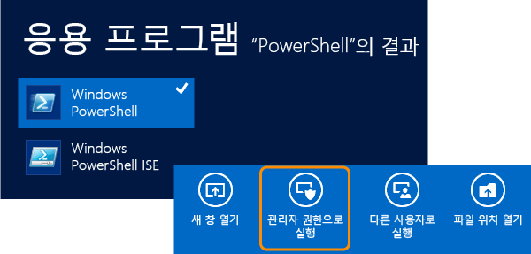
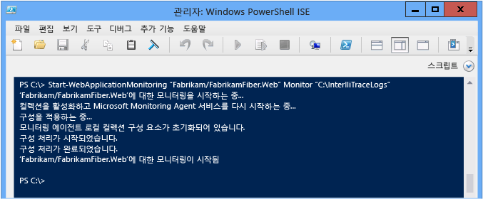
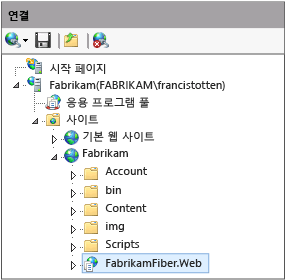

# <a name="using-the-microsoft-monitoring-agent"></a>Microsoft Monitoring Agent 사용
**Microsoft Monitoring Agent**를 사용하면 IIS에서 호스트되는 ASP.NET 웹앱과 SharePoint 2010 또는 2013 응용 프로그램의 오류, 성능 문제 또는 기타 문제를 로컬로 모니터링할 수 있습니다. Monitoring Agent에서 IntelliTrace 로그(.iTrace) 파일로 진단 이벤트를 저장할 수 있습니다. 그런 다음 Visual Studio Enterprise(Professional 또는 Community Edition 아님)에서 로그를 열고 모든 Visual Studio 진단 도구를 사용하여 문제를 디버그할 수 있습니다. 또한 **Trace** 모드에서 Monitoring Agent를 실행하여 IntelliTrace 진단 데이터와 메서드 데이터를 수집할 수도 있습니다. Microsoft Monitoring Agent를 [Application Insights](http://www.visualstudio.com/get-started/find-performance-problems-vs.aspx) 및 [System Center Operation Manager](http://technet.microsoft.com/library/hh205987.aspx)와 통합할 수 있습니다. Microsoft Monitoring Agent는 설치 시 대상 시스템 환경을 변경합니다.  
  
> [!NOTE]
>  **IntelliTrace 독립 실행형 수집기**를 사용하면 대상 환경을 변경하지 않고 원격 컴퓨터의 웹, SharePoint, WPF 및 Windows Forms 앱에 대해 IntelliTrace 진단 및 메서드 데이터를 수집할 수도 있습니다. Microsoft Monitoring Agent를 **Monitor** 모드로 실행하는 경우에 비해 독립 실행형 수집기가 성능에 더 큰 영향을 줍니다. 참조 [IntelliTrace 독립 실행형 수집기를 사용 하 여](../debugger/using-the-intellitrace-stand-alone-collector.md)합니다.  
  
 System Center 2012를 사용하는 경우 Microsoft Monitoring Agent와 Operations Manager를 함께 사용하면 문제에 대한 경고를 받고 저장된 IntelliTrace 로그의 링크를 사용하여 Team Foundation Server 작업 항목을 만들 수 있습니다. 그런 다음 추가 디버깅을 위해 이러한 작업 항목을 다른 사용자에게 할당할 수 있습니다. [개발 프로세스와 Operations Manager 통합](http://technet.microsoft.com/library/jj614609.aspx) 및 [Microsoft Monitoring Agent를 사용하여 모니터링](http://technet.microsoft.com/en-us/library/dn465153.aspx)을 참조하세요.  
  
 시작하기 전에 작성 및 배포된 코드와 일치하는 소스와 기호가 있는지 확인합니다. 그러면 IntelliTrace 로그에서 진단 이벤트 디버깅 및 검색을 시작할 때 응용 프로그램 코드로 직접 이동할 수 있습니다. Visual Studio에서 배포된 코드에 대해 일치하는 소스를 자동으로 찾아서 열 수 있도록[빌드를 설정](../debugger/diagnose-problems-after-deployment.md) 합니다.  
  
1.  [1단계: Microsoft Monitoring Agent 설치](#SetUpMonitoring)  
  
2.  [2단계: 앱 모니터링 시작](#MonitorEvents)  
  
3.  [3단계: 기록된 이벤트 저장](#SaveEvents)  
  
##  <a name="SetUpMonitoring"></a> 1단계: Microsoft Monitoring Agent 설치  
 응용 프로그램을 변경하지 않고 로컬 모니터링을 수행하려면 웹 서버에 독립 실행형 Monitoring Agent를 설치합니다. System Center 2012를 사용하는 경우 [Microsoft Monitoring Agent 설치](http://technet.microsoft.com/library/dn465156.aspx)를 참조하세요.  
  
###  <a name="SetUpStandaloneMMA"></a> 독립 실행형 Monitoring Agent 설치  
  
1.  다음 사항을 확인합니다.  
  
    -   웹 서버에서 [지원되는 버전의 IIS(인터넷 정보 서비스)](http://technet.microsoft.com/en-us/library/dn465154.aspx)를 실행 중입니다.  
  
    -   웹 서버에 .NET Framework 3.5, 4 또는 4.5가 설치되어 있습니다.  
  
    -   웹 서버에서 Windows PowerShell 3.0 이상을 실행 중입니다. [Q: Windows PowerShell 2.0이 설치되어 있는 경우에는 어떻게 해야 하나요?](#PowerShell2)  
  
    -   PowerShell 명령을 실행하고 모니터링 시작 시 응용 프로그램 풀을 재생할 수 있도록 웹 서버에 대한 관리자 권한이 있습니다.  
  
    -   이전 버전의 Microsoft Monitoring Agent를 제거했습니다.  
  
2.  [무료 Microsoft Monitoring Agent](http://go.microsoft.com/fwlink/?LinkId=320384)의 32비트 버전( **MMASetup-i386.exe** ) 또는 64비트 버전( **MMASetup-AMD64.exe**)을 Microsoft 다운로드 센터에서 웹 서버로 다운로드합니다.  
  
3.  다운로드한 실행 파일을 실행하여 설치 마법사를 시작합니다.  
  
4.  **C:\IntelliTraceLogs**와 같이 IntelliTrace 로그를 저장할 안전한 디렉터리를 웹 서버에 만듭니다.  
  
     모니터링을 시작하기 전에 이 디렉터리를 만들어야 합니다. 앱 속도 저하를 방지 하려면 매우 활성화 되지 않은 로컬 고속 디스크의 위치를 선택 합니다.  
  
    > [!IMPORTANT]
    >  IntelliTrace 로그에는 개인 데이터와 중요한 데이터가 포함될 수 있습니다. 따라서 파일을 사용해야 하는 ID만 이 디렉터리에 액세스할 수 있도록 합니다. 이와 관련한 사항은 회사의 개인 정보 보호 정책을 확인하세요.  
  
5.  자세한 함수 수준 모니터링을 실행하거나 SharePoint 응용 프로그램을 모니터링하려면 웹앱 또는 SharePoint 응용 프로그램을 호스트하는 응용 프로그램 풀에 IntelliTrace 로그 디렉터리에 대한 읽기 및 쓰기 권한을 제공합니다. [Q: 응용 프로그램 풀에 대한 사용 권한은 어떻게 설정하나요?](#FullPermissionsITLog)  
  
### <a name="q--a"></a>Q&A  
  
####  <a name="PowerShell2"></a> Q: Windows PowerShell 2.0이 설치되어 있는 경우에는 어떻게 해야 하나요?  
 **A:** PowerShell 3.0을 사용하는 것이 좋습니다. 그렇지 않으면 PowerShell을 실행할 때마다 Microsoft Monitoring Agent PowerShell cmdlet을 가져와야 합니다. 또한 다운로드할 수 있는 도움말 콘텐츠에도 액세스할 수 없습니다.  
  
1.  **Windows PowerShell** 또는 **Windows PowerShell ISE** 명령 프롬프트 창을 관리자 권한으로 엽니다.  
  
2.  아래의 기본 설치 위치에서 Microsoft Monitoring Agent PowerShell 모듈을 가져옵니다.  
  
     **PS c: > Import-module "C:\Program Files\Microsoft Monitoring Agent\Agent\PowerShell\Microsoft.MonitoringAgent.PowerShell\Microsoft.MonitoringAgent.PowerShell.dll"**  
  
3.  최신 도움말 콘텐츠를 보려면[TechNet을 방문](http://technet.microsoft.com/systemcenter/default) 하세요.  
  
####  <a name="FullPermissionsITLog"></a> Q: 응용 프로그램 풀에 대한 사용 권한은 어떻게 설정하나요?  
 **A:** Windows **icacls** 명령 또는 Windows 탐색기(파일 탐색기)를 사용합니다. 예를 들어:  
  
-   Windows **icacls** 명령을 통해 사용 권한을 설정하려면 다음 명령을 사용합니다.  
  
    -   **DefaultAppPool** 응용 프로그램 풀의 웹앱:  
  
         `icacls "C:\IntelliTraceLogs" /grant "IIS APPPOOL\DefaultAppPool":RX`  
  
    -   **SharePoint - 80** 응용 프로그램 풀의 SharePoint 응용 프로그램:  
  
         `icacls "C:\IntelliTraceLogs" /grant "IIS APPPOOL\SharePoint - 80":RX`  
  
     -또는-  
  
-   Windows 탐색기 또는 파일 탐색기를 통해 사용 권한을 설정하려면 다음 단계를 수행합니다.  
  
    1.  IntelliTrace 로그 디렉터리의 **속성** 을 엽니다.  
  
    2.  **보안** 탭에서 **편집**, **추가**를 차례로 선택합니다.  
  
    3.  **개체 유형을 선택하세요.** 상자에 **기본 제공 보안 계정** 이 표시되는지 확인하고 선택 하지 **개체 유형** 추가 합니다.  
  
    4.  **찾을 위치를 선택하세요.** 상자에 로컬 컴퓨터가 표시되는지 확인하고 선택 하지 **위치** 변경할 수 있습니다.  
  
    5.  **선택할 개체 이름을 입력하세요.** 상자에 웹 앱 또는 SharePoint 응용 프로그램의 응용 프로그램 풀을 추가합니다.  
  
    6.  **이름 확인** 을 선택하여 이름을 확인합니다. **확인**을 선택합니다.  
  
    7.  응용 프로그램 풀에 있는지 확인 **읽기 & 실행** 사용 권한.  
  
##  <a name="MonitorEvents"></a> 2단계: 앱 모니터링 시작  
 Windows PowerShell [Start-WebApplicationMonitoring](http://go.microsoft.com/fwlink/?LinkID=313686) 명령을 사용하여 앱 모니터링을 시작합니다. System Center 2012를 사용하는 경우 [Microsoft Monitoring Agent를 사용하여 웹 응용 프로그램 모니터링](http://technet.microsoft.com/library/dn465157.aspx)을 참조하세요.  
  
1.  웹 서버에서 **Windows PowerShell** 또는 **Windows PowerShell ISE** 명령 프롬프트 창을 관리자 권한으로 엽니다.  
  
       
  
2.  [Start-WebApplicationMonitoring](http://go.microsoft.com/fwlink/?LinkID=313686) 명령을 실행하여 앱 모니터링을 시작합니다. 그러면 웹 서버에서 모든 웹 앱이 다시 시작됩니다.  
  
     이 명령의 간단한 구문은 다음과 같습니다.  
  
     **Start-webapplicationmonitoring** *"\<응용 프로그램 이름 >"*  *\<monitoringMode >* *"\<outputPath >"*  *\<UInt32 >* *"\<collectionPlanPathAndFileName >"*  
  
     아래에는 웹앱 이름과 간단한 **Monitor** 모드만 사용하는 예제가 나와 있습니다.  
  
     **PS c: > Start-webapplicationmonitoring "FabrikamFabrikamFiber.Web" 모니터링 "C:IntelliTraceLogs"**  
  
     IIS 경로 및 간단한 **Monitor** 모드를 사용하는 예제는 다음과 같습니다.  
  
     **PS c: > Start-webapplicationmonitoring "IIS:sitesFabrikamFabrikamFiber.Web" 모니터링 "C:IntelliTraceLogs"**  
  
     모니터링을 시작하고 나면 앱이 다시 시작되는 동안 Microsoft Monitoring Agent가 일시 중지될 수 있습니다.  
  
       
  
    |||  
    |-|-|  
    |*"\<응용 프로그램 이름 >"*|IIS에서 웹 사이트 및 웹앱 이름에 대한 경로를 지정합니다. 원하는 경우 IIS 경로도 포함할 수 있습니다.<br /><br /> *"\<IISWebsiteName >\\< IISWebAppName\>"*<br /><br /> -또는-<br /><br /> **"IIS:\sites**  *\\< IISWebsiteName\>\\< IISWebAppName\>"*<br /><br /> IIS 관리자에서 이 경로를 찾을 수 있습니다. 예를 들어:<br /><br /> <br /><br /> [Get-WebSite](http://technet.microsoft.com/library/ee807832.aspx) 및 [Get WebApplication](http://technet.microsoft.com/library/ee790554.aspx) 명령을 사용할 수도 있습니다.|  
    |*\<monitoringMode >*|모니터링 모드를 지정합니다.<br /><br /> <ul><li>**Monitor**: 이 모드에서는 예외 이벤트 및 성능 이벤트에 대한 최소한의 세부 정보를 기록하며 기본 수집 계획을 사용합니다.</li><li>**Trace**: 함수 수준 세부 정보를 기록하거나 지정된 수집 계획을 사용하여 SharePoint 2010 및 SharePoint 2013 응용 프로그램을 모니터링합니다. 이 모드를 사용하는 경우 앱 실행 속도가 느려질 수 있습니다.<br /><br /> <ul><li>[Q: 응용 프로그램 풀에 대한 사용 권한은 어떻게 설정하나요?](#FullPermissionsITLog)</li><li>[Q: 앱 속도를 그대로 유지하면서 데이터를 최대한 수집하려면 어떻게 해야 하나요?](#Minimizing)</li></ul><br />     아래 예제에서는 SharePoint 사이트에서 호스트되는 SharePoint 앱에 대한 이벤트를 기록합니다.<br /><br />     **Start-webapplicationmonitoring "FabrikamSharePointSite\FabrikamSharePointApp" "C:\Program Files\Microsoft Agent\Agent\IntelliTraceCollector\collection_plan.ASP.NET.default.xml를 모니터링 하는 데 사용" "C:\IntelliTraceLogs" 추적**</li><li>**Custom**: 지정된 사용자 지정 수집 계획을 사용하여 사용자 지정 세부 정보를 기록합니다. 모니터링이 이미 시작된 후 컬렉션 계획을 편집하는 경우에는 모니터링을 다시 시작해야 합니다.</li></ul>|  
    |*"\<outputPath >"*|IntelliTrace 로그를 저장할 전체 디렉터리 경로를 지정합니다. 모니터링을 시작하기 전에 이 디렉터리를 만들어야 합니다.|  
    |*\<UInt32 >*|IntelliTrace 로그의 최대 크기를 지정합니다. IntelliTrace 로그의 기본 최대 크기는 250MB입니다.<br /><br /> 로그가 이 한도에 도달하면 Monitoring Agent는 항목을 추가로 기록할 수 있도록 가장 오래된 항목을 덮어씁니다. 이 제한을 변경하려면 **-MaximumFileSizeInMegabytes** 옵션을 사용하거나 수집 계획에서 `MaximumLogFileSize` 특성을 편집합니다.|  
    |*"\<collectionPlanPathAndFileName >"*|수집 계획의 전체 경로 또는 상대 경로와 파일 이름을 지정합니다. 이 계획은 Monitoring Agent의 설정을 구성하는.xml 파일입니다.<br /><br /> Monitoring Agent에 포함되어 있으며 웹앱과 SharePoint 응용 프로그램에 사용 가능한 계획은 다음과 같습니다.<br /><br /> -   **collection_plan.ASP.NET.default.xml**<br />     예외, 성능 이벤트, 데이터베이스 호출, 웹 서버 요청 등의 이벤트만 수집합니다.<br />-   **collection_plan.ASP.NET.trace.xml**<br />     함수 수준 호출과 기본 컬렉션 계획의 모든 데이터를 수집합니다. 이 계획은 상세 분석에 적합하지만 앱 속도는 느려질 수 있습니다.<br /><br /> 이러한 계획의 지역화된 버전은 Monitoring Agent의 하위 폴더에 있습니다. 앱 속도 저하를 방지하기 위해 [이러한 계획을 사용자 지정하거나 계획을 직접 만들](http://go.microsoft.com/fwlink/?LinkId=227871) 수도 있습니다. 모든 사용자 지정 계획은 Monitoring Agent와 같은 안전한 위치에 저장합니다.<br /><br /> [Q: 앱 속도를 그대로 유지하면서 데이터를 최대한 수집하려면 어떻게 해야 하나요?](#Minimizing)|  
  
     전체 구문 및 기타 예제에 대 한 자세한 내용은 실행는 **Start-webapplicationmonitoring g-h-detailed** 명령 또는 **Start-webapplicationmonitoring g-h-예제** 명령입니다.  
  
3.  모니터링되는 모든 웹앱의 상태를 확인하려면 [Get-WebApplicationMonitoringStatus](http://go.microsoft.com/fwlink/?LinkID=313685) 명령을 실행합니다.  
  
### <a name="q--a"></a>Q&A  
  
####  <a name="Minimizing"></a> Q: 앱 속도를 그대로 유지하면서 데이터를 최대한 수집하려면 어떻게 해야 하나요?  
 **A:** Microsoft Monitoring Agent는 많은 데이터를 수집할 수 있으므로 수집하도록 선택하는 데이터 및 수집 방법에 따라 앱 성능에 영향을 줄 수 있습니다. 앱 속도를 그대로 유지하면서 대부분의 데이터를 가져올 수 있는 몇 가지 방법은 다음과 같습니다.  
  
-   웹 앱 및 SharePoint 응용 프로그램의 경우 Monitoring Agent는 지정한 응용 프로그램 풀을 공유하는 모든 앱에 대한 데이터를 기록합니다. 이로 인해 단일 응용 프로그램 풀을 공유하는 앱의 속도가 느려질 수 있습니다. 그러나 단일 앱의 모듈에서만 데이터를 수집하도록 제한할 수 있습니다. 앱 속도 저하를 방지하려면 각 앱을 자체 응용 프로그램 풀에서 호스트합니다.  
  
-   Monitoring Agent가 수집 계획에서 데이터를 수집하는 이벤트를 검토합니다. 수집 계획을 편집하여 관련이나 필요가 없는 이벤트를 사용하지 않도록 설정합니다. 이렇게 하면 시작 성능과 런타임 성능을 개선할 수 있습니다.  
  
     이벤트를 사용하지 않도록 설정하려면 `enabled` 요소의 `<DiagnosticEventSpecification>` 특성을 `false`로 설정합니다.  
  
     `<DiagnosticEventSpecification enabled="false">`  
  
     `enabled` 특성이 없으면 이벤트는 사용하도록 설정됩니다.  
  
     예를 들면 다음과 같습니다.  
  
    -   Windows 워크플로를 사용하지 앱에 대해 Windows 워크플로 이벤트를 사용하지 않도록 설정합니다.  
  
    -   레지스트리에 액세스하기는 하지만 레지스트리 설정에 문제가 표시되지 않는 앱에 대해 레지스트리 이벤트를 사용하지 않도록 설정합니다.  
  
-   Monitoring Agent가 수집 계획에서 데이터를 수집하는 모듈을 검토합니다. 다음 단계를 수행하여 관련이 있는 모듈만 포함하도록 수집 계획을 편집합니다.  
  
     이렇게 하면 앱 시작 및 실행 시 Monitoring Agent가 수집하는 메서드 호출 정보 및 기타 계측 데이터의 양이 감소합니다. 이 데이터를 통해 함수 호출로 전달되며 함수 호출에서 반환되는 값을 디버깅 및 검토할 때 코드를 단계별로 실행할 수 있습니다.  
  
    1.  수집 계획을 엽니다. `<ModuleList>` 요소를 찾습니다.  
  
    2.  `<ModuleList>`에서 `isExclusionList` 특성을 `false`로 설정합니다.  
  
    3.  `<Name>` 요소를 사용하여 파일 이름, 문자열 값(이름에 해당 문자열이 들어 있는 모듈이 포함됨) 또는 공개 키 중 하나로 각 모듈을 지정합니다.  
  
     아래 예제는 Fabrikam Fiber 웹 앱의 기본 웹 모듈에서만 데이터를 수집하는 목록을 만듭니다.  
  
    ```xml  
    <ModuleList isExclusionList="false">  
       <Name>FabrikamFiber.Web.dll</Name>  
    </ModuleList>  
  
    ```  
  
     이름에 "Fabrikam"이 포함되어 있는 모든 모듈에서 데이터를 수집하려면 다음과 같은 목록을 만듭니다.  
  
    ```xml  
    <ModuleList isExclusionList="false">  
       <Name>Fabrikam</Name>  
    </ModuleList>  
  
    ```  
  
     공개 키 토큰을 지정하여 모듈에서 데이터를 수집하려면 다음과 같은 목록을 만듭니다.  
  
    ```xml  
    <ModuleList isExclusionList="false">  
       <Name>PublicKeyToken:B77A5C561934E089</Name>  
       <Name>PublicKeyToken:B03F5F7F11D50A3A</Name>  
       <Name>PublicKeyToken:31BF3856AD364E35</Name>  
       <Name>PublicKeyToken:89845DCD8080CC91</Name>  
       <Name>PublicKeyToken:71E9BCE111E9429C</Name>  
    </ModuleList>  
  
    ```  
  
     **Q: 모듈만 제외하면 되지 않나요?**  
  
     **A:** 기본적으로 수집 계획에서는 `isExclusionList` 특성을 `true`로 설정하여 모듈을 제외합니다. 그러나 모듈을 제외해도 목록 기준을 충족하지 않거나 관련이 없는 모듈(예: 타사 또는 오픈 소스 모듈)에서 데이터가 수집될 수 있습니다.  
  
#### <a name="q-what-values-does-the-agent-collect"></a>Q: Monitoring Agent는 어떤 값을 수집하나요?  
 **A:** 성능에 대한 영향을 줄이기 위해 Monitoring Agent는 다음 값만 수집합니다.  
  
-   메서드로 전달되며 메서드에서 반환되는 기본 값 형식  
  
-   메서드로 전달되며 메서드에서 반환되는 최상위 개체의 필드에 포함된 기본 데이터 형식  
  
 예를 들어 `AlterEmployee` 메서드 서명이 정수 `id` 및 `Employee` 개체 `oldemployee`를 허용한다고 가정해 보겠습니다.  
  
 `public Employee AlterEmployee(int id, Employee oldemployee)`  
  
 `Employee` 형식에는 `Id`, `Name` 및 `HomeAddress` 특성이 있습니다. 그리고 `Employee` 및 `Address` 형식 간에는 연결 관계가 있습니다.  
  
   
  
 Monitoring Agent는 `id` 메서드에서 반환되는 `Employee.Id`, `Employee.Name`, `Employee` 및 `AlterEmployee` 개체의 값을 기록합니다. 그러나 `Address` 개체에 대한 정보는 null인지 여부를 제외하고는 기록하지 않습니다. 또한 `AlterEmployee` 메서드의 로컬 변수에 대한 데이터도 기록하지 않습니다. 단, 다른 메서드가 해당 로컬 변수를 매개 변수로 사용하는 경우에는 로컬 변수가 메서드 매개 변수로 기록됩니다.  
  
##  <a name="SaveEvents"></a> 3단계: 기록된 이벤트 저장  
 오류 또는 성능 문제가 발견되면 기록된 이벤트를 IntelliTrace 로그에 저장합니다. Monitoring Agent는 이벤트가 기록된 경우에만 로그를 만듭니다. System Center 2012를 사용하는 경우 [Microsoft Monitoring Agent를 사용하여 웹 응용 프로그램 모니터링](http://technet.microsoft.com/library/dn465157.aspx)을 참조하세요.  
  
### <a name="save-recorded-events-but-continue-monitoring"></a>기록된 이벤트를 저장하고 모니터링 계속  
 IntelliTrace 로그를 만들되 앱을 다시 시작하거나 모니터링을 중지하지는 않으려면 다음 단계를 수행합니다. 이렇게 하면 Monitoring Agent는 서버 또는 응용 프로그램이 다시 시작되어도 모니터링을 계속합니다.  
  
1.  웹 서버에서 관리자 권한으로 Windows PowerShell 명령 프롬프트 창을 엽니다.  
  
2.  [Checkpoint-WebApplicationMonitoring](http://go.microsoft.com/fwlink/?LinkID=313684) 명령을 실행하여 IntelliTrace 로그의 스냅숏을 저장합니다.  
  
     **Checkpoint-webapplicationmonitoring** *"\<IISWebsiteName >\\< IISWebAppName\>"*  
  
     \- 또는 -  
  
     **Checkpoint-webapplicationmonitoring "IIS:\sites**  *\\< IISWebsiteName\>\\< IISWebAppName\>"*  
  
     예를 들어:  
  
     **PS c:\\> Checkpoint-webapplicationmonitoring "Fabrikam\FabrikamFiber.Web"**  
  
     -또는-  
  
     **PS c: > Checkpoint-webapplicationmonitoring "IIS:sitesFabrikamFabrikamFiber.Web"**  
  
     실행에 대 한 자세한 내용은 **Checkpoint-webapplicationmonitoring g-h-자세한** 명령 또는 **Checkpoint-webapplicationmonitoring g-h-예제** 명령입니다.  
  
3.  안전한 공유 폴더에 로그를 복사한 다음 Visual Studio Enterprise(Professional 또는 Community Edition 아님)가 설치되어 있는 컴퓨터에서 로그를 엽니다.  
  
    > [!IMPORTANT]
    >  IntelliTrace 로그는 개인 데이터와 중요한 데이터를 포함할 수 있으므로 공유 시 주의해야 합니다. 이러한 로그에 액세스하는 모든 사용자에게 해당 데이터를 볼 권한이 있는지 확인합니다. 이와 관련한 사항은 회사의 개인 정보 보호 정책을 확인하세요.  
  
 **다음 단계:** [Visual Studio Enterprise에서 기록된 이벤트 진단](../debugger/diagnose-problems-after-deployment.md#InvestigateEvents)  
  
### <a name="save-recorded-events-and-stop-monitoring"></a>기록된 이벤트를 저장하고 모니터링 중지  
 특정 문제를 재현하는 동안에만 진단 정보를 확인하려면 다음 단계를 수행합니다. 그러면 웹 서버에서 모든 웹 앱이 다시 시작됩니다.  
  
1.  웹 서버에서 관리자 권한으로 Windows PowerShell 명령 프롬프트 창을 엽니다.  
  
2.  [Stop-WebApplicationMonitoring](http://go.microsoft.com/fwlink/?LinkID=313687) 명령을 실행하여 IntelliTrace 로그를 만든 다음 특정 웹앱 모니터링을 중지합니다.  
  
     **Stop-webapplicationmonitoring** *"\<IISWebsiteName >\\< IISWebAppName\>"*  
  
     \- 또는 -  
  
     **Stop-webapplicationmonitoring "IIS:\sites**  *\\< IISWebsiteName\>\\< IISWebAppName\>"*  
  
     또는 모든 웹앱 모니터링을 중지하려면 다음 명령을 실행합니다.  
  
     **Stop-webapplicationmonitoring-모두**  
  
     예를 들어:  
  
     **PS c:\\> Stop-webapplicationmonitoring "Fabrikam\iFabrikamFiber.Web"**  
  
     \- 또는 -  
  
     **PS c:\\> Stop-webapplicationmonitoring "IIS:\sites\Fabrikam\FabrikamFiber.Web"**  
  
     실행에 대 한 자세한 내용은 **보려면 Stop-webapplicationmonitoring-자세한** 명령 또는 **Stop-webapplicationmonitoring g-h-예제** 명령입니다.  
  
3.  안전한 공유 폴더에 로그를 복사한 다음 Visual Studio Enterprise가 설치되어 있는 컴퓨터에서 로그를 엽니다.  
  
 **다음 단계:** [Visual Studio Enterprise에서 기록된 이벤트 진단](../debugger/diagnose-problems-after-deployment.md#InvestigateEvents)  
  
## <a name="q--a"></a>Q&A  
  
### <a name="q-where-can-i-get-more-information"></a>Q: 추가 정보는 어디서 확인할 수 있나요?  
  
#### <a name="blogs"></a>블로그  
 [Microsoft Monitoring Agent 소개](http://blogs.msdn.com/b/visualstudioalm/archive/2013/09/20/introducing-microsoft-monitoring-agent.aspx)  
  
 [프로덕션 서버에서 IntelliTrace 컬렉션 최적화](http://go.microsoft.com/fwlink/?LinkId=255233)  
  
#### <a name="forums"></a>포럼  
 [Visual Studio 진단](http://go.microsoft.com/fwlink/?LinkId=262263)