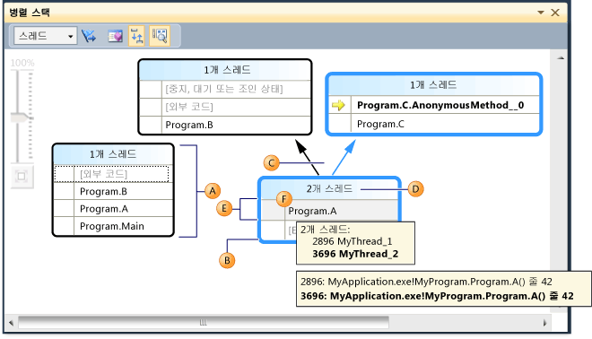
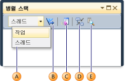
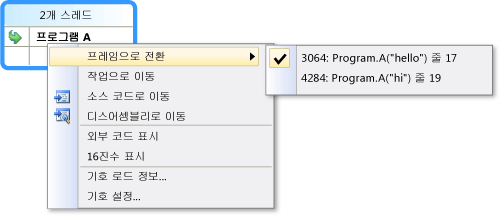
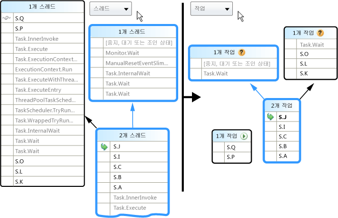
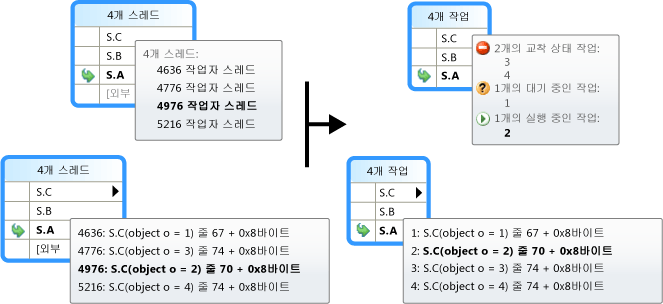
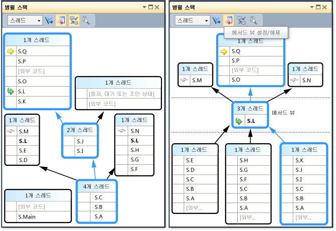

# 병렬 스택 창 사용
[!INCLUDE[vs2017banner](../code-quality/includes/vs2017banner.md)]

**병렬 스택** 창은 다중 스레드 응용 프로그램을 디버깅할 때 유용합니다.  **스레드 뷰**에는 응용 프로그램의 모든 스레드에 대한 호출 스택 정보가 표시됩니다.  따라서 스레드와 스레드 스택 프레임 간을 탐색할 수 있습니다.  관리되는 코드에서 **작업 뷰**는 <xref:System.Threading.Tasks.Task?displayProperty=fullName> 개체의 호출 스택이 표시됩니다.  네이티브 코드에서 **작업 뷰**는 [작업 그룹](/visual-cpp/parallel/concrt/task-parallelism-concurrency-runtime), [병렬 알고리즘](/visual-cpp/parallel/concrt/parallel-algorithms), [비동기 에이전트](/visual-cpp/parallel/concrt/asynchronous-agents) 및 [간단한 작업](/visual-cpp/parallel/concrt/task-scheduler-concurrency-runtime)의 호출 스택이 표시됩니다.  
  
## 스레드 뷰  
 다음 그림에서는 Main에서 A, B 및 외부 코드로 차례로 이동한 하나의 스레드를 보여 줍니다.  다른 두 스레드는 외부 코드에서 시작한 후 A로 이동했지만, 그 중 하나는 B로 진행한 후 외부 코드로 진행했고 다른 하나는 C로 진행한 후 AnonymousMethod로 진행했습니다.  
  
   
  
 그림에서 현재 스레드의 호출 경로는 파란색으로 강조 표시되며, 활성 스택 프레임은 노란색 화살표로 표시됩니다.  **병렬 스택** 창에서 다른 메서드를 선택하여 현재 스택 프레임을 변경할 수 있습니다.  이렇게 하면 선택한 메서드가 현재 스레드의 일부인지 아니면 다른 스레드의 일부인지에 따라 현재 스레드가 전환될 수 있습니다.  다음 표에서는 그림에 표시된 **병렬 스택** 창의 기본 기능에 대해 설명합니다.  
  
|설명선 문자|요소 이름|설명|  
|------------|-----------|--------|  
|A|호출 스택 세그먼트 또는 노드|하나 이상의 스레드에 대한 일련의 메서드 컨텍스트를 포함합니다.  노드에 연결된 화살표 선이 없으면 스레드에 대한 전체 호출 경로를 나타냅니다.|  
|B|파란색 강조 표시|현재 스레드의 호출 경로를 나타냅니다.|  
|C|화살표 선|노드를 연결하여 스레드에 대한 전체 호출 경로를 구성합니다.|  
|D|노드 머리글에 대한 도구 설명|호출 경로가 이 노드를 공유하는 각 스레드의 ID 및 사용자 정의 이름을 표시합니다.|  
|E|메서드 컨텍스트|동일한 메서드에 있는 하나 이상의 스택 프레임을 나타냅니다.|  
|F|메서드 컨텍스트에 대한 도구 설명|스레드 뷰에서는 **스레드** 창과 유사한 표에 모든 스레드를 표시하고,  작업 뷰에서는 **병렬 작업** 창과 유사한 표에 모든 작업을 표시합니다.|  
  
 또한 그래프가 너무 커서 창에 맞지 않는 경우에는 병렬 스택 창의 주 창에 **Bird's Eye View** 아이콘이 표시됩니다.  전체 그래프를 창에서 보려면 이 아이콘을 클릭하면 됩니다.  
  
## 메서드 컨텍스트 아이콘  
 다음 표에서는 활성 및 현재 스택 프레임에 대한 정보를 제공하는 아이콘을 설명합니다.  
  
|||  
|-|-|  
|아이콘|설명|  
||메서드 컨텍스트에 현재 스레드의 활성 스택 프레임이 포함되어 있음을 나타냅니다.|  
||메서드 컨텍스트에 현재 스레드가 아닌 스레드의 활성 스택 프레임이 포함되어 있음을 나타냅니다.|  
||메서드 컨텍스트에 현재 스택 프레임이 포함되어 있음을 나타냅니다.  메서드 이름이 나타나는 모든 노드에서 메서드 이름이 굵게 표시됩니다.|  
  
## 도구 모음 컨트롤  
 다음 그림과 표에서는 병렬 스택 도구 모음에서 사용할 수 있는 컨트롤에 대해 설명합니다.  
  
   
  
|설명선 문자|컨트롤|설명|  
|------------|---------|--------|  
|A|스레드\/작업 콤보 상자|스레드의 호출 스택과 작업의 호출 스택 간에 뷰를 전환합니다.  자세한 내용은 작업 뷰와 스레드 뷰를 참조하십시오.|  
|B|플래그가 지정된 항목만 표시|**GPU 스레드** 창, **병렬 조사식** 창 등의 다른 디버그 창에서 플래그가 지정된 스레드에 대해서만 호출 스택을 표시합니다.|  
|C|메서드 뷰 설정\/해제|스택 뷰와 메서드 뷰 간을 전환합니다.  자세한 내용은 메서드 뷰를 참조하십시오.|  
|D|현재 스택 프레임으로 자동 스크롤|현재 스택 프레임이 뷰에 표시되도록 다이어그램을 자동 스크롤합니다.  이 기능은 다른 창에서 현재 스택 프레임을 변경하거나 큰 다이어그램에서 새 중단점을 적중할 때 유용합니다.|  
|E|확대\/축소 컨트롤 설정\/해제|확대\/축소 컨트롤을 표시하거나 숨깁니다.  확대\/축소 컨트롤의 표시 여부와 관계없이 Ctrl 키를 누른 상태에서 마우스 휠을 돌려서 확대\/축소할 수도 있습니다.|  
  
### 상황에 맞는 메뉴 항목  
 다음 그림과 표에서는 스레드 뷰와 작업 뷰에서 메서드 컨텍스트를 마우스 오른쪽 단추로 클릭할 때 사용할 수 있는 바로 가기 메뉴 항목에 대해 설명합니다.  마지막 6개 항목은 호출 스택 창에서 직접 가져온 것으로 새로운 동작을 제공하지 않습니다.  
  
   
  
|Menu Item|설명|  
|---------------|--------|  
|플래그|선택한 항목에 플래그를 지정합니다.|  
|플래그 해제|선택한 항목의 플래그를 해제합니다.|  
|중지|선택한 항목을 중지합니다.|  
|재개|선택한 항목을 재개합니다.|  
|작업으로 이동 또는 스레드로 이동|도구 모음의 콤보 상자와 같은 기능을 수행하지만 동일한 스택 프레임이 강조 표시된 상태로 유지됩니다.|  
|소스 코드로 이동|사용자가 마우스 오른쪽 단추로 클릭한 스택 프레임에 해당하는 소스 코드의 위치로 이동합니다.|  
|프레임으로 전환|호출 스택 창의 해당 메뉴 명령과 동일합니다.  그러나 병렬 스택을 사용하는 경우 여러 프레임이 하나의 메서드 컨텍스트에 해당할 수 있습니다.  따라서 메뉴 항목에 하위 메뉴가 있고 각각의 하위 메뉴가 특정 스택 프레임을 나타냅니다.  스택 프레임 중 하나가 현재 스레드에 있으면 스택 프레임에 해당하는 메뉴가 선택됩니다.|  
|디스어셈블리로 이동|사용자가 마우스 오른쪽 단추로 클릭한 스택 프레임에 해당하는 디스어셈블리 창의 위치로 이동합니다.|  
|외부 코드 표시|외부 코드를 표시하거나 숨깁니다.|  
|16진수 표시|10진수 표시와 16진수 표시 간을 전환합니다.|  
|기호 로드 정보|해당하는 대화 상자를 표시합니다.|  
|기호 설정|해당하는 대화 상자를 표시합니다.|  
  
## 작업 뷰  
 응용 프로그램에서 <xref:System.Threading.Tasks.Task?displayProperty=fullName> 개체\(관리 코드\)나 `task_handle` 개체\(네이티브 코드\)를 사용하여 병렬화를 표현하는 경우 병렬 스택 창 도구 모음의 콤보 상자를 사용하여 *작업 뷰*로 전환할 수 있습니다.  작업 뷰에는 스레드 대신 작업의 호출 스택이 표시됩니다.  작업 뷰는 다음과 같이 스레드 뷰와 다릅니다.  
  
-   작업을 실행하고 있지 않은 스레드의 호출 스택이 표시되지 않습니다.  
  
-   작업을 실행 중인 스레드의 호출 스택은 맨 위와 맨 아래에서 시각적으로 잘려 작업과 가장 많이 관련된 프레임을 표시합니다.  
  
-   여러 작업이 한 스레드에 있으면 이러한 작업의 호출 스택이 개별 노드로 분할됩니다.  
  
 다음 그림의 오른쪽에는 병렬 스택 작업 뷰가 표시되고 왼쪽에는 해당 스레드 뷰가 표시됩니다.  
  
   
  
 전체 호출 스택을 보려면 스택 프레임을 마우스 오른쪽 단추로 클릭하고 **스레드로 이동**을 클릭하여 스레드 뷰로 전환하면 됩니다.  
  
 앞의 표에서 설명했듯이 마우스로 메서드 컨텍스트를 가리키면 추가 정보를 볼 수 있습니다.  다음 이미지에서는 스레드 뷰와 작업 뷰에 대한 정보를 도구 설명으로 보여 줍니다.  
  
   
  
## 메서드 뷰  
 스레드 뷰나 작업 뷰에서 도구 모음의 메서드 뷰 아이콘을 클릭하여 현재 메서드를 축으로 그래프를 회전할 수 있습니다.  메서드 뷰에서는 현재 메서드를 호출하거나 현재 메서드에 의해 호출되는 모든 스레드에 대한 메서드를 모두 한눈에 볼 수 있습니다.  다음 그림에서는 스레드 뷰를 보여 주며, 메서드 뷰에서 동일한 정보가 어떻게 표시되는지도 보여 줍니다.  
  
   
  
 새 스택 프레임으로 전환하여 해당 메서드를 현재 메서드로 설정하고 창에 새 메서드에 대한 모든 호출자 및 호출 수신자를 표시합니다.  이렇게 하면 메서드가 호출 스택에 표시되는지 여부에 따라 일부 스레드가 뷰에 나타나거나 사라집니다.  스택 뷰로 돌아가려면 메서드 뷰 도구 모음 단추를 다시 클릭합니다.  
  
## 참고 항목  
 [연습: 병렬 응용 프로그램 디버깅](../debugger/walkthrough-debugging-a-parallel-application.md)   
 [디버거 기본 사항](../debugger/debugger-basics.md)   
 [관리 코드 디버깅](../debugger/debugging-managed-code.md)   
 [Parallel Programming](../Topic/Parallel%20Programming%20in%20the%20.NET%20Framework.md)   
 [작업 창 사용](../debugger/using-the-tasks-window.md)   
 [연습: 병렬 응용 프로그램 디버깅](../debugger/walkthrough-debugging-a-parallel-application.md)   
 [작업 클래스](../extensibility/debugger/task-class-internal-members.md)