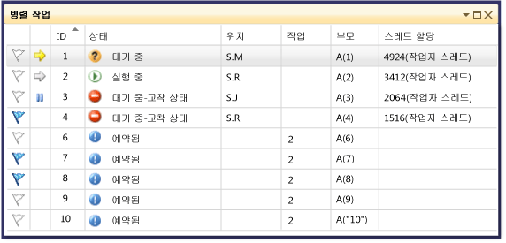
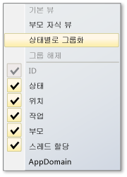
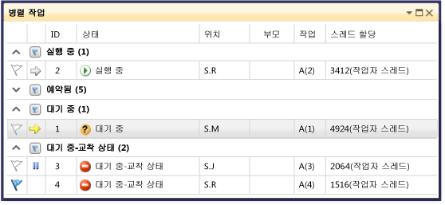
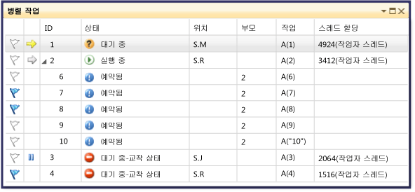
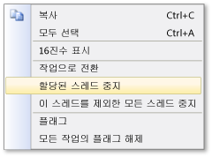

# 작업 창 사용
[!INCLUDE[vs2017banner](../code-quality/includes/vs2017banner.md)]

**작업** 창은 **스레드** 창과 비슷하지만, 각 스레드 대신 <xref:System.Threading.Tasks.Task?displayProperty=fullName>, [task\_handle](../Topic/task_group%20Class.md) 또는 [WinJS.Promise](http://msdn.microsoft.com/library/windows/apps/br211867.aspx) 개체에 대한 정보가 표시된다는 점이 다릅니다.  스레드와 마찬가지로, 작업은 동시에 실행할 수 있는 비동기 작업을 나타내지만 여러 작업이 같은 스레드에서 실행될 수도 있습니다.  자세한 내용은 [JavaScript의 비동기 프로그래밍\(Windows 스토어 앱\)](http://msdn.microsoft.com/library/windows/apps/hh700330.aspx)을 참조하세요.  
  
 관리 코드에서 <xref:System.Threading.Tasks.Task?displayProperty=fullName> 개체 또는 **await** 및 **async** 키워드\(Visual Basic에서는 **Await** 및 **Async**\)로 작업할 때 **작업** 창을 사용할 수 있습니다.  관리 코드의 작업에 대한 자세한 내용은 [Parallel Programming](../Topic/Parallel%20Programming%20in%20the%20.NET%20Framework.md)을 참조하세요.  
  
 네이티브 코드에서 **작업 그룹**, [병렬 알고리즘](/visual-cpp/parallel/concrt/task-parallelism-concurrency-runtime), [비동기 에이전트](/visual-cpp/parallel/concrt/parallel-algorithms) 및 [간단한 작업](/visual-cpp/parallel/concrt/asynchronous-agents)으로 작업할 때 [작업](/visual-cpp/parallel/concrt/task-scheduler-concurrency-runtime) 창을 사용할 수 있습니다.  네이티브 코드의 작업에 대한 자세한 내용은 [동시성 런타임](/visual-cpp/parallel/concrt/concurrency-runtime)을 참조하세요.  
  
 JavaScript에서 promise .then 코드로 작업할 때 작업 창을 사용할 수 있습니다.  
  
 중단하고 디버거를 시작할 때마다 **작업** 창을 사용할 수 있습니다.  **디버그** 메뉴에서 **창**을 클릭하고 **작업**을 클릭하여 작업 창에 액세스할 수 있습니다.  다음 그림에서는 기본 모드의 **작업** 창을 보여 줍니다.  
  
   
  
> [!NOTE]
>  관리 코드에서 <xref:System.Threading.Tasks.Task>, <xref:System.Threading.Tasks.TaskStatus> 또는 <xref:System.Threading.Tasks.TaskStatus> 상태에 있는 <xref:System.Threading.Tasks.TaskStatus>는 관리되는 스레드가 대기 또는 조인 상태에 있는 경우 작업 창에 표시되지 않을 수도 있습니다.  
  
## 작업 열 정보  
 **작업** 창의 열에는 다음 정보가 표시됩니다.  
  
|열 이름|설명|  
|----------|--------|  
|**플래그**|플래그 설정된 작업이 표시되며 작업에 플래그를 설정하거나 해제할 수 있습니다.|  
|**아이콘**|노란색 화살표는 현재 작업을 나타냅니다.  현재 작업은 현재 스레드의 최상위 작업입니다.   흰색 화살표는 중단 작업\(디버거가 호출된 현재 작업\)을 나타냅니다.   일시 중지 아이콘은 사용자가 중지한 작업을 나타냅니다.  목록에서 작업을 마우스 오른쪽 단추로 클릭하여 작업을 중지하거나 중지된 작업을 해제할 수 있습니다.|  
|**ID**|시스템에서 제공한 작업 번호입니다.  네이티브 코드에서는 작업의 주소입니다.|  
|**상태**|작업의 현재 상태\(예약됨, 활성, 교착 상태, 대기 중 또는 완료됨\)입니다.  예약된 작업은 아직 실행되지 않은 작업이므로 호출 스택, 할당된 스레드 또는 관련 작업이 없습니다.   활성 작업은 디버거를 시작하기 전에 코드를 실행 중이던 작업입니다.   대기 중인 작업은 이벤트가 신호를 받거나, 잠금이 해제되거나, 다른 작업이 완료되기를 기다리고 있어서 차단된 작업입니다.   교차 상태의 작업은 해당 스레드와 다른 스레드 간에 교착 상태가 발생한 대기 중인 작업입니다.   교착 상태의 작업 또는 대기 중인 작업의 **상태** 셀을 가리키면 블록에 대한 자세한 정보를 볼 수 있습니다. **Warning:**  **작업** 창에서는 WCT\(Wait Chain Traversal\)에서 지원되는 동기화 기본 형식을 사용하는 차단된 작업에 대해서만 교착 상태가 보고됩니다.  예를 들어 WCT를 사용하는 <xref:System.Threading.Tasks.Task> 개체에서 교착 상태가 발생한 경우 디버거에서는 **대기 중\-교착 상태**를 보고합니다.  동시성 런타임에서 관리되지 않으며 WCT를 사용하지 않는 작업에서 교착 상태가 발생한 경우에는 디버거에서 **대기 중**을 보고합니다.  WCT에 대한 자세한 내용은 [Wait Chain Traversal](http://msdn.microsoft.com/library/ms681622\(VS.85\).aspx)을 참조하세요.|  
|**시작 시간**|작업이 활성화된 시간입니다.|  
|**기간**|작업이 활성화된 기간\(초\)입니다.|  
|**완료 시간**|작업이 완료된 시간입니다.|  
|**위치**|작업의 호출 스택의 현재 위치입니다.  이 셀을 가리키면 작업에 대한 전체 호출 스택을 볼 수 있습니다.  예약된 작업의 이 열에는 값이 없습니다.|  
|**작업**|작업이 생성될 때 작업으로 전달된 초기 메서드와 인수입니다.|  
|**부모**|이 작업을 만든 작업의 ID입니다.  비어 있으면 작업에 부모가 없는 것입니다.  관리되는 프로그램에만 적용됩니다.|  
|**스레드 할당**|작업이 실행 중인 스레드의 ID 및 이름입니다.|  
|**반환 상태**|작업이 완료되었을 때의 상태입니다.  반환 상태 값은 **성공**, **취소됨** 및 **오류**입니다.|  
|**AppDomain**|관리 코드의 경우 작업이 실행되고 있는 응용 프로그램 도메인입니다.|  
|**task\_group**|네이티브 코드의 경우 작업을 예약한 [task\_group](../Topic/task_group%20Class.md)의 주소입니다.  비동기 에이전트 및 간단한 작업의 경우 이 열은 0으로 설정됩니다.|  
|프로세스|작업이 실행 중인 프로세스의 ID입니다.|  
|비동기 상태|관리 코드의 경우 작업 상태입니다.  기본적으로 이 열은 숨겨집니다.  이 열을 표시하려면 열 머리글 중 하나에 대한 상황에 맞는 메뉴를 엽니다.  **열**, **AsyncState**를 선택합니다.|  
  
 열 머리글을 마우스 오른쪽 단추로 클릭하고 원하는 열을 선택하여 뷰에 추가할 수 있습니다.  열을 제거하려면 선택을 취소합니다. 또한 왼쪽이나 오른쪽으로 끌어서 열을 다시 정렬할 수도 있습니다.  열 바로 가기 메뉴가 다음 그림에 표시됩니다.  
  
   
  
## 작업 정렬  
 열 조건으로 작업을 정렬하려면 열 머리글을 클릭합니다.  예를 들어, **ID** 열 머리글을 클릭하여 1,2,3,4,5 등의 작업 ID로 작업을 정렬할 수 있습니다.  정렬 순서를 반대로 바꾸려면 열 머리글을 다시 클릭합니다.  현재 정렬 열과 정렬 순서는 열에 화살표로 표시됩니다.  
  
## 작업 그룹화  
 목록 뷰에서 열을 기준으로 작업을 그룹화할 수 있습니다.  예를 들어, **상태** 열 머리글을 마우스 오른쪽 단추로 클릭하고 **상태별 그룹**을 클릭하면 동일한 상태의 모든 작업을 그룹화할 수 있습니다.  예를 들어, 대기 중인 작업만 빨리 확인하여 차단된 이유를 살펴볼 수 있습니다.  또한 디버그 세션 중에 관심 없는 그룹을 축소할 수도 있습니다.  동일한 방식으로 다른 열을 기준으로 그룹화할 수 있습니다.  그룹 머리글 옆의 단추를 클릭하여 간단하게 그룹에 플래그를 설정하거나 해제할 수 있습니다.  다음 그림에서는 그룹화된 모드의 **작업** 창을 보여 줍니다.  
  
   
  
## 부모 자식 뷰  
 이 뷰는 관리 코드에서만 사용할 수 있습니다. 열 머리글을 마우스 오른쪽 단추로 클릭하고 **부모 자식 뷰**를 클릭하여 작업 목록을 계층적 뷰로 변경할 수 있습니다. 계층적 뷰에서 모든 자식 작업은 부모 아래에 표시하거나 숨길 수 있는 하위 노드입니다.  다음 그림은 부모 자식 뷰의 작업을 보여 줍니다.  
  
   
  
## 작업에 플래그 설정  
 작업 목록 항목을 선택한 다음 상황에 맞는 메뉴에서 **플래그**를 선택하거나, 첫 번째 열에서 플래그 아이콘을 클릭하여 작업이 실행 중인 스레드에 플래그를 지정할 수 있습니다.  여러 작업에 플래그를 설정하는 경우 플래그 설정된 작업에만 초점을 맞출 수 있도록 플래그 설정된 모든 작업을 맨 위로 오게 플래그 열을 정렬할 수 있습니다.  **병렬 스택** 창을 사용하여 플래그 설정된 작업만 볼 수도 있습니다.  이렇게 하면 디버깅 중 관심 없는 작업을 필터링할 수 있습니다.  플래그는 디버깅 세션 간에 유지되지 않습니다.  
  
## 작업 중지 및 재개  
 작업 목록 항목을 마우스 오른쪽 단추로 클릭하고 **할당된 스레드 중지**를 클릭하여 작업이 실행되고 있는 스레드를 중지할 수 있습니다.  작업이 이미 중지되었으면 **할당된 스레드 재개** 명령이 표시됩니다. 스레드를 중지하면 현재 중단점 이후에 코드를 단계별로 실행할 때 해당 스레드가 실행되지 않습니다.  **이 스레드를 제외한 모든 스레드 중지** 명령은 작업 목록 항목을 실행 중인 스레드를 제외한 모든 스레드를 중지합니다.  
  
 다음 그림에서는 각 작업에 대한 다른 메뉴 항목을 보여 줍니다.  
  
   
  
## 참고 항목  
 [디버거 기본 사항](../debugger/debugger-basics.md)   
 [관리 코드 디버깅](../debugger/debugging-managed-code.md)   
 [Parallel Programming](../Topic/Parallel%20Programming%20in%20the%20.NET%20Framework.md)   
 [동시성 런타임](/visual-cpp/parallel/concrt/concurrency-runtime)   
 [병렬 스택 창 사용](../debugger/using-the-parallel-stacks-window.md)   
 [연습: 병렬 응용 프로그램 디버깅](../debugger/walkthrough-debugging-a-parallel-application.md)