# 연습: Visual Studio에서 병렬 응용 프로그램 디버깅
이 연습에서는 사용 하는 **병렬 작업** 및 **병렬 스택** 병렬 응용 프로그램을 디버깅 하는 windows. 이러한 창은 이해 하 고 사용 하는 코드의 런타임 동작을 확인 하는 데 도움이 [라이브러리 TPL (작업 병렬)](/dotnet/standard/parallel-programming/task-parallel-library-tpl) 또는 [동시성 런타임](/cpp/parallel/concrt/concurrency-runtime)합니다. 이 연습에서는 기본 제공 중단점이 있는 샘플 코드를 제공합니다. 사용 하는 방법을 보여 줍니다 코드가 중단 된 후의 **병렬 작업** 및 **병렬 스택** 검사 하는 windows.  
  
 이 연습에서는 다음 작업 방법을 배웁니다.  
  
-   한 뷰에서 모든 스레드의 호출 스택을 보는 방법  
  
-   응용 프로그램에서 만들어지는 `System.Threading.Tasks.Task` 인스턴스의 목록을 보는 방법  
  
-   스레드 대신 작업의 실제 호출 스택을 보는 방법  
  
-   코드를 탐색 하는 방법의 **병렬 작업** 및 **병렬 스택** windows 합니다.  
  
-   창에서 그룹화, 확대/축소 및 기타 관련 기능을 통한 크기 조정을 처리하는 방법  
  
## 필수 구성 요소  
 이 연습에서는 가정 하는 **내 코드만** 사용 (Visual Studio의 최신 버전에서 기본적으로 사용 됩니다). 에 **도구** 메뉴에서 클릭 **옵션**, 확장 하 고는 **디버깅** 노드를 선택 **일반**를 선택한 후 **사용 하도록 설정 내 코드만 5d; (관리 전용)**합니다. 이 기능을 설정하지 않아도 연습을 사용할 수 있지만 결과가 그림과 다를 수 있습니다.  
  
## C# 샘플  
 C# 샘플을 사용하는 경우 이 연습에서는 외부 코드가 숨겨져 있다고 가정합니다. 외부 코드의 표시 여부를 전환 하려면 마우스 오른쪽 단추로 클릭는 **이름** 표 머리글의 **호출 스택** 창 및 선택 하거나 지웁니다 **외부 코드 포시**합니다. 이 기능을 설정하지 않아도 연습을 사용할 수 있지만 결과가 그림과 다를 수 있습니다.  
  
## C++ 샘플  
 C++ 샘플을 사용하는 경우 이 항목의 외부 코드에 대한 참조를 무시해도 됩니다. 외부 코드는 C# 샘플에만 적용됩니다.  
  
## 그림  
 이 항목의 그림은 C# 샘플을 실행하는 쿼드 코어 컴퓨터에서 기록되었습니다. 다른 구성을 사용하여 이 연습을 수행할 수도 있지만 그림이 컴퓨터에 표시되는 것과 다를 수 있습니다.  
  
## 샘플 프로젝트 만들기  
 이 연습의 샘플 코드는 아무 작업도 수행하지 않는 응용 프로그램의 코드입니다. 이 코드의 목표는 단지 도구 창을 사용하여 병렬 응용 프로그램을 디버깅하는 방법을 이해하는 것입니다.  
  
#### 샘플 프로젝트를 만들려면  
  
1.  Visual Studio의 **파일** 메뉴에서 **새로 만들기**를 가리킨 다음 **프로젝트**를 클릭합니다.  
  
2.  에 **설치 된 템플릿** 창에서 Visual C#, Visual Basic 또는 Visual c + +를 선택 합니다. 관리되는 언어의 경우 [!INCLUDE[net_v40_short](../code-quality/includes/net_v40_short_md.md)]이 프레임워크 상자에 표시되는지 확인합니다.  
  
3.  선택 **콘솔 응용 프로그램** 클릭 하 고 **확인**합니다. 기본값인 Debug 구성을 유지합니다.  
  
4.  프로젝트에서 .cpp, .cs 또는 .vb 코드 파일을 엽니다. 내용을 삭제하여 빈 코드 파일을 만듭니다.  
  
5.  선택한 언어의 다음 코드를 빈 코드 파일에 붙여 넣습니다.  
  
 [!code-csharp[Debugger#1](../debugger/codesnippet/CSharp/walkthrough-debugging-a-parallel-application_1.cs)]
 [!code-cpp[Debugger#1](../debugger/codesnippet/CPP/walkthrough-debugging-a-parallel-application_1.cpp)]
 [!code-vb[Debugger#1](../debugger/codesnippet/VisualBasic/walkthrough-debugging-a-parallel-application_1.vb)]  
  
1.  에 **파일** 메뉴를 클릭 하 여 **모두 저장**합니다.  
  
2.  에 **빌드** 메뉴를 클릭 하 여 **솔루션 다시 빌드**합니다.  
  
     `Debugger.Break`(C++ 샘플의 경우 `DebugBreak`)가 4번 호출됩니다. 따라서 중단점을 삽입할 필요가 없으며 응용 프로그램을 실행하기만 하면 디버거에서 응용 프로그램이 최대 4번 중단됩니다.  
  
## 병렬 스택 창 사용: 스레드 뷰  
 **디버그** 메뉴에서 **디버깅 시작**을 클릭합니다. 첫 번째 중단점이 적중될 때까지 기다립니다.  
  
#### 단일 스레드의 호출 스택을 보려면  
  
1.  에 **디버그** 메뉴에서 **Windows** 클릭 하 고 **스레드**합니다. 도킹 된 **스레드** Visual Studio의 아래쪽 창에 있습니다.  
  
2.  에 **디버그** 메뉴에서 **Windows** 클릭 하 고 **호출 스택**합니다. 도킹 된 **호출 스택** Visual Studio 아래쪽 창에 있습니다.  
  
3.  스레드를 두 번 클릭는 **스레드** 창을 활성화 합니다. 활성화된 현재 스레드에는 노란색 화살표가 표시됩니다. 현재 스레드를 변경 하면 해당 호출 스택이에 표시 되는 **호출 스택** 창.  
  
#### 병렬 스택 창을 검사하려면  
  
1.  에 **디버그** 메뉴에서 **Windows** 클릭 하 고 **병렬 스택**합니다. 다음 사항을 확인 **스레드** 왼쪽 위 모서리에 있는 상자에서를 선택 합니다.  
  
     사용 하 여는 **병렬 스택** 창 하나의 보기에 동시에 여러 호출 스택을 볼 수 있습니다. 다음 그림에서는 **병렬 스택** 위쪽 창에서 **호출 스택** 창.  
  
     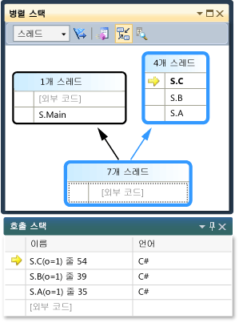  
  
     주 스레드의 호출 스택이 한 상자에 표시되고 다른 4개의 스레드에 대한 호출 스택이 다른 상자에서 그룹화됩니다. 4개의 스레드는 해당 스택 프레임이 동일한 메서드 컨텍스트를 공유 즉, 동일한 메서드인 `A`, `B` 및 `C`에 있기 때문에 그룹화됩니다. 머리글을 가리키면으로 동일한 상자를 공유 하는 스레드의 이름과 스레드 Id 보기로 (**4 개의 스레드**). 다음 그림과 같이 현재 스레드가 굵게 표시됩니다.  
  
     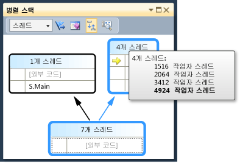  
  
     노란색 화살표는 현재 스레드의 활성 스택 프레임을 나타냅니다. 자세한 정보를 보려면 해당 항목을 가리킵니다.  
  
     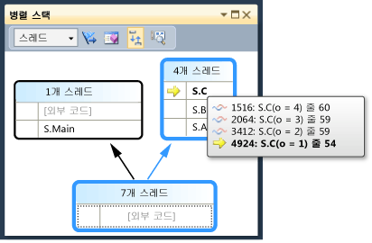  
  
     스택 프레임에 대해 표시할 정보의 양을 설정할 수 있습니다 (**모듈 이름을**, **매개 변수 형식**, **매개 변수 이름은**, **매개 변수 값**, **줄 번호** 및 **바이트 오프셋**) 마우스 오른쪽 단추로 클릭 하 여는 **호출 스택** 창.  
  
     상자 주변의 파란색 강조 표시는 현재 스레드가 해당 상자의 일부임을 나타냅니다. 현재 스레드는 도구 설명에서 굵은 스택 프레임으로도 표시됩니다. 스레드 창에서 주 스레드를 두 번 클릭 하면 볼 수 있습니다는 파란색 강조 표시가 **병렬 스택** 창이 적절 하 게 이동 합니다.  
  
     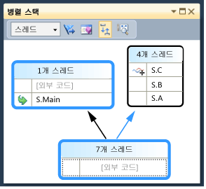  
  
#### 2번째 중단점까지 실행을 계속하려면  
  
1.  2 번째 중단점이 적중 될 때까지 실행을 다시 시작 하는 **디버그** 메뉴를 클릭 하 여 **계속**합니다. 다음 그림에서는 2번째 중단점에서의 스레드 트리를 보여 줍니다.  
  
     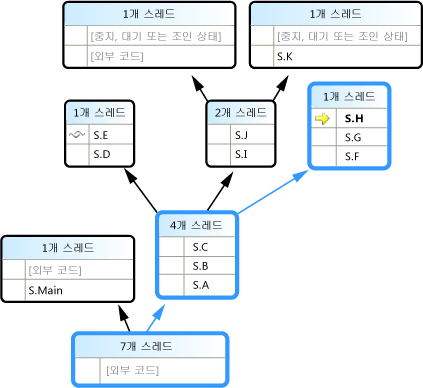  
  
     첫 번째 중단점에서 4개 스레드가 모두 S.A 메서드에서 S.B 메서드로 이동되고 다시 S.C 메서드로 이동되었습니다. 정보는에 여전히 나타나며는 **병렬 스택** 창 있지만 4 개 스레드는 더 진행 되었습니다. 그 중 하나가 S.D와 S.E로 진행되었습니다. 다른 하나는 S.F, S.G 및 S.H로 진행되었습니다. 나머지 두 개는 S.I와 S.J로 진행되었으며, 이 중단점에서 스레드 중 하나가 S.K로 이동되었고 다른 하나는 사용자 코드가 아닌 외부 코드로 진행되었습니다.  
  
     예를 들어 상자 머리글을 가리키면 수 **1 개 스레드** 또는 **2 개 스레드**스레드는 스레드 Id를 참조 하십시오. 스택 프레임을 가리키면 스레드 ID와 기타 스레드 정보를 볼 수 있습니다. 파란색 강조 표시는 현재 스레드를 나타내며 노란색 화살표는 현재 스레드의 활성 스택 프레임을 나타냅니다.  
  
     실 모양 아이콘(겹친 파란색 및 빨간색 물결선)은 현재 스레드가 아닌 스레드의 활성 스택 프레임을 나타냅니다. 에 **호출 스택** 창 프레임을 전환 하려면 S.B를 두 번 클릭 합니다. **병렬 스택** 창은 구부러진된 녹색 화살표 아이콘을 사용 하 여 현재 스레드의 현재 스택 프레임을 나타냅니다.  
  
     에 **스레드** 창에서 스레드 간을 전환 하 고 관찰 하는 보기에는 **병렬 스택** 창이 업데이트 됩니다.  
  
     바로 가기 메뉴를 사용 하 여 다른 스레드의 다른 프레임으로 또는 다른 스레드로 전환할 수는 **병렬 스택** 창. 예를 들어, S.J를 마우스 오른쪽 단추로 클릭, 가리킨 **프레임으로 전환**를 하 고 다음 명령을 클릭 합니다.  
  
     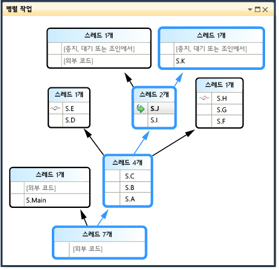  
  
     S.C를 마우스 오른쪽 단추로 클릭 하 고 가리킨 **프레임으로 전환**합니다. 명령 중 하나에 현재 스레드의 스택 프레임을 나타내는 선택 표시가 있습니다. 동일한 스레드의 해당 프레임으로 전환하거나(녹색 화살표만 이동) 다른 스레드로 전환할 수 있습니다(파란색 강조 표시도 이동). 다음 그림에서는 하위 메뉴를 보여 줍니다.  
  
     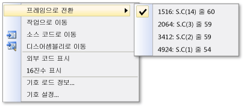  
  
     메서드 컨텍스트가 하나의 스택 프레임에 연결 된 경우 상자 머리글 표시 **1 개 스레드** 두 번 클릭 하 여 전환할 수 있습니다. 두 개 이상의 프레임이 연결된 메서드 컨텍스트를 두 번 클릭하면 메뉴가 자동으로 표시됩니다. 메서드 컨텍스트를 가리키면 오른쪽에 검은색 삼각형이 나타납니다. 이 삼각형을 클릭해도 바로 가기 메뉴가 표시됩니다.  
  
     스레드가 많은 대규모 응용 프로그램의 경우 일부 스레드에만 초점을 맞출 수 있습니다. **병렬 스택** 창 플래그가 지정 된 스레드에 대해서만 호출 스택을 표시할 수 있습니다. 도구 모음을 클릭 하 고 **지정 된 스레드만 표시** 목록 상자 옆에 있는 단추 합니다.  
  
     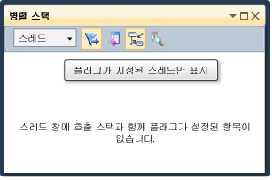  
  
     다음에 **스레드** 창에서 해당 호출 스택이 표시 되는 모양을 보려면 하나씩 스레드에 플래그는 **병렬 스택** 창. 스레드에 플래그를 설정하려면 바로 가기 메뉴 또는 스레드의 첫 번째 셀을 사용합니다. 클릭는 **지정 된 스레드만 표시** 도구 모음 단추를 다시 모든 스레드 표시 합니다.  
  
#### 3번째 중단점까지 실행을 계속하려면  
  
1.  3 번째 중단점이 적중 될 때까지 실행을 다시 시작 하는 **디버그** 메뉴를 클릭 하 여 **계속**합니다.  
  
     여러 스레드가 동일한 메서드에 있지만 메서드가 호출 스택의 시작 지점에 있지 않은 경우 메서드가 서로 다른 상자에 나타납니다. 현재 중단점의 예는 S.L입니다. 이 중단점은 3개의 스레드를 포함하며 3개의 상자에 나타납니다. S.L을 두 번 클릭합니다.  
  
     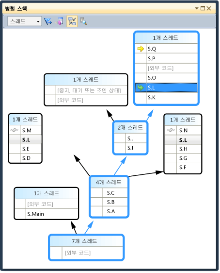  
  
     다른 두 상자에서 S.L이 굵게 표시되므로 해당 위치를 확인할 수 있습니다. 확인 하려는 경우는 프레임 s.l이 호출 되는 프레임과 호출을 클릭는 **메서드 뷰 설정/해제** 도구 모음 단추입니다. 다음 그림에서는 메서드 뷰를 보여 줍니다.는 **병렬 스택** 창.  
  
     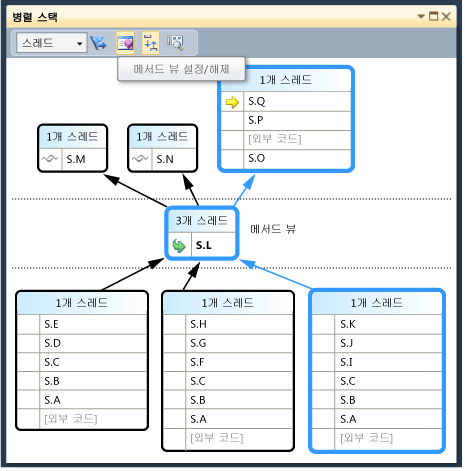  
  
     다이어그램이 선택한 메서드를 축으로 회전하고 뷰 중간에 있는 자체 상자에 배치됩니다. 호출 수신자와 호출자가 맨 위와 맨 아래에 나타납니다. 클릭는 **메서드 뷰 설정/해제** 단추 다시이 모드를 종료 합니다.  
  
     바로 가기 메뉴는 **병렬 스택** 도 창에는 다음과 같은 다른 항목입니다.  
  
    -   **16 진수 표시** 10 진수 및 16 진수는 도구 설명의 번호를 설정/해제 합니다.  
  
    -   **기호 로드 정보** 및 **기호 설정** 해당 대화 상자를 엽니다.  
  
    -   **소스 코드로 이동** 및 **디스어셈블리로 이동** 편집기에서 선택한 메서드로 이동 합니다.  
  
    -   **외부 코드 표시** 는 사용자 코드에 없는 경우에 모든 프레임을 표시 합니다. 이 메뉴 항목을 사용하면 추가 프레임을 수용할 수 있게 다이어그램이 확장됩니다. 추가 프레임에 대한 기호가 없어서 프레임이 흐리게 표시될 수 있습니다.  
  
     큰 다이어그램이 있는 경우 다음 중단점으로 한 단계씩 코드를 실행할 때 뷰가 현재 스레드의 활성 스택 프레임(중단점을 처음 적중하는 스레드)으로 자동 스크롤되게 할 수 있습니다. 에 **병렬 스택** 창 있는지 확인는 **현재 스택 프레임으로 자동 스크롤** 도구 모음 단추가 켜져 있습니다.  
  
     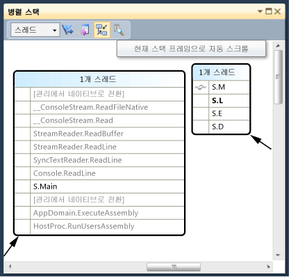  
  
2.  계속 하기 전에 **병렬 스택** 창, 왼쪽 및 아래쪽으로 모든 방법은 스크롤입니다.  
  
#### 4번째 중단점까지 실행을 계속하려면  
  
1.  4 번째 중단점이 적중 될 때까지 실행을 다시 시작 하는 **디버그** 메뉴를 클릭 하 여 **계속**합니다.  
  
     뷰가 어떻게 자동 스크롤되는지 봅니다. 스레드를 전환는 **스레드** 에서 창 또는 스위치 스택 프레임의 **호출 스택** 창 및 표시 방법을 보기 항상 정확한 프레임으로 자동 스크롤됩니다. 해제 **현재 도구 프레임으로 자동 스크롤** 옵션 차이 확인 합니다.  
  
     **Bird's Eye View** 에서 큰 다이어그램에도 도움이 됩니다는 **병렬 스택** 창. 볼 수는 **Bird's Eye View** 다음 그림과 같이 창의 오른쪽 아래 모퉁이에서 스크롤 막대 사이의 단추를 클릭 하 여 합니다.  
  
     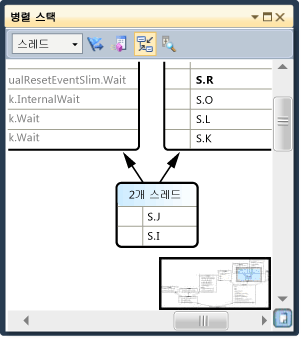  
  
     사각형을 다이어그램 주변에서 빠르게 이동할 수 있습니다.  
  
     사각형을 한 방향으로 이동하는 또 한 가지 방법은 다이어그램의 검은색 영역을 클릭하여 원하는 위치로 끄는 것입니다.  
  
     다이어그램을 확대하거나 축소하려면 Ctrl 키를 누른 상태에서 마우스 휠을 움직입니다. 또는 도구 모음의 확대/축소 단추를 클릭하고 확대/축소 도구를 사용합니다.  
  
     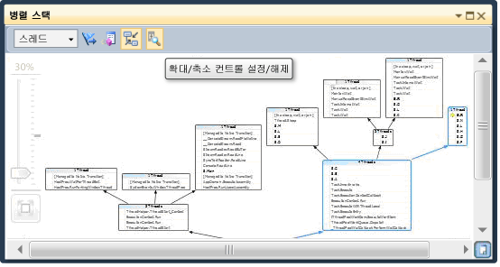  
  
     클릭 하 여 상향식이 아닌 하향식으로에서 스택의 볼 수도 **도구** 메뉴를 클릭 하 **옵션**, 다음을 선택 하거나 아래 옵션을 선택 취소 된 **디버깅** 노드.  
  
2.  계속 하기 전에 **디버그** 메뉴를 클릭 하 여 **디버깅 중지** 실행을 종료할 합니다.  
  
## 병렬 작업 창과 병렬 스택 창의 작업 뷰 사용  
 계속하기 전에 이전 절차를 완료하는 것이 좋습니다.  
  
#### 첫 번째 중단점이 적중될 때까지 응용 프로그램을 다시 시작하려면  
  
1.  에 **디버그** 메뉴를 클릭 하 여 **디버깅 시작** 고 첫 번째 중단점이 적중 될 때까지 대기 합니다.  
  
2.  에 **디버그** 메뉴에서 **Windows** 클릭 하 고 **스레드**합니다. 도킹 된 **스레드** Visual Studio의 아래쪽 창에 있습니다.  
  
3.  에 **디버그** 메뉴에서 **Windows** 클릭 **호출 스택**합니다. 도킹 된 **호출 스택** Visual Studio 아래쪽 창에 있습니다.  
  
4.  스레드를 두 번 클릭은 **스레드** 창을 활성화 합니다. 활성화된 현재 스레드에는 노란색 화살표가 표시됩니다. 현재 스레드를 변경하면 다른 창이 업데이트됩니다. 다음에는 작업을 살펴보겠습니다.  
  
5.  에 **디버그** 메뉴에서 **Windows** 클릭 하 고 **병렬 작업**합니다. 다음 그림에서는 **작업** 창.  
  
     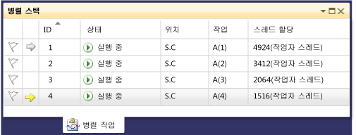  
  
     실행 중인 각 작업에 대해 같은 이름의 속성에서 반환되는 작업의 ID, 작업을 실행하는 스레드의 ID 및 이름, 작업의 위치가 표시됩니다. 작업을 가리키면 전체 호출 스택이 포함된 도구 설명이 표시됩니다. 또한 아래에서 **작업** 열을 작업으로 전달 된 메서드를 볼 수 있습니다; 즉, 시작 지점을 합니다.  
  
     열을 정렬할 수 있습니다. 정렬 문자 모양이 정렬 열과 방향을 나타냅니다. 열을 왼쪽이나 오른쪽으로 끌어서 열을 다시 정렬할 수도 있습니다.  
  
     노란색 화살표는 현재 작업을 나타냅니다. 작업을 두 번 클릭하거나 바로 가기 메뉴를 사용하여 작업을 전환할 수 있습니다. 작업을 전환하면 주 스레드가 현재 스레드가 되고 다른 창이 업데이트됩니다.  
  
     작업 간을 수동으로 전환하는 경우 노란색 화살표는 이동하지만 흰색 화살표는 디버거를 중단시킨 작업을 계속 표시합니다.  
  
#### 2번째 중단점까지 실행을 계속하려면  
  
1.  2 번째 중단점이 적중 될 때까지 실행을 다시 시작 하는 **디버그** 메뉴를 클릭 하 여 **계속**합니다.  
  
     이전에 **상태** 열에 모든 작업이 실행 중으로 표시 되었지만 이제는 작업 중 두 개가 대기 중입니다. 작업은 다양한 이유로 차단될 수 있습니다. 에 **상태** 열에서 차단 된 이유를 알아보려면 대기 중인 작업을 가리키면 합니다. 예를 들어, 다음 그림에서 작업 3이 작업 4를 기다리고 있습니다.  
  
     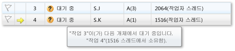  
  
     작업 4는 작업 2에 할당된 스레드가 소유하는 모니터를 기다리고 있습니다.  
  
     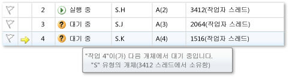  
  
     첫 번째 열에 플래그를 클릭 하 여 작업에 플래그 수 있습니다는 **작업** 창.  
  
     동일한 디버깅 세션의 여러 중단점 간에 작업을 추적 하거나에 호출 스택이 표시 되는 작업에 대 한 필터링 할 플래그 설정을 사용할 수 있습니다는 **병렬 스택** 창.  
  
     사용 하는 경우는 **병렬 스택** 창 응용 프로그램 스레드 이전에 본 합니다. 보기는 **병렬 스택** 에 창 이번 응용 프로그램 작업을 봅니다. 선택 하 여이 작업을 수행 **작업** 왼쪽 위의 상자에서. 다음 그림에서는 작업 뷰를 보여 줍니다.  
  
     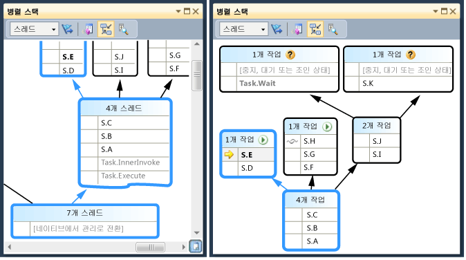  
  
     현재 실행 중인 작업이 아닌 스레드의 작업 보기에 표시 되지 않습니다는 **병렬 스택** 창. 또한 작업을 실행하는 스레드의 경우 작업과 관련이 없는 스택 프레임 중 일부가 스택의 맨 위와 맨 아래에서 필터링됩니다.  
  
     보기는 **작업** 창을 다시 합니다. 열 머리글을 마우스 오른쪽 단추로 클릭하여 열의 바로 가기 메뉴를 표시합니다.  
  
     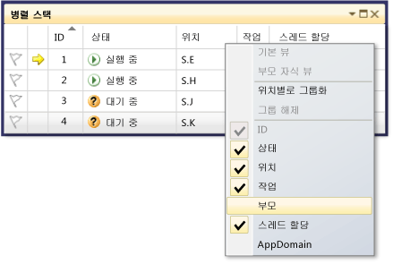  
  
     바로 가기 메뉴를 사용하여 열을 추가하거나 제거할 수 있습니다. 예를 들어, AppDomain 열은 선택되지 않았으므로 목록에 표시되지 않습니다. 클릭 **부모**합니다. **부모** 열 4 개 작업 중 하나에 대 한 값 없이 표시 합니다.  
  
#### 3번째 중단점까지 실행을 계속하려면  
  
1.  3 번째 중단점이 적중 될 때까지 실행을 다시 시작 하는 **디버그** 메뉴를 클릭 하 여 **계속**합니다.  
  
     지금 새 작업인 작업 5가 실행 중이며 작업 4가 대기 중입니다. 이유 위로 이동 하 여 대기 중인 작업에서 볼 수는 **상태** 창. 에 **부모** 열, 해당 작업 4이 5 작업의 부모입니다.  
  
     부모-자식 관계를 보다 잘 시각화 하려면 마우스 오른쪽 단추로 클릭는 **부모** 열 머리글을 클릭 한 다음 **부모 자식 뷰**합니다. 다음 그림이 표시됩니다.  
  
       
  
     동일한 스레드에 대해 작업 4와 작업 5가 실행되고 있습니다. 이 정보에 표시 되지 않습니다는 **스레드** 창; 볼 수 있다는 추가적인 이점이은 여기에서 **작업** 창. 이 확인 하려면 보기는 **병렬 스택** 창. 표시 된 있는지 **작업**합니다. 두 번 클릭 하 여 작업 4와 5를 찾습니다는 **작업** 창. 이렇게 하면 파란색 강조 표시는 **병렬 스택** 창이 업데이트 됩니다. 도구 설명에서 검색 하 여 작업 4와 5를 찾을 수도 있습니다는 **병렬 스택** 창.  
  
     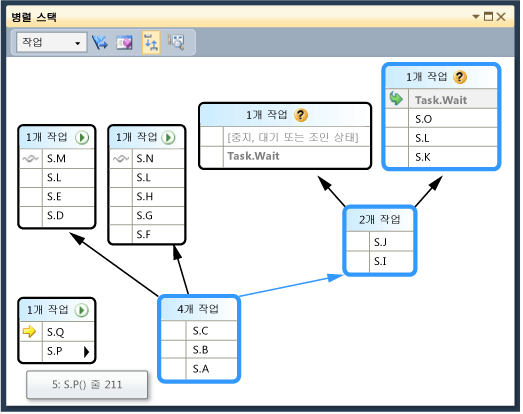  
  
     에 **병렬 스택** 창에서 S.P를 마우스 오른쪽 단추로 클릭 **스레드로 이동**합니다. 창이 스레드 뷰로 전환되고 해당 프레임이 뷰에 표시됩니다. 동일한 스레드에서 두 작업을 볼 수 있습니다.  
  
     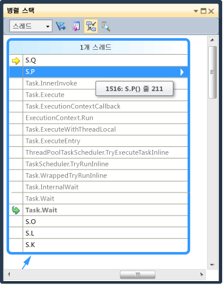  
  
     이것은 작업 보기에의 또 다른 이점은 **병렬 스택** 창과 비교 하 여 **스레드** 창.  
  
#### 4번째 중단점까지 실행을 계속하려면  
  
1.  3 번째 중단점이 적중 될 때까지 실행을 다시 시작 하는 **디버그** 메뉴를 클릭 하 여 **계속**합니다. 클릭는 **ID** ID로 정렬 하려면 열 머리글 다음 그림이 표시됩니다.  
  
     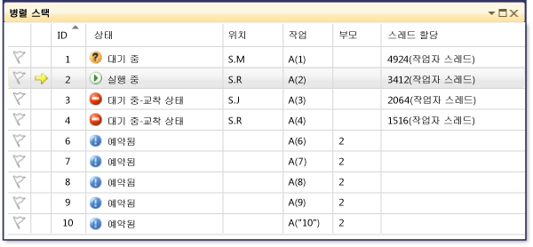  
  
     작업 5가 완료되어 더 이상 표시되지 않습니다. 그렇지 않고 교착 상태도 표시되지 않으면 F11 키를 눌러 한 단계씩 코드를 실행합니다.  
  
     작업 3과 작업 4가 서로 대기 중이어서 교착 상태에 있습니다. 또한 작업 2의 자식인 5개의 새 작업이 있고 현재 예약되어 있습니다. 예약된 작업은 코드 내에서는 시작되었지만 아직 실행되지 않은 작업입니다. 따라서 해당 **위치** 및 **스레드 할당** 열이 비어 있습니다.  
  
     보기는 **병렬 스택** 창을 다시 합니다. 각 상자의 머리글에는 스레드 ID 및 이름을 표시하는 도구 설명이 있습니다. 작업 뷰로 전환는 **병렬 스택** 창. 그림과 같이 머리글을 가리키면 작업 ID, 이름 및 상태가 표시됩니다.  
  
     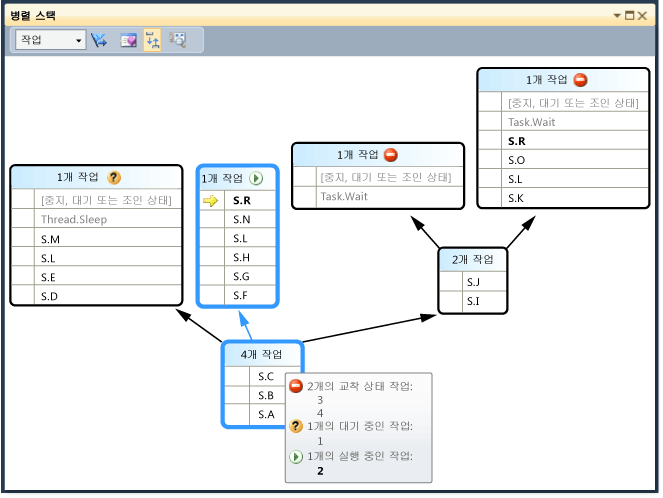  
  
     열별로 작업을 그룹화할 수 있습니다. 에 **작업** 창을 마우스 오른쪽 단추로 클릭는 **상태** 열 머리글을 클릭 한 다음 **상태별으로 그룹화**합니다. 다음 그림에서는 **작업** 창 상태별으로 그룹화 합니다.  
  
     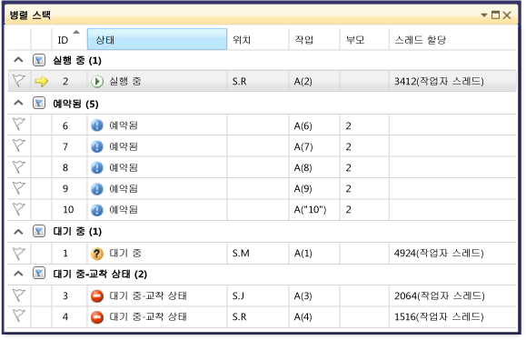  
  
     다른 열을 기준으로 그룹화할 수도 있습니다. 작업을 그룹화하여 일부 작업에만 초점을 맞출 수 있습니다. 축소 가능한 그룹마다 함께 그룹화되는 항목 수가 있습니다. 클릭 하 여 그룹에 모든 항목을 플래그 신속 하 게는 **플래그** 의 오른쪽에 있는 단추는 **축소** 단추입니다.  
  
     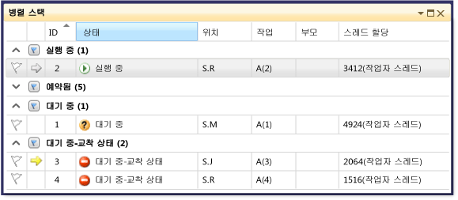  
  
     마지막 기능은 **작업** 창을 검사 하는 작업을 마우스 오른쪽 단추로 클릭할 때 표시 되는 바로 가기 메뉴입니다.  
  
     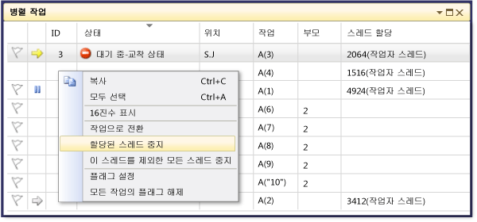  
  
     바로 가기 메뉴에는 작업 상태에 따라 다양한 명령이 표시됩니다. 명령에는 있습니다 **복사**, **모두 선택**, **16 진수 표시**, **작업으로 전환**, **고정 할당 스레드**, **모든 스레드가 있지만이 고정**, 및 **할당 된 스레드 재개**, 및 **플래그**합니다.  
  
     작업의 내부 스레드를 중지하거나 할당된 스레드를 제외한 모든 스레드를 중지할 수 있습니다. 고정 된 스레드는에 표시 된 **작업** 창 에서처럼 중인는 **스레드** 창 옆에 파란색 *일시 중지* 아이콘입니다.  
  
## 요약  
 이 연습에서 설명 된 **병렬 작업** 및 **병렬 스택** 디버거 창. 다중 스레드 코드를 사용하는 실제 프로젝트에서 이러한 창을 사용하십시오. C++, C# 또는 Visual Basic으로 작성된 병렬 코드를 검사할 수 있습니다.  
  
## 참고 항목  
 [다중 스레드 응용 프로그램 디버깅](../debugger/walkthrough-debugging-a-parallel-application.md)   
 [Debugger Basics](../debugger/debugger-basics.md) (디버거 기본 사항)  
 [Debugging Managed Code](../debugger/debugging-managed-code.md) (관리 코드 디버그)  
 [병렬 프로그래밍](/dotnet/standard/parallel-programming/index)   
 [동시성 런타임](/cpp/parallel/concrt/concurrency-runtime)   
 [병렬 스택 창 사용](../debugger/using-the-parallel-stacks-window.md)   
 [작업 창 사용](../debugger/using-the-tasks-window.md)