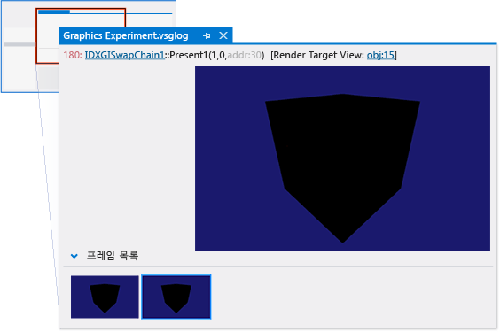
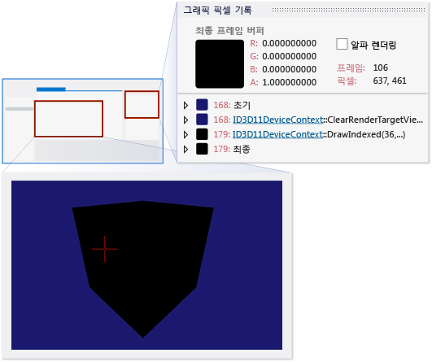
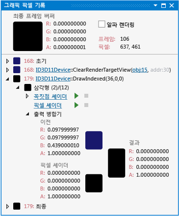

# 연습: 음영으로 인한 렌더링 오류 디버깅
[!INCLUDE[vs2017banner](../code-quality/includes/vs2017banner.md)]

이 연습에서는 [!INCLUDE[vsprvs](../code-quality/includes/vsprvs_md.md)] 그래픽 진단을 사용하여 셰이더 버그로 인해 색상이 잘못 지정된 개체를 조사하는 방법을 보여 줍니다.  
  
 이 연습에서는 다음 방법을 설명합니다.  
  
-   그래픽 로그 문서를 검사하여 문제를 나타내는 픽셀을 확인합니다.  
  
-   **그래픽 픽셀 기록** 창에서 픽셀 상태를 좀 더 자세히 검토합니다.  
  
-   **HLSL 디버거**를 사용하여 픽셀 및 꼭지점 셰이더를 검사합니다.  
  
## 시나리오  
 개체 색상이 잘못 지정되는 문제는 일반적으로 꼭지점 셰이더가 픽셀 셰이더에 올바르지 않거나 불완전한 정보를 전달할 때 발생합니다.  
  
 이 시나리오에서 사용자는 최근에 앱에 개체를 추가했으며 개체를 변환하고 고유한 모양을 부여하기 위해 새 꼭지점 및 픽셀 셰이더도 함께 추가했습니다. 테스트하는 동안 앱을 실행하는 경우 개체가 검은색으로 렌더링됩니다. 그래픽 진단을 사용하여 앱을 디버그할 수 있도록 그래픽 로그 문제를 포착합니다. 이 문제는 앱에서 다음과 같이 보입니다.  
  
   
  
## 조사  
 그래픽 진단 도구를 사용하면 그래픽 로그 문서를 로드하여 테스트 중에 캡처한 프레임을 검사할 수 있습니다.  
  
#### 그래픽 로그에서 프레임을 검사하려면  
  
1.  [!INCLUDE[vsprvs](../code-quality/includes/vsprvs_md.md)]에서 누락된 모델을 보여 주는 프레임이 포함된 그래픽 로그를 로드합니다. 새 그래픽 로그 문서 창이 [!INCLUDE[vsprvs](../code-quality/includes/vsprvs_md.md)]에 나타납니다. 이 창의 맨 윗 부분에 선택한 프레임의 렌더링 대상 출력이 있습니다. 아래쪽에는 캡처된 각 프레임을 미리 보기 이미지로 표시하는 **프레임 목록**이 있습니다.  
  
2.  **프레임 목록**에서 개체의 모양이 올바르지 않은 프레임을 선택합니다. 선택한 프레임을 반영하도록 렌더링 대상이 업데이트됩니다. 이 시나리오에서 그래픽 로그 문서 창은 다음과 같습니다.  
  
       
  
 문제를 보이는 프레임을 선택한 후에 **그래픽 픽셀 기록** 창을 사용하여 프레임을 진단할 수 있습니다.**그래픽 픽셀 기록** 창은 특정 픽셀에 영향을 미칠 수 있는 기본 형식, 해당 셰이더 및 렌더링 대상에 미친 영향을 시간 순서대로 보여 줍니다.  
  
#### 픽셀을 검사하려면  
  
1.  **그래픽 픽셀 기록** 창을 엽니다.**그래픽 진단** 도구 모음에서 **픽셀 기록**을 선택합니다.  
  
2.  픽셀을 선택하여 검사합니다. 그래픽 로그 문서 창에서 잘못 색이 지정된 개체의 픽셀 중 하나를 선택합니다.  
  
       
  
     **그래픽 픽셀 기록** 창은 선택된 픽셀을 반영하도록 업데이트됩니다. 이 시나리오에서 **그래픽 픽셀 기록** 창은 다음과 같습니다.  
  
       
  
     픽셀 셰이더의 결과는 완전히 불투명한 검은색\(0, 0, 0, 1\)입니다. **출력 병합기**가 이 색상을 픽셀의 **이전** 색상과 결합하므로 **결과**가 완전히 불투명한 검은색이 되는 것입니다.  
  
 색상이 잘못된 픽셀을 검사하고 픽셀 셰이더 출력이 예상된 색이 아닌지 검색한 후에는 HLSL 디버거를 사용하여 픽셀 셰이더를 검사하고 개체 색상에 나타난 결과를 확인할 수 있습니다. 실행하는 동안 HLSL 디버거를 사용하여 HLSL 변수의 상태를 검사하고, HLSL 코드를 단계별로 진행하고, 문제 진단을 위한 중단점을 설정할 수 있습니다.  
  
#### 픽셀 셰이더를 검사하려면  
  
1.  픽셀 셰이더 디버깅을 시작합니다.**그래픽 픽셀 기록** 창의 개체 기본 형식에서 **픽셀 셰이더** 옆에 있는 **디버깅 시작** 단추를 선택합니다.  
  
2.  이 시나리오에서는 꼭지점 셰이더에서 들어온 색상만 픽셀 셰이더를 통과하므로 픽셀 셰이더가 문제의 원인이 아님을 쉽게 알 수 있습니다.  
  
3.  `input.color`에 포인터를 놓습니다. 해당 값은 완전히 불투명한 검정색입니다\(0, 0, 0, 1\).  
  
       
  
     이 시나리오에서 검사를 통해 잘못된 색상은 수행할 픽셀 셰이더에 대한 올바른 색상 정보를 제공하지 않는 꼭짓점 셰이더의 결과일 수 있음을 알 수 있습니다.  
  
 꼭짓점 셰이더가 픽셀 셰이더에 대한 올바른 정보를 제공하지 않고 있을 수 있다고 판단했다면 다음 단계는 꼭짓점 셰이더를 검사하는 것입니다.  
  
#### 꼭지점 셰이더를 검사하려면  
  
1.  꼭지점 셰이더 디버깅을 시작합니다.**그래픽 픽셀 기록** 창의 개체 기본 형식에서 **꼭지점 셰이더** 옆에 있는 **디버깅 시작** 단추를 선택합니다.  
  
2.  꼭지점 셰이더의 출력 구조를 찾습니다. 이것이 픽셀 셰이더의 입력에 해당합니다. 이 시나리오에서 이 구조의 이름은 `output`입니다. 꼭짓점 셰이더 코드를 검사하고 사용자의 디버깅 활동으로 인해 `color` 구조의 `output` 멤버가 완전히 불투명한 검정색으로 명시적으로 설정되어 있는지 확인합니다.  
  
3.  색상 멤버가 입력 구조에서 복사되지 않았음을 확인합니다.`output.color` 값이 `output` 구조가 반환되기 직전에 완전히 불투명한 검정색으로 설정되어 있으므로 `output`의 값이 이전 줄에서 올바르게 초기화되지 않았음을 확인하는 것이 좋습니다.`output.color`의 값을 살펴보는 동안 `output.color`를 검정색으로 설정하는 줄에 도달할 때까지 꼭짓점 셰이더를 단계별로 수행합니다.`output.color` 값이 검정색으로 설정될 때까지 초기화되지 않음을 확인합니다. 이렇게 하면 `output.color`를 검정색으로 설정하는 코드 줄을 삭제하기 보다는 수정해야 함을 확인할 수 있습니다.  
  
       
  
 렌더링 문제의 원인이 꼭짓점 셰이더가 픽셀 셰이더에 올바른 색상 값을 제공하지 않기 때문이라고 판단했다면 이 정보를 사용하여 문제를 해결할 수 있습니다. 이 시나리오에서는 꼭짓점 셰이더에서 다음 코드를 변경하여 문제를 해결할 수 있습니다.  
  
```  
output.color = float3(0.0f, 0.0f, 0.0f);  
```  
  
 다음으로 변경:  
  
```hlsl  
output.color = input.color;  
```  
  
 이 코드는 수정하지 않은 상태로 개체의 꼭지점에서 들어온 꼭지점 색상을 통과시키며, 좀 더 복잡한 꼭지점 셰이더는 색상을 통과시키기 전에 수정할 수 있습니다. 수정된 꼭지점 셰이더 코드는 다음과 같습니다.  
  
   
  
 코드를 수정한 후 다시 빌드하고 앱을 다시 실행하여 렌더링 문제가 해결되었는지 검색합니다.  
  
 