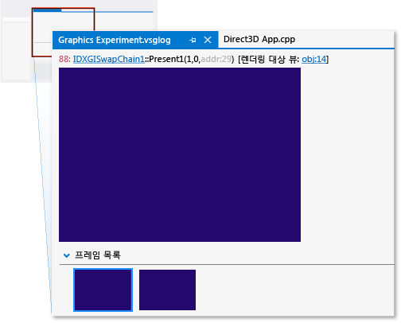
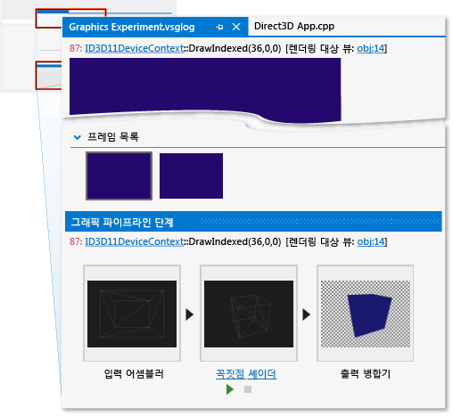
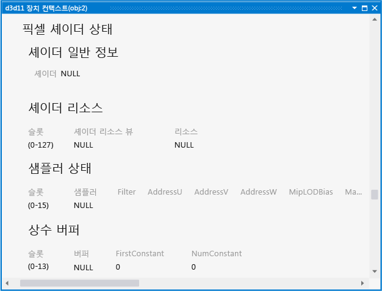
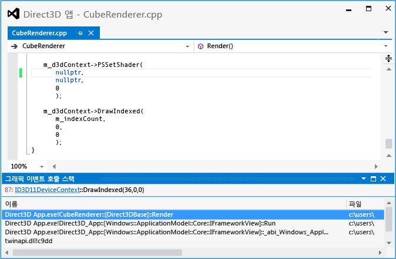

# 연습: 잘못 구성된 파이프라인으로 인해 누락된 개체
[!INCLUDE[vs2017banner](../code-quality/includes/vs2017banner.md)]

이 연습에서는 [!INCLUDE[vsprvs](../code-quality/includes/vsprvs_md.md)] 그래픽 진단 도구를 사용하여 설정되지 않은 픽셀 셰이더로 인해 누락된 개체를 조사하는 방법을 보여 줍니다.  
  
 이 연습에서는 다음 작업을 설명합니다.  
  
-   **그래픽 이벤트 목록**을 사용하여 문제의 잠재적인 원인을 찾습니다.  
  
-   **그래픽 파이프라인 단계** 창을 사용하여 `DrawIndexed` Direct3D API 호출의 효과를 검사합니다.  
  
-   장치 컨텍스트를 검사하여 셰이더 단계를 설정하지 않았음을 확인합니다.  
  
-   **그래픽 파이프라인 단계** 창을 **그래픽 이벤트 호출 스택**과 함께 사용하여 설정되지 않은 픽셀 셰이더의 원본을 찾을 수 있도록 합니다.  
  
## 시나리오  
 3차원 앱에 개체가 누락된다면, 셰이더 단계 중 하나가 개체 렌더링 전에 설정되지 않아서 누락된 것일 수 있습니다. 간단한 렌더링이 필요한 앱에서 이 오류의 원인은 보통 개체의 그리기 호출의 호출 스택 어딘가에 문제가 있습니다. 그러나 최적화 방법으로서, 일부 앱에서는 상태 변경 오버헤드를 최소화하기 위해 셰이더 프로그램, 질감 또는 기타 데이터를 공통적으로 가지고 있는 개체들을 함께 일괄 처리합니다. 이러한 앱에서, 오류의 원인은 그리기 호출의 호출 스택보다는 일괄 처리 시스템에 있을 수 있습니다. 이 연습의 시나리오에서는 간단한 렌더링이 필요한 앱을 보여 주므로, 오류 원인을 호출 스택에서 찾을 수 있습니다.  
  
 이 시나리오에서는 테스트를 위해 앱을 실행할 때 배경은 예상대로 렌더링되지만 개체 중 하나가 나타나지 않습니다. 그래픽 진단을 사용하여 앱을 디버그할 수 있도록 그래픽 로그 문제를 포착합니다. 이 문제는 앱에서 다음과 같이 보입니다.  
  
   
  
## 조사  
 그래픽 진단 도구를 사용하면 그래픽 로그 문서를 로드하여 테스트 중에 캡처한 프레임을 검사할 수 있습니다.  
  
#### 그래픽 로그에서 프레임을 검사하려면  
  
1.  [!INCLUDE[vsprvs](../code-quality/includes/vsprvs_md.md)]에서 누락된 개체를 보여 주는 프레임이 포함된 그래픽 로그 문서를 로드합니다. 새 그래픽 로그 탭이 [!INCLUDE[vsprvs](../code-quality/includes/vsprvs_md.md)]에 나타납니다. 이 탭의 맨 윗부분에 선택한 프레임의 렌더링 대상 출력이 있습니다. 아래쪽에는 캡처된 각 프레임을 미리 보기 이미지로 표시하는 **프레임 목록**이 있습니다.  
  
2.  **프레임 목록**에서 개체가 표시되지 않는 것을 보여 주는 프레임을 선택합니다. 선택한 프레임을 반영하도록 렌더링 대상이 업데이트됩니다. 이 시나리오에서 그래픽 로그 탭은 다음과 같습니다.  
  
       
  
 문제를 보이는 프레임을 선택한 후에 **그래픽 이벤트 목록**을 사용하여 진단을 시작할 수 있습니다.**그래픽 이벤트 목록**에는 활성 프레임을 렌더링하여 장치를 상태를 설정하거나, 버퍼를 만들고 업데이트하거나 프레임에 나타나는 개체를 그리는 등의 작업을 하기 위해 수행한 모든 Direct3D API 호출이 포함됩니다. 많은 유형의 호출\(그리기, 디스패치, 복사 또는 지우기 등\)은 앱이 예상대로 작동할 때 렌더링 대상에 항상은 아니지만 종종 해당 변경 사항이 생기므로 흥미롭습니다. 그리기 호출은 각각 앱이 렌더링하는 기하 도형을 나타내므로 특히 흥미롭습니다.  
  
 우리는 렌더링 대상에 누락된 개체는 포함되지 않지만, 다른 오류가 있는 것으로 표시되지 않음을 알고 있으므로, **그래픽 파이프라인 단계** 도구와 함께 **그래픽 이벤트 목록**을 사용하여 누락된 개체의 기하 도형에 해당하는 그리기 호출을 판단할 수 있습니다.**그래픽 파이프라인 단계** 창은 렌더링 대상에 대한 효과에 상관없이 각 그리기 호출에 전송된 기하 도형을 보여 줍니다. 그리기 호출을 진행함에 따라, 기하 도형이 각각 사용되는 단계를 통과할 때 파이프라인 단계가 각 호출과 관련된 기하 도형을 표시하도록 업데이트되고, 렌더링 대상 출력도 호출이 완료되면 렌더링 대상의 상태를 표시하도록 업데이트됩니다.  
  
#### 누락된 기하 도형에 대한 그리기 호출을 찾으려면,  
  
1.  **그래픽 이벤트 목록** 창을 엽니다.**그래픽 진단** 도구 모음에서 **이벤트 목록**을 선택합니다.  
  
2.  **그래픽 파이프라인 단계** 창을 엽니다.**그래픽 진단** 도구 모음에서 **파이프라인 단계**를 선택합니다.  
  
3.  **그래픽 이벤트 목록** 창에서 각 그리기 호출을 진행할 때, 누락된 개체에 대한 **그래픽 파이프라인 단계** 창을 봅니다. 더 쉽게 확인하려면 **그래픽 이벤트 목록** 창의 오른쪽 위 모서리에 있는 **검색** 상자에 "그리기"를 입력합니다. 그러면 목록이 필터링되어 제목에 "그리기"가 포함된 이벤트만 나타납니다.  
  
     **그래픽 파이프라인 단계** 창에서 **입력 어셈블러** 단계는 개체가 변환되기 전 개체의 기하 도형을 보여 주며, **꼭지점 셰이더** 단계는 변환된 후의 동일한 개체를 보여 줍니다. 이 시나리오에서 알 수 있듯이 **그래픽 파이프라인 단계** 창에는 **입력 어셈블러** 및 **꼭짓점 셰이더** 단계가 표시되지만, 그리기 호출 중 하나에 대한 **픽셀 셰이더** 단계는 표시되지 않습니다.  
  
    > [!NOTE]
    >  헐 셰이더, 도메인 셰이더 또는 기하 도형 셰이더 단계와 같은 다른 파이프라인 단계에서 개체를 처리하는 경우, 그 중 어느 단계라도 문제의 원인이 될 수 있습니다. 일반적으로 문제는 결과가 표시되지 않거나 예기치 않은 방식으로 표시되는 최초의 단계와 관련이 있습니다.  
  
4.  누락된 개체에 해당하는 그리기 호출에 도달하면 중지합니다. 이 시나리오에서 **그래픽 파이프라인 단계** 창은 기하 도형이 GPU에 만들어지고\(**입력 어셈블러** 단계의 존재로 알 수 있음\) 변환\(**꼭짓점 셰이더** 단계로 알 수 있음\)되지만 활성 픽셀 셰이더가 없는\(**픽셀 셰이더** 단계의 부재로 알 수 있음\) 것으로 보이므로 렌더링 대상에 나타나지 않습니다. 이 시나리오에서는 누락된 개체의 실루엣을 아래 그림과 같이 **출력 병합기** 단계에서 확인할 수도 있습니다.  
  
       
  
 앱이 누락된 개체의 기하 도형에 대한 그리기 호출을 발행했음을 확인하고 픽셀 셰이더 단계 비활성 상태임이 발견되면 장치 상태를 검사하여 찾은 사항들을 확인할 수 있습니다.**그래픽 개체 표**를 사용하여 장치 컨텍스트와 기타 Direct3D 개체 데이터를 검사할 수 있습니다.  
  
#### 장치 컨텍스트를 검사하려면,  
  
1.  **d3d11 장치 컨텍스트**를 엽니다.**그래픽 파이프라인 단계** 창에서 창의 위쪽에 표시되는 `DrawIndexed` 호출의 일부인 **ID3D11DeviceContext** 링크를 선택합니다.  
  
2.  **d3d11 장치 컨텍스트** 탭에 표시되는 장치 상태를 검사하여 그리기 호출 동안 활성 상태였던 픽셀 셰이더가 없음을 확인합니다. 이 시나리오에서 **픽셀 셰이더 상태** 아래에 표시되는 **셰이더 일반 정보**는 셰이더가 **NULL**임을 나타냅니다.  
  
       
  
 픽셀 셰이더가 앱에 의해 null로 설정되었는지 확인했다면 다음 단계는 셰이더가 설정되어 있는 앱 소스 코드의 위치를 찾는 것입니다.**그래픽 이벤트 목록**을 **그래픽 이벤트 호출 스택**과 함께 사용하여 이 위치를 찾을 수 있습니다.  
  
#### 앱 소스 코드에서 픽셀 셰이더가 설정되어 있는 위치를 찾으려면,  
  
1.  누락된 개체에 해당하는 `PSSetShader` 호출을 찾습니다.**그래픽 이벤트 목록** 창에서 **그래픽 이벤트 목록** 창의 오른쪽 위 모서리에 있는 **검색** 상자에 "Draw;PSSetShader"를 입력합니다. 그러면 목록이 필터링되어 "PSSetShader" 이벤트와 제목에 "그리기"가 포함된 이벤트만 남게 됩니다. 누락된 개체의 그리기 호출 전에 나타나는 첫 번째 `PSSetShader` 호출을 선택합니다.  
  
    > [!NOTE]
    >  이 프레임 동안 설정되지 않은 경우 `PSSetShader`는 **그래픽 이벤트 목록** 창이 표시되지 않습니다. 이런 일은 보통 모든 개체에 대해 하나의 픽셀 셰이더만 사용하거나 이 프레임 중 `PSSetShader` 호출을 실수로 건너뛴 경우에만 발생합니다. 어느 경우에든 앱의 소스 코드에서 `PSSetShader` 호출을 검색하고 기존의 디버그 기술을 사용하여 이러한 호출의 동작을 검사하는 것이 좋습니다.  
  
2.  **그래픽 이벤트 호출 스택** 창을 엽니다.**그래픽 진단** 도구 모음에서 **그래픽 이벤트 호출 스택**을 선택합니다.  
  
3.  호출 스택을 사용하여 앱의 소스 코드에서 `PSSetShader` 호출을 찾습니다.**그래픽 이벤트 호출 스택** 창에서 최상위 호출을 선택하고 픽셀 셰이더가 설정되는 값을 검사합니다. 픽셀 셰이더가 바로 null로 설정할 수도 있고, 또는 함수에 전달된 인수나 다른 상태로 인해 null 값이 발생할 수도 있습니다. 직접 설정하지 않은 경우라면 호출 스택의 어딘가에서 null 값의 원인을 찾을 수도 있습니다. 이 시나리오에서는 픽셀 셰이더가 `CubeRenderer::Render`라는 최상위 함수에서 `nullptr`로 직접 설정되고 있음을 볼 수 있습니다.  
  
       
  
    > [!NOTE]
    >  호출 스택을 검사하는 것만으로 null 값의 원인을 찾을 수 없는 경우에는 픽셀 셰이더를 null로 설정할 때 프로그램의 실행이 중단되는 조건부 중단점을 `PSSetShader` 호출에 설정하는 것이 좋습니다. 그런 다음 디버그 모드에서 앱을 다시 시작하고 기존의 디버그 기법을 사용하여 null 값의 원인을 찾습니다.  
  
 문제를 해결하려면 `ID3D11DeviceContext::PSSetShader` API 호출의 첫 번째 매개 변수를 사용하여 올바른 픽셀 셰이더를 할당합니다.  
  
   
  
 코드를 수정한 후 다시 빌드하고 앱을 다시 실행하여 렌더링 문제가 해결되었는지 확인할 수 있습니다.  
  
   
  
## 다음 단계