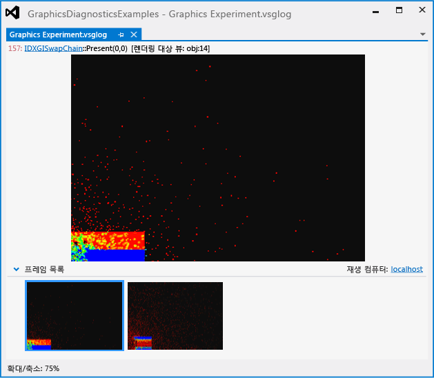
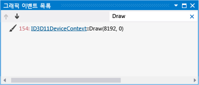
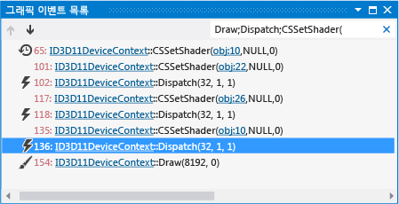
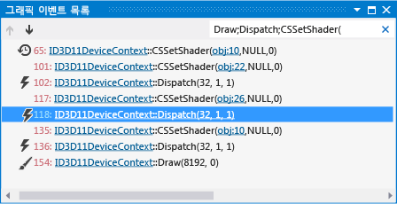

# 연습: 그래픽 진단을 사용하여 계산 셰이더 디버깅
[!INCLUDE[vs2017banner](../code-quality/includes/vs2017banner.md)]

이 연습에서는 잘못된 결과를 생성하는 계산 셰이더를 Visual Studio 그래픽 진단 도구를 사용하여 조사하는 방법을 보여 줍니다.  
  
 이 연습에서는 다음 작업을 설명합니다.  
  
-   **그래픽 이벤트 목록**을 사용하여 문제의 잠재적인 원인을 찾습니다.  
  
-   **그래픽 이벤트 호출 스택**을 사용하여 DirectCompute `Dispatch` 이벤트에서 실행되는 계산 셰이더를 결정합니다.  
  
-   **그래픽 파이프라인 단계** 창과 HLSL 디버거를 사용하여 문제의 원인이 되는 계산 셰이더를 검사합니다.  
  
## 시나리오  
 이 시나리오에서는 DirectCompute를 사용하여 시뮬레이션 업데이트에서 컴퓨팅 성능이 가장 많이 필요한 부분을 수행하는 유체 역학 시뮬레이션을 작성했습니다.  앱이 실행되면 데이터 집합 및 UI가 제대로 렌더링되는 것으로 보이지만 시뮬레이션은 예상대로 작동하지 않습니다.  그래픽 진단을 사용하여 앱을 디버그할 수 있도록 그래픽 로그 문제를 포착할 수 있습니다.  이 문제는 앱에서 다음과 같이 보입니다.  
  
   
  
 그래픽 로그의 그래픽 문제를 포착하는 방법에 대한 자세한 내용은 [그래픽 정보 캡처](../debugger/capturing-graphics-information.md)를 참조하세요.  
  
## 조사  
 그래픽 진단 도구를 사용하여 캡처된 프레임을 검사할 수 있도록 그래픽 로그 파일을 로드할 수 있습니다.  
  
#### 그래픽 로그에서 프레임을 검사하려면  
  
1.  Visual Studio에서 잘못된 시뮬레이션 결과를 보이는 프레임이 포함된 그래픽 로그를 로드합니다.  Visual Studio에 새 그래픽 진단 탭이 나타납니다.  이 탭의 맨 윗부분에 선택한 프레임의 렌더링 대상 출력이 있습니다.  아래쪽에는 각 캡처된 프레임의 미리 보기 그림을 표시하는 **프레임 목록**이 있습니다.  
  
2.  **프레임 목록**에서 잘못된 시뮬레이션 동작을 보이는 프레임을 선택합니다.  렌더링 코드가 아니라 시뮬레이션 코드에 오류가 있는 것으로 보이더라도, DirectCompute 이벤트는 Direct3D 이벤트와 함께 프레임별로 캡처되므로 프레임을 선택해야 합니다.  이 시나리오에서 그래픽 로그 탭은 다음과 같습니다.  
  
       
  
 문제를 보이는 프레임을 선택한 후에 **그래픽 이벤트 목록**을 사용하여 프레임을 진단할 수 있습니다.  **그래픽 이벤트 목록**에는 활성 프레임 중에 수행된 모든 DirectCompute 호출 및 Direct3D API 호출\(예: GPU에서 계산을 실행하거나 데이터 집합 또는 UI를 렌더링하는 API 호출\)에 대한 이벤트가 포함됩니다.  이 시나리오에서 우리는 GPU에서 실행하는 시뮬레이션의 일부를 나타내는 `Dispatch` 이벤트에 집중하겠습니다.  
  
#### 시뮬레이션 업데이트에 대한 디스패치 이벤트를 찾으려면  
  
1.  **그래픽 진단** 도구 모음에서 **이벤트 목록**을 선택하여 **그래픽 이벤트 목록** 창을 엽니다.  
  
2.  **그래픽 이벤트 목록**을 검사하여 데이터 집합을 렌더링하는 그리기 이벤트가 있는지 확인입니다.  더 쉽게 확인하려면 **그래픽 이벤트 목록** 창의 오른쪽 위 모서리에 있는 **검색** 상자에 `그리기`를 입력합니다.  그러면 목록이 필터링되어 제목에 "그리기"가 포함된 이벤트만 나타납니다.  이 시나리오에서는 다음과 같은 그리기 이벤트가 발생한 것이 확인됩니다.  
  
       
  
3.  각 그리기 이벤트 간에 이동하면서 그래픽 로그 문서 탭에서 렌더링 대상을 살펴봅니다.  
  
4.  렌더링 대상에 렌더링된 데이터 집합이 처음으로 표시되면 중지합니다.  이 시나리오에서는 첫 번째 그리기 이벤트에서 데이터 집합이 렌더링됩니다.  시뮬레이션에서 오류가 표시됩니다.  
  
       
  
5.  이제 **그래픽 이벤트 목록**에서 시뮬레이션을 업데이트하는 `Dispatch` 이벤트를 검사합니다.  시뮬레이션이 렌더링되기 전에 업데이트될 가능성이 있기 때문에 먼저, 결과를 렌더링하는 그리기 이벤트 이전에 발생하는 `Dispatch` 이벤트에 집중할 수 있습니다.  이 작업을 더 쉽게 수행하려면 **검색** 상자를 수정하여 `그리기;디스패치;CSSetShader(`를 입력합니다.  그러면 그리기 이벤트 외에 `Dispatch` 및 `CSSetShader` 이벤트도 포함되도록 목록이 필터링됩니다.  이 시나리오에서는 그리기 이벤트 전에 다수의 `Dispatch` 이벤트가 발생한 것을 확인할 수 있습니다.  
  
       
  
 여러 개의 가능한 `Dispatch` 이벤트 중 문제에 해당하는 일부 이벤트를 알게 되었으므로 이제 이들 일부 이벤트에 대해 자세히 살펴볼 수 있습니다.  
  
#### 디스패치 호출이 실행하는 계산 셰이더를 확인하려면  
  
1.  **그래픽 진단** 도구 모음에서 **이벤트 호출 스택**을 선택하여 **그래픽 이벤트 호출 스택** 창을 엽니다.  
  
2.  시뮬레이션 결과를 렌더링하는 그리기 이벤트부터 시작하여 각 이전 `CSSetShader` 이벤트 사이를 역방향으로 이동합니다.  그런 다음, **그래픽 이벤트 호출 스택** 창에서 최상위 함수를 선택하여 호출 사이트로 이동합니다.  호출 사이트에서 [CSSetShader](http://msdn.microsoft.com/library/ff476402.aspx) 함수 호출의 첫 번째 매개 변수를 사용하여 다음 `Dispatch` 이벤트에서 실행되는 계산 셰이더를 확인합니다.  
  
 이 시나리오에는 각 프레임에 `CSSetShader` 및 `Dispatch` 이벤트가 세 쌍 있습니다.  역방향으로 살펴보면, 세 번째 쌍은 통합 단계를 나타내고\(유체 입자가 실제로 이동함\), 두 번째 쌍은 힘 계산 단계를 나타내고\(각 입자에 영향을 주는 힘이 계산됨\), 첫 번째 쌍은 밀도 계산 단계를 나타냅니다.  
  
#### 계산 셰이더를 디버그하려면  
  
1.  **그래픽 진단** 도구 모음에서 **파이프라인 단계**를 선택하여 **그래픽 파이프라인 단계** 창을 엽니다.  
  
2.  세 번째 `Dispatch` 이벤트\(그리기 이벤트 바로 앞에 나오는 이벤트\)를 선택한 다음 **그래픽 파이프라인 단계** 창의 **계산 셰이더** 단계에서 **디버깅 시작**을 선택합니다.  
  
       
  
     HLSL 디버거는 통합 단계를 수행하는 셰이더에서 시작됩니다.  
  
3.  계산 셰이더 소스 코드에서 통합 단계를 검토하여 오류의 원인을 찾습니다.  그래픽 진단을 HLSL 계산 셰이더 코드를 디버그할 때는 코드를 단계별로 실행하고 조사식 창과 같은 다른 익숙한 디버깅 도구를 사용할 수 있습니다.  이 시나리오에서는 통합 단계를 수행하는 계산 셰이더에서 오류가 없는 것으로 확인됩니다.  
  
       
  
4.  계산 셰이더 디버깅을 중지하려면 **디버그** 도구 모음에서 **디버깅 중지**를 선택합니다\(키보드에서 Shift\+F5 누름\).  
  
5.  다음으로, 두 번째 `Dispatch` 이벤트를 선택하고 이전 단계에서 했던 것과 마찬가지로 계산 셰이더 디버깅을 시작합니다.  
  
       
  
     HLSL 디버거는 각 유체 입자에 작용하는 힘을 계산하는 셰이더에서 시작됩니다.  
  
6.  계산 셰이더 소스 코드를 검토하여 힘 계산 단계가 있는지 확인합니다.  이 시나리오에서는 여기가 오류의 원인이라는 것이 확인됩니다.  
  
       
  
 오류의 위치를 확인한 후에는 디버깅을 중지하고 상호 작용하는 입자 간의 거리를 올바르게 계산하도록 계산 셰이더 소스 코드를 수정할 수 있습니다.  이 시나리오에서는 줄 `float2 diff = N_position + P_position;`을 `float2 diff = N_position - P_position;`으로 변경하면 됩니다.  
  
   
  
 이 시나리오에서는 런타임에 계산 셰이더가 컴파일되기 때문에 변경한 후에 앱을 다시 시작하기만 하면 시뮬레이션에 미치는 영향을 확인할 수 있습니다.  앱을 다시 빌드할 필요가 없습니다.  앱을 실행하면 이제 시뮬레이션이 올바르게 동작하는 것이 확인됩니다.  
  
 