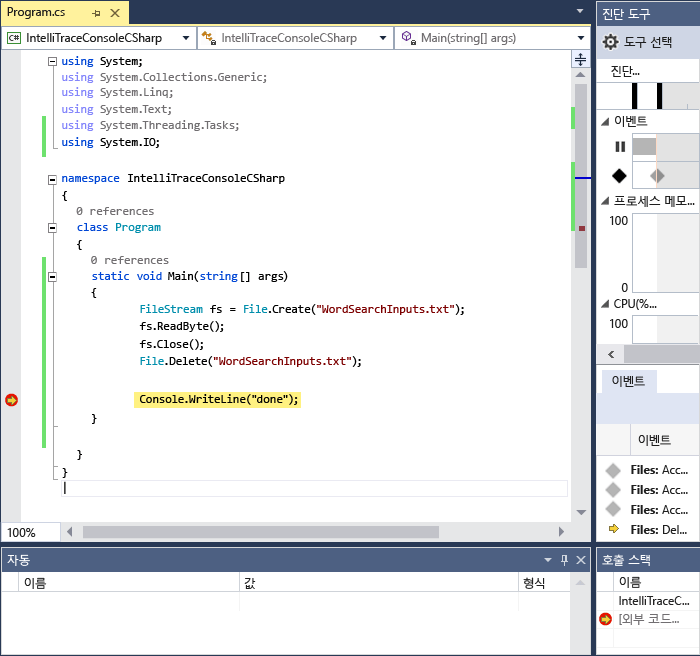
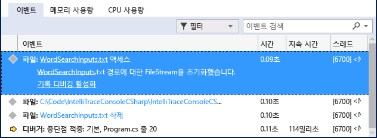
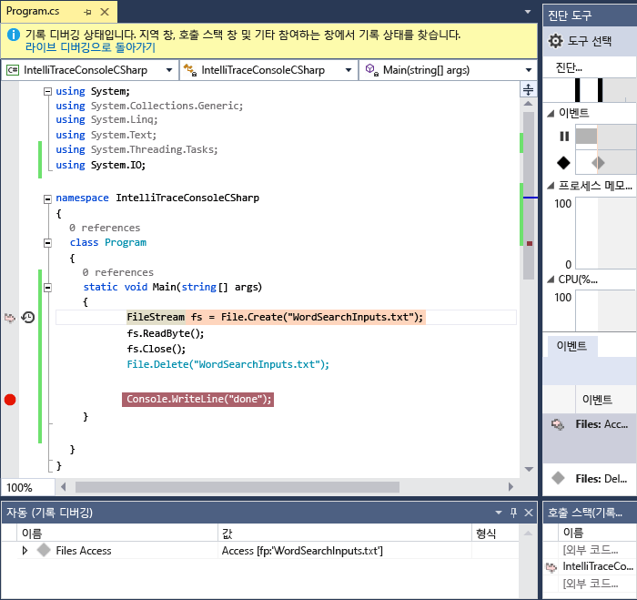

# <a name="view-events-with-intellitrace-in-visual-studio"></a>Visual Studio에서 IntelliTrace로 이벤트 보기
IntelliTrace를 사용하여 특정 이벤트 또는 이벤트 범주나 이벤트 외에 개별 함수 호출에 대한 정보를 수집할 수 있습니다. 다음 절차에서는 이 작업을 수행하는 방법을 보여 줍니다.  
  
 Visual Studio Enterprise edition, Professional 또는 Community edition 아님에서 IntelliTrace를 사용할 수 있습니다.  
  
##  <a name="GettingStarted"></a> Intellitrace를 구성 합니다.  
 IntelliTrace 이벤트로만 디버그를 시도할 수 있습니다. IntelliTrace 이벤트에는 디버거 이벤트, 예외, .NET Framework 이벤트 및 기타 시스템 이벤트가 있습니다. 특정 이벤트를 켜거나 꺼서 디버깅을 시작하기 전에 IntelliTrace에서 기록하는 이벤트를 제어할 수 있습니다. 자세한 내용은 참조 [IntelliTrace 기능](../debugger/intellitrace-features.md)합니다.  
  
 - 파일 액세스에 대한 IntelliTrace 이벤트 켜기 이동 하는 **도구 > 옵션 > IntelliTrace > IntelliTrace 이벤트** 페이지 및 확장 하 고는 **파일** 범주입니다. **파일** 이벤트 범주를 확인합니다. 이렇게 하면 모든 파일 이벤트(액세스, 닫기, 삭제)가 확인됩니다.

## <a name="create-your-app"></a>앱 만들기
  
1.  C# 콘솔 응용 프로그램을 만듭니다. Program.cs 파일에서 다음 `using` 문을 추가합니다.  
  
    ```csharp  
    using System.IO;  
    ```  
  
2.  Main 메서드에서 <xref:System.IO.FileStream> 을 만들고 여기에서 읽고 닫고 파일을 삭제합니다. 다른 줄을 추가하여 중단점을 설정할 위치 지정합니다.  
  
    ```csharp  
    static void Main(string[] args)  
    {  
        FileStream fs = File.Create("WordSearchInputs.txt");  
        fs.ReadByte();  
        fs.Close();  
        File.Delete("WordSearchInputs.txt");  
  
        Console.WriteLine("done");  
    }  
    ```  
  
3.  `Console.WriteLine("done");`  

## <a name="start-debugging-and-view-intellitrace-events"></a>디버깅을 시작 하 고 IntelliTrace 이벤트를 표시
  
1.  일반적인 방법으로 디버깅을 시작합니다. (키를 눌러 **F5** 키를 누르거나 **디버그 > 디버깅 시작**합니다.  
  
    > [!TIP]
    >  유지 된 **지역** 및 **자동** 창 확인 하는 값을 해당 창에 기록 디버깅 하는 동안 열어 합니다.  
  
2.  중단점에서 실행이 중지됩니다. 표시 되지 않으면는 **진단 도구** 창 클릭 **디버그 > Windows > IntelliTrace 이벤트**합니다.  
  
     **진단 도구** 창에서 **이벤트** 탭을 찾으세요( **이벤트**, **메모리 사용량**및 **CPU 사용량**, 이렇게 3개의 탭이 표시되어야 함). **이벤트** 탭에는 디버거 실행이 중단되기 전에 마지막 이벤트로 끝나는 시간 순 이벤트 목록이 표시됩니다. **WordSearchInputs.txt 액세스**라는 이벤트가 표시되어야 합니다.  
  
     다음 스크린샷은 Visual Studio 2015 업데이트 1에서 시작됩니다.  
  
       
  
3.  이벤트를 선택하여 해당 세부 정보를 확장합니다.  
  
     다음 스크린샷은 Visual Studio 2015 업데이트 1에서 시작됩니다.  
  
       
  
     경로 이름 링크를 선택하여 파일을 열 수 있습니다. 전체 경로 이름을 사용할 수 없는 경우에는 **파일 열기** 대화 상자가 나타납니다.  
  
     클릭 **기록 디버깅 활성화**를 설정 하는 디버거의 컨텍스트 선택한 이벤트 된 시간을 보여 주는 기록 데이터를 수집된,는 **호출 스택**, **지역** 및 기타 참여 디버거 창. 소스 코드를 사용할 수 있는 경우 Visual Studio가 소스 창에서 포인터를 해당 코드로 이동하여 검사할 수 있게 합니다.  
  
     다음 스크린샷은 Visual Studio 2015 업데이트 1에서 시작됩니다.  
  
       
  
4.  버그를 찾지 못한 경우 버그를 발생시키는 기타 이벤트를 검사합니다. 함수 호출을 단계별로 실행할 수 있도록 IntelliTrace에서 호출 정보를 기록하게 할 수도 있습니다. 
  
## <a name="next-steps"></a>다음 단계

기록 디버깅으로 IntelliTrace의 고급 기능 중 일부를 사용할 수 있습니다.

 - 스냅숏을 보려면를 참조 하세요. [IntelliTrace 단계 백을 사용 하 여 스냅숏 보기](../debugger/how-to-use-intellitrace-step-back.md)
 - 참조 변수를 검사 하 고 코드를 탐색 하는 방법에 자세한 [기록 디버깅을 사용 하 여 앱을 검사 합니다.](../debugger/historical-debugging-inspect-app.md)