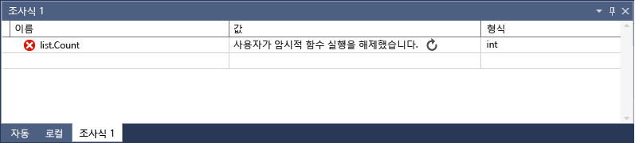

# 조사식 및 간략한 조사식 창
[!INCLUDE[vs2017banner](../code-quality/includes/vs2017banner.md)]

**조사식**\(**디버그 \/ Windows \/ 조사식 \/ 조사식\(1, 2, 3, 4\)**\) 및 **간략한 조사식**\(**디버그 \/ 간략한 조사식**\) 창을 사용하여 디버깅 세션 중 변수와 식을 조사할 수 있습니다. 차이점은 **조사식** 창에는 여러 변수가 표시될 수 있는 반면 **간략한 조사식** 창에는 한 번에 하나의 변수가 표시된다는 것입니다.  
  
## 간략한 조사식을 사용하여 단일 변수 관찰  
 **간략한 조사식** 창을 사용하여 단일 변수를 관찰할 수 있습니다. 예를 들어 다음과 같은 코드를 가정해 봅니다.  
  
```c#  
static void Main(string[] args) { int a, b; a = 1; b = 2; for (int i = 0; i < 10; i++) { a = a + b; } }  
```  
  
 간략한 조사식 창에서 다음과 같이 변수를 관찰할 수 있습니다.  
  
1.  `a = a + b;` 줄에 중단점을 설정합니다.  
  
2.  디버깅을 시작합니다. 중단점에서 실행이 중지됩니다.  
  
3.  **간략한 조사식** 창을 엽니다\(a를 마우스 오른쪽 단추로 클릭하고 **디버그 \/ 간략한 조사식** 또는 **Shift\+F9** 선택\). 창을 열고 **식** 창에 변수를 추가한 다음 **다시 평가**를 클릭할 수 있습니다.**값** 창에 값이 2인 변수가 표시됩니다.  
  
4.  **간략한 조사식** 창은 모달 대화 상자 창이므로 열려 있는 한 디버깅을 계속할 수 없습니다.**조사식 추가**를 클릭하여 **조사식** 창에 변수를 추가할 수 있습니다.  
  
5.  **간략한 조사식** 창을 닫습니다. 이제 **조사식** 창에서 값을 관찰하는 동안 디버깅을 계속할 수 있습니다.  
  
## 조사식 창을 사용하여 변수 관찰  
 **조사식** 창을 사용하여 여러 변수를 관찰할 수 있습니다. 예를 들어 다음과 같은 코드를 가정해 봅니다.  
  
```c#  
static void Main(string[] args) { int a, b, c; a = 1; b = 2; c = 0; for (int i = 0; i < 10; i++) { a++; b *= 2; c = a + b; } }  
  
```  
  
 다음과 같이 조사식 창에 3개의 변수 값을 추가합니다.  
  
1.  `c = a + b;` 줄에 중단점을 설정합니다.  
  
2.  디버깅을 시작합니다\(**F5**\). 중단점에서 실행이 중지됩니다.  
  
3.  조사식 창을 엽니다\(**디버그 \/ Windows \/ 조사식 \/ 조사식 1** 또는 **Ctrl\+Alt\+W, 1**\).  
  
4.  첫 번째 행에 `a` 변수를 추가하고, 두 번째 행에 `b` 변수를 추가하고, 세 번째 행에 `c` 변수를 추가합니다.  
  
5.  디버깅을 계속합니다.  
  
 `for` 루프를 반복하면 변수 값이 변경됩니다.  
  
 네이티브 코드로 프로그래밍할 때 변수 이름 또는 변수 이름이 들어 있는 식의 컨텍스트를 한정해야 하는 경우가 있습니다. 컨텍스트는 변수가 있는 함수, 소스 파일 및 모듈입니다. 컨텍스트를 한정해야 할 경우 컨텍스트 연산자 구문을 사용할 수 있습니다. 자세한 내용은 C\+\+의 식을 참조하세요.  
  
## 조사식 창을 사용하여 식 관찰  
 이제 대신 식을 사용하여 살펴보겠습니다. 디버거에서 인식할 수 있는 올바른 모든 식을 추가할 수 있습니다.  
  
 예를 들어 이전 섹션에 나열된 코드가 있는 경우 다음과 같이 세 가지 값의 평균을 구할 수 있습니다.  
  
   
  
 일반적으로 **조사식** 창에서 식을 계산하는 규칙은 코딩 언어에서 식을 계산하는 규칙과 동일합니다. 식에 구문 오류가 있으면 코드 편집기에 표시되는 것과 동일한 컴파일러 오류를 예상할 수 있습니다. 예를 들면 다음과 같습니다.  
  
   
  
##  <a name="bkmk_refreshWatch"></a> 만료된 조사식 값 새로 고침  
 특정 상황에서는 **조사식** 창에서 식을 계산할 때 새로 고침 아이콘\(두 화살표가 있는 원 또는 두 물결선이 있는 원\)이 표시될 수도 있습니다.  예를 들어 속성 확인이 꺼져 있고\(**도구 \/ 옵션 \/ 디버깅 \/ 속성 확인 및 기타 암시적 함수 호출 사용**\) 다음 코드가 있는 경우입니다.  
  
```c#  
static void Main(string[] args) { List<string> list = new List<string>(); list.Add("hello"); list.Add("goodbye"); }  
  
```  
  
 목록의 `Count` 속성에 조사식을 설정하는 경우 다음과 같은 내용이 표시되어야 합니다.  
  
   
  
 이는 오류 또는 오래된 값을 나타냅니다. 일반적으로 아이콘을 클릭하면 값을 새로 고칠 수 있지만 새로 고치지 않으려는 경우도 있습니다. 먼저 값이 계산되지 않은 이유를 알아야 합니다.  
  
 아이콘을 가리키면 도구 설명에 식이 계산되지 않은 이유에 대한 정보가 표시됩니다. 서로 반대 방향으로 도는 두 화살표가 나타나면 다음 이유 중 하나로 인해 식이 계산되지 않은 것입니다.  
  
-   •	식 계산 중에 오류가 발생했습니다. 예를 들어 시간 초과가 발생했거나 변수가 범위를 벗어났습니다.  
  
-   •	응용 프로그램에서 부작용을 트리거할 수 있는 함수 호출이 식에 포함되어 있습니다\([부작용과 식](#bkmk_sideEffects) 참조\).  
  
-   디버거에 의한 속성 및 암시적 함수 호출의 자동 확인이 꺼져 있으면\(**도구 \/ 옵션 \/ 디버깅 \/ 속성 확인 및 기타 암시적 함수 호출 사용**\) 식을 자동으로 계산할 수 없습니다.  
  
 값을 새로 고치려면 새로 고침 아이콘을 클릭하거나 스페이스바를 누릅니다. 디버거가 식을 다시 계산합니다. 속성 자동 확인 및 암시적 부작용이 해제되었기 때문에 새로 고침 아이콘이 나타난 경우 식을 계산할 수 있습니다.  
  
 실과 유사한 두 개의 물결선이 있는 원 아이콘이 나타나면 잠재적 크로스 스레드 종속성으로 인해 식이 계산되지 않은 것입니다. 즉, 코드를 확인할 때 응용 프로그램의 다른 스레드를 임시로 실행해야 함을 의미합니다. 중단 모드에서는 일반적으로 응용 프로그램의 모든 스레드가 중지됩니다. 다른 스레드를 임시로 실행할 수 있게 하면 프로그램 상태에 예기치 않은 영향이 있을 수 있으며 디버거가 중단점 및 해당 스레드에서 발생한 예외와 같은 이벤트를 무시하게 됩니다.  
  
##  <a name="bkmk_sideEffects"></a> 부작용과 식  
 일부 경우에는 식을 계산하면 변수 값이 바뀌거나 프로그램 상태에 영향이 미칠 수 있습니다. 예를 들어 다음 식을 계산하면 `var1`의 값이 변경됩니다.  
  
```  
var1 = var2  
```  
  
 이를 [부작용](https://en.wikipedia.org/wiki/Side_effect_\(computer_science\))이라고 합니다. 부작용은 프로그램의 작동 방식을 변경하여 디버깅을 더 어렵게 만들 수 있습니다.  
  
 부작용이 있는 것으로 알려진 식은 처음 입력할 때 한 번만 계산됩니다. 다음 계산은 수행되지 않습니다. 값 옆에 표시되는 업데이트 아이콘을 클릭하면 이 동작을 직접 재정의할 수 있습니다.  
  
 모든 부작용을 방지하는 한 가지 방법은 자동 함수 계산을 끄는 것입니다\(**도구 \/ 옵션 \/ 디버깅 \/ 속성 확인 및 기타 암시적 함수 호출 사용**\).  
  
 암시적 함수 호출이나 속성의 계산을 해제한 경우 **ac** 형식 한정자를 사용하여 계산을 수행하게 할 수 있습니다\(C\#에만 해당\).[C\#의 형식 지정자](../debugger/format-specifiers-in-csharp.md)를 참조하세요.  
  
## 조사식 창에서 개체 ID 사용\(C\# 및 Visual Basic\)  
 특정 개체의 동작을 관찰하려는 경우가 있습니다. 예를 들어 변수가 범위를 벗어난 후 지역 변수에 의해 참조된 개체를 추적할 수 있습니다. C\# 및 Visual Basic에서 참조 형식의 특정 인스턴스에 대한 개체 ID를 만들고 조사식 창 및 중단점 조건에서 사용할 수 있습니다. 개체 ID는 CLR\(공용 언어 런타임\) 디버깅 서비스에 의해 생성되고 개체와 연결됩니다.  
  
> [!NOTE]
>  개체 ID는 약한 참조를 만들고 개체가 가비지 수집되지 않도록 차단하지 않습니다. 현재 디버깅 세션에 대해서만 유효합니다.  
  
 다음 코드에서 한 메서드는 지역 변수를 사용하여 `Person`을 만들지만 다른 메서드에서 `Person`의 이름을 확인하려고 합니다.  
  
```c#  
class Person { public Person(string name) { Name = name; } public string Name { get; set; } } public class Program { List<Person> _people = new List<Person>(); public static void Main(string[] args) { MakePerson(); DoSomething(); } private static void MakePerson() { var p = new Person("Bob"); _people.Add(p); } private static void DoSomething() { // more processing Console.WriteLine("done"); } }  
  
```  
  
 **조사식** 창에서 해당 `Person` 개체에 대한 참조를 다음과 같이 추가할 수 있습니다.  
  
1.  개체를 만들고 일정 시간 후에 코드에서 중단점을 설정합니다.  
  
2.  디버깅을 시작하고, 실행이 중단점에서 중지되면 **지역** 창에서 변수를 찾아 마우스 오른쪽 단추로 클릭한 다음 **개체 ID 만들기**를 선택합니다.  
  
3.  **지역** 창에 **$** 더하기 숫자가 표시됩니다. 이는 개체 ID입니다.  
  
4.  조사식 창에 개체 ID를 추가합니다.  
  
5.  개체의 동작을 관찰하려는 중단점을 설정합니다.  위의 코드에서는 `DoSomething()` 메서드에 있습니다.  
  
6.  디버깅을 계속하고, `DoSomething()` 메서드에서 실행에서 중지되면 **조사식** 창에 `Person` 개체가 표시됩니다.  
  
> [!NOTE]
>  위의 예제에서 `Person.Name`과 같은 개체의 속성을 보려는 경우 속성 확인을 사용하도록 설정해야 합니다.  
  
## 조사식 창에서 레지스터 사용\(C\+\+에만 해당\)  
 네이티브 코드를 디버그하는 경우 **$\<레지스터 이름\>** 또는 **@\<레지스터 이름\>**을 사용하여 변수 이름뿐 아니라 레지스터 이름도 추가할 수 있습니다.  자세한 내용은 [의사 변수](../debugger/pseudovariables.md)를 참조하세요.  
  
## DynamicView 및 조사식 창  
 일부 스크립팅 언어\(예: JavaScript 또는 Python\)는 동적 또는 [덕 형식 지정](https://en.wikipedia.org/wiki/Duck_typing)을 사용하며 .NET 언어\(4.0 이상 버전\)는 표시할 수 없는 런타임 속성 및 메서드가 있기 때문에 일반 디버깅 창을 사용하여 관찰하기 어려운 개체를 지원합니다.  
  
 조사식 창에 a 또는 [IDynamicMetaObjectProvider 인터페이스](../Topic/IDynamicMetaObjectProvider%20Interface.md)를 구현하는 형식에서 만들어진 개체가 표시되면 디버거가 **자동** 표시에 특수한 **동적 뷰** 노드를 추가합니다. 이 노드에서는 동적 개체의 동적 멤버가 표시되지만 멤버의 값을 편집할 수 없습니다.  
  
 **동적 뷰**의 자식을 마우스 오른쪽 단추로 클릭하고 **조사식 추가**를 선택하면 디버거가 개체를 동적 개체로 캐스팅하는 새로운 조사식 변수를 삽입합니다. 즉, **개체 이름**이 \(**\(동적\)개체\).이름**이 됩니다.  
  
 **동적 뷰**의 멤버 평가에 부작용이 있을 수 있습니다. 부작용에 대한 설명은 [부작용과 식](#bkmk_sideEffects)을 참조하세요. C\#의 경우 새 코드 줄을 단계별로 실행할 때 디버거에서 **동적 뷰**에 표시된 값을 자동으로 다시 평가하지 않습니다. Visual Basic의 경우 **동적 뷰**를 통해 추가된 식이 자동으로 새로 고쳐집니다.  
  
 동적 뷰 값을 새로 고치는 방법에 대한 지침은 [만료된 조사식 값 새로 고침](#bkmk_refreshWatch)을 참조하세요.  
  
 개체에 대한 **동적 뷰**만 표시하려는 경우 **동적** 형식 지정자를 사용할 수 있습니다.  
  
-   C\#: **ObjectName, dynamic**  
  
-   Visual Basic: **$dynamic, ObjectName**  
  
 **동적 뷰**는 COM 개체에 대한 디버깅 환경도 향상시킵니다. 디버거가 **System.\_\_ComObject**에 래핑된 COM 개체를 발견하면 개체에 대한 **동적 뷰** 노드를 추가합니다.  
  
## 참고 항목  
 [디버거 창](../debugger/debugger-windows.md)