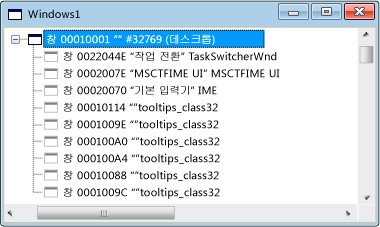

# Windows View
[!INCLUDE[vs2017banner](../code-quality/includes/vs2017banner.md)]

Spy\+\+를 처음 열면 시스템에 있는 모든 창과 컨트롤의 트리가 창 뷰에 표시되고  창 핸들과 클래스 이름도 표시됩니다.  현재 데스크톱 창은 트리의 맨 위에 표시됩니다.  다른 모든 창은 데스크톱의 자식이며 표준 창 계층 구조에 따라 표시됩니다.  형제 창은 해당 부모의 아래에서 들여쓰기가 적용된 확장 가능한 목록으로 표시됩니다.  
  
 아래 그림에서는 최상위 노드가 확장된 일반적인 Spy\+\+ 창 뷰를 보여 줍니다.  
  
   
\+Spy\+\+ 창 뷰  
  
 현재 데스크톱 창은 트리의 맨 위에 표시됩니다.  다른 모든 창은 데스크톱의 자식이며 표준 창 계층 구조에 따라 표시됩니다. 형제 창은 Z 순서로 정렬됩니다.  노드 옆에 있는 \+ 또는 \- 기호를 클릭하여 트리의 부모 노드를 확장하거나 축소할 수 있습니다.  
  
 창 뷰에 포커스가 있으면 [창 경로 대화 상자](../debugger/window-search-dialog-box.md)의 찾기 도구를 사용하여 시스템에 열려 있는 모든 창의 내용을 표시할 수 있습니다.  
  
## 단원 내용  
 [How to: Use the Finder Tool](../debugger/how-to-use-the-finder-tool.md)  
 이 도구로 창에서 속성이나 메시지를 검색하는 방법을 보여 줍니다.  
  
 [How to: Search for a Window in Windows View](../debugger/how-to-search-for-a-window-in-windows-view.md)  
 창 뷰에서 특정 창을 찾는 방법에 대해 설명합니다.  
  
 [How to: Display Window Properties](../debugger/how-to-display-window-properties.md)  
 창 속성 대화 상자를 여는 절차에 대해 설명합니다.  
  
## 관련 단원  
 [Spy\+\+ Views](../debugger/spy-increment-views.md)  
 창, 메시지, 프로세스 및 스레드의 Spy\+\+ 트리 뷰에 대해 설명합니다.  
  
 [Using Spy\+\+](../debugger/using-spy-increment.md)  
 Spy\+\+ 도구를 소개하고 사용 방법에 대해 설명합니다.  
  
 [창 찾기 대화 상자](../debugger/find-window-dialog-box.md)  
 특정 창에서 속성이나 메시지를 표시하는 데 사용됩니다.  
  
 [창 경로 대화 상자](../debugger/window-search-dialog-box.md)  
 창 뷰에서 특정 창의 노드를 찾는 데 사용됩니다.  
  
 [창 속성 대화 상자](../debugger/window-properties-dialog-box.md)  
 창 뷰에서 선택한 창의 속성을 표시하는 데 사용됩니다.  
  
 [Spy\+\+ Reference](../debugger/spy-increment-reference.md)  
 각 Spy\+\+ 메뉴 및 대화 상자에 대해 설명하는 단원이 포함되어 있습니다.