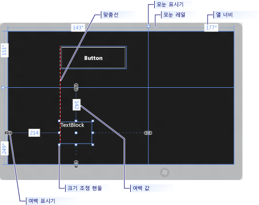
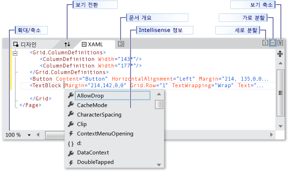
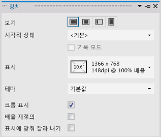
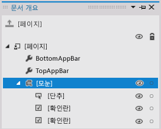
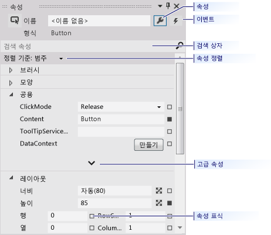

# Visual Studio에서 XAML 디자이너를 사용하여 UI 만들기
[!INCLUDE[vs2017banner](../code-quality/includes/vs2017banner.md)]

Visual Studio의 XAML 디자이너는 XAML 기반 Windows 스토어, Windows Phone, WPF 및 Silverlight 앱을 디자인하는 데 도움이 되는 그래픽 인터페이스를 제공합니다.**도구 상자**에서 컨트롤을 끌고 **속성** 창에서 속성을 설정하여 앱에 대한 사용자 인터페이스를 만들 수 있습니다. XAML 뷰에서 직접 XAML을 편집할 수도 있습니다.  
  
 애니메이션 및 동작과 같은 고급 XAML 디자인 작업에 대해서는 [Blend for Visual Studio를 사용하여 UI 만들기](../designers/creating-a-ui-by-using-blend-for-visual-studio.md)를 참조하세요.  
  
## XAML 디자이너 작업 영역  
 XAML 디자이너의 작업 영역은 몇 가지 그래픽 인터페이스 요소로 구성됩니다. 여기에는 아트보드, XAML 편집기, 장치 창, 문서 개요 창 및 속성 창이 포함됩니다. XAML 디자이너를 열려면 **솔루션 탐색기**에서 XAML 파일을 마우스 오른쪽 단추로 클릭하고 **뷰 디자이너**를 선택합니다.  
  
## 뷰 작성  
 XAML 디자이너는 앱의 렌더링된 XAML 태그에 대한 XAML 뷰 및 동기화된 디자인 뷰를 제공합니다. Visual Studio에서 XAML 파일을 연 상태에서, **디자인** 및 **XAML** 탭을 사용하여 디자인 뷰와 XAML 뷰 사이에서 전환할 수 있습니다.**창 바꾸기** 단추를 사용하여 아트보드 또는 XAML 편집기 중 하나의 맨 위에 나타나는 창을 전환할 수 있습니다.  
  
 디자인 뷰에서 *아트 보드* 포함하는 창이 활성 창이고 이를 기본 작업 화면으로 사용할 수 있습니다. 이 창에서 요소를 추가하거나 그린 다음 수정하여 앱에서 페이지를 시각적으로 디자인할 수 있습니다. 자세한 내용은 [XAML Designer에서의 요소 작업](../designers/working-with-elements-in-xaml-designer.md)을 참조하세요. 이 그림은 디자인 뷰에서 아트보드를 보여 줍니다.  
  
   
  
 이러한 기능은 아트보드에서 사용할 수 있습니다.  
  
 **맞춤선**  
 맞춤선은 빨간색 파선 선으로 표시되는 *맞춤 경계선*으로, 컨트롤의 가장자리가 맞춰진 경우나 텍스트 기준선이 맞춰진 경우를 나타냅니다.**맞춤선에 맞추기**를 사용하도록 설정한 경우에만 맞춤 경계선이 나타납니다.  
  
 **모눈 레일**  
 `Grid` 레일은 [모눈](http://msdn.microsoft.com/library/windows/apps/windows.ui.xaml.controls.grid.aspx) 패널의 행과 열을 관리하는 데 사용됩니다. 행과 열을 만들고 삭제하며, 상대적인 너비와 높이를 조정할 수 있습니다. 아트보드의 왼쪽에 나타나는 세로 모눈 레일은행에 사용되고 맨 위에 나타나는 가로줄은 열에 사용됩니다.  
  
 **모눈 표시기**  
 `Grid` 표시기는 `Grid` 레일에 세로 또는 가로 줄이 연결된 삼각형으로 나타납니다.`Grid` 표시기를 끌면 마우스를 이동할 때 인접한 열이나 행의 너비 또는 높이가 그에 따라 업데이트됩니다.  
  
 `Grid` 표시기는 `Grid`의 행 및 열에 대한 높이 및 너비를 제어하는 데 사용됩니다.`Grid` 레일에서 클릭하여 새 열 또는 행을 추가할 수 있습니다. 두 개 이상의 열 또는 행이 포함된 `Grid` 패널에 대한 새로운 행 또는 열 줄을 추가하는 경우 미니 도구 모음이 레일 외부에 나타나며, 이 도구 모음에서 너비와 높이를 명시적으로 설정할 수 있습니다. 미니 도구 모음을 사용하면 `Grid` 행 및 열에 대한 크기 조정 옵션을 설정할 수 있습니다.  
  
 **크기 조정 핸들**  
 크기 조정 핸들이 선택된 컨트롤에 나타나며 이 핸들을 사용하여 컨트롤의 크기를 조정할 수 있습니다. 컨트롤의 크기를 조정하면 너비 및 높이 값이 나타나므로 컨트롤의 크기를 조정하는 데 도움이 됩니다. 디자인 뷰에서 컨트롤을 조작하는 방법에 대한 자세한 내용은 [XAML Designer에서의 요소 작업](../designers/working-with-elements-in-xaml-designer.md)을 참조하십시오.  
  
 **여백**  
 여백은 컨트롤 가장자리와 해당 컨테이너 가장자리 사이의 고정된 공간 크기를 나타냅니다. 속성 창의 **레이아웃** 아래에 있는 [여백](http://msdn.microsoft.com/library/windows/apps/windows.ui.xaml.frameworkelement.margin.aspx) 속성을 사용하여 컨트롤의 여백을 설정할 수 있습니다.  
  
 **여백 표시기**  
 여백 표시기를 사용하여 레이아웃 컨테이너를 기준으로 요소의 여백을 변경할 수 있습니다. 여백 표시기가 열려 있으면 여백이 설정되지 않고 여백 표시기에서 끊어진 체인을 표시합니다. 여백을 설정 하지 않으면 런타임에 레이아웃 컨테이너 크기를 조정할 때 요소가 제자리에 유지됩니다. 여백 표시기가 닫힌 경우 여백 표시기는 끊어지지 않은 체인을 표시하고 런타임에 레이아웃 컨테이너의 크기가 조정될 때 요소도 여백과 함께 이동됩니다\(여백은 고정됨\).  
  
 **요소 핸들**  
 요소 주위의 파란색 상자 모퉁이 위로 포인터를 이동하면 아트보드에 표시되는 요소 핸들을 사용하여 요소를 수정할 수 있습니다. 이러한 핸들을 사용하면 회전, 크기 조정, 대칭 이동 또는 이동 작업을 수행하거나 요소에 모퉁이 반경을 추가할 수 있습니다. 요소 핸들의 기호는 함수 별로 다르며 포인터의 정확한 위치에 따라 변경됩니다. 요소 핸들이 보이지 않으면 요소를 선택했는지 확인합니다.  
  
 디자인 뷰에서 다음과 같이 화면의 왼쪽 아래 영역에서 추가 아트보드 명령을 사용할 수 있습니다.  
  
   
  
 이러한 명령은 이 도구 모음에서 사용할 수 있습니다.  
  
 **확대\/축소**  
 확대\/축소를 사용하면 디자인 화면의 크기를 조정할 수 있습니다. 12.5%부터 800%까지 확대\/축소하거나 **선택 영역에 맞춤** 및 **모두에 맞춤**과 같은 옵션을 선택할 수 있습니다.  
  
 **맞춤 모눈 숨기기**  
 눈금선을 표시하는 맞춤 모눈을 표시하거나 숨깁니다.**모눈선에 맞추기** 또는 **맞춤선에 맞추기**를 사용할 때 눈금선이 사용됩니다.  
  
 **모눈선에 맞추기 켜기\/끄기**  
 아트보드에서 개체를 끌 때 **모눈선에 맞추기**가 사용되면 요소가 가장 가까운 세로 눈금선이나 가로 눈금선에 맞춰집니다.  
  
 **맞춤선에 맞추기 켜기\/끄기**  
 맞춤선을 사용하면 서로를 기준으로 컨트롤을 맞출 수 있습니다.**맞춤선에 맞추기**를 사용하는 경우 다른 컨트롤을 기준으로 컨트롤을 끌면 가장자리와 일부 컨트롤의 텍스트가 가로 또는 세로로 정렬될 때 맞춤 경계선이 나타납니다. 맞춤 경계선은 빨간색 파선으로 나타납니다.  
  
 XAML 뷰에서 XAML 편집기가 포함된 창이 활성 창이며 XAML 편집기는 기본 제작 도구입니다. XAML\(Extensible Application Markup Language\)은 응용 프로그램의 사용자 인터페이스를 지정하는 데 사용할 수 있는 선언적인 XML 기반 어휘를 제공합니다. XAML 뷰에는 IntelliSense, 자동 서식 지정, 구문 강조 표시 및 태그 탐색이 포함됩니다. 이 그림에서는 XAML 뷰를 보여 줍니다.  
  
   
  
 **분할 뷰 구분선**  
 XAML 편집기가 아래쪽 창에 있을 때 분할 뷰 구분선이 XAML 뷰의 맨 위에 나타납니다. 분할 뷰 구분선을 사용하여 디자인 뷰 및 XAML 뷰의 상대적 크기를 제어할 수 있습니다. 뷰의 위치를 바꾸고\(**창 바꾸기** 단추 사용\), 뷰를 가로 또는 세로로 정렬할지 여부를 지정하고, 뷰 중 하나를 축소할 수 있습니다.  
  
 **태그 확대\/축소**  
 태그 확대\/축소를 사용하여 XAML 뷰의 크기를 조정할 수 있습니다. 20%부터 400%까지 확대\/축소할 수 있습니다.  
  
## 장치 창  
 XAML 디자이너의 장치 창에서 다양한 디자인 타임 뷰와 디스플레이, Windows 스토어 또는 Windows Phone 프로젝트에 대한 표시 옵션으로 시뮬레이트할 수 있습니다. 장치 창은  XAML 디자이너에서 작업할 때 **디자인** 메뉴에서 사용할 수 있습니다. 다음과 같이 나타납니다.  
  
   
  
 다음은 장치 창에서 사용할 수 있는 옵션입니다.  
  
 **표시**  
 앱의 다른 디스플레이 크기 및 해상도를 미리 봅니다.  
  
 **방향**  
 앱의 다른 방향 즉, **가로** 또는 **세로**를 지정합니다.  
  
 **Microsoft Edge**  
 앱의 다른 가장자리 맞춤 즉, **모두**, **왼쪽**, **오른쪽** 또는 **없음**을 지정합니다.  
  
 **고대비**  
 선택한 대비 설정에 따라 앱을 미리 봅니다. 이 설정은 **기본값** 이외의 값으로 설정된 경우 App.xaml에 설정된 `RequestedTheme` 속성을 재정의합니다.  
  
 **배율 재정의**  
 디자인 화면 내에서 문서 배율의 에뮬레이션을 켜고 끕니다. 이 기능으로 배율을 1씩 늘릴 수 있습니다. 에뮬레이션을 켜려면 확인란을 선택합니다. 예를 들어 배율이 100%인 경우 디자인 화면 내의 문서는 140%까지 크기 조정됩니다. 현재 배율이 180인 경우에는 이 옵션은 사용할 수 없습니다.  
  
 **최소 너비**  
 최소 너비 설정을 지정합니다. 최소 너비는 App.xaml 파일에서 변경할 수 있습니다.  
  
 **테마**  
 앱 테마를 지정합니다. 예를 들어 진한 테마와 밝은 테마 간에 전환할 수 있습니다.  
  
 **크롬 표시**  
 디자인 뷰에서 앱 주위의 시뮬레이트된 태블릿 프레임을 켜고 끕니다. 프레임을 표시하려면 이 확인란을 선택합니다.  
  
 **표시에 맞춰 잘라내기**  
 디스플레이 모드를 지정합니다. 디스플레이 크기에 맞춰 문서 크기를 잘라 내려면 확인란을 선택합니다.  
  
## 문서 개요 창  
 XAML 디자이너의 문서 개요 창은 이러한 작업을 수행하는 데 도움이 됩니다.  
  
-   아트보드의 모든 요소에 대한 계층 구조를 표시합니다.  
  
-   요소를 수정\(계층 구조에서 이동, 아트보드에서 수정, 속성 창에서 속성 설정 등\)할 수 있도록 선택합니다. 자세한 내용은 [XAML Designer에서의 요소 작업](../designers/working-with-elements-in-xaml-designer.md)을 참조하십시오.  
  
-   컨트롤인 요소의 템플릿을 만들고 수정합니다.  
  
-   선택한 요소에 대한 상황에 맞는 메뉴를 사용합니다. 아트보드에서 선택한 요소에 대해서도 동일한 메뉴를 사용할 수 있습니다.  
  
 문서 개요 창을 보려면 메뉴 모음에서 **보기**, **다른 창**, **문서 개요**를 선택합니다.  
  
   
  
 다음은 문서 개요 창에서 사용할 수 있는 옵션입니다.  
  
 **문서 개요**  
 문서 개요 창의 주 보기에는 트리 구조의 문서 계층 구조가 표시됩니다. 문서 개요의 계층적 특성을 사용하여 다양한 수준의 세부 정보에서 문서를 검사하고 단독으로 또는 그룹으로 요소를 잠그고 숨길 수 있습니다.  
  
 **표시\/숨기기**  
 문서 개요의 항목에 해당하는 아트보드 요소를 표시하거나 숨깁니다. 표시되면 눈 기호가 나타나는 **표시\/숨기기** 단추를 사용합니다. 또는 요소를 숨기려면 Ctrl\+H를 누르고, 요소를 표시하려면 Shift\+Ctrl\+H를 누릅니다.  
  
 **잠금\/잠금해제**  
 문서 개요의 항목에 해당하는 아트보드 요소를 잠그거나 잠금 해제합니다. 잠긴 요소는 수정할 수 없습니다. 잠기면 자물쇠가 나타나는 **잠금\/잠금해제** 단추를 사용합니다. 또는 요소를 잠그려면 Ctrl\+L을 누르고, 잠금 해제하려면 Shift\+Ctrl\+L을 누릅니다.  
  
 **범위를 pageRoot로 되돌립니다.**  
 문서 개요 창의 위쪽에 있는 옵션은 위쪽 화살표 기호를 표시하며 문서 개요를 이전 범위로 반환합니다. 범위 상향 지정은 스타일이나 템플릿의 범위에 있을 경우에만 적용할 수 있습니다.  
  
## 속성 창  
 속성 창을 사용하면 컨트롤에 대한 속성 값을 설정할 수 있습니다. 다음과 같이 나타납니다.  
  
   
  
 속성 창의 위쪽에는 다양한 옵션이 있습니다.**이름** 상자를 사용하여 현재 선택된 요소의 이름을 변경할 수 있습니다. 왼쪽 위 모서리에 현재 선택한 요소를 나타내는 아이콘이 있습니다. 속성을 범주별로 또는 사전순으로 정렬하려면 **정렬 기준** 목록에서 **범주**, **이름** 또는 **소스**를 클릭합니다. 컨트롤에 대한 이벤트의 목록을 보려면 번개 기호를 표시하는 **이벤트** 단추를 클릭합니다. 속성을 검색하려면 먼저 **검색 속성** 상자에서 속성의 이름을 입력합니다. 속성 창에 입력할 때 검색 조건과 일치하는 속성이 표시됩니다. 일부 속성에서는 아래쪽 화살표 단추를 선택하여 고급 속성을 설정할 수 있습니다. 속성 사용 및 이벤트 처리에 대한 자세한 내용은 [빠른 시작: 컨트롤 추가 및 이벤트 처리](http://go.microsoft.com/fwlink/?LinkID=247983)를 참조하세요.  
  
 각 속성 값의 오른쪽에 상자 기호로 나타나는 *속성 표식*이 있습니다. 속성 표식의 모양은 속성에 적용되는 리소스 또는 데이터 바인딩이 있는지 여부를 나타냅니다. 예를 들어 흰색 상자 기호는 기본값을 나타내고, 검은색 상자 기호는 일반적으로 로컬 리소스가 적용되었음을 나타내고, 주황색 상자는 일반적으로 데이터 바인딩이 적용되었음을 나타냅니다. 속성 표식을 클릭하면 스타일의 정의로 이동하거나, 데이터 바인딩 작성기를 열거나, 리소스 선택기를 엽니다.  
  
## 참고 항목  
 [XAML Designer에서의 요소 작업](../designers/working-with-elements-in-xaml-designer.md)   
 [방법: 리소스 만들기 및 적용](../designers/how-to-create-and-apply-a-resource.md)   
 [연습: XAML 디자이너의 데이터 바인딩](../designers/walkthrough-binding-to-data-in-xaml-designer.md)