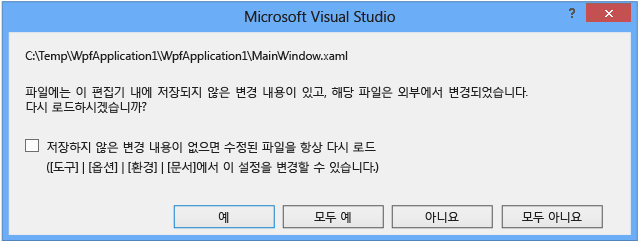

# Visual Studio에서 XAML 디자인

Visual Studio 및 Blend for Visual Studio는 다양한 앱 유형에 XAML을 사용하여 유용한 사용자 인터페이스 및 풍부한 미디어 환경을 빌드할 수 있게 해주는 시각적 도구를 제공합니다. 두 도구는 시각적 XAML 편집기를 비롯한 공통 기능 집합을 공유하지만 Blend for Visual Studio에서는 애니메이션 및 동작과 같은 고급 작업을 위한 추가 디자인 도구를 제공합니다.

앱을 디자인하는 과정은 선택한 도구 및 대상 플랫폼에 따라 달라집니다. 이 문서에서는 Visual Studio와 Blend for Visual Studio의 XAML 디자인 도구를 비교합니다. 도구를 사용하는 방법에 대한 자세한 연습은 다음 항목을 참조하세요.

- [Visual Studio에서 XAML 디자이너를 사용하여 UI 만들기](creating-a-ui-by-using-xaml-designer-in-visual-studio.md)
- [Blend for Visual Studio를 사용하여 UI 만들기](creating-a-ui-by-using-blend-for-visual-studio.md)

## 적합한 도구 선택

선택하는 디자인 도구는 대체로 사용자 역량에 따라 달라집니다. 코드를 지향하는 경우 Visual Studio에서 XAML 코드를 작성하여 고급 디자인 작업을 수행할 수 있습니다. 디자인을 지향하는 경우 Blend for Visual Studio를 사용하여 코드를 작성하지 않고 고급 작업을 수행할 수 있습니다.

Visual Studio와 Blend for Visual Studio 간에 전환할 수 있으며, 둘 다에서 같은 프로젝트를 동시에 열어 놓을 수도 있습니다. 한 IDE에서 XAML 파일을 변경한 후 다른 IDE로 전환할 때 자동 다시 로드를 통해 변경 내용을 적용할 수 있습니다. 두 IDE 중 하나에서 **도구**, **옵션** 대화 상자의 옵션을 통해 다시 로드 동작을 제어할 수 있습니다.

### 공유 기능

기본적인 작업의 경우 대부분 Visual Studio 및 Blend for Visual Studio용 IDE에서 약간의 차이점은 있지만 동일한 창과 기능 집합을 공유합니다. 중요 사항은 다음과 같습니다.

- **일관된 사용자 인터페이스:** 익숙한 Visual Studio 사용자 인터페이스 컨텍스트 내에서 응용 프로그램을 디자인하여 IDE 간 전환을 더 즐겁고 생산적인 경험으로 만들 수 있습니다. Blend for Visual Studio는 콘텐츠와 사용자 인터페이스 간의 대비를 향상시켜 디자인하는 콘텐츠에 집중할 수 있게 해주는 Visual Studio 어두운 테마를 사용합니다. [XAML 디자이너를 사용하여 UI 만들기](../designers/creating-a-ui-by-using-xaml-designer-in-visual-studio.md)를 참조하세요.

     

- **XAML IntelliSense:** 두 IDE는 모두 문 완성, 코드 주석 처리 및 형식 지정과 같은 일반적인 편집기 작업 지원, 리소스, 바인딩 및 코드 탐색을 포함하여 IntelliSense에서 기대하는 모든 일반적인 기능을 지원합니다.

- **기본 디버깅 기능:** 이제 코드에서 중단점을 설정하여 실행 중인 앱 디버그를 포함하여 Blend에서 디버그할 수 있습니다. Visual Studio와 일관된 디버깅 환경을 유지하기 위해 Blend for Visual Studio에는 Visual Studio의 디버깅 창과 도구 모음이 대부분 포함되어 있습니다. 진단 및 코드 분석과 같은 고급 디버깅 기능은 Visual Studio에서만 사용할 수 있습니다. [Debugging in Visual Studio](../debugger/debugging-in-visual-studio.md)을 참조하세요.

- **파일 다시 로드 환경:** Blend for Visual Studio 또는 Visual Studio 중 하나에서 XAML 파일을 편집한 후 다른 프로그램으로 전환할 때 편집된 파일이 자동으로 다시 로드되도록 할 수 있습니다. 워크플로 중단을 최소화하기 위해 이제 파일 다시 로드 대화 상자에서 파일 다시 로드 기본 설정을 지정할 수 있습니다.

     

- **동기화된 레이아웃 및 설정:** 사용자 지정 레이아웃을 통해 도구 창 레이아웃 사용자 지정을 저장하고 적용할 수 있습니다. 동일한 Microsoft 계정으로 로그인하면 Visual Studio에서 Visual Studio 및 Blend for Visual Studio 둘 다에 대한 이러한 사용자 지정과 기본 설정을 컴퓨터 간에 동기화합니다. [Visual Studio IDE 개인 설정](../ide/personalizing-the-visual-studio-ide.md)을 참조하세요.

- **공통 솔루션 탐색기:** 솔루션 탐색기를 통해 프로젝트 및 해당 파일을 구조적으로 보고 연결된 명령에 쉽게 액세스할 수 있습니다. 솔루션 탐색기를 사용하면 대규모 엔터프라이즈 프로젝트 작업이 훨씬 용이해집니다. [솔루션 및 프로젝트](../ide/solutions-and-projects-in-visual-studio.md)를 참조하세요.

- **팀 탐색기:** 팀 탐색기를 통해 GIT 또는 TFS 리포지토리로 프로젝트를 관리하면 팀 공동 작업에 도움이 됩니다. [팀 탐색기에서 작업](http://msdn.microsoft.com/Library/fd7a5cf7-7916-4fa0-b5e6-5a83cf377a02)을 참조하세요.

- **NuGet:** Visual Studio 및 Blend for Visual Studio 둘 다에서 NuGet 패키지를 관리할 수 있습니다. NuGet은 솔루션에서 패키지 설치 및 제거를 간소화하는 .NET Framework 패키지 관리자입니다.

## Blend for Visual Studio의 고급 기능

생산성을 향상시키려면 다음과 같은 작업에 Blend for Visual Studio를 사용하는 것이 좋습니다. 이러한 영역에 대해 Blend for Visual Studio는 Visual Studio 디자이너나 코드를 단독으로 사용할 때보다 빠른 속도와 더 많은 기능을 제공합니다.

|대상|Visual Studio|Blend for Visual Studio|추가 정보|
|--------|-------------------|-----------------------------|----------------------|
|**애니메이션 만들기**|애니메이션을 만들 수 있는 디자인 도구가 없습니다. 프로그래밍 방식으로 애니메이션을 만들어야 합니다. 따라서 WPF의 애니메이션, 타이밍 시스템 및 광범위한 코딩 전문 기술을 이해하고 있어야 합니다.|애니메이션을 시각적으로 만들고 Blend for Visual Studio에서 미리 볼 수 있습니다. 코드로 애니메이션을 빌드하는 것보다 더 빠르고 정확합니다. 사용자 상호 작용을 처리하는 트리거를 추가하고 이벤트 처리기 및 기타 기능을 추가하는 코드로 전환할 수 있습니다.|[개체에 애니메이션 적용](../designers/animate-objects-in-xaml-designer.md)|
|**보다 쉽게 조작할 수 있도록 도형 및 텍스트를 패스로 변환**|지원되지 않습니다.|도형을 패스(더 우수한 편집 컨트롤 제공)로 변환하여 도형(예: 사각형 및 타원)에 대해 미세하거나 큰 변경을 수행할 수 있습니다.  패스 모양을 변경하거나 패스를 결합하고 여러 도형에서 복합형 패스를 만들 수 있습니다.   또한 텍스트 블록을 패스로 변환하여 벡터 이미지로 조작할 수 있습니다.|[도형 및 패스 그리기](../designers/draw-shapes-and-paths.md)|
|**UI 디자인에 대화형 작업 추가**|C#, Visual Basic 또는 C++ 코드가 필요합니다.|정적 디자인에 대화형 작업을 추가하려면 동작을 컨트롤에 끌어다 놓습니다. 동작은 끌어서 놓기, 확대/축소 및 시각적 상태 변경 등의 기능을 캡슐화하는, 즉시 사용 가능한 코드 조각입니다. 선택할 수 있는 동작 집합이 계속 추가되고 있으며, 자신만의 동작을 만들 수 있습니다.   그런 다음 Blend for Visual Studio에서 해당 속성을 변경하거나 코드에서 이벤트 처리기를 추가하여 각 동작을 사용자 지정할 수 있습니다.|[컨트롤을 삽입하고 해당 동작을 수정](../designers/insert-controls-and-modify-their-behavior-in-xaml-designer.md)|
|**Adobe 아트워크 사용**|지원되지 않습니다.|Adobe FXG, PhotoShop, Illustrator 아트워크를 가져오고 Blend for Visual Studio에서 UI를 구현합니다.|[이미지, 비디오 및 오디오 클립 삽입](../designers/insert-images-videos-and-audio-clips-in-xaml-designer.md)|
|**컨트롤, 템플릿 및 스타일 편집**|코딩 및 WPF 스타일, 템플릿에 대한 지식이 필요합니다.|모든 이미지를 컨트롤로 변환합니다.   템플릿 편집 도구를 사용하여 몇 번의 마우스 클릭만으로 컨트롤, 스타일 및 템플릿을 변경할 수 있습니다.   예를 들어 Blend for Visual Studio 스타일 리소스를 사용하여 단추, 목록 상자, 스크롤 막대, 메뉴 등과 같은 공용 WPF 컨트롤을 구현하고 Blend for Visual Studio에서 해당 색, 스타일 또는 기본 템플릿을 직접 변경할 수 있습니다. 그런 다음 원하는 경우 마무리 작업을 위해 코드로 전환할 수 있습니다.|[개체 스타일 수정](../designers/modify-the-style-of-objects-in-blend.md)|
|**데이터에 UI 연결**|SQL Server 데이터베이스, WCF 또는 웹 서비스, 개체 또는 SharePoint 목록 등의 리소스에서 데이터 소스를 만들고 UI 컨트롤에 데이터 소스를 바인딩할 수 있습니다.   대화형 디자인 환경의 경우 디자인 타임 데이터는 직접 만들어야 합니다.|프로토타입 및 테스트에 쉽게 예제 데이터를 만듭니다. 준비가 끝나면 라이브 데이터로 전환합니다.   Blend for Visual Studio의 데이터 생성 기능은 매우 우수한 기능으로(즉시 이름, 숫자, URL 및 사진을 쉽게 추가할 수 있음) 시간을 대폭 절약하도록 도와줍니다.   라이브 데이터의 경우 UI 컨트롤을 XML 파일이나 모든 CLR 데이터 소스에 바인딩할 수 있습니다.|[데이터 표시](../designers/display-data-in-blend.md)|

고급 XAML 디자인에 대한 자세한 내용은 [Blend for Visual Studio를 사용하여 UI 만들기](../designers/creating-a-ui-by-using-blend-for-visual-studio.md)를 참조하세요.
