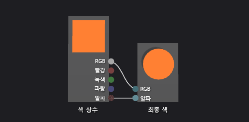

# 방법: 기본 색 셰이더 만들기
[!INCLUDE[vs2017banner](../code-quality/includes/vs2017banner.md)]

이 문서에서는 셰이더 디자이너와 DGSL\(Directed Graph Shader Language\)을 사용하여 단색 셰이더를 만드는 방법을 보여줍니다.  이 셰이더는 상수 RGB 색 값으로 최종 색상을 설정합니다.  
  
 이 문서는 다음과 같은 활동을 보여줍니다.  
  
-   그래프에서 노드 제거  
  
-   그래프에 노드 추가  
  
-   노드 속성 설정  
  
-   노드 연결  
  
## 일반 색 셰이더 만들기  
 RGB 색 상수의 색 값을 최종 출력 색에 쓰면 일반 색 셰이더를 구현할 수 있습니다.  
  
 시작하기 전에 **속성** 창과 **도구 상자**가 표시되는지 확인하십시오.  
  
#### 일반 색 셰이더를 만들려면  
  
1.  사용할 DGSL 셰이더를 만듭니다.  DGSL 셰이더를 프로젝트에 추가하는 방법에 대한 내용은 [셰이더 디자이너](../designers/shader-designer.md)의 시작 단원을 참조하십시오.  
  
2.  **점 색** 노드를 삭제합니다.  **점 색** 노드를 선택한 다음 메뉴 모음에서 **편집**, **삭제**를 선택하려면 **선택** 도구를 사용합니다.  
  
3.  **색 상수** 노드를 그래프에 추가합니다.  **도구 상자**의 **상수** 아래에서 **색 상수**를 선택하고 디자인 화면으로 이동합니다.  
  
4.  **색 상수** 노드에 대한 색 값을 지정합니다.  **색 상수** 노드를 선택한 다음 **속성** 창과 **출력** 속성에서 색 값을 지정하려면 **선택** 도구를 사용합니다.  주황색의 경우 값 \(1.0, 0.5, 0.2, 1.0\)을 지정하십시오.  
  
5.  색 상수를 최종 색으로 연결합니다.  연결을 만들려면 **색 상수** 노드의 **RGB** 터미널을 **최종 색** 노드의 **RGB** 터미널로 이동한 다음 **색 상수** 노드의 **알파** 터미널을 **최종 색** 노드의 **알파** 터미널로 이동합니다.  이러한 연결은 최종 색을 이전 단계에서 정의된 색 상수로 설정합니다.  
  
 다음 그림에서는 완성된 셰이더 그래프와 큐브에 적용된 셰이더의 미리 보기를 보여 줍니다.  
  
> [!NOTE]
>  그림에서 주황색은 셰이더의 효과를 더 잘 보여주도록 지정되었습니다.  
  
   
  
 특정 셰이프는 일부 셰이더에 대해 더 나은 미리 보기를 제공할 수 있습니다.  셰이더 디자이너에서 셰이더를 미리보기 하는 방법에 대한 자세한 내용은 [셰이더 디자이너](../designers/shader-designer.md)를 참조하십시오.  
  
## 참고 항목  
 [방법: 3차원 모델에 셰이더 적용](../designers/how-to-apply-a-shader-to-a-3-d-model.md)   
 [방법: 셰이더 내보내기](../designers/how-to-export-a-shader.md)   
 [셰이더 디자이너](../designers/shader-designer.md)   
 [셰이더 디자이너 노드](../designers/shader-designer-nodes.md)