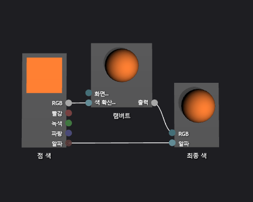

# 방법: 기본 램버트 셰이더 만들기

이 문서에서는 셰이더 디자이너 및 DGSL(Directed Graph Shader Language)을 사용하여 기본형 램버트 조명 모델을 구현하는 조명 셰이더를 만드는 방법을 보여 줍니다.

## 램버트 조명 모델

램버트 조명 모델은 주변 및 방향 조명을 통합하여 3D 장면의 개체를 음영 처리합니다. 주변 구성 요소는 3D 장면에 기본 수준의 조명을 제공합니다. 방향성 구성 요소는 방향성(멀리) 광원에서 추가 조명을 제공합니다. 주변 조명은 방향에 관계없이 장면의 모든 표면에 똑같이 영향을 미칩니다. 특정 표면의 경우 표면의 주변 색과 장면에 있는 주변 조명의 색 및 강도를 기반으로 결과가 생성됩니다. 방향성 조명은 광원 방향을 기준으로 표면 방향에 따라 장면의 모든 표면에 서로 다른 영향을 미칩니다. 표면의 확산 색 및 방향과 광원의 색, 강도 및 방향을 기반으로 결과가 생성됩니다. 직접 광원을 향하는 표면은 최대 기여도를 받고 광원의 정반대 방향을 향하는 표면은 기여도를 받지 않습니다. 램버트 조명 모델에서 주변 구성 요소와 하나 이상의 방향성 구성 요소는 결합되어 개체의 각 점에 대한 총 확산 색 기여도를 결정합니다.

시작하기 전에 **속성** 창과 **도구 상자**가 표시되는지 확인하세요.

1.  사용할 DGSL 셰이더를 만듭니다. DGSL 셰이더를 프로젝트에 추가하는 방법에 대한 내용은 [셰이더 디자이너](../designers/shader-designer.md)의 시작 섹션을 참조하세요.

2.  **최종 색** 노드에서 **점 색** 노드의 연결을 끊습니다. **점 색** 노드의 **RGB** 터미널을 선택하고 **연결 끊기**를 선택합니다. **알파** 터미널은 연결해 둡니다.

3.  **램버트** 노드를 그래프에 추가합니다. **도구 상자**의 **유틸리티**에서 **램버트**를 선택하고 디자인 화면으로 이동합니다. 램버트 노드는 주변 및 확산 조명 매개 변수에 따라 픽셀의 총 확산 색 기여도를 계산합니다.

4.  **점 색** 노드를 **램버트** 노드에 연결합니다. **선택** 모드에서 **점 색** 노드의 **RGB** 터미널을 **램버트** 노드의 **확산 색** 터미널로 이동합니다. 이 연결은 램버트 노드에 픽셀의 보간 확산 색을 제공합니다.

5.  계산된 색 값을 최종 색에 연결합니다. **램버트** 노드의 **출력** 터미널을 **최종 색** 노드의 **RGB** 터미널로 이동합니다.

 다음 그림은 주전자 모델에 적용된 셰이더의 완료된 셰이더 그래프 및 미리 보기를 보여 줍니다.

> [!NOTE]
> 이 그림에서 셰이더의 효과를 더 잘 보여 주기 위해 셰이더의 **MaterialDiffuse** 매개 변수를 사용하여 주황색이 지정되었습니다. 게임 또는 앱에서는 이 매개 변수를 사용하여 각 개체의 고유한 색 값을 제공합니다. 재질 매개 변수에 대한 자세한 내용은 [셰이더 디자이너](../designers/shader-designer.md)의 셰이더 미리 보기 섹션을 참조하세요.

 

 일부 셰이더의 경우 특정 도형을 사용하면 미리 보기가 더 잘 표시될 수 있습니다. 셰이더 디자이너에서 셰이더를 미리 보는 방법에 대한 자세한 내용은 [셰이더 디자이너](../designers/shader-designer.md)의 셰이더 미리 보기 섹션을 참조하세요.

 다음 그림은 3D 모델에 적용되는 이 문서에서 설명된 셰이더를 보여줍니다.

 

 3D 모델에 셰이더를 적용하는 방법에 대한 자세한 내용은 [방법: 3D 모델에 셰이더 적용](../designers/how-to-apply-a-shader-to-a-3-d-model.md)을 참조하세요.

## 참고 항목

- [방법: 3D 모델에 셰이더 적용](../designers/how-to-apply-a-shader-to-a-3-d-model.md)
- [방법: 셰이더 내보내기](../designers/how-to-export-a-shader.md)
- [방법: 기본 퐁 셰이더 만들기](../designers/how-to-create-a-basic-phong-shader.md)
- [셰이더 디자이너](../designers/shader-designer.md)
- [셰이더 디자이너 노드](../designers/shader-designer-nodes.md)