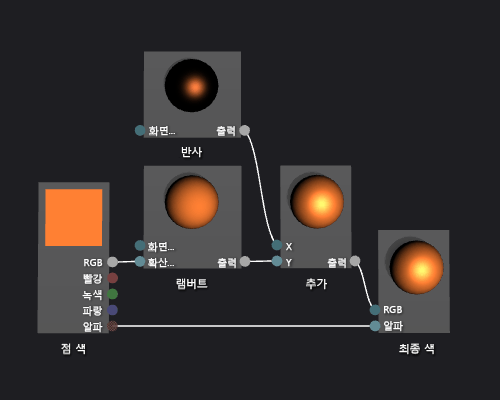

# 방법: 기본 퐁 셰이더 만들기
[!INCLUDE[vs2017banner](../code-quality/includes/vs2017banner.md)]

이 문서에서는 셰이더 디자이너와 DGSL\(Directed Graph Shader Language\)을 사용하여 전통적인 조명 모델을 구현하는 조명 셰이더를 만드는 방법을 보여줍니다.  
  
 이 문서는 다음과 같은 활동을 보여줍니다.  
  
-   셰이더 그래프에 노드 추가  
  
-   노드 연결 해제  
  
-   노드 연결  
  
## 퐁 조명 모델  
 퐁 조명 모델은 표면의 반사 속성을 시뮬레이션하는 반사 하이라이트를 포함하기 위해 Lambert 조명 모델을 확장합니다.  반사 구성 요소는 Lambert 조명 모델에서 사용하는 동일한 방향의 광원 소스에서 추가 조명을 제공하지만 최종 색에는 다르게 영향을 줍니다.  반사 강조는 뷰 방향, 광원 소스 및 화면 방향을 기초로 장면에서 다르게 모든 화면에 영향을 줍니다.  이는 표면의 반사 색과 반사력 및 표면의 방향 그리고 광원 소스의 색, 강도 및 방향의 제품입니다.  뷰어에 광원을 직접 반사하는 표면은 최대로 반사하는 영향을 받고 뷰어에서 멀리 떨어진 광원을 반사하는 표면은 영향을 받지 않습니다.  퐁 라이팅 모델 아래에서 개체의 각 지점의 색상 및 반사 하이라이트 강도를 확인하려면 하나 이상의 반사 구성 요소를 결합한 다음 Lambert 조명 모델의 결과에 추가하여 픽셀의 최종 색상을 만듭니다.  
  
 램버트 조명 모델에 대한 자세한 내용은 [방법: 기본 램버트 셰이더 만들기](../designers/how-to-create-a-basic-lambert-shader.md)를 참조하십시오.  
  
 시작하기 전에 **속성** 창과 **도구 상자**가 표시되는지 확인하십시오.  
  
#### 퐁 셰이더를 만들려면  
  
1.  램버트 셰이더를 만드는 방법은 [방법: 기본 램버트 셰이더 만들기](../designers/how-to-create-a-basic-lambert-shader.md)를 참조하십시오.  
  
2.  **최종 색상** 노드로부터 **램버트** 노드를 연결 해제 합니다.  **램버트** 노드의 **RGB** 터미널을 선택하고 **링크 끊기**를 선택합니다.  그러면 다음 단계에서 추가되는 노드에 대한 공간이 생깁니다.  
  
3.  **추가** 노드를 그래프에 추가합니다.  **도구 상자** 에서, **수학** 아래에서 **추가** 를 선택하고 디자인 화면으로 이동합니다.  
  
4.  **반사** 노드를 그래프에 추가합니다.  **도구 상자**의 **유틸리티** 아래에서 **반사**를 선택하고 디자인 화면으로 이동합니다.  
  
5.  반사 기여도를 추가합니다.  **반사** 노드의 **출력** 터미널을 **추가** 노드의 **X** 터미널로 이동시키고, **램버트** 노드의 **출력** 터미널을 **추가** 노드의 **Y** 터미널로 이동시킵니다.  이러한 연결은 픽셀에 대한 총 확산 및 반사 색을 결합합니다.  
  
6.  계산된 색 값을 최종 색으로 연결합니다.  **추가** 노드의 **출력** 터미널을 **최종 색** 노드의 **RGB** 터미널로 이동합니다.  
  
 다음 그림에서는 완성된 셰이더 그래프와 주전자 모델에 적용된 셰이더의 미리 보기를 보여 줍니다.  
  
> [!NOTE]
>  이 그림에서 셰이더 효과를 보다 잘 보여 주기 위해, 주황색은 셰이더의 **MaterialDiffuse** 매개변수를 사용함으로써 지정해주고, 금속 수준의 완료는 **MaterialSpecular** 와 **MaterialSpecularPower** 매개변수를 사용함으로써 지정해줍니다.  더 많은 재료 매개 변수에 대한 정보는 셰이더 미리 보기 섹션을 참조 하십시오. [셰이더 디자이너](../designers/shader-designer.md).  
  
   
  
 특정 셰이프는 일부 셰이더에 대해 더 나은 미리 보기를 제공할 수 있습니다.  미리 보는 방법에 대한 자세한 내용은 셰이더 디자이너에서 셰이더 미리 단원을 참조합니다 [셰이더 디자이너](../designers/shader-designer.md)  
  
 다음 그림은 3차원 모델에 적용되었고, 이 문서에서 설명하는 셰이더를 보여줍니다.  **MaterialSpecular** 속성은 \(1.00, 0.50, 0.20, 0.00\)으로 **MaterialSpecularPower** 속성은 4로 설정합니다.  
  
> [!NOTE]
>  **MaterialSpecular** 속성은 표면 재질의 명확한 마무리를 결정합니다.  플라스틱 또는 유리 등 고광택 표면에는 밝은 음영의 흰색 반사 색을 갖는 경향이 있습니다.  금속 표면은 확산 색에 가까운 반사 색을 갖는 경향이 있습니다.  새틴 마무리 표면은 회색의 어두운 음영인 반사 색을 갖는 경향이 있습니다.  
>   
>  **MaterialSpecularPower** 속성은 반사 하이라이트의 강도를 결정합니다.  높은 반사 파워는 더 무디고 더 지역화된 강조 표시를 시뮬레이션합니다.  매우 낮은 반사력은 표면의 색을 과포화시키고 숨길 수 있는 강렬하고 넓은 하이라이트를 시뮬레이션합니다.  
  
   
  
 셰이더를 3D모델에 적용하는 방법에 대한 자세한 내용은 [방법: 3차원 모델에 셰이더 적용](../designers/how-to-apply-a-shader-to-a-3-d-model.md)을 참조하십시오.  
  
## 참고 항목  
 [방법: 3차원 모델에 셰이더 적용](../designers/how-to-apply-a-shader-to-a-3-d-model.md)   
 [방법: 셰이더 내보내기](../designers/how-to-export-a-shader.md)   
 [방법: 기본 램버트 셰이더 만들기](../designers/how-to-create-a-basic-lambert-shader.md)   
 [셰이더 디자이너](../designers/shader-designer.md)   
 [셰이더 디자이너 노드](../designers/shader-designer-nodes.md)