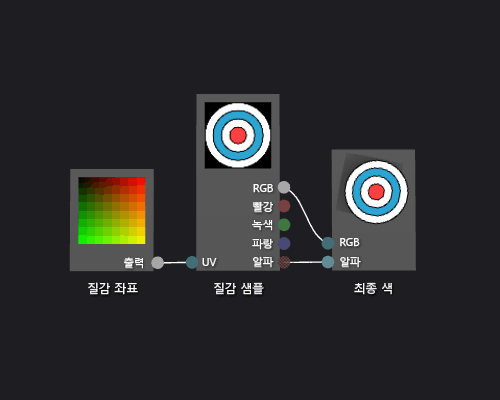

# 방법: 기본 질감 셰이더 만들기
[!INCLUDE[vs2017banner](../code-quality/includes/vs2017banner.md)]

이 문서에서는 셰이더 디자이너와 DGSL\(Directed Graph Shader Language\)을 사용하여 단일 텍스처 셰이더를 만드는 방법을 보여줍니다.  이 셰이더에서 최종 색상을 텍스처에서 샘플링된 RGB 및 알파 값으로 직접 설정합니다.  
  
 이 문서는 다음과 같은 활동을 보여줍니다.  
  
-   셰이더 그래프에서 노드 제거  
  
-   그래프에 노드 추가  
  
-   셰이더 매개 변수 설정  
  
-   환경 매개 변수 표시 여부 설정  
  
-   노드 연결  
  
## 기본 질감 셰이더 만들기  
 질감 샘플의 색상과 알파 값을 최종 출력 색상에 직접 쓰면 기본적인 단일 질감 셰이더를 구현할 수 있습니다.  
  
 시작하기 전에 **속성** 창과 **도구 상자**가 표시되는지 확인하십시오.  
  
#### 기본 질감 셰이더를 만들려면  
  
1.  사용할 DGSL 셰이더를 만듭니다.  DGSL 셰이더를 프로젝트에 추가하는 방법에 대한 내용은 [셰이더 디자이너](../designers/shader-designer.md)의 시작 단원을 참조하십시오.  
  
2.  **점 색** 노드를 삭제합니다.  **선택** 모드에서 **점 색** 노드를 선택한 다음 메뉴 모음에서 **편집**, **삭제**를 선택합니다.  그러면 다음 단계에서 추가되는 노드에 대한 공간이 생깁니다.  
  
3.  **질감 샘플** 노드를 그래프에 추가합니다.  **도구 상자**의 **질감** 아래에서 **질감 샘플**을 선택하고 디자인 화면으로 이동합니다.  
  
4.  **질감 좌표** 노드를 그래프에 추가합니다.  **도구 상자**의 **질감** 아래에서 **질감 좌표**를 선택하고 디자인 화면으로 이동합니다.  
  
5.  적용할 질감을 선택 합니다.  **선택** 모드에서, **텍스쳐 샘플** 노드를 선택하고, **속성** 창에서, **파일명** 속성을 사용하여 사용하고 싶은 텍스쳐를 지정합니다.  
  
6.  질감에 공개적으로 액세스할 수 있도록 합니다.  **텍스쳐 샘플** 노드를 선택하고, **속성** 창에서, **접근** 속성을 **Public** 으로 설정합니다.  이제 **모델 편집기** 같은 다른 도구에서 질감을 설정할 수 있습니다.  
  
7.  질감 좌표를 질감 샘플에 연결합니다.  **선택** 모드에서 **질감 좌표**노드의 **출력** 터미널을 **질감 샘플**노드의 **UV** 터미널로 이동합니다.  이 연결은 지정된 좌표에서 질감을 샘플링합니다.  
  
8.  질감 샘플을 최종 색으로 연결합니다.  **RGB** 터미널인 **텍스쳐 샘플** 노드를 **RGB** 터미널인 **최종색상** 노드로 이동합니다, 그리고 **알파** 터미널인 **텍스쳐 샘플** 노드를 **알파** 터미널인 **최종색상** 노드로 이동합니다.  
  
 다음 그림에서는 완성된 셰이더 그래프와 큐브에 적용된 셰이더의 미리 보기를 보여 줍니다.  
  
> [!NOTE]
>  이 그림에서는 미리 보기 모양으로 사용 되는 평면 및 텍스처 셰이더 효과 보다 잘 설명 하기 위해 지정되었습니다.  
  
   
  
 특정 셰이프는 일부 셰이더에 대해 더 나은 미리 보기를 제공할 수 있습니다.  셰이더 디자이너에서 셰이더를 미리보기 하는 방법에 대한 자세한 내용은 [셰이더 디자이너](../designers/shader-designer.md)를 참조하십시오.  
  
## 참고 항목  
 [방법: 3차원 모델에 셰이더 적용](../designers/how-to-apply-a-shader-to-a-3-d-model.md)   
 [이미지 편집기](../designers/image-editor.md)   
 [셰이더 디자이너](../designers/shader-designer.md)   
 [셰이더 디자이너 노드](../designers/shader-designer-nodes.md)