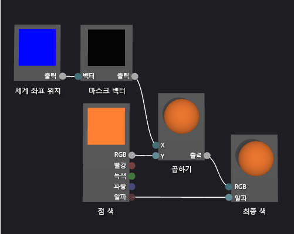

# 방법: 기하 도형 기반 그라데이션 셰이더 만들기
[!INCLUDE[vs2017banner](../code-quality/includes/vs2017banner.md)]

이 문서에서는 셰이더 디자이너와 DGSL\(Directed Graph Shader Language\)을 사용하여 기하 도형 그라데이션 셰이더를 만드는 방법을 보여줍니다.  이 셰이더에서 세계 공간에 있는 개체의 각 지점의 높이별로 상수 RGB 색상 값을 조정합니다.  
  
 이 문서는 다음과 같은 활동을 보여줍니다.  
  
-   셰이더 그래프에 노드 추가  
  
-   노드 속성 설정  
  
-   노드 연결 해제  
  
-   노드 연결  
  
## 형상 기반의 그라데이션 셰이더 만들기  
 조각의 위치 픽셀을 셰이더에 통합함으로써 형상 기반의 셰이더를 구현할 수 있습니다.  음영 언어 픽셀 2 차원 화면에서의 색상 및 위치 단지 보다 더 많은 정보를 포함합니다.  일부 시스템에서 *frgmanet* 로 알려진 픽셀은 픽셀에 반응하는 표면을 표현하는 값의 컬렉션입니다  이 문서에서 설명한 셰이더는 조각의 최종 출력 색에 영향을 미치기 위해 월드 공간에서 3차원 개체의 각 픽셀의 높이를 이용합니다.  
  
 시작하기 전에 **속성** 창과 **도구 상자**가 표시되는지 확인하십시오.  
  
#### 형상 기반의 그라데이션 셰이더를 만들려면  
  
1.  사용할 DGSL 셰이더를 만듭니다.  DGSL 셰이더를 프로젝트에 추가하는 방법에 대한 내용은 [셰이더 디자이너](../designers/shader-designer.md)의 시작 단원을 참조하십시오.  
  
2.  **최종 색상** 노드로부터 **꼭짓점 색** 노드를 연결해제 합니다.  **꼭짓점 색** 노드의 **RGB** 터미널을 선택하고 **링크 끊기**를 선택합니다.  그러면 다음 단계에서 추가되는 노드에 대한 공간이 생깁니다.  
  
3.  **곱하기** 노드를 그래프에 추가합니다.  **도구 상자**의 **수학** 아래에서 **곱하기**를 선택하고 디자인 화면으로 이동합니다.  
  
4.  **벡터 마스크** 노드를 그래프에 추가합니다.  **도구 상자**의 **유틸리티** 아래에서 **마스크 벡터**를 선택하고 디자인 화면으로 이동합니다.  
  
5.  **마스크 벡터** 노드에 대한 마스크 값을 지정합니다.  **선택** 모드에서, **벡터 마스크** 노드를 선택한 다음 **속성** 창에서 **녹색 \/ \(Y\)** 속성을 **True**로 **빨간색 \/ \(X\)**, **파랑 \/ \(Z\)** 및 **알파 \/ \(W\)** 속성을 **False**로 설정합니다.  이 예제에서 **빨간색 \/ \(X\)**, **녹색 \/ \(Y\)**, 및 **블루 \/ \(Z\)** 속성은 **세계 위치** 노드의 x, y 및 z 구성 요소에 해당하며 **알파 \/ \(W\)**는 사용하지 않습니다.  **녹색 \/ \(Y\)**만 **True**로 설정했기 때문에 마스킹된 후 입력된 벡터의 y 구성 요소만 유지됩니다.  
  
6.  **세계 위치** 노드를 그래프에 추가합니다.  **도구 상자**의 **상수** 아래에서 **세계 위치**를 선택하고 디자인 화면으로 이동합니다.  
  
7.  조각의 월드 공간 마스크합니다.  **선택** 모드에서 **세계 위치** 노드의 **출력** 터미널을 **벡터 마스크** 노드의 **벡터** 터미널로 이동합니다.  이 연결은 조각의 위치를 마스크하여 x 및 z 구성 요소를 무시합니다.  
  
8.  RGB 색 상수를 마스크된 월드 공간 위치로 곱합니다.  **RGB** 터밀널인 **꼭짓점 색상** 노드를 **Y** 터미널인 **곱하기** 노드로 옮깁니다. 그때, **출력** 터미널인 **마스크 백터** 노드를 **X** 터미널인 **곱셈** 노드로 옮깁니다.  이 연결은 월드 공간에서 픽셀의 높이만큼 색 값의 배율을 조정합니다.  
  
9. 배율 조정된 색 값을 최종 색으로 연결합니다.  **곱셈** 노드의 **출력** 터미널을 **최종 색** 노드의 **RGB** 터미널로 이동합니다.  
  
 다음 그림에서는 완성된 셰이더 그래프와 구에 적용된 셰이더의 미리 보기를 보여 줍니다.  
  
> [!NOTE]
>  이 그림에서 주황색은 향상 셰이더의 효과를 더 잘 증명하기 위해 지정되지만 미리 보기 모양 월드 공간에 위치가 있으므로 셰이더 디자이너에서 셰이더를 모두 볼 수는 없습니다.  셰이더는 완벽한 효과를 보여주기 위해 실제 장면에서 미리 볼 수 있어야 합니다.  
  
   
  
 특정 셰이프는 일부 셰이더에 대해 더 나은 미리 보기를 제공할 수 있습니다.  셰이더 디자이너에서 셰이더를 미리보기 하는 방법에 대한 자세한 내용은 **셰이더 미리보기** [셰이더 디자이너](../designers/shader-designer.md)를 참조하십시오.  
  
 다음 그림에서 [방법: 3차원 지형 모델 만들기](../designers/how-to-model-3-d-terrain.md)에서 설명한 3차원 장면에 적용되어 이 문서에서 설명한 셰이더를 보여 줍니다.  색의 농도는 세상에서 점의 높이와 함께 증가합니다.  
  
   
  
 셰이더를 3D모델에 적용하는 방법에 대한 자세한 내용은 [방법: 3차원 모델에 셰이더 적용](../designers/how-to-apply-a-shader-to-a-3-d-model.md)을 참조하십시오.  
  
## 참고 항목  
 [방법: 3차원 모델에 셰이더 적용](../designers/how-to-apply-a-shader-to-a-3-d-model.md)   
 [방법: 셰이더 내보내기](../designers/how-to-export-a-shader.md)   
 [방법: 3차원 지형 모델 만들기](../designers/how-to-model-3-d-terrain.md)   
 [방법: 회색조 질감 셰이더 만들기](../designers/how-to-create-a-grayscale-texture-shader.md)   
 [셰이더 디자이너](../designers/shader-designer.md)   
 [셰이더 디자이너 노드](../designers/shader-designer-nodes.md)