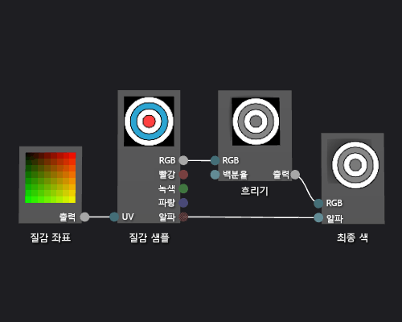

# 방법: 회색조 질감 셰이더 만들기
[!INCLUDE[vs2017banner](../code-quality/includes/vs2017banner.md)]

이 문서에서는 셰이더 디자이너와 DGSL\(Directed Graph Shader Language\)을 사용하여 회색 텍스처 셰이더를 만드는 방법을 보여줍니다.  이 셰이더에서 텍스처 샘플의 RGB 색상 값을 수정한 다음 수정되지 않은 알파 값과 함께 사용하여 최종 색상을 설정합니다.  
  
## 회색조 질감 셰이더 만들기  
 최종 출력 색상에 쓰기 전에 질감 샘플의 색 값을 수정하여 회색조 질감 셰이더를 구현할 수 있습니다.  
  
 시작하기 전에 **속성** 창과 **도구 상자**가 표시되는지 확인하십시오.  
  
#### 회색조 질감 셰이더를 만들려면  
  
1.  기본 텍스쳐 셰이더를 생성합니다, 자세한 설명은 [방법: 기본 질감 셰이더 만들기](../designers/how-to-create-a-basic-texture-shader.md) 를 참조하십시오.  
  
2.  **최종 색** 노드의 **RGB** 터미널로부터 **질감 샘플** 노드의 **RGB** 터미널 연결을 끊습니다.  **선택** 모드에서, **RGB** 터미널인 **텍스쳐 샘플** 노드를 선택하고, **링크 끊기** 를 선택합니다.  그러면 다음 단계에서 추가되는 노드에 대한 공간이 생깁니다.  
  
3.  **흑백화** 노드를 그래프에 추가합니다.  **도구 상자**의 **필터** 아래에서 **흑백화**를 선택하고 디자인 화면으로 이동합니다.  
  
4.  **흑백화** 노드를 사용하는 회색조 값을 계산합니다.  **선택** 모드에서, **텍스쳐 셰이더** 노드의 **RGB** 터미널을 **흑백화** 노드의 **UV** 터미널로 이동합니다.  
  
    > [!NOTE]
    >  기본적으로, **흑백화** 노드는 전체적으로 입력된 색상의 채도를 저하시키고, 회색조 전환을 위해 표준 광도 가중치를 사용합니다.  어떻게 **흑백화** 노드가 **광도** 속성의 값을 변경시킴으로써 또는 부분적으로 입력된 색상을 흑백화시키는 것에 대한 동작을 변경할 수 있습니다.  부분적으로 입력된 색상을 흑백화 시키기 위하여, 범위\(0,1\)에서 스칼라 값을 **퍼센트** 터미널인 **흑백화** 노드에 제공합니다.  
  
5.  회색조 색 값을 최종 색으로 연결합니다.  **흑백화** 노드의 **출력** 터미널을 **최종 색** 노드의 **RGB** 터미널로 이동합니다.  
  
 다음 그림에서는 완성된 셰이더 그래프와 큐브에 적용된 셰이더의 미리 보기를 보여 줍니다.  
  
> [!NOTE]
>  이 그림에서는 미리 보기 모양으로 사용 되는 평면 및 텍스처 셰이더 효과를 보다 잘 설명 하기 위해 지정되었습니다.  
  
   
  
 특정 셰이프는 일부 셰이더에 대해 더 나은 미리 보기를 제공할 수 있습니다.  셰이더 디자이너에서 셰이더를 미리보기 하는 방법에 대한 자세한 내용은 [셰이더 디자이너](../designers/shader-designer.md)를 참조하십시오.  
  
## 참고 항목  
 [방법: 3차원 모델에 셰이더 적용](../designers/how-to-apply-a-shader-to-a-3-d-model.md)   
 [방법: 셰이더 내보내기](../designers/how-to-export-a-shader.md)   
 [이미지 편집기](../designers/image-editor.md)   
 [셰이더 디자이너](../designers/shader-designer.md)   
 [셰이더 디자이너 노드](../designers/shader-designer-nodes.md)