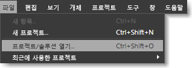
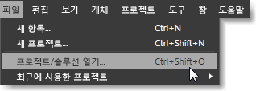

# Blend의 바로 가기 키 및 보조 키
바로 가기 키를 사용하면 마우스 단추를 여러 번 클릭해야 하는 동작을 바로 가기 키 하나로 줄일 수 있으므로 작업 속도를 향상시킬 수 있습니다. [!INCLUDE[blend_first](../debugger/includes/blend_first_md.md)]의 바로 가기 키는 다음의 두 범주로 제공됩니다.  
  
-   **선택키** 선택키를 사용하면 키보드에서 특정 키를 눌러 대화 상자의 영역이나 메뉴 명령에 액세스할 수 있습니다. 선택키는 현재 선택한 명령이나 대화 상자에 나타나는 밑줄로 식별할 수 있습니다.  
  
     선택키를 사용하려면 먼저 Alt 키 또는 F10 키를 눌러 선택키가 나타나도록 한 후에 특정 메뉴 또는 대화 상자 항목에 해당하는 문자를 누릅니다. Tab 키 또는 화살표 키를 사용하여 메뉴나 대화 상자를 탐색할 수 있습니다. 예를 들어 [!INCLUDE[blend_subs](../debugger/includes/blend_subs_md.md)]에서 Alt 키를 누르면 **파일** 메뉴에서 **F** 문자 아래에 밑줄이 표시되어 F가 선택키임을 나타냅니다. 프로젝트를 열려면 Alt 키를 누른 상태로 F와 O를 차례로 누르면 됩니다.  
  
       
Alt 키를 누르면 밑줄과 함께 나타나는 선택키  
  
-   **바로 가기 키** 바로 가기 키를 눌러 메뉴 명령 선택 또는 도구 동작 수정 등의 작업을 수행할 수 있습니다.  
  
     대부분의 바로 가기 키는 메뉴 명령 오른쪽에 표시되므로 [!INCLUDE[blend_subs](../debugger/includes/blend_subs_md.md)] 사용자 인터페이스에서 쉽게 식별할 수 있습니다. 예를 들어 **파일** 메뉴의 **프로젝트 열기** 명령에는 Ctrl+Shift+O 바로 가기 키가 포함되어 있습니다. **도구** 패널의 도구에 대한 바로 가기 키를 보려면 포인터로 도구 위를 가리킵니다.  
  
       
바로 가기가 있는 메뉴 항목 옆에 나타나는 바로 가기 키  
  
 내게 필요한 옵션 및 기능에 대한 자세한 내용은 [Microsoft의 내게 필요한 옵션](http://go.microsoft.com/fwlink/?LinkId=75069)을 참조하세요.  
  
## 보조 키  
 일부 바로 가기 키는 연결된 메뉴 항목이 없으므로 [!INCLUDE[blend_subs](../debugger/includes/blend_subs_md.md)] 사용자 인터페이스를 통해 찾을 수 없습니다. 다음 항목에는 도구 동작을 수정하거나 개체 크기 조정 등의 작업을 수정하는 바로 가기가 나와 있습니다.  
  
-   [아트보드 보조 키](../designers/artboard-modifier-keys-in-blend.md)  
  
-   [펜 도구 보조 키](../designers/pen-tool-modifier-keys-in-blend.md)  
  
-   [직접 선택 도구 보조 키](../designers/direct-selection-tool-modifier-keys-in-blend.md)