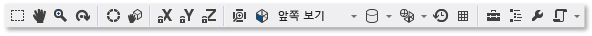

# 모델 편집기
[!INCLUDE[vs2017banner](../code-quality/includes/vs2017banner.md)]

이 문서에서는 [!INCLUDE[vsprvs](../code-quality/includes/vsprvs_md.md)] 이미지 편집기로 3차원 모델을 보고, 만들며 수정하는 방법을 설명합니다.  
  
 모델 편집기를 사용하여 처음부터 기본적인 3차원 모델을 만들거나 모든 기능을 갖춘 3차원 모델링 도구를 사용하여 만든 더 복잡한 3차원 모델을 보고 수정할 수 있습니다.  모델 편집기는 DirectX 응용 프로그램 개발에 사용되는 여러 가지 3차원 모델 형식을 지원합니다.  
  
## 지원되는 형식  
 모델 편집기는 이러한 모델 형식을 지원합니다.  
  
|형식 이름|파일 확장명|지원되는 작업\(보기, 편집, 만들기\)|  
|-----------|------------|----------------------------|  
|AutoDesk FBX 교환 파일|.fbx|보기, 편집, 만들기|  
|Collada DAE 파일|.dae|보기, 편집\(Collada DAE 파일에 대한 수정은 FBX 형식을 사용하여 저장됩니다.\)|  
|OBJ|.obj|보기, 편집\(OBJ 파일에 대한 수정은 FBX 형식을 사용하여 저장됩니다.\)|  
  
## 시작  
 이 단원에서는 [!INCLUDE[vsprvs](../code-quality/includes/vsprvs_md.md)] 프로젝트에 3차원 모델을 추가하는 방법을 설명하고 시작하는 데 필요한 기본 정보를 제공합니다.  
  
#### 프로젝트에 3차원 모델을 추가하려면  
  
1.  **솔루션 탐색기**에서 이미지를 추가하려는 프로젝트의 바로 가기 메뉴를 연 다음 **추가**, **새 항목**을 선택합니다.  
  
2.  **새 항목 추가** 대화 상자의 **설치됨**에서 **그래픽**을 선택한 다음 **3D 장면\(.fbx\)**을 선택합니다.  
  
3.  모델 파일의 **이름**과 만들려는 **위치**를 지정합니다.  
  
4.  **추가** 단추를 선택합니다.  
  
### 축 방향  
 [!INCLUDE[vsprvs](../code-quality/includes/vsprvs_md.md)]에서는 모든 3차원 축의 방향을 지원하고 모델 파일 형식에서 축 방향 정보를 로드합니다.  축 방향을 지정하지 않은 경우 [!INCLUDE[vsprvs](../code-quality/includes/vsprvs_md.md)]에서는 기본적으로 오른손 좌표계를 사용합니다.  **축 표시기**는 디자인 화면 오른쪽 아래 모서리에 현재 축 방향을 보여줍니다.  **축 표시기**에서 빨간색은 x축을 나타내고 녹색은 y축을 나타내며 파란색은 z축을 나타냅니다.  
  
### 3차원 모델 시작  
 모델 편집기에서 각각의 새로운 개체는 반드시 기본 3차원 도형 중 하나 또는 모델 편집기에 기본 제공되는 *기본 도형*으로 시작됩니다.  새롭고 고유한 개체를 만들려면 기본 도형을 장면에 추가한 다음 꼭짓점을 수정하여 모양을 변경합니다.  복잡한 도형의 경우 돌출 또는 하위 영역별로 추가 꼭짓점을 추가한 다음 수정합니다.  장면에 기본 개체를 추가하는 방법에 대한 자세한 내용은 [3차원 개체 만들기 및 가져오기](#Adding3DObjects)를 참조하십시오.  개체에 꼭짓점을 더 추가하는 방법에 대한 자세한 내용은 [개체 수정](#ModifyingObjects)을 참조하십시오.  
  
## 모델 편집기에서 작업  
 다음 단원에서는 모델 편집기를 사용하여 3차원 모델 작업을 수행하는 방법을 설명합니다.  
  
### 모델 편집기 도구 모음  
 모델 편집기 도구 모음에는 3차원 모델 작업에 유용한 명령이 포함되어 있습니다.  
  
 모델 편집기의 상태에 영향을 주는 명령은 주 [!INCLUDE[vsprvs](../code-quality/includes/vsprvs_md.md)] 창의 **모델 편집기 모드** 도구 모음에 있습니다.  모델링 도구 및 스크립트 명령은 모델 편집기 디자인 화면의 **모델 편집기** 도구 모음에 있습니다.  
  
 다음은 **모델 편집기 모드** 도구 모음입니다.  
  
   
  
 이 표에서는 왼쪽에서 오른쪽으로 나타나는 순서에 따라 나열된 **모델 편집기 모드** 도구 모음에 있는 항목을 설명합니다.  
  
|도구 상자 항목|설명|  
|--------------|--------|  
|**선택**|활성 선택 모드에 따라 장면에서 점, 가장자리, 면 또는 개체 선택을 사용합니다.|  
|**이동**|창 프레임을 기준으로 3차원 장면의 이동을 사용합니다.  이동하려면 장면에서 한 점을 선택하고 주변으로 이동시킵니다.   **선택** 모드에서 Ctrl 키를 누른 상태에서 **이동** 모드를 일시적으로 활성화합니다.|  
|**확대\/축소**|창 프레임을 기준으로 다소간 장면 세부 정보의 표시를 사용합니다.  **확대\/축소** 모드로 장면에서 점을 선택하고 오른쪽이나 아래쪽으로 이동하여 확대하거나 왼쪽이나 위쪽으로 이동하여 축소합니다.   **선택** 모드에서 마우스 휠을 사용하여 Ctrl 키를 누른 채 확대\/축소할 수 있습니다.|  
|**궤도**|선택한 개체 주변의 원형 경로에 보기를 배치합니다.  개체를 선택하지 않은 경우 장면 원점에 경로의 중심이 맞춰집니다. **Note:**  이 모드는 **직교** 프로젝션을 사용할 때는 효과가 없습니다.|  
|**월드 로컬**|이 항목이 활성화되면 선택된 개체에 대한 변환이 월드 공간에서 발생합니다.  그렇지 않으면 선택한 개체에 대한 변환은 로컬 공간에서 발생합니다.|  
|**피벗 모드**|이 항목을 사용하는 경우 변환은 선택한 개체의 *피벗 지점*에 적용됩니다. \(피벗 지점에서는 변환의 중심, 배율 및 회전 작업을 정의합니다.\) 그렇지 않으면 변환은 피벗 점을 기준으로 개체의 형상 위치와 방향에 영향을 줍니다.|  
|**X축 잠금**|개체 조작을 X축으로 제한합니다.  조작자 위젯의 중앙 부분을 사용하는지 여부에만 적용됩니다.|  
|**Y축 잠금**|개체 조작을 Y축으로 제한합니다.  조작자 위젯의 중앙 부분을 사용하는지 여부에만 적용됩니다.|  
|**Z축 잠금**|개체 조작을 Z축으로 제한합니다.  조작자 위젯의 중앙 부분을 사용하는지 여부에만 적용됩니다.|  
|**프레임 개체**|보기의 중앙에 오도록 선택된 개체를 프레이밍합니다.|  
|**보기**|보기 방향을 설정합니다.  다음은 사용 가능한 방향입니다.   **앞면**  장면 앞에 보기를 배치합니다.   **뒤**  장면 뒤에 보기를 배치합니다.   **왼쪽**  장면 왼쪽에 보기를 배치합니다.   **오른쪽**  장면 오른쪽에 보기를 배치합니다.   **위쪽**  장면 위에 보기를 배치합니다.   **아래쪽**  장면 아래에 보기를 배치합니다. **Note:**  이는 **직교** 프로젝션이 사용될 때 보기 방향을 변경하는 유일한 방법입니다.|  
|**프로젝션**|장면을 그리는 데 사용되는 프로젝션의 종류를 설정합니다.  다음은 사용 가능한 프로젝션입니다.   **큐브 뷰**  원근 투영 관점에서 뷰포인트에서 멀리 있는 개체는 작게 표시되고, 결국 거리에 따라 한 점으로 수렴합니다.   **직각**  직교 프로젝션에서는 개체가 뷰포인트로부터의 거리에 관계없이 같은 크기로 나타납니다.  수렴을 표시하지 않습니다.  **직교** 프로젝션이 활성화되면 **궤도** 모드를 사용하여 보기를 배치할 수 없습니다.|  
|**그리기 스타일**|장면에서 개체를 렌더링하는 방법을 설정합니다.  다음은 사용 가능한 스타일입니다.   **가는 철사 틀**  활성화되면 개체는 가는 철사 틀로 렌더링됩니다.   **Overdraw**  활성화되면 개체는 추가 혼합을 사용하여 렌더링됩니다.  장면에서 얼마나 많이 overdraw가 발생했는지 시각화하는 데 사용할 수 있습니다.   **음영이 있는 플랫**  활성화되면 개체는 기본적인 음영이 있는 플랫 조명 모델을 사용하여 렌더링됩니다.  개체의 면을 더욱 쉽게 보는 데 사용할 수 있습니다.   어떠한 옵션도 사용 가능하지 않으면 각 개체에 적용되는 재질들을 사용하여 렌더링됩니다.|  
|**실시간 렌더링 모드**|실시간 렌더링을 사용하는 경우 [!INCLUDE[vsprvs](../code-quality/includes/vsprvs_md.md)]는 사용자 작업이 수행되지 않을 때도 디자인 화면을 다시 그립니다.  이 모드는 시간이 지남에 따라 셰이더 작업을 할 때 유용합니다.|  
|**모눈 설정\/해제**|이 항목이 활성화되면 모눈이 표시됩니다.  그렇지 않으면 표가 표시되지 않습니다.|  
|**도구 상자**|또는 **도구 상자**를 표시하거나 숨깁니다.|  
|**문서 개요**|또는 **문서 개요** 창을 표시하거나 숨깁니다.|  
|**속성**|또는 **속성** 창을 표시하거나 숨깁니다.|  
|**고급**|고급 명령 및 옵션을 포함합니다.   **그래픽 엔진**   **D3D11로 렌더링**  Direct3D 11을 사용하여 모델 편집기 디자인 화면을 렌더링합니다.   **D3D11WARP로 렌더링**  Direct3D 11 WARP\(Windows Advanced Rasterization Platform\)를 사용하여 모델 편집기 디자인 화면을 렌더링합니다.   **장면 관리**   **가져오기**  다른 3차원 모델 파일에서 현재 장면으로 개체를 가져옵니다.   **부모에 연결**  선택된 여러 개체 중 첫 번째 개체를 선택된 나머지 개체의 부모로 설정합니다.   **부모에서 분리**  선택한 개체를 부모로부터 분리합니다.  선택한 개체는 장면에서 *루트 개체*가 됩니다.  루트 개체에 부모 개체가 없습니다.   **그룹 만들기**  선택한 개체를 형제 개체로 그룹화합니다.   **개체 병합**  선택한 개체를 하나의 개체로 결합합니다.   **다각형 선택에서 새 개체 만들기**  현재 개체에서 선택한 면을 제거하고 이러한 면이 포함된 새 개체에 이 장면을 추가합니다.   **도구**   **다각형 권선 대칭 이동**  감기 순서와 보통 표면이 반전되도록 선택된 다각형을 대칭 이동합니다.   **모든 애니메이션 제거**  개체에서 애니메이션 데이터를 제거합니다.   **삼각 측량**  선택한 개체를 삼각형으로 변환합니다.   **보기**   뒷면 고르기  뒷면 고르기를 사용하거나 사용하지 않도록 설정합니다.   **Frame Rate\(프레임 속도\)**  디자인 화면의 상단 모서리에 프레임 속도를 표시합니다.  프레임 속도는 초당 그려지는 프레임 수입니다.   이 옵션은 **실시간 렌더링 모드** 옵션을 사용할 때 유용합니다.   **모두 표시**  장면에 모든 개체를 보여 줍니다.  이렇게 하면 각 개체의 **숨김** 속성이 **False**로 다시 설정됩니다.   **표면 법선 표시**  각 면의 법선을 보여줍니다.   **누락된 재질 표시**  할당된 재료가 없는 개체에 특수 질감을 표시합니다.   **피벗 표시**  현재 선택 영역의 피벗 지점에서 3차원 축 마커 표시를 사용하거나 사용하지 않을 수 있습니다.   **자리 표시자 노드 표시**  자리 표시자 노드를 표시합니다.  개체를 그룹화하면 자리 표시자 노드가 만들어집니다.   **꼭짓점 법선 표시**  각 꼭짓점의 법선을 보여줍니다. **Tip:**  **스크립트** 단추를 선택하여 마지막 스크립트를 다시 실행할 수 있습니다.|  
  
 다음은 **모델 편집기** 도구 모음입니다.  
  
   
  
 다음 표에서는 위쪽에서 아래쪽으로 나타나는 순서에 따라 나열된 **모델 편집기** 도구 모음에 있는 항목을 설명합니다.  
  
|도구 상자 항목|설명|  
|--------------|--------|  
|**좌표 이동**|선택 항목을 이동합니다.|  
|**규모**|선택 영역의 크기를 변경합니다.|  
|**회전**|선택 영역을 회전합니다.|  
|**점 선택**|개체의 개별 점을 선택하도록 **선택 모드**를 설정합니다.|  
|**가장자리 선택**|개체의 가장자리\(두 꼭짓점 사이의 선\)를 선택하도록 **선택 모드**를 설정합니다.|  
|**표면 선택**|개체의 면을 선택하도록 **선택 모드**를 설정합니다.|  
|**개체 선택**|전체 개체를 선택하도록 **선택 모드**를 설정합니다.|  
|**돌출**|추가로 면을 만들고 선택한 면에 연결합니다.|  
|**나누기**|선택한 면을 여러 면으로 나눕니다.  새 면을 만들려면 새 꼭짓점을 추가합니다. 원래 면의 중심에 한 개의 꼭짓점을 그리고, 각 가장자리 가운데에 하나의 꼭짓점을 추가한 다음 원래 꼭짓점과 결합합니다.  추가된 면 수는 원래 면의 가장자리 수와 같습니다.|  
  
### 뷰 제어  
 3차원 장면은 위치와 방향을 가진 가상 카메라를 떠올릴 수 있는 뷰에 따라 렌더링됩니다.  위치 및 방향을 변경하려면 **모델 편집기 모드** 도구 모음에서 뷰 컨트롤을 사용합니다.  
  
 다음 표에서는 기본 뷰 컨트롤을 설명합니다.  
  
|뷰 컨트롤|설명|  
|-----------|--------|  
|**이동**|창 프레임을 기준으로 3차원 장면의 이동을 사용합니다.  이동하려면 장면에서 한 점을 선택하고 주변으로 이동시킵니다.   **선택** 모드에서 Ctrl 키를 누른 상태에서 **이동** 모드를 일시적으로 활성화합니다.|  
|**확대\/축소**|창 프레임을 기준으로 다소간 장면 세부 정보의 표시를 사용합니다.  **확대\/축소** 모드로 장면에서 점을 선택하고 오른쪽이나 아래쪽으로 이동하여 확대하거나 왼쪽이나 위쪽으로 이동하여 축소합니다.   **선택** 모드에서 마우스 휠을 사용하여 Ctrl 키를 누른 채 확대\/축소할 수 있습니다.|  
|**궤도**|선택한 개체 주변의 원형 경로에 보기를 배치합니다.  개체를 선택하지 않은 경우 장면 원점에 경로의 중심이 맞춰집니다. **Note:**  이 모드는 **직교** 프로젝션을 사용할 때는 효과가 없습니다.|  
|**프레임 개체**|보기의 중앙에 오도록 선택된 개체를 프레이밍합니다.|  
  
 보기는 가상 카메라에 의해 설정되지만 프로젝션에 의해서도 정의됩니다.  프로젝션에서는 해당 뷰에서 도형 및 개체가 디자인 화면의 픽셀로 변환되는 방법을 정의합니다.  **모델 편집기** 도구 모음에서 **원근감** 또는 **직교** 프로젝션을 선택할 수 있습니다.  
  
|프로젝션|설명|  
|----------|--------|  
|**큐브 뷰**|원근 투영 관점에서 뷰포인트에서 멀리 있는 개체는 작게 표시되고, 결국 거리에 따라 한 점으로 수렴합니다.|  
|**직각**|직교 프로젝션에서는 개체가 뷰포인트로부터의 거리에 관계없이 같은 크기로 나타납니다.  수렴을 표시하지 않습니다.  **직교** 프로젝션이 활성화되면 **궤도** 모드를 사용하여 보기를 임의로 배치할 수 없습니다.|  
  
 두 비슷한 장면을 비교할 때처럼 알려진 위치와 각도에서 3차원 장면을 보는 데 유용할 수 있습니다.  이 시나리오의 경우 모델 편집기는 여러 미리 정의된 보기를 제공합니다.  미리 정의된 뷰를 사용하려면 **모델 편집기 모드** 도구 모음에서 **보기**를 선택한 다음 앞, 뒤, 왼쪽, 오른쪽, 위쪽 또는 아래쪽 중 원하는 미리 정의된 뷰를 선택합니다.  이러한 보기에서 가상 카메라는 장면의 원점에서 직접 찾습니다.  예를 들어, **위쪽 보기**를 선택했다면 가상 카메라가 화면의 바로 위에서 화면을 본 것입니다.  
  
### 추가 형상 세부 정보 보기  
 3차원 개체 또는 장면을 더 잘 이해하기 위해 꼭짓점 당 법선, 면 당 법선 및 활성화된 선택의 피벗 지점 같은 추가 기하 도형 세부 정보 및 기타 세부 정보를 볼 수 있습니다.  이를 활성화 또는 비활성화하려면 **모델 편집기** 도구 모음에서 **스크립트**, **보기**를 선택한 다음 원하는 항목을 선택합니다.  
  
###   3차원 개체 만들기 및 가져오기  
 미리 정의된 3차원 도형을 장면에 추가하려면 **도구 상자**에서 원하는 도형을 선택하여 디자인 화면으로 이동합니다.  새 셰이프는 장면의 원점에 배치됩니다.  모델 편집기는 **원뿔**, **정육면체**, **원통**, **원반**, **평면**, **구** 및 **주전자**의 7개 모양을 제공합니다.  
  
 파일에서 3차원 개체를 가져오려면 **모델 편집기** 도구 모음에서 **고급**, **장면 관리** 및 **가져오기**를 선택한 다음 가져올 파일을 지정합니다.  
  
### 개체 변형  
 **회전**, **배율** 및 **변환** 속성을 변경하여 개체를 *변환*할 수 있습니다.  *회전*은 피벗 지점에서 정의한 x축, y축 및 z축 주위로 연속 회전을 적용하여 개체의 방향을 지정합니다.  각 회전 사양에는 순서대로 x, y 및 z의 세 가지 구성 요소가 있으며, 구성 요소는 각도로 정의됩니다.  **배율**은 피벗 지점을 중심으로 하나 이상의 축을 따라 지정된 인수만큼 개체를 늘려 개체의 크기를 조정합니다.  *변환*은 피벗 점 대신 부모에 상대적인 3차원 공간에서 개체를 찾습니다.  
  
 모델링 도구를 사용하거나 속성을 설정하여 개체를 변환할 수 있습니다.  
  
##### 모델링 도구를 사용하여 개체를 변환하려면  
  
1.  **선택** 모드에서 변환하려는 개체를 선택합니다.  가는 철사 틀 오버레이는 개체가 선택되었음을 나타냅니다.  
  
2.  **모델 편집기** 도구 모음에서 **변환**, **배율** 또는 **회전** 도구를 선택합니다.  선택한 개체에 대한 변환, 배율 조정 또는 회전 조작자가 나타납니다.  
  
3.  조작자를 사용하여 변환을 수행합니다.  변환과 배율 조정 변환의 경우 조작자는 축 표시기입니다.  한 번에 한 축을 변경하거나 표시기 중앙에 있는 흰색 큐브를 사용하여 동시에 모든 축을 변경할 수 있습니다.  회전에서 조정자는 x축\(빨간색\), y축\(녹색\) 및 z축\(파란색\)에 따라 해당 색으로 조합된 구입니다.  각 축을 개별적으로 변경하여 원하는 회전을 만들어야 합니다.  
  
##### 속성을 설정하여 개체를 변환하려면  
  
1.  **선택** 모드에서 변환하려는 개체를 선택합니다.  가는 철사 틀 오버레이는 개체가 선택되었음을 나타냅니다.  
  
2.  **속성** 창에서 **회전**, **배율** 및 **변환** 속성에 대해 값을 지정합니다.  
  
    > [!IMPORTANT]
    >  **회전** 속성의 경우 각 세 축의 주변을 회전할 각도를 지정합니다.  회전은 순서대로 적용되기 때문에 x축, y축 및 z축 회전을 기준으로 먼저 계획을 세워야 합니다.  
  
 모델링 도구를 사용함으로써 변환을 정밀하지는 않지만 빠르게 만들 수 있습니다.  개체 속성을 설정함으로써 변환을 빠르지는 않지만 정밀하게 지정할 수 있습니다.  원하는 변환에 "충분히 가까이" 가져온 다음 속성 값을 미세 조정하려면 모델링 도구를 사용하는 것이 좋습니다.  
  
 조작자를 사용하지 않으려면 자유 형식 모드를 사용할 수 있습니다.  **모델 편집기** 도구 모음에서 **스크립트**, **도구**, **자유형 조작**을 선택하여 자유형 모드를 활성화\(또는 비활성화\)합니다.  자유형 모드에서는 조작점 대신에 디자인 화면의 어떤 점에서든 조작을 시작할 수 있습니다.  자유형 모드에서는 변경하지 않으려는 축을 잠금 설정하여 특정 축 변경을 제한할 수 있습니다.  **모델 편집기 모드** 도구 모음에서 **잠금 X**, **잠금 Y** 및 **잠금 Z** 단추의 조합을 선택합니다.  
  
 모눈에 맞춤을 사용하면 개체 작업이 편리할 수 있습니다.  **모델 편집기 모드** 도구 모음에서 **맞추기**를 선택하여 모눈에 맞춤을 설정\(또는 해제\)합니다.  모눈에 맞춤이 활성화되면 변환, 회전 및 배율 변환이 미리 정의된 증분으로 제한됩니다.  
  
### 피벗 점 작업  
 개체의 피벗 점은 회전과 배율의 중심을 정의합니다.  개체의 피벗 점을 변경하여 회전과 배율 조정 변환의 영향을 받는 방법을 변경할 수 있습니다.  **모델 편집기 모드** 도구 모음에서 **피벗 모드**를 선택하여 피벗 모드를 활성화\(또는 비활성화\)합니다.  피벗 모드를 사용하면 작은 축 표시기가 선택한 개체의 피벗 지점에 표시됩니다.  그런 다음 **변환** 및 **회전** 도구를 사용하여 피벗 점을 조작할 수 있습니다.  
  
 피벗 점을 사용하는 방법을 보여 주는 데모를 보려면 [방법: 3차원 모델의 피벗 점 수정](../designers/how-to-modify-the-pivot-point-of-a-3-d-model.md)을 참조하십시오.  
  
### 월드 및 로컬 모드  
 개체의 로컬 좌표계\(또는 *로컬 참조 프레임*\) 또는 세계 좌표계\(또는 *세계 참조 프레임*\)에서 변환 및 회전이 발생할 수 있습니다.  세계의 참조 프레임은 개체의 회전과 독립적입니다.  로컬 모드는 기본입니다.  월드 모드를 활성화\(또는 비활성화\)하려면 **모델 편집기 모드** 도구 모음에서 **WorldLocal** 단추를 선택합니다.  
  
###   개체 수정  
 꼭짓점, 가장자리 및 면을 이동하거나 삭제하여 3차원 개체의 모양을 변경할 수 있습니다.  기본적으로 모델 편집기가 *개체 모드*에 있기 때문에 전체 개체를 선택하고 변환할 수 있습니다.  점, 모서리 또는 면을 선택하려면 해당 선택 모드를 선택합니다.  **모델 편집기 모드** 도구 모음에서 **선택 모드**를 선택한 다음 원하는 모드를 선택합니다.  
  
 돌출 또는 하위 영역별로 추가 꼭짓점을 만들 수 있습니다.  돌출된 부분은 복사된 꼭짓점으로 연결 유지되는 한 면의 꼭짓점\(동일 평면상의 꼭짓점 집합\)을 복사한 것입니다.  세분화는 꼭짓점을 추가하여 이전에 있었던 여러 면을 만듭니다.  새 면을 만들려면 새 꼭짓점을 추가합니다. 원래 면의 중심에 한 개의 꼭짓점을 그리고, 각 가장자리 가운데에 하나의 꼭짓점을 추가한 다음 원래 꼭짓점과 결합합니다.  추가된 면 수는 원래 면의 가장자리 수와 같습니다.  두 경우 모두 개체의 기하 모양을 변경하기 위한 변환, 회전 및 새 꼭짓점으로 크기 조절을 할 수 있습니다.  
  
##### 개체에서 면을 돌출시키려면  
  
1.  표면 선택 모드에서 돌출시킬 표면을 선택합니다.  
  
2.  **모델 편집기** 도구 모음에서 **스크립트**, **도구**, **돌출**을 선택합니다.  
  
##### 면을 나누려면  
  
1.  표면 선택 모드에서 세분화할 표면을 선택합니다.  세분하면 새로운 에지 데이터가 만들어지기 때문에 한 번에 모든 면을 세분화하면 면이 모두 인접했을 때 보다 일관된 결과가 나타납니다.  
  
2.  **모델 편집기** 도구 모음에서 **스크립트**, **도구**, **나누기**를 선택합니다.  
  
 면을 삼각 측량하고, 개체를 병합하고, 다각형 선택 영역을 새 개체로 변환할 수도 있습니다.  삼각형은 비삼각형 면이 최적의 삼각형 수로 변환될 수 있도록 추가 가장자리를 만듭니다. 하지만 기하학적 세부 정보를 제공하지는 않습니다.  병합은 선택한 개체를 하나의 개체로 결합합니다.  새 개체는 다각형 선택에서 만들 수 있습니다.  
  
##### 면을 삼각 측량하려면  
  
1.  표면 선택 모드에서 삼각 측량할 표면을 선택합니다.  
  
2.  **모델 편집기** 도구 모음에서 **스크립트**, **도구**, **삼각 측량**을 선택합니다.  
  
##### 개체를 병합하려면  
  
1.  개체 선택 모드에서 병합할 개체를 선택합니다.  
  
2.  **모델 편집기** 도구 모음에서 **스크립트**, **도구**, **개체 병합**을 선택합니다.  
  
##### 다각형 선택에서 개체를 만들려면  
  
1.  표면 선택 모드에서 새 개체를 만들려는 표면을 선택합니다.  
  
2.  **모델 편집기** 도구 모음에서 **스크립트**, **도구**, **다각형 선택에서 새 개체 만들기**를 선택합니다.  
  
### 재질 및 셰이더 작업  
 개체의 모양은 장면에서의 상호 작용 및 개체의 재료로 결정합니다.  재료는 표면이 다른 형식의 조명과 상호 작용하는 방법을 설명하는 속성과 조명 정보, 텍스처 맵, 일반 맵 및 기타 데이터를 기초로 개체 표면의 각 픽셀의 최종 색을 계산하는 셰이더 프로그램으로 정의합니다.  
  
 모델 편집기는 다음과 같은 기본 재질을 제공합니다.  
  
|재질|설명|  
|--------|--------|  
|꺼짐|시뮬레이션된 조명 없이 화면을 렌더링합니다.|  
|램버트|시뮬레이션된 주변 조명 및 확산 조명으로 화면을 렌더링합니다.|  
|퐁|시뮬레이션된 주변 조명, 확산 조명 및 반사 조명으로 화면을 렌더링합니다.|  
  
 각 재질은 개체 표면에 하나의 질감을 적용합니다.  재질을 사용하는 각 개체에 대해 다른 질감을 설정할 수 있습니다.  
  
 이 장면에서 특정 개체가 다른 광원에 반응하는 방식을 수정하기 위해 재질을 사용하는 다른 개체와 상관없이 재질의 조명 속성을 변경할 수 있습니다.  이 표에서는 일반적인 조명 속성을 설명합니다.  
  
|조명 속성|설명|  
|-----------|--------|  
|앰비언트|주변 조명에 의해 표면이 어떤 영향을 받는지 설명합니다.|  
|확산|방향과 포인트 조명이 표면에 미치는 영향을 설명합니다.|  
|발광|다른 조명에 관계없이 표면이 빛을 방출하는 방법에 대해 설명합니다.|  
|반사|방향과 포인트 조명이 표면에 어떻게 반사되는지 설명합니다.|  
|반사 강도|반사 하이라이트의 폭과 강도를 설명합니다.|  
  
 어떤 재질을 지원하는지에 따라 조명 속성, 질감 및 기타 데이터를 변경할 수 있습니다.  **선택** 모드에서 재질을 변경할 개체를 선택한 다음 **속성** 창에서 **MaterialAmbient**, **MaterialDiffuse**, **MaterialEmissive**, **MaterialSpecular**, **MaterialSpecularPower** 또는 기타 사용 가능한 속성을 변경합니다.  재질은 **Texture1**부터 **Texture8**까지 속성에 순차적으로 이름이 지정되어 최대 8개의 질감을 노출할 수 있습니다.  
  
 개체에서 모든 재질을 제거하려면 **모델 편집기** 도구 모음에서 **스크립트**, **재질**, **재질 제거**를 선택합니다.  
  
 **셰이더 디자이너**를 사용하여 3차원 장면에 개체를 적용할 수 있는 사용자 지정 셰이더 재질을 만들 수 있습니다.  사용자 지정 셰이더 재질을 만드는 방법에 대한 자세한 내용은 [셰이더 디자이너](../designers/shader-designer.md)를 참조하십시오.  사용자 지정 셰이더 재질을 개체에 적용하는 방법에 대한 내용은 [방법: 3차원 모델에 셰이더 적용](../designers/how-to-apply-a-shader-to-a-3-d-model.md)을 참조하십시오.  
  
### 장면 관리  
 장면을 개체의 계층으로 관리할 수 있습니다.  여러 개체가 계층에 배열되면 모든 변환, 배율 또는 부모 노드의 회전이 하위에 적용됩니다.  이는 더 많은 기본 개체에서 복잡한 개체 또는 장면을 구성하려고 할 때 유용합니다.  
  
 **문서 개요** 창을 사용하여 장면 계층을 보고 장면 노드를 선택할 수 있습니다.  개요에서 노드를 선택하면 **속성** 창을 사용하여 노드의 속성을 수정할 수 있습니다.  
  
 개체 중 하나를 다른 개체의 부모로 만들거나 부모 역할을 하는 자리 표시자 노드 아래에 형제로 함께 그룹화하여 개체의 계층을 구성할 수 있습니다.  
  
##### 부모 개체가 있는 계층 구조를 만들려면  
  
1.  **선택** 모드에서 두 개 이상의 개체를 선택합니다.  처음 선택하는 것이 부모 개체가 됩니다.  
  
2.  **모델 편집기** 도구 모음에서 **스크립트**, **장면 관리**, **상위에 연결**을 선택합니다.  
  
##### 형제 개체의 계층 구조를 만들려면  
  
1.  **선택** 모드에서 두 개 이상의 개체를 선택합니다.  자리 표시자 개체가 만들어지고 상위 개체가 됩니다.  
  
2.  **모델 편집기** 도구 모음에서 **스크립트**, **장면 관리**, **그룹 만들기**를 선택합니다.  
  
 모델 편집기는 흰색 가는 철사 틀을 사용하여 부모가 되는 첫 번째 선택된 개체를 식별합니다.  선택 영역의 다른 개체에는 파란색 가는 철사 틀이 있습니다.  기본적으로 자리 표시자 노드는 표시되지 않습니다.  자리 표시자 노드를 표시하려면 **모델 편집기** 도구 모음에서 **스크립트**, **장면 관리**, **자리 표시자 노드 표시**를 선택합니다.  자리 표시자가 없는 개체에서 작업할 때처럼 자리 표시자 노드로 작업할 수 있습니다.  
  
 두 개체 사이의 부모\-자식 연결을 제거하려면 **모델 편집기** 도구 모음에서 자식 개체를 선택한 다음 **스크립트**, **장면 관리**, **부모로부터 분리**를 선택합니다.  자식 개체에서 부모를 분리하는 경우 장면에서 자식 개체는 루트 개체가 됩니다.  
  
## 바로 가기 키  
  
|명령|바로 가기 키|  
|--------|-------------|  
|**선택** 모드로 전환합니다.|Ctrl\+G, Gtrl\+Q   S|  
|**확대\/축소** 모드로 전환|Ctrl\+G, Ctrl\+Z   Z|  
|**이동** 모드로 전환|Ctrl\+G, Ctrl\+P   K|  
|모두 선택|Ctrl\+A|  
|현재 선택 영역을 삭제합니다.|Delete|  
|현재 선택을 취소합니다.|이스케이프|  
|확대|마우스 휠 앞으로   Ctrl\+마우스 휠 앞으로   Shit\+마우스 휠 앞으로   Ctrl\+PageUp   더하기 기호\(\+\)|  
|축소|마우스 휠 뒤로   Ctrl\+마우스 휠 뒤로   Shit\+마우스 휠 뒤로   Ctrl\+PageDown   빼기 기호\(\-\)|  
|카메라를 위로 이동|PageDown|  
|카메라를 아래로 이동|PageUp|  
|카메라를 왼쪽으로 이동|마우스 휠 왼쪽   Ctrl\+PageDown|  
|카메라를 오른쪽으로 이동|마우스 휠 오른쪽   Ctrl\+PageDown|  
|모델 위쪽 보기|Ctrl\+L, Ctrl\+T   T|  
|모델 아래쪽 보기|Ctrl\+L, Ctrl\+U|  
|모델의 왼쪽 보기|Ctrl\+L, Ctrl\+L|  
|모델의 오른쪽 보기|Ctrl\+L, Ctrl\+R|  
|모델의 앞쪽 보기|Ctrl\+L, Ctrl\+F|  
|모델의 뒷면 보기|Ctrl\+L, Ctrl\+B|  
|창의 프레임 개체|F|  
|가는 철사 틀 모드 전환|Ctrl\+L, Ctrl\+W|  
|모눈에 맞춤 설정\/해제|Ctrl\+G, Ctrl\+N|  
|피벗 모드 전환|Ctrl\+G, Ctrl\+V|  
|X축 제한 전환|Ctrl\+L, Ctrl\+X|  
|Y축 제한 전환|Ctrl\+L, Ctrl\+Y|  
|Z축 제한 전환|Ctrl\+L, Ctrl\+Z|  
|변환 모드로 전환|Ctrl\+G, Ctrl\+W   W|  
|배율 모드로 전환|Ctrl\+G, Ctrl\+E   E|  
|회전 모드로 전환|Ctrl\+G, Ctrl\+R   R|  
|점 선택 모드로 전환|Ctrl\+L, Ctrl\+1|  
|가장자리 선택 모드로 전환|Ctrl\+L, Ctrl\+2|  
|표면 선택 모드로 전환|Ctrl\+L, Ctrl\+3|  
|개체 선택 모드로 전환|Ctrl\+L, Ctrl\+4|  
|궤도\(카메라\) 모드로 전환|Ctrl\+G, Ctrl\+O|  
|장면에서 다음 개체를 선택합니다.|Tab|  
|장면에서 이전 개체를 선택합니다.|Shift\+Tab 키|  
|현재 도구를 기반으로 선택된 개체를 조작합니다.|화살표 키|  
|현재 조작자를 비활성화합니다.|Q|  
|카메라 회전|왼쪽 마우스 단추와 함께 Alt\+끌기|  
  
## 관련 항목  
  
|제목|설명|  
|--------|--------|  
|[게임 및 응용 프로그램을 위한 3D 자산 작업](../designers/working-with-3-d-assets-for-games-and-apps.md)|텍스처, 이미지, 3차원 모델 및 셰이더 효과 같은 그래픽 자산으로 작업하는 데 사용할 수 있는 [!INCLUDE[vsprvs](../code-quality/includes/vsprvs_md.md)] 도구에 대한 개요를 제공합니다.|  
|[이미지 편집기](../designers/image-editor.md)|[!INCLUDE[vsprvs](../code-quality/includes/vsprvs_md.md)] 이미지 편집기를 사용하여 질감과 이미지 작업을 수행하는 방법을 설명합니다.|  
|[셰이더 디자이너](../designers/shader-designer.md)|[!INCLUDE[vsprvs](../code-quality/includes/vsprvs_md.md)] 셰이더 디자이너를 사용하여 셰이더 작업을 수행하는 방법을 설명합니다.|