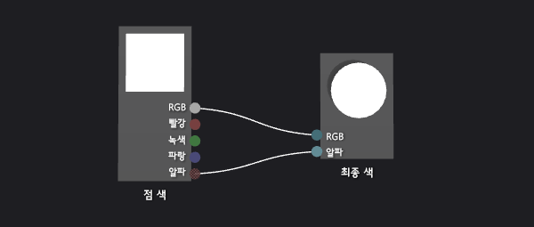
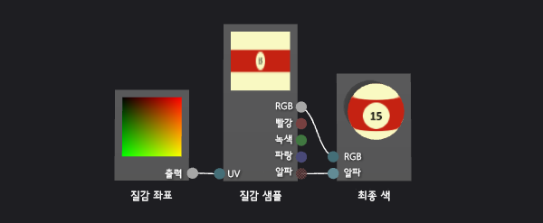
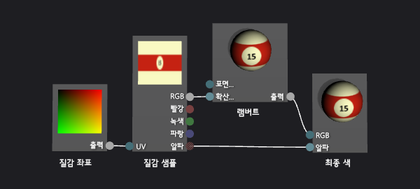
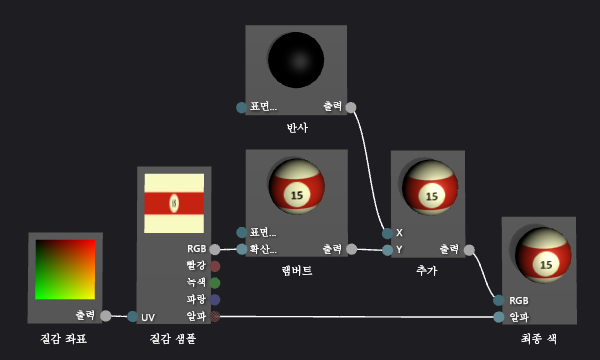
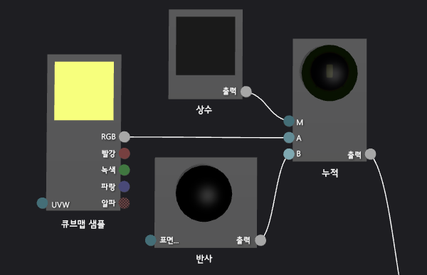
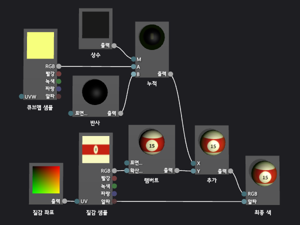

# 연습: 사실적인 3차원 당구공 만들기
[!INCLUDE[vs2017banner](../code-quality/includes/vs2017banner.md)]

이 연습에서는 셰이더 디자이너 및 [!INCLUDE[vsprvs](../code-quality/includes/vsprvs_md.md)]의 이미지 편집기를 사용하여 사실적인 3차원 당구 공 만드는 방법을 설명합니다.  당구 공 모양의 3차원 모양은 여러 셰이더 기술과 적합한 텍스처 리소스를 결합하여 얻을 수 있습니다.  
  
 이 문서는 다음과 같은 활동을 보여줍니다.  
  
-   모양과 질감을 사용하여 당구공의 기본 모양 만들기.  
  
-   램버트 조명 모델을 사용하여 깊이 추가.  
  
-   반사 하이라이트를 사용하여 기본 모양을 향상시킵니다.  
  
-   환경을 반영하여 공간감 만들기  
  
## 사전 요구 사항  
 이 연습을 완료하려면 다음과 같은 구성 요소 및 기술이 필요합니다.  
  
-   2010년 6월 DirectX SDK에 포함된 DirectX Texture Tool처럼 큐브 맵에 텍스처를 어셈블하는 도구입니다.  
  
-   [!INCLUDE[vsprvs](../code-quality/includes/vsprvs_md.md)]에서 이미지 편집기의 친숙성.  
  
-   [!INCLUDE[vsprvs](../code-quality/includes/vsprvs_md.md)]에서 셰이더 디자이너의 친숙성.  
  
## 모양과 질감을 사용하여 기본 모양 만들기  
 컴퓨터 그래픽에서 모양의 가장 기본적인 요소는 모양과 색상입니다.  컴퓨터 시뮬레이션에서는 실제 세계의 개체의 모양을 표현할 수 있도록 3차원 모델을 사용하는 것이 일반적입니다.  질감 맵을 사용하여 모델의 표면에 색 세부 사항이 적용됩니다.  
  
 일반적으로 아티스트에게 사용할 수 있는 3차원 모델을 만들어 달라고 요청할 수 있지만 당구 공이 일반적인 모양\(구\)이기 때문에 셰이더 디자이너에는 이미 적합한 모델이 구축되어 있습니다.  
  
 구는 셰이더 디자이너에서 기본 미리 보기 기본 도형입니다. 셰이더를 미리 보기 위해 현재 다른 셰이프를 사용하는 경우에 구로 다시 전환합니다.  
  
#### 구형을 사용하여 셰이더를 미리 보려면  
  
-   셰이더 디자이너 도구 모음에서 **구로 미리 봅니다.**를 선택합니다.  
  
 다음 단계에서 텍스처를 모델에 적용하는 셰이더 프로그램을 만들 수 있지만 먼저 사용할 수 있는 텍스처를 만들어야 합니다.  이 연습에서는 [!INCLUDE[vsprvs](../code-quality/includes/vsprvs_md.md)]의 일부인 이미지 편집기를 사용하여 텍스처를 만드는 방법을 설명하지만 적합한 형식으로 텍스처를 저장할 수 있는 모든 이미지 편집기를 사용할 수 있습니다.  
  
 **속성** 창과 **도구 상자**가 표시되는지 확인하십시오.  
  
#### 이미지 편집기를 사용하여 당구공 질감을 만들려면  
  
1.  사용할 질감을 만듭니다.  질감을 프로젝트에 추가하는 방법에 대한 내용은 [이미지 편집기](../designers/image-editor.md)의 시작 단원을 참조하십시오.  
  
2.  너비가 높이의 두 배가 되도록 이미지를 설정합니다. 이는 텍스처가 당구공의 구체 표면에 매핑되는 방식이기 때문에 필요합니다.  이미지 크기를 조정하려면 **속성** 창에서 **너비** 및 **높이** 속성에 대해 새 값을 지정합니다.  예를 들어, 너비와 높이를 각각 512와 256으로 설정합니다.  
  
3.  질감이 구체로 매핑되는 방법을 염두에 두고 당구 공에 질감을 그립니다.  
  
     텍스처는 다음과 같이 됩니다.  
  
       
  
4.  선택적으로 이 질감의 저장 요구 사항을 줄일 수 있습니다.  높이에 맞게 질감의 너비를 줄여 이것을 수행할 수 있습니다.  이를 통해 너비에 따라 텍스처가 압축되지만 텍스처가 구에 매핑되는 방식으로 인해 당구 공이 렌더링되면 텍스처는 확장됩니다.  크기 조정 후 질감은 다음과 비슷해 보여야 합니다.  
  
       
  
 이제 이 질감을 모델에 적용하는 셰이더를 만들 수 있습니다.  
  
#### 기본 질감 셰이더를 만들려면  
  
1.  사용할 DGSL 셰이더를 만듭니다.  DGSL 셰이더를 프로젝트에 추가하는 방법에 대한 내용은 [셰이더 디자이너](../designers/shader-designer.md)의 시작 단원을 참조하십시오.  
  
     기본적으로 셰이더 그래프는 다음과 같습니다.  
  
       
  
2.  현재 픽셀에 텍스처 샘플의 값을 적용할 수 있도록 기본 셰이더를 수정합니다.  셰이더 그래프는 다음과 같습니다.  
  
       
  
3.  텍스처 속성을 구성하여 이전의 절차에서 생성한 텍스처를 적용합니다.  **텍스처 샘플** 노드의 **텍스처** 속성 값을 **Texture1**로 설정한 다음 동일한 속성 창에서 **Texture1** 속성 그룹의 **파일 이름** 속성을 사용하여 텍스처를 지정합니다.  
  
 셰이더에 텍스처를 적용하는 방법에 대한 자세한 내용은 [방법: 기본 질감 셰이더 만들기](../designers/how-to-create-a-basic-texture-shader.md)을 참조하십시오.  
  
 당구공은 이제 다음과 같이 보여야 합니다.  
  
   
  
## 램버트 조명 모델을 사용하여 깊이 만들기  
 지금까지 쉽게 인식할 수 있는 당구공을 만들었습니다.  그러나 이것은 정밀한 복제품이라기 보다는 만화 그림의 당구공처럼 평평하고 흥미롭지 않습니다.  평면 모양은 당구 공의 표면에 있는 각 픽셀이 같은 양의 조명을 받는 것처럼 행동하는 간단한 셰이더에서 발생합니다.  
  
 실제 세계에서 광원에 직접 노출되는 표면에 빛이 나타나고 광원에 사각으로 노출되는 표면에는 이 보다 더 적은 양의 빛이 나타납니다.  표면에 광원이 직접 비출 경우 가장 작은 표면 영역에 광선의 에너지가 분산되기 때문입니다.  화면이 광원에서 멀어질수록 동일한 양의 에너지가 점점 더 큰 표면 영역에 분산됩니다  광원에서 떨어져 빛을 전혀 받지 않는 표면은 완전히 어둡게 나타납니다.  개체 표면의 밝기 변화는 개체 모양을 나타내는 데 도움을 주는 중요한 중요한 시각적 신호입니다. 이러한 변화가 없으면 개체는 편평하게 보입니다.  
  
 컴퓨터 그래픽에서는 복잡한 실제 세계 빛의 상호작용을 간단하게 근사화한 *조명 모델*을 실제 세계의 조명 모양 복제에 사용합니다.  Lambert 조명 모델은 이전 단락에서 설명한 대로 개체의 표면에 확산 반사된 조명을 양의 다르게 합니다.  당구 공에 더 그럴듯한 3차원 모양을 부여하기 위해 해당 셰이더에 Lambert 조명 모델을 추가할 수 있습니다.  
  
#### 해당 셰이더에 램버트 조명을 추가하려면  
  
-   램버트 조명 값으로 질감 샘플의 값을 조절하도록 셰이더를 수정합니다.  셰이더 그래프는 다음과 같습니다.  
  
       
  
-   선택적으로 셰이더 그래프의 **MaterialDiffuse** 속성을 구성하여 조명이 작동하는 방식을 조절할 수 있습니다.  셰이더 그래프의 속성에 액세스하려면 디자인 화면의 빈 영역을 선택한 후 **속성** 창에서 액세스하려는 속성을 찾습니다.  
  
 셰이더에 램버트 조명을 적용하는 방법에 대한 자세한 내용은 [방법: 기본 램버트 셰이더 만들기](../designers/how-to-create-a-basic-lambert-shader.md)을 참조하십시오.  
  
 램버트 조명이 적용된 상태에서 당구공은 다음과 같이 나타납니다.  
  
   
  
## 반사 하이라이트를 사용하여 기본 모양을 향상시킵니다.  
 Lambert 조명 모델은 모양의 개념과 텍스처 전용 셰이더에 없는 차원을 제공합니다.  그러나 당구 공도 다소 무딘 모양이 있습니다.  
  
 실제 당구 공은 일반적으로 공에 떨어지는 빛을 일부를 반사하는 광택이 나는 표면을 가지고 있습니다.  이 반사된 조명의 일부는 반사 하이라이트가 되어 화면의 반사 속성을 시뮬레이션합니다.  마무리 속성에 따라 강조 표시가 지역화되거나 넓어질 수 있으며 강렬하거나 미묘해질 수 있습니다.  이러한 반사 리플렉션은 광원, 표면의 방향, 카메라 위치 사이의 관계를 사용하여 모델링됩니다. 즉, 표면의 방향이 카메라에 직접 광원을 반영하고 리플렉션이 덜 직접적일 경우 하이라이트는 가장 강합니다.  
  
 퐁 조명 모델은 이전 단락에서 설명한 바와 같이 반사 하이라이트가 포함하기 위해 Lambert 조명 모델에 구축됩니다.  Phong 조명 모델을 셰이더에 추가하여 당구 공에 더욱 흥미로운 모양을 갖는 시뮬레이션된 마무리를 제공할 수 있습니다.  
  
#### 해당 셰이더에 반사 조명을 추가하려면  
  
1.  추가 혼합을 사용하여 반사 기여도를 포함하도록 셰이더를 수정합니다.  셰이더 그래프는 다음과 같습니다.  
  
       
  
2.  또는 셰이더 그래프의 반사 속성\(**MaterialSpecular** 및 **MaterialSpecularPower**\)을 구성하여 반사 하이라이트가 작동하는 방식을 조정할 수 있습니다.  셰이더 그래프의 속성에 액세스하려면 디자인 화면의 빈 영역을 선택한 후 **속성** 창에서 액세스하려는 속성을 찾습니다.  
  
 셰이더에 반사 하이라이트를 적용하는 방법에 대한 자세한 내용은 [방법: 기본 퐁 셰이더 만들기](../designers/how-to-create-a-basic-phong-shader.md)을 참조하십시오.  
  
 반사 강조가 적용된 상태에서 당구공은 다음과 같이 나타나야 합니다.  
  
   
  
## 환경을 반영하여 공간감 만들기  
 반사 강조가 적용된 상태에서 당구공은 정말 진짜처럼 보입니다.  오른쪽 셰이프, 오른쪽 그리기 작업 및 오른쪽 마침입니다.  그러나 해당 환경의 일부처럼 보이도록 당구공을 만들 수 있는 기술이 한 가지 더 있습니다.  
  
 실제 당구 공을 자세히 살펴보면 광택 있는 표면은 반사광뿐만 아니라 주변의 이미지에 의해 희미하게 반사된 것을 볼 수 있습니다.  환경의 이미지를 질감으로 사용하고 모델의 자체 질감과 결합하여 각 픽셀의 최종 색을 확인하여 이 반사를 시뮬레이션할 수 있습니다.  마감하고자 하는 종류에 따라, 리플렉션 질감을 나머지 셰이더와 더 많이 또는 더 적게 결합할 수 있습니다.  예를 들어, 거울과 같이 높은 반사율을 가진 반사면을 묘사하는 셰이더는 오직 반사 텍스처만을 사용할 수 있습니다. 하지만, 당구공과 같이 미묘한 반사를 묘사하는 셰이더는 반사 텍스처 값의 일부분과 나머지 부분의 셰이더 계산을 조합할 수 있습니다.  
  
 물론 사용자는 단순히 모델 텍스처 맵을 적용한 동일한 방식으로 모델에 반사된 이미지를 적용할 수 없습니다.  만약 그렇게 하면, 빛의 반사가 당구공에 접한 것처럼 움직입니다.  어느 방향에서든 반사가 될 수 있기 때문에 모든 각도에 대한 반사맵 값을 제공하고 세계를 중심으로 반사맵을 유지할 방법이 필요합니다.  이러한 요구 사항을 충족하기 위해 큐브의 면을 형성하기 위해 배열된 6개의 텍스처를 제공하는 *큐브 맵*이라는 특수한 종류의 텍스처 맵을 사용할 수 있습니다.  이 큐브 내에서 어느 방향으로나 가리켜 질감 값을 찾을 수 있습니다.  정육면체의 각 면의 질감이 환경의 이미지를 포함하면 정육면체 표면의 올바른 위치를 선택하여 모든 반사를 시뮬레이션할 수 있습니다.  큐브를 월드에 정렬시킴으로써 환경을 정확히 반영하게 됩니다.  큐브를 샘플링해야 하는 위치를 확인하려면 개체 표면의 카메라 벡터의 리플렉션을 계산한 다음 3차원 텍스처 좌표로 사용합니다.  이런 식으로 큐브 맵을 사용하는 것은 *환경 매핑*이라는 일반적인 방법입니다.  
  
 환경 매핑은 이전 단락에서 설명하는 대로 실제 반사의 효율적인 근사값을 제공합니다.  환경 매핑 반사를 셰이더에 혼합하여 장면에서 당구 공이 더 둥글게 보이도록 만드는 시뮬레이션된 마무리를 당구 공에 제공할 수 있습니다.  
  
 첫 번째 단계에서는 큐브 맵 텍스처를 만듭니다.  여러 종류의 응용 프로그램에서 큐브 맵의 내용은 특히 반사가 미묘하거나 화면에 많은 공간을 차지하지 않는다면 효과적으로 완벽할 필요가 없습니다.  예를 들어, 많은 게임은 환경 매핑을 위해 미리 계산된 큐브 맵을 사용하고 반사가 정확하지 않더라도 각 반사체 중 가장 가까운 것을 사용합니다.  개괄적인 샘플이라도 확실한 효과를 얻기에 충분합니다.  
  
#### 이미지 편집기를 사용하여 환경 맵에 대한 질감을 만들려면  
  
1.  사용할 질감을 만듭니다.  질감을 프로젝트에 추가하는 방법에 대한 내용은 [이미지 편집기](../designers/image-editor.md)의 시작 단원을 참조하십시오.  
  
2.  해당 너비가 높이와 동일하고 크기가 2의 거듭제곱이 되도록 이미지 크기를 설정합니다. 이 설정은 큐브 맵 인덱싱 방식 때문에 필요합니다.  이미지 크기를 조정하려면 **속성** 창에서 **너비** 및 **높이** 속성에 대해 새 값을 지정합니다.  예를 들어, **너비** 및 **높이** 속성을 256으로 설정합니다.  
  
3.  질감을 단색으로 채웁니다.  이 텍스처는 당구 테이블의 표면에 해당하는 큐브 맵의 아래쪽입니다.  다음 질감에 대해 사용한 색상을 염두에 두십시오.  
  
4.  첫 번째와 같은 크기의 두 번째 질감을 만듭니다.  이 텍스처는 당구 테이블의 표면과 면 그리고 당구 테이블 주변의 영역에 해당하는 큐브 맵의 4개 면에서 반복됩니다.  맨 아래 텍스처와 같은 색을 사용하여 이 텍스처에 당구 테이블의 표면을 그려야 합니다.  텍스처는 다음과 같이 됩니다.  
  
       
  
     반사 맵은 효과적이기 위해 사진과 동일할 필요는 없습니다. 예를 들어, 이 문서에서 이미지를 만드는 데 사용하는 큐브 맵에는 6개가 아니라 4개의 포켓만이 포함되어 있습니다.  
  
5.  나머지 질감과 같은 크기의 세 번째 질감을 만듭니다.  이 텍스처는 당구 테이블 위의 천정에 해당하는 큐브 맵의 위쪽입니다.  리플렉션의 이 부분을 더욱 세련되게 하기 위해 오버헤드 조명을 그려 이전 절차에서 셰이더에 추가한 반사 하이라이트를 강화할 수 있습니다.  텍스처는 다음과 같이 됩니다.  
  
       
  
 큐브 맵 측면에 개별 텍스처를 만들었으므로 단일 .dds 텍스처에 저장할 수 있는 큐브 맵에 텍스처를 결합하는 도구를 사용할 수 있습니다.  .dds 질감 형식으로 큐브 맵을 저장할 수 있는 경우 큐브 맵을 만들려는 프로그램을 사용할 수 있습니다.  이 연습에서는 2010년 6월 DirectX SDK의 일부인 DirectX 텍스처 도구를 사용하여 텍스처를 만드는 방법을 보여줍니다.  
  
#### DirectX 질감 도구를 사용하여 큐브 맵을 어셈블하려면  
  
1.  DirectX Texture 도구의 주 메뉴에서 **파일**, **새 질감**을 선택합니다.  **새 질감** 대화 상자가 나타납니다.  
  
2.  **질감 형식** 그룹에서 **큐브맵 질감**을 선택합니다.  
  
3.  **치수** 그룹에 **너비**와 **높이**에 대해 올바른 값을 입력한 다음 **확인**을 선택합니다.  새 질감 문서가 나타납니다.  기본적으로 질감 문서에 처음 표시되는 질감은 **양의 X** 큐브 면에 해당합니다.  
  
4.  큐브 면에 질감 큐브의 측면에 대해 만든 질감을 로드합니다.  주 메뉴에서 **파일**, **이 큐브 맵 면에 열기**를 선택하고 큐브의 측면에 만든 텍스처를 선택한 다음 **열기**를 선택합니다.  
  
5.  **음수 X**, **양수 Z** 및 **음수 Z** 큐브 면에 대해 4단계를 반복합니다.  이렇게 하려면 로드하려는 면을 보아야 합니다.  다른 큐브 맵 면을 보려면 주 메뉴에서 **보기**, **큐브 맵 면**를 선택한 다음 볼 면을 선택합니다.  
  
6.  **\+Y**큐브 면에 질감 큐브 위쪽에 생성한 질감을 로드합니다.  
  
7.  **\-Y**큐브 면에 질감 큐브 아래쪽에 생성한 질감을 로드합니다.  
  
8.  질감을 저장합니다.  
  
 큐브 맵의 레이아웃을 다음과 같이 상상할 수 있습니다.  
  
   
  
 위쪽의 이미지는 양수 Y\(\+ Y\) 큐브 면이고 중간, 왼쪽에서 오른쪽은 \-X \+ Z \+ X이며 아래는 Y 큐브 면입니다.  
  
 이제 큐브 맵 샘플이 셰이더의 나머지에 혼합되도록 셰이더를 수정할 수 있습니다.  
  
#### 해당 셰이더에 환경 매핑을 추가하려면  
  
1.  추가 혼합을 사용하여 환경 매핑 기여도를 포함하도록 셰이더를 수정합니다.  셰이더 그래프는 다음과 같습니다.  
  
       
  
     **곱셈\-덧셈** 노드를 사용하여 셰이더 그래프를 간소화할 수 있습니다.  
  
     환경 매핑을 구현하는 셰이더 노드의 자세한 보기는 다음과 같습니다.  
  
       
  
2.  큐브 맵의 텍스처 속성을 구성하여 이전의 절차에서 생성한 텍스처를 적용합니다.  **Cubemap 샘플** 노드의 **텍스처** 속성 값을 **Texture2**로 설정한 다음 **Texture2** 속성 그룹의 **파일 이름** 속성을 사용하여 텍스처를 지정합니다.  
  
3.  선택적으로 **상수** 노드의 **출력** 속성을 구성하여 당구공의 반사를 조절할 수 있습니다.  노드의 속성에 액세스하려면 항목을 선택한 후 **속성** 창에서 액세스하려는 속성을 찾습니다.  
  
 환경 매핑이 적용된 상태에서 당구공은 다음과 같이 나타납니다.  
  
   
  
 이 최종 이미지에서는 추가한 효과가 진짜 당구 공을 만드는 방법을 보여 줍니다.  모양, 텍스처 및 조명은 3차원 개체의 기본 모양, 반사 하이라이트 및 리플렉션을 만들어 당구 공을 더욱 흥미롭게 하고 환경의 일부 처럼 보이게 합니다.  
  
## 참고 항목  
 [방법: 셰이더 내보내기](../designers/how-to-export-a-shader.md)   
 [방법: 3차원 모델에 셰이더 적용](../designers/how-to-apply-a-shader-to-a-3-d-model.md)   
 [셰이더 디자이너](../designers/shader-designer.md)   
 [이미지 편집기](../designers/image-editor.md)   
 [셰이더 디자이너 노드](../designers/shader-designer-nodes.md)