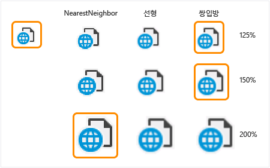

# DPI 문제 해결
[!INCLUDE[vs2017banner](../code-quality/includes/vs2017banner.md)]

장치 수가 늘어나면 "고해상도" 화면을 제공 합니다. 이 화면에는 일반적으로 200 개가 넘는 픽셀 \(ppi\) 수 있습니다. 이러한 컴퓨터에서 응용 프로그램 작업에는 콘텐츠를 보는 장치에 대 한 보기 어려울 거리에 있는 항목의 요구를 충족 하도록 확장 될 필요 합니다. 2014 년 고밀도 디스플레이 대 한 기본 대상은 모바일 컴퓨팅 장치 \(태블릿, 클램쉘 랩톱 및 휴대폰\)입니다.  
  
 Windows 8.1 이상 디스플레이 및 컴퓨터 고밀도 둘 다에 연결 된 표준 밀도 동시에 표시 하는 환경에 맞게 이러한 컴퓨터를 사용 하도록 설정 하려면 몇 가지 기능이 포함 되어 있습니다.  
  
-   Windows에서 "만들기" 텍스트와 다른 항목 보다 크거나 작게를 사용 하는 장치에 맞게 내용 조정 수 설정 \(Windows XP부터 사용 가능\).  
  
-   Windows 8.1 이상 자동으로 콘텐츠 대부분의 응용 프로그램의 서로 다른 픽셀 밀도 표시 간 이동 하는 경우 일치 하도록 조정 됩니다. 기본 디스플레이 높은 밀도 \(200% 배율\) 이며 보조 디스플레이 표준 밀도 \(100%\) 때 Windows는 자동으로 축소할 응용 프로그램 창 내용 보조 디스플레이 \(1 픽셀 응용 프로그램에서 렌더링 되는 모든 4 픽셀에 대 한 표시\).  
  
-   Windows 픽셀 밀도 대 한 크기 조정 및 표시 \(Windows 7 이상 OEM 구성 가능\)에 대 한 거리 보기 오른쪽 기본값으로 설정 됩니다.  
  
-   Windows 자동으로 확장할 수 콘텐츠를 250 %280 ppi \(현재 Windows 8.1 S14\)를 초과 하는 새 장치에 있습니다.  
  
 Windows에 UI를 확장 하는 작업을 다루는 증가 된 픽셀 수를 활용 하는 방법이 있습니다. 응용 프로그램 자체 "시스템 DPI를 인식 합니다."를 선언 하 여이 시스템에 옵트인 이렇게 하지 않으면 하는 응용 프로그램 시스템에 의해 확장 됩니다. 이 옵션은 여기서 전체 응용 프로그램은 균일 하 게 픽셀 확대 "유사" 사용자 환경에서 발생할 수 있습니다. 예:  
  
   
  
 Visual Studio 확장을 인식 하는 DPI 되에 옵트인 하 고 따라서가 가상화 되지 않은"."  
  
 Windows \(및 Visual Studio\) 시스템에서 설정한 배율은 처리 하는 여러 가지 방법으로 여러 가지 UI 기술을 활용 합니다. 예:  
  
-   WPF \(단위, 픽셀이 아닌\) 장치 독립적인 방식으로 컨트롤을 측정합니다. WPF UI를 현재 DPI에 대해 자동으로 조정 합니다.  
  
-   UI 프레임 워크에 관계 없이 모든 텍스트 크기 포인트 단위로 표현 됩니다 않으며 따라서 시스템에 의해 DPI 독립적으로 처리 됩니다. Win32, WinForms 및 WPF의 텍스트를 이미 강화 올바르게는 표시 장치에 그리는 경우.  
  
-   Win32\/WinForms 대화 상자 및 창 있는 눈금, 흐름 및 표 레이아웃 패널을 통해 예를 들어 텍스트가 아니라 여 크기가 조정 된 레이아웃을 사용 하도록 설정 하기 위한 방법입니다. 이러한 글꼴 크기는 증가 하는 경우 배율이 조정 되지 않으므로 하드 코드 된 픽셀 위치 방지 도구를 사용 합니다.  
  
-   시스템에서 제공 하는 아이콘 또는 시스템 메트릭 \(예를 들어 SM\_CXICON 및 SM\_CXSMICON\)를 기반으로 리소스는 이미 맞춰집니다.  
  
## 이전 Win32 \(GDI, GDI \+\) 및 WinForms 기반 UI  
 WPF는 이미 높은 DPI\-인식, 대부분의 Win32\/GDI 기반 코드 되지로 기록 되었으나 염두에서 DPI 인식 합니다. DPI 조정 Api를 제공 했습니다. Win32 문제 수정 제품 전체에 걸쳐 일관 되 게 사용 해야 합니다. Visual Studio에서 도우미 메서드를 제공 하는 기능을 복제 하 고 제품 일관성을 유지 하지 않으려면 클래스 라이브러리입니다.  
  
## 고해상도 이미지  
 이 섹션은 주로 Visual Studio 2013을 확장 하는 개발자가 됩니다. Visual Studio 2015 용 Visual Studio에 기본 제공 되는 이미지 서비스를 사용 합니다. 여러 버전의 Visual Studio 지원\/대상으로 해야 하 고 따라서 이미지 서비스를 사용 하 여 2015에서 불가능 한 이전 버전에 존재 하지 않는 한 이후 찾을 수 있습니다. 이 여기서는 또한 다음입니다.  
  
## 되기에는 너무 작은 이미지를 배율 조정  
 되기에는 너무 작은 이미지 "확장" 하 고 GDI 및 몇 가지 일반적인 방법 사용 하 여 WPF에서 렌더링 될 수 있습니다. 관리 되는 DPI 도우미 클래스는 내부 및 외부 Visual Studio 통합 업체 주소 아이콘, 비트맵, imagestrips, 및 imagelists 크기 조정에 사용할 수 있습니다. Win32 기반 네이티브 C \/ C \+ \+ 도우미 HICON, HBITMAP, HIMAGELIST, 및 VsUI::GdiplusImage 크기 조정에 사용할 수 있습니다. 일반적으로 비트맵의 크기 조정 도우미 라이브러리에 대 한 참조를 포함 한 후 한 줄짜리 변경만 필요 합니다. 예:  
  
```cpp  
(Unmanaged)  VsUI::DpiHelper::LogicalToDeviceUnits(&hBitmap);  
```  
  
```c#  
(WinForms) DpiHelper.LogicalToDeviceUnits(ref image);  
```  
  
 Imagelist 크기 조정 아니면 했는지에 따라 다릅니다 imagelist 로드 시, 완료 된 런타임에 추가 됩니다. 로드 시간에 완료 하는 경우에 비트맵와 마찬가지로 LogicalToDeviceUnits\(\) imagelist를 호출 합니다. 코드를 imagelist 작성 하기 전에 개별 비트맵을 로드 해야 하는 경우의 imagelist 이미지 크기를 조정할 수 있는지 확인 합니다.  
  
```c#  
imagelist.ImageSize = DpiHelper.LogicalToDeviceUnits(imagelist.ImageSize);  
```  
  
 네이티브 코드에서 차원은 만들 때 imagelist 다음과 같은 확장 될 수 있습니다.  
  
```cpp  
ImageList_Create(VsUI::DpiHelper::LogicalToDeviceUnitsX(16),VsUI::DpiHelper::LogicalToDeviceUnitsY(16), ILC_COLOR32|ILC_MASK, nCount, 1);  
```  
  
 함수 라이브러리의 크기 조정 알고리즘을 지정할 수 있음 경우 크기 조정 imagelists를 배치 하려면 투명도에 사용 되는 배경색을 지정 해야 이미지나 NearestNeighbor 배율 \(그러면 125%, 150%에 왜곡\) 사용 합니다.  
  
 참조는 <xref:Microsoft.VisualStudio.PlatformUI.DpiHelper> msdn 설명서입니다.  
  
 다음 표에서 요소 크기 조정 방법을 이미지 크기를 조정할지 해당 DPI에 예제가 나와 있습니다. 녹색의 이미지는 우리의 가장 좋은 방법은 Visual Studio 2013 \(100 ~ 200 %DPI 조정\)을 기준으로 표시:  
  
   
  
## 레이아웃 문제  
 절대 위치 \(특히, 픽셀 단위\)를 사용 하는 대신 확장 ui에서 및 서로 관련 포인트를 유지 하 여 주로 일반적인 레이아웃 문제를 방지할 수 있습니다. 예:  
  
-   레이아웃\/텍스트 위치는 수직 확장 이미지에 맞게 조정 해야 합니다.  
  
-   표에서 열 너비를 확장 된 텍스트에 맞게 조정 해야 합니다.  
  
-   하드 코드 된 크기나 요소 사이 공백을 크기가 조정 되도록 해야 합니다. 텍스트 크기에 대해서만 기반 하는 크기, 일반적으로 세밀 하 게 되므로 글꼴 자동으로 조정 됩니다.  
  
 사용할 수 있는 도우미 함수는 <xref:Microsoft.VisualStudio.PlatformUI.DpiHelper> 클래스를 통해 X 및 Y 축에서 크기 조정:  
  
-   LogicalToDeviceUnitsX\/LogicalToDeviceUnitsY \(함수를 사용 하면 X에 크기 조정 \/ Y 축\)  
  
-   int 공간 \= DpiHelper.LogicalToDeviceUnitsX \(10\).  
  
-   int 높이 \= VsUI::DpiHelper::LogicalToDeviceUnitsY\(5\);  
  
 Rect, 지점 및 크기와 같은 개체를 확장할 LogicalToDeviceUnits 오버 로드가 있습니다.  
  
## 이미지 배율을 조정 및 레이아웃을 DPIHelper 라이브러리\/클래스를 사용 하 여  
 Visual Studio DPI 도우미 라이브러리 네이티브 및 관리 되는 양식에서 사용할 수 있으며 다른 응용 프로그램에서 Visual Studio shell 외부에서 사용할 수 있습니다.  
  
 라이브러리를 사용 하려면로 이동 된 [Visual Studio VSSDK 확장성 샘플](https://github.com/Microsoft/VSSDK-Extensibility-Samples) 높은 DPI\_Images\_Icons 샘플을 복제 하 고  
  
 소스 파일에서 VsUIDpiHelper.h 등 VsUI::DpiHelper 클래스의 정적 함수를 호출 합니다.  
  
```cpp  
#include "VsUIDpiHelper.h"  
  
int cxScaled = VsUI::DpiHelper::LogicalToDeviceUnitsX(cx);  
VsUI::DpiHelper::LogicalToDeviceUnits(&hBitmap);  
  
```  
  
> [!NOTE]
>  정적 클래스 수준 또는 모듈 수준 변수에서 도우미 함수를 사용 하지 마십시오. 라이브러리 스레드 동기화에도 정적 변수를 사용 하 고 초기화 순서 문제가 발생할 수 있습니다. 비정적 멤버 변수를 해당 정적 변수를 변환 하거나 \(첫 번째 액세스 시 생성 될\) 하도록 함수를 래핑하십시오.  
  
 Visual Studio 환경에서 실행 되는 관리 코드에서 DPI 도우미 함수에 액세스 합니다.  
  
-   사용 하는 프로젝트 셸을 MPF의 최신 버전을 참조 해야 합니다. 예:  
  
    ```c#  
    <Reference Include="Microsoft.VisualStudio.Shell.14.0.dll" />  
    ```  
  
-   프로젝트에 대 한 참조가 확인 **System.Windows.Forms**, **PresentationCore**, 및 **PresentationUI**합니다.  
  
-   코드에서 사용 된 **Microsoft.VisualStudio.PlatformUI** DpiHelper 클래스의 정적 함수 네임 스페이스를 호출 합니다. 지원 되는 종류 \(지점, 크기, 사각형 및 등\)을 새로운 반환 하는 확장 함수 개체를 확장할 제공 합니다. 예:  
  
    ```c#  
    using Microsoft.VisualStudio.PlatformUI;  
    double x = DpiHelper.LogicalToDeviceUnitsX(posX);  
    Point ptScaled = ptOriginal.LogicalToDeviceUnits();  
    DpiHelper.LogicalToDeviceUnits(ref bitmap);  
  
    ```  
  
## 가능한 UI에서 WPF 이미지 허용량 처리  
 Wpf에서 비트맵 자동으로 조정 됩니다 WPF에서 사진 또는 큰 스크린 샷을 잘 작동 하지 않으면이 메뉴 항목 아이콘에 대 한 적절 한 인식된 허용량을 도입 하기 때문입니다 고품질 이중 큐빅 알고리즘 \(기본값\), 사용 하 여 현재 DPI 확대\/축소 수준입니다.  
  
 권장 사항:  
  
-   로고 이미지와 배너 아트 워크를 기본에 대 한 <xref:System.Windows.Media.BitmapScalingMode> 크기 모드를 사용할 수 있습니다.  
  
-   메뉴 항목과도 해 이미지에는 <xref:System.Windows.Media.BitmapScalingMode> 허용량 \(200%, 300%\)에서 제거 하기 위해 다른 왜곡 아티팩트를 발생 하지 않습니다 때 사용 해야 합니다.  
  
-   •	큰 확대\/축소 수준 \(예를 들어 250% 또는 %350\) 100%의 배수가 없습니다,에 대 한 퍼지 바랜 UI 발생 이중 큐빅을 사용 하 여의 해 이미지 크기를 조정 합니다. 첫 번째 100% \(예를 들어, 200% 또는 300%\)의 가장 큰 배수로 NearestNeighbor 사용 하 여 이미지 크기 조정 및 여기에서 이중 큐빅 크기 조정 하 여 더 나은 결과 얻습니다. 특수 한 사례를 참조 하십시오.: 자세한 내용은 수준 큰 dpi WPF 이미지 prescaling 합니다.  
  
 Microsoft.VisualStudio.PlatformUI 네임 스페이스의 DpiHelper 클래스 멤버를 제공 합니다. <xref:System.Windows.Media.BitmapScalingMode> 에 바인딩에 사용할 수 있습니다. Visual Studio shell 크기 조정 모드로 제품 간에 일관 되 게 DPI 배율에 따라 비트맵을 제어할 수 있습니다.  
  
 를 사용 하려면 XAML에서 다음을 추가 합니다.  
  
```xaml  
xmlns:vsui="clr-namespace:Microsoft.VisualStudio.PlatformUI;assembly=Microsoft.VisualStudio.Shell.14.0"  
  
<Setter Property="RenderOptions.BitmapScalingMode" Value="{x:Static vs:DpiHelper.BitmapScalingMode}" />  
  
```  
  
 이미 Visual Studio shell 최상위 창 및 대화 상자에서이 속성을 설정합니다. 이미 Visual Studio에서 실행 하는 WPF 기반 UI 것을 상속 합니다. UI의 특정 말에 설정을 전파 하지 않습니다, XAML\/WPF UI의 루트 요소에 대해 설정할 수 있습니다. Blend와 같은 디자이너 창 부재 중 실행 하는 처리 및이 발생 하는 위치에는 팝업 Win32 부모 요소에 포함 됩니다.  
  
 일부 UI는 Visual Studio 텍스트 편집기 및 WPF 기반 디자이너 \(WPF 데스크톱 및 Windows 스토어\)와 같은 시스템 집합 DPI 확대\/축소 수준을 독립적으로 확장할 수 있습니다. 이러한 경우 DpiHelper.BitmapScalingMode 사용 해야 합니다. 편집기에서이 문제를 해결 하려면 사용자 지정 속성을 생성 하는 IDE 팀 RenderOptions.BitmapScalingMode 제목 있습니다. 시스템 및 UI의 결합 된 확대\/축소 수준에 따라 HighQuality 또는 NearestNeighbor 해당 속성 값을 설정 합니다.  
  
## 특별 한 경우: prescaling 큰 DPI 수준에 대 한 WPF 이미지  
 100% \(예를 들어 250%, 350% 등에\)의 배수로 없는 매우 큰 확대\/축소 수준에 대 한 퍼지, 바랜 UI에서 이중 큐빅 결과 사용 하 여의 해 이미지를 확장 합니다. 뚜렷하게 텍스트와 함께 이러한 이미지 처럼이 비슷합니다 거의 하는 것 처럼 보입니다. 눈으로 및 텍스트와 관련 하 여 초점이 가깝게 이미지가 나타납니다. 첫 번째 100% \(예를 들어, 200% 또는 300%\)의 가장 큰 배수로 NearestNeighbor 사용 하 여 이미지 크기 조정 및 크기 조정으로 크기를 나머지 \(추가 50%\)에 대 한 이중 큐빅이 확대 크기로 크기 조정 결과 향상 시킬 수 있습니다.  
  
 다음은 결과의 차이의 예는 첫 번째 이미지의 크기가 조정 되는 위치 200% 250%\-\> 100%\-\> 향상 된 이중 크기 조정 알고리즘을 사용 하 고 두 번째 이중 큐빅 100% 마찬가지로\-\> 250%입니다.  
  
   
  
 각 이미지 요소를 표시 하기 위한이 두 번 확장, XAML 태그를 사용 하 여 UI를 사용 하도록 설정 하려면 수정할 필요 합니다. 다음 예제에서는 DpiHelper 라이브러리 및 Shell.12\/14를 사용 하 여 Visual Studio에서 WPF에서 이중 확장을 사용 하는 방법을 보여 줍니다.  
  
 1 단계: 300%, 200%로 이미지를 Prescale 등에 NearestNeighbor를 사용 하 여입니다.  
  
 바인딩에서 또는 XAML 태그 확장에 적용 된 변환기를 사용 하 여 이미지를 prescale 합니다. 예:  
  
```xaml  
<vsui:DpiPrescaleImageSourceConverter x:Key="DpiPrescaleImageSourceConverter" />  
  
<Image Source="{Binding Path=SelectedImage, Converter={StaticResource DpiPrescaleImageSourceConverter}}" Width="16" Height="16" />  
  
<Image Source="{vsui:DpiPrescaledImage Images/Help.png}" Width="16" Height="16" />  
  
```  
  
 이미지는 또한 테마가 지원 될 해야 할 경우 \(아니지만 대부분, 해야\), 태그를 먼저 테마 이미지와 다음 사전 크기 조정을 수행 하는 다른 변환기를 사용할 수 있습니다. 태그를 사용할 수 <xref:Microsoft.VisualStudio.PlatformUI.DpiPrescaleThemedImageConverter> 또는 <xref:Microsoft.VisualStudio.PlatformUI.DpiPrescaleThemedImageSourceConverter>, 원하는 변환 출력에 따라 합니다.  
  
```xaml  
<vsui:DpiPrescaleThemedImageSourceConverter x:Key="DpiPrescaleThemedImageSourceConverter" />  
  
<Image Width="16" Height="16">  
  <Image.Source>  
    <MultiBinding Converter="{StaticResource DpiPrescaleThemedImageSourceConverter}">  
      <Binding Path="Icon" />  
      <Binding Path="(vsui:ImageThemingUtilities.ImageBackgroundColor)"    
               RelativeSource="{RelativeSource Self}" />  
      <Binding Source="{x:Static vsui:Boxes.BooleanTrue}" />  
    </MultiBinding>  
  </Image.Source>  
</Image>  
```  
  
 2 단계: 최종 크기가 현재 dpi 올바른지 확인 합니다.  
  
 WPF는 ui 요소에 설정 하는 BitmapScalingMode 속성을 사용 하 여 현재 dpi UI 조정 하기 때문에 소스 두세 시간 보다 더 큰 보이는지 대로 prescaled 이미지를 사용 하 여 이미지 컨트롤 해야 합니다. 다음은이 효과 대처 하는 몇 가지 방법입니다.  
  
-   100%에 원본 이미지의 치수를 알고 있는 경우에 이미지 컨트롤의 정확한 크기를 지정할 수 있습니다. 이러한 크기 적용 된 크기 조정 하기 전에 UI의 크기를 반영 합니다.  
  
    ```xaml  
    <Image Source="{Binding Path=SelectedImage, Converter={StaticResource DpiPrescaleImageSourceConverter}}" Width="16" Height="16" />  
    ```  
  
-   원본 이미지의 크기를 알 수 없는 경우 layouttransform 속성 최종 이미지 개체를 축소 하 사용할 수 있습니다. 예:  
  
    ```xaml  
    <Image Source="{Binding Path=SelectedImage, Converter={StaticResource DpiPrescaleImageSourceConverter}}" >  
        <Image.LayoutTransform>  
         <ScaleTransform  
             ScaleX="{x:Static vsui:DpiHelper.PreScaledImageLayoutTransformScale}"  
             ScaleY="{x:Static vsui:DpiHelper.PreScaledImageLayoutTransformScale}" />  
        </Image.LayoutTransform>  
    </Image>  
    ```  
  
## 에 WebOC HDPI 지원을 사용 하도록 설정  
 기본적으로 \(예: WPF 또는 \/ \/ IWebBrowser2 인터페이스에서 WebBrowser 컨트롤\) WebOC 컨트롤을 HDPI 검색 및 지원을 사용 하지 마십시오. 결과 포함된 된 컨트롤을 고해상도 디스플레이에 너무 작은 디스플레이 콘텐츠로 됩니다. 다음 특정 웹 WebOC 인스턴스에서 높은 DPI 지원을 사용 하도록 설정 하는 방법에 설명 합니다.  
  
 IDocHostUIHandler 인터페이스 구현 \(MSDN 문서를 참조는 [IDocHostUIHandler](http://msdn.microsoft.com/library/aa753260.aspx) 인터페이스\):  
  
```idl  
[ComImport, InterfaceType(ComInterfaceType.InterfaceIsIUnknown),  
 Guid("BD3F23C0-D43E-11CF-893B-00AA00BDCE1A")]  
public interface IDocHostUIHandler  
{  
    [return: MarshalAs(UnmanagedType.I4)]  
    [PreserveSig]  
    int ShowContextMenu(  
        [In, MarshalAs(UnmanagedType.U4)] int dwID,  
        [In] POINT pt,  
        [In, MarshalAs(UnmanagedType.Interface)] object pcmdtReserved,  
        [In, MarshalAs(UnmanagedType.IDispatch)] object pdispReserved);  
    [return: MarshalAs(UnmanagedType.I4)]  
    [PreserveSig]  
    int GetHostInfo([In, Out] DOCHOSTUIINFO info);  
    [return: MarshalAs(UnmanagedType.I4)]  
    [PreserveSig]  
    int ShowUI(  
        [In, MarshalAs(UnmanagedType.I4)] int dwID,  
        [In, MarshalAs(UnmanagedType.Interface)] object activeObject,  
        [In, MarshalAs(UnmanagedType.Interface)] object commandTarget,  
        [In, MarshalAs(UnmanagedType.Interface)] object frame,  
        [In, MarshalAs(UnmanagedType.Interface)] object doc);  
    [return: MarshalAs(UnmanagedType.I4)]  
    [PreserveSig]  
    int HideUI();  
    [return: MarshalAs(UnmanagedType.I4)]  
    [PreserveSig]  
    int UpdateUI();  
    [return: MarshalAs(UnmanagedType.I4)]  
    [PreserveSig]  
    int EnableModeless([In, MarshalAs(UnmanagedType.Bool)] bool fEnable);  
    [return: MarshalAs(UnmanagedType.I4)]  
    [PreserveSig]  
    int OnDocWindowActivate([In, MarshalAs(UnmanagedType.Bool)] bool fActivate);  
    [return: MarshalAs(UnmanagedType.I4)]  
    [PreserveSig]  
    int OnFrameWindowActivate([In, MarshalAs(UnmanagedType.Bool)] bool fActivate);  
    [return: MarshalAs(UnmanagedType.I4)]  
    [PreserveSig]  
    int ResizeBorder(  
        [In] COMRECT rect,  
        [In, MarshalAs(UnmanagedType.Interface)] object doc,  
        bool fFrameWindow);  
    [return: MarshalAs(UnmanagedType.I4)]  
    [PreserveSig]  
    int TranslateAccelerator(  
        [In] ref MSG msg,  
        [In] ref Guid group,  
        [In, MarshalAs(UnmanagedType.I4)] int nCmdID);  
    [return: MarshalAs(UnmanagedType.I4)]  
    [PreserveSig]  
    int GetOptionKeyPath(  
        [Out, MarshalAs(UnmanagedType.LPArray)] string[] pbstrKey,  
        [In, MarshalAs(UnmanagedType.U4)] int dw);  
    [return: MarshalAs(UnmanagedType.I4)]  
    [PreserveSig]  
    int GetDropTarget(  
        [In, MarshalAs(UnmanagedType.Interface)] IOleDropTarget pDropTarget,  
        [MarshalAs(UnmanagedType.Interface)] out IOleDropTarget ppDropTarget);  
    [return: MarshalAs(UnmanagedType.I4)]  
    [PreserveSig]  
    int GetExternal([MarshalAs(UnmanagedType.IDispatch)] out object ppDispatch);  
    [return: MarshalAs(UnmanagedType.I4)]  
    [PreserveSig]  
    int TranslateUrl(  
        [In, MarshalAs(UnmanagedType.U4)] int dwTranslate,  
        [In, MarshalAs(UnmanagedType.LPWStr)] string strURLIn,  
        [MarshalAs(UnmanagedType.LPWStr)] out string pstrURLOut);  
    [return: MarshalAs(UnmanagedType.I4)]  
    [PreserveSig]  
    int FilterDataObject(  
        IDataObject pDO,  
        out IDataObject ppDORet);  
    }   
```  
  
 필요에 따라 ICustomDoc 인터페이스를 구현 \(MSDN 문서를 참조는 [ICustomDoc](http://msdn.microsoft.com/library/aa753272.aspx) 인터페이스\):  
  
```idl  
[InterfaceType(ComInterfaceType.InterfaceIsIUnknown),  
 Guid("3050F3F0-98B5-11CF-BB82-00AA00BDCE0B")]  
public interface ICustomDoc  
{  
    void SetUIHandler(IDocHostUIHandler pUIHandler);  
}   
```  
  
 IDocHostUIHandler WebOC의 문서와 함께 구현 하는 클래스를 연결 합니다. 위의 ICustomDoc 인터페이스를 구현한 경우 WebOC의 문서 속성은 사용할 즉시는 ICustomDoc에 캐스팅 그리고 IDocHostUIHandler를 구현 하는 클래스를 전달 하 여 SetUIHandler 메서드를 호출 합니다.  
  
```c#  
// "this" references that class that owns the WebOC control and in this case also implements the IDocHostUIHandler interface  
ICustomDoc customDoc = (ICustomDoc)webBrowser.Document;  
customDoc.SetUIHandler(this);  
  
```  
  
 ICustomDoc 인터페이스를 구현 하지 않은 경우 다음 되는 즉시 WebOC의 문서 속성 유효 해야 하는 IOleObject으로 캐스팅 하 고 IDocHostUIHandler를 구현 하는 클래스에 전달 하 여 SetClientSite 메서드를 호출 합니다. GetHostInfo 메서드 호출에 전달 된 DOCHOSTUIINFO에 DOCHOSTUIFLAG\_DPI\_AWARE 플래그를 설정 합니다.  
  
```c#  
public int GetHostInfo(DOCHOSTUIINFO info)  
{  
    // This is what the default site provides.  
    info.dwFlags = (DOCHOSTUIFLAG)0x5a74012;  
    // Add the DPI flag to the defaults  
    info.dwFlags |=.DOCHOSTUIFLAG.DOCHOSTUIFLAG_DPI_AWARE;  
    return S_OK;  
}  
```  
  
 이 WebOC 컨트롤 HPDI 가져와야 하는 모든 이어야 합니다.  
  
## 팁  
  
1.  WebOC 컨트롤에 문서 속성이 변경 되 면 IDocHostUIHandler 클래스와 문서를 다시 연결 해야 할 수 있습니다.  
  
2.  위의 작동 하지 않는 경우에 DPI 플래그에 대 한 변경을 가져오지 못함 WebOC는 알려진된 문제입니다. 이 문제를 해결 하는 가장 안정적인 방법은 확대\/축소 비율에 대 한 값이 두 개의 서로 다른 두 개의 호출을 의미 하 고 WebOC의 광학 확대\/축소 전환 됩니다. 또한이 해결 방법은 필요한 경우 탐색 한 모든 호출에서 수행 해야 할 수 있습니다.  
  
    ```c#  
    // browser2 is a SHDocVw.IWebBrowser2 in this case  
    // EX: Call the Exec twice with DPI%-1 and then DPI% as the zoomPercent values  
    IOleCommandTarget cmdTarget = browser2.Document as IOleCommandTarget;  
    if (cmdTarget != null)  
    {  
        object commandInput = zoomPercent;  
        cmdTarget.Exec(IntPtr.Zero,  
                       OLECMDID_OPTICAL_ZOOM,  
                       OLECMDEXECOPT_DONTPROMPTUSER,  
                       ref commandInput,  
                       ref commandOutput);  
    }  
    ```