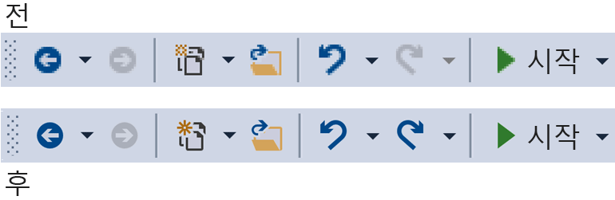
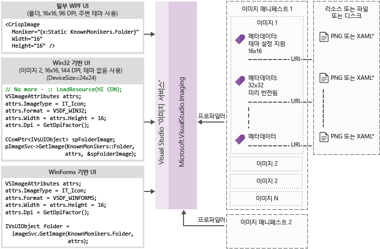

# <a name="image-service-and-catalog"></a>이미지 서비스 및 카탈로그
이 cookbook 지침과 Visual Studio 이미지 서비스 및 Visual Studio 2015에 도입 된 이미지 카탈로그에 대 한 유용한 정보를 포함 합니다.  
  
 Visual Studio 2015에 도입 된 이미지 서비스 개발자를 장치 및 사용자의 표시 되는 컨텍스트에 대 한 올바른 테마를 포함 하 여 이미지를 표시 하려면 선택한 테마에 대 한 최상의 이미지를 가져올 수 있습니다. 이미지 서비스를 채택 자산 유지 관리, HDPI 확장 및 테마와 관련 된 주요 취약 한 부분을 제거 하는 데 도움이 됩니다.  
  
|||  
|-|-|  
|**오늘 문제**|**솔루션**|  
|배경 색 혼합|기본 제공 알파 혼합|  
|명칭 테마 설정 이미지|테마 메타 데이터|  
|고대비 모드|대체 고대비 리소스|  
|서로 다른 DPI 모드에 대 한 여러 리소스 필요|벡터 기반 대체 (fallback) 사용 하 여 선택 가능한 리소스|  
|이미지 복제|이미지 개념 당 한 개의 식별자|  
  
 이미지 서비스를 채택 하는 이유  
  
-   Visual Studio에서 최신 "픽셀 완벽 한" 이미지를 항상 가져오기  
  
-   제출 하 고 사용자 고유의 이미지를 사용할 수 있습니다.  
  
-   새 DPI 조정 Windows을 추가 하는 경우 아웃 이미지 테스트할 필요가 없습니다  
  
-   구현에 오래 된 아키텍처 문제를 해결 합니다.  
  
 Visual Studio 셸 도구 모음에서 이전 및 이후 이미지 서비스를 사용 하 여:  
  
   
  
## <a name="how-it-works"></a>작동 방법  
 이미지 서비스 지원 되는 모든 UI 프레임 워크에 대 한 적합 한 비트맵 이미지를 제공할 수 있습니다.  
  
-   WPF: BitmapSource  
  
-   WinForms: System.Drawing.Bitmap  
  
-   Win32: HBITMAP  
  
 이미지 서비스 흐름 다이어그램  
  
   
  
 **이미지 모니커**  
  
 이미지 모니커 (또는 줄여서 모니커) 이미지 자산 또는 이미지 라이브러리에서 이미지 목록 자산을 고유 하 게 식별 하는 GUID/ID 쌍입니다.  
  
 **알려진된 모니커**  
  
 모든 Visual Studio 구성 요소 또는 확장 하 여 Visual Studio 이미지 카탈로그 및 공개적으로 사용할 수에 포함 된 이미지 모니커 집합.  
  
 **이미지 매니페스트 파일**  
  
 이미지 매니페스트 (.imagemanifest) 파일은 이미지 자산, 자산, 실제 이미지 또는 각 자산을 나타내는 이미지를 나타내는 모니커를 정의 하는 XML 파일입니다. 레거시 UI 지원에 대 한 이미지 목록 또는 이미지 매니페스트 독립 실행형 이미지를 정의할 수 있습니다. 또한, 시기 및 이러한 자산을 표시 하는 방법을 변경 하려면 각 자산 뒤에 있는 개별 이미지 또는 자산에 설정할 수 있는 속성이 있습니다.  
  
 **이미지 매니페스트 스키마**  
  
 이미지 완료 매니페스트는 다음과 같습니다.  
  
```xml  
<ImageManifest>  
      <!-- zero or one Symbols elements -->  
      <Symbols>  
        <!-- zero or more Import, Guid, ID, or String elements -->  
      </Symbols>  
      <!-- zero or one Images elements -->  
      <Images>  
        <!-- zero or more Image elements -->  
      </Images>  
      <!-- zero or one ImageLists elements -->  
      <ImageLists>  
        <!-- zero or more ImageList elements -->  
      </ImageLists>  
</ImageManifest>  
```  
  
 **기호**  
  
 가독성과 유지 관리 지원, 이미지 매니페스트 특성 값에 대 한 기호 사용할 수 있습니다. 기호는 다음과 같이 정의 됩니다.  
  
```xml  
<Symbols>  
      <Import Manifest="manifest" />  
      <Guid Name="ShellCommandGuid" Value="8ee4f65d-bab4-4cde-b8e7-ac412abbda8a" />  
      <ID Name="cmdidSaveAll" Value="1000" />  
      <String Name="AssemblyName" Value="Microsoft.VisualStudio.Shell.UI.Internal" />  
</Symbols>  
```  
  
|||  
|-|-|  
|**하위 요소**|**정의**|  
|가져오기|현재 매니페스트에서 사용 하기 위해 지정 된 매니페스트 파일의 기호를 가져옵니다.|  
|GUID|GUID를 나타내는 기호와 GUID 서식 지정 일치 해야 합니다.|  
|ID|ID를 나타내는 기호와 음수가 아닌 정수 여야 합니다.|  
|문자열|기호는 임의의 문자열 값을 나타냅니다.|  
  
 기호는 대/소문자 구분, 및 $(symbol-name) 구문을 사용 하 여 참조입니다.  
  
```xml  
<Image Guid="$(ShellCommandGuid)" ID="$(cmdidSaveAll)" >  
      <Source Uri="/$(AssemblyName);Component/Resources/image.xaml" />  
</Image>  
```  
  
 모든 매니페스트에 대 한 일부 기호를 사용 하는 미리 정의 되어 있습니다. Uri 특성에 사용할 수 있습니다는 \<소스 > 또는 \<가져오기 > 요소는 로컬 컴퓨터에 대 한 참조 경로입니다.  
  
|||  
|-|-|  
|**기호**|**설명**|  
|CommonProgramFiles|% CommonProgramFiles % 환경 변수 값|  
|LocalAppData|% LocalAppData % 환경 변수 값|  
|ManifestFolder|매니페스트 파일을 포함 하는 폴더|  
|내 문서|현재 사용자의 내 문서 폴더의 전체 경로|  
|ProgramFiles|% ProgramFiles % 환경 변수 값|  
|시스템|Windows\System32 폴더|  
|WinDir|% WinDir % 환경 변수 값|  
  
 **Image**  
  
 \<이미지 > 요소는 모니커에서 참조할 수 있는 이미지를 정의 합니다. GUID 및 ID 전체적으로 볼 이미지 모니커를 형성 합니다. 모니커는 이미지에 대 한 전체 이미지 라이브러리 고유 해야 합니다. 이미지가 하나 이상 지정된 모니커 있으면 라이브러리를 빌드하는 중 발생 하는 첫 번째는 유지 되는 것입니다.  
  
 소스가 하나 이상 있어야 합니다. 크기 중립 소스 최상의 결과의 크기, 광범위 한 범위에서 지지만 필요 하지 않습니다. 서비스에 정의 되어 있지 크기의 이미지에 대 한 요청은 \<이미지 > 요소와 크기 중립 소스가 없다는, 서비스는 최상의 크기 관련 소스를 선택 하 고 요청한 크기로 확장 합니다.  
  
```xml  
<Image Guid="guid" ID="int" AllowColorInversion="true/false">  
      <Source ... />  
      <!-- optional additional Source elements -->  
</Image>  
```  
  
|||  
|-|-|  
|**특성**|**정의**|  
|GUID|[필수] 이미지 모니커의 GUID 부분|  
|ID|[필수] 이미지 모니커 ID 부분|  
|AllowColorInversion|[선택 사항 기본 true] 이미지에 프로그래밍 방식으로 어두운 배경을 사용 하는 경우 반전 된 색을 가질 수 있는지 여부를 나타냅니다.|  
  
 **소스**  
  
 \<소스 > 요소는 단일 이미지 소스 자산 (XAML 및 PNG)을 정의 합니다.  
  
```xml  
<Source Uri="uri" Background="background">  
      <!-- optional NativeResource element -->  
 </Source>  
```  
  
|||  
|-|-|  
|**특성**|**정의**|  
|URI|[필수] 이미지를 로드할 수 수를 정의 하는 URI입니다. 다음 중 하나일 수 있습니다.<br /><br /> -A [Pack URI](http://msdn.microsoft.com/en-US/library/aa970069\(v=vs.100\).aspx) 응용 프로그램을 사용 하 여: / / / 기관<br />-An 절대 구성 요소 리소스 참조<br />-네이티브 리소스를 포함 하는 파일 경로|  
|배경|[선택 사항] 유형의 원본을 사용 하려고 합니다. 백그라운드에서 작업을 나타냅니다.<br /><br /> 다음 중 하나일 수 있습니다.<br /><br /> *조명:* 연한 배경에 소스를 사용할 수 있습니다.<br /><br /> *어두운:*에 어두운 화면에서 소스를 사용할 수 있습니다.<br /><br /> *고: 대비* 고대비 모드에서 백그라운드에서 소스를 사용할 수 있습니다.<br /><br /> *HighContrastLight:* 고대비 모드에서 연한 배경에 소스를 사용할 수 있습니다.<br /><br /> *HighContrastDark:* 고대비 모드에 어두운 화면에서 소스를 사용할 수 있습니다.<br /><br /> 배경 특성을 생략 하는 경우 백그라운드에서 소스를 사용할 수 있습니다.<br /><br /> 배경이 *Light*, *어두운*, *HighContrastLight*, 또는 *HighContrastDark*, 소스의 색 반전 되지 됩니다. 배경 생략 되거나로 설정 된 경우 *고 대비*, 소스의 색 반전은 이미지의 제어 **AllowColorInversion** 특성입니다.|  
|||  
  
 A \<소스 > 요소는 다음과 같은 선택적 하위 요소 중 하나만 포함할 수 있습니다.  
  
||||  
|-|-|-|  
|**요소**|**특성 (모두 필수)**|**정의**|  
|\<크기 >|값|장치 단위로 지정된 된 크기의 이미지에 대 한 소스 사용 됩니다. 이미지가 사각형 됩니다.|  
|\<SizeRange >|MinSize, 최대 크기|소스 장치 단위로 MaxSize로 자르기 MinSize에서 이미지에 대 한 포괄적 사용 됩니다. 이미지가 사각형 됩니다.|  
|\<크기 >|너비, 높이|지정 된 너비 및 높이 (장치 단위)의 이미지에 대 한 소스 사용 됩니다.|  
|\<DimensionRange >|MinWidth, MinHeight,<br /><br /> 최대 너비, 최대 높이|원본 최대 너비/높이 (장치 단위)에 최소 너비/높이의 이미지에 대 한 포괄적 사용 됩니다.|  
  
 A \<소스 > 요소는 선택적 있을 수도 있습니다 \<NativeResource > 하위 요소를 정의 하는 \<소스 > 관리 되는 어셈블리를 사용 하지 않고 네이티브 어셈블리에서 로드 된 합니다.  
  
```xml  
<NativeResource Type="type" ID="int" />  
```  
  
|||  
|-|-|  
|**특성**|**정의**|  
|형식|[필수] 네이티브 리소스 XAML 또는 PNG 형식|  
|ID|[필수] 네이티브 리소스의 정수 ID 부분|  
  
 **ImageList**  
  
 \<ImageList > 요소는 단일 스트립에 반환 될 수 있는 이미지의 컬렉션을 정의 합니다. 필요에 따라 스트립 필요에 따라 만들어집니다.  
  
```xml  
<ImageList>  
      <ContainedImage Guid="guid" ID="int" External="true/false" />  
      <!-- optional additional ContainedImage elements -->  
 </ImageList>  
```  
  
|||  
|-|-|  
|**특성**|**정의**|  
|GUID|[필수] 이미지 모니커의 GUID 부분|  
|ID|[필수] 이미지 모니커 ID 부분|  
|외부|[선택 사항 기본값: false] 이미지 모니커 이미지는 현재 매니페스트를 참조 하는지 여부를 나타냅니다.|  
  
 포함 된 이미지에 대 한 모니커는 현재 매니페스트에서 정의 되는 이미지를 참조할 필요가 없습니다. 이미지 라이브러리에 포함 된 이미지를 찾지 못하면 빈 자리 표시자 이미지를 해당 위치에 사용 됩니다.  
  
## <a name="using-the-image-service"></a>이미지 서비스를 사용 하 여  
  
### <a name="first-steps-managed"></a>첫 번째 단계 (관리 됨)  
 이미지 서비스를 사용 하려면 프로젝트에는 다음 어셈블리의 일부 또는 전부에 대 한 참조를 추가 하려면:  
  
-   **Microsoft.VisualStudio.ImageCatalog.dll**  
  
    -   기본 제공 이미지 카탈로그 KnownMonikers를 사용 하는 경우 필수  
  
-   **Microsoft.VisualStudio.Imaging.dll**  
  
    -   사용 하는 경우 필수 **CrispImage** 및 **ImageThemingUtilities** WPF ui  
  
-   **Microsoft.VisualStudio.Imaging.Interop.14.0.DesignTime.dll**  
  
    -   사용 하는 경우 필요는 **ImageMoniker** 및 **ImageAttributes** 형식  
  
    -   **EmbedInteropTypes** 설정할지를 true로  
  
-   **Microsoft.VisualStudio.Shell.Interop.14.0.DesignTime**  
  
    -   사용 하는 경우 필요는 **IVsImageService2** 형식  
  
    -   **EmbedInteropTypes** 설정할지를 true로  
  
-   **Microsoft.VisualStudio.Utilities.dll**  
  
    -   사용 하는 경우 필요는 **BrushToColorConverter** 는 ImageThemingUtilities에 대 한. **ImageBackgroundColor** WPF ui  
  
-   **Microsoft.VisualStudio.Shell 합니다. \<VSVersion >.0**  
  
    -   사용 하는 경우 필요는 **IVsUIObject** 형식  
  
-   **Microsoft.VisualStudio.Shell.Interop.10.0.dll**  
  
    -   WinForms 기반 UI 도우미를 사용 하는 경우 필수  
  
    -   **EmbedInteropTypes** 설정할지를 true로  
  
### <a name="first-steps-native"></a>첫 번째 단계 (네이티브)  
 이미지 서비스를 사용 하려면 프로젝트에 다음 헤더의 일부 또는 전부를 포함 해야 합니다.  
  
-   **KnownImageIds.h**  
  
    -   기본 제공 이미지 카탈로그를 사용 하는 경우 필수 **KnownMonikers**, 있지만 사용할 수 없습니다는 **ImageMoniker** 때에서 값을 반환 하는 같은 유형의 **IVsHierarchy GetGuidProperty**또는 **GetProperty** 호출 합니다.  
  
-   **KnownMonikers.h**  
  
    -   기본 제공 이미지 카탈로그를 사용 하는 경우 필수 **KnownMonikers**합니다.  
  
-   **ImageParameters140.h**  
  
    -   사용 하는 경우 필요는 **ImageMoniker** 및 **ImageAttributes** 형식입니다.  
  
-   **VSShell140.h**  
  
    -   사용 하는 경우 필요는 **IVsImageService2** 유형입니다.  
  
-   **ImageThemingUtilities.h**  
  
    -   이미지 서비스를 테마 설정 통해 처리할 수 없는 경우 필요 합니다.  
  
    -   이미지 서비스가 이미지 테마를 처리할 수 있는 경우이 헤더를 사용 하지 마십시오.  
  
-   **VSUIDPIHelper.h**  
  
    -   DPI 도우미를 사용 하 여 현재 DPI를 얻으려고 하는 경우 필요 합니다.  
  
## <a name="how-do-i-write-new-wpf-ui"></a>새 WPF UI를 작성 하는 방법  
  
1.  위의 필요한 어셈블리 참조를 추가 하 여 시작 프로젝트에 섹션을 먼저 단계입니다. 필요한 참조만 추가 모두 추가 필요가 없습니다. (참고:에 액세스할 수 또는 사용 하는 경우 **색** 대신 **브러시**에 대 한 참조를 건너뛸 수 있습니다 **유틸리티**이므로 변환기 필요 하지는 않습니다.)  
  
2.  원하는 이미지를 선택 하 고 해당 모니커를 가져옵니다. 사용 하 여 한 **KnownMoniker**, 하거나 사용자 고유의 사용자 지정 이미지 및 모니커 있는 경우 직접 사용 합니다.  
  
3.  추가 **CrispImages** xaml입니다. (아래 예제 참조).  
  
4.  설정의 **ImageThemingUtilities.ImageBackgroundColor** UI 계층의 속성입니다. (명령 프롬프트 창의 배경색 알고 없는 반드시에 하지 위치에서 설정 되어야 합니다는 **CrispImage**.) (아래 예제 참조).  
  
```xaml  
<Window  
  x:Class="WpfApplication.MainWindow"  
  xmlns="http://schemas.microsoft.com/winfx/2006/xaml/presentation"  
  xmlns:x="http://schemas.microsoft.com/winfx/2006/xaml"  
  xmlns:imaging="clr-namespace:Microsoft.VisualStudio.Imaging;assembly=Microsoft.VisualStudio.Imaging"  
  xmlns:theming="clr-namespace:Microsoft.VisualStudio.PlatformUI;assembly=Microsoft.VisualStudio.Imaging"  
  xmlns:utilities="clr-namespace:Microsoft.Internal.VisualStudio.Imaging;assembly=Microsoft.VisualStudio.Imaging"  
  xmlns:catalog="clr-namespace:Microsoft.VisualStudio.Imaging;assembly=Microsoft.VisualStudio.ImageCatalog"  
  Title="MainWindow" Height="350" Width="525" UseLayoutRounding="True">  
  <Window.Resources>  
    <utilities:BrushToColorConverter x:Key="BrushToColorConverter"/>  
  </Window.Resources>  
  <StackPanel Background="White" VerticalAlignment="Center"   
    theming:ImageThemingUtilities.ImageBackgroundColor="{Binding Background, RelativeSource={RelativeSource Self}, Converter={StaticResource BrushToColorConverter}}">  
    <imaging:CrispImage Width="16" Height="16" Moniker="{x:Static catalog:KnownMonikers.MoveUp}" />  
  </StackPanel>  
</Window>  
```  
  
 **기존 WPF UI를 업데이트 하려면 어떻게 해야 합니까?**  
  
 기존 WPF UI 업데이트은 세 단계로 구성 된 상대적으로 간단한 프로세스입니다.  
  
1.  모두 바꾸기 \<이미지 > 요소와 UI에 \<CrispImage > 요소  
  
2.  모니커 특성에 모든 원본 특성을 변경 합니다.  
  
    -   이미지는 바뀌지 사용 하는 경우 **KnownMonikers**, 해당 속성을 정적으로 바인딩할는 **KnownMoniker**합니다. (위 예 참조).  
  
    -   이미지는 바뀌지 사용자 지정 이미지를 사용 하는 경우 다음 정적으로 바인딩할 사용자 고유의 모니커 합니다.  
  
    -   이미지 변경할 수 있는 경우 모니커 특성에 속성 변경 내용을 통지 하는 코드 속성에 바인딩하십시오.  
  
3.  어딘가에 UI 계층 구조를 설정 **ImageThemingUtilities.ImageBackgroundColor** 있는지 색 반전 있도록 올바르게를 작동 합니다.  
  
    -   사용 할 수 있습니다는 **BrushToColorConverter** 클래스입니다. (위 예 참조).  
  
## <a name="how-do-i-update-win32-ui"></a>Win32 UI를 업데이트 하려면 어떻게 해야 합니까?  
 이미지를 로딩 하는 원시를 바꾸려면 해당 되는 경우 다음 코드를 추가 합니다. 필요에 따라 HICONs HIMAGELIST 비교와 이러한 방식으로 반환에 대 한 값을 전환 합니다.  
  
 **이미지 서비스 가져오기**  
  
```cpp  
CComPtr<IVsImageService2> spImgSvc;  
CGlobalServiceProvider::HrQueryService(SID_SVsImageService, &spImgSvc);  
```  
  
 **이미지를 요청합니다.**  
  
```cpp  
ImageAttributes attr = { 0 };  
attr.StructSize      = sizeof(attributes);  
attr.Format          = DF_Win32;  
// IT_Bitmap for HBITMAP, IT_Icon for HICON, IT_ImageList for HIMAGELIST  
attr.ImageType       = IT_Bitmap;  
attr.LogicalWidth    = 16;  
attr.LogicalHeight   = 16;  
attr.Dpi             = VsUI::DpiHelper::GetDeviceDpiX();  
attr.Background      = 0xFFFFFFFF;  
// Desired RGBA color, if you don't use this, don't set IAF_Background below  
attr.Flags           = IAF_RequiredFlags | IAF_Background;  
  
CComPtr<IVsUIObject> spImg;  
// Replace this KnownMoniker with your desired ImageMoniker  
spImgSvc->GetImage(KnownMonikers::Blank, attributes, &spImg);  
  
```  
  
## <a name="how-do-i-update-winforms-ui"></a>WinForms UI를 업데이트 하려면 어떻게 해야 합니까?  
 이미지를 로딩 하는 원시를 바꾸려면 해당 되는 경우 다음 코드를 추가 합니다. 필요에 따라 아이콘 또는 비트맵을 반환 하는 것에 대 한 값을 전환 합니다.  
  
 **문을 사용 하 여 도움이 되는 것**  
  
```csharp  
using GelUtilities = Microsoft.Internal.VisualStudio.PlatformUI.Utilities;  
```  
  
 **이미지 서비스 가져오기**  
  
```csharp  
// This or your preferred way of querying for Visual Studio services  
IVsImageService2 imageService = (IVsImageService2)Package.GetGlobalService(typeof(SVsImageService));  
  
```  
  
 **이미지를 요청 합니다.**  
  
```csharp  
ImageAttributes attributes = new ImageAttributes  
{  
    StructSize    = Marshal.SizeOf(typeof(ImageAttributes)),  
    // IT_Bitmap for Bitmap, IT_Icon for Icon  
    ImageType     = (uint)_UIImageType.IT_Bitmap,  
    Format        = (uint)_UIDataFormat.DF_WinForms,  
    LogicalWidth  = 16,  
    LogicalHeight = 16,  
    // Desired RGBA color, if you don't use this, don't set IAF_Background below  
    Background    = 0xFFFFFFFF,  
    Flags = (uint)_ImageAttributesFlags.IAF_RequiredFlags | _ImageAttributesFlags.IAF_Background,  
};  
  
// Replace this KnownMoniker with your desired ImageMoniker  
IVsUIObject uIObj = imageService.GetImage(KnownMonikers.Blank, attributes);  
  
Bitmap bitmap = (Bitmap)GelUtilities.GetObjectData(uiObj); // Use this if you need a bitmap  
// Icon icon = (Icon)GelUtilities.GetObjectData(uiObj); // Use this if you need an icon  
  
```  
  
## <a name="how-do-i-use-image-monikers-in-a-new-tool-window"></a>새 도구 창에 이미지 모니커를 사용 하는 방법  
 VSIX 패키지 프로젝트 템플릿은 Visual Studio 2015에 대 한 업데이트 되었습니다. 요소를 만들려면 VSIX 프로젝트를 마우스 오른쪽 단추로 클릭 하 고 "새 항목... 추가"를 선택 합니다. (Ctrl + Shift + A)입니다. 프로젝트 언어에 대 한 확장성 노드에서 "사용자 지정 도구 창," 선택 "추가" 단추를 누르고 도구 창에 이름을 지정 합니다.  
  
 이들은 도구 창에서 모니커를 사용 하는 키 위치입니다. 각각에 대 한 지침을 따르세요.  
  
1.  도구 창 탭 탭 작은 되 면 충분히 (Ctrl + Tab 창 전환기에도 사용).  
  
     파생 된 클래스에 대 한 생성자에 다음이 줄 추가 **ToolWindowPane** 유형:  
  
    ```csharp  
    // Replace this KnownMoniker with your desired ImageMoniker  
    this.BitmapImageMoniker = KnownMonikers.Blank;  
    ```  
  
2.  도구 창을 열려면 명령입니다.  
  
     패키지에 대 한.vsct 파일에서 도구 창 명령 단추를 편집 합니다.  
  
    ```xml  
    <Button guid="guidPackageCmdSet" id="CommandId" priority="0x0100" type="Button">  
      <Parent guid="guidSHLMainMenu" id="IDG_VS_WNDO_OTRWNDWS1"/>  
      <!-- Replace this KnownMoniker with your desired ImageMoniker -->  
      <Icon guid="ImageCatalogGuid" id="Blank" />  
      <!-- Add this -->  
      <CommandFlag>IconIsMoniker</CommandFlag>  
      <Strings>  
        <ButtonText>MyToolWindow</ButtonText>  
      </Strings>  
    </Button>  
    ```  
  
 **기존 도구 창에 이미지 모니커를 사용 하는 방법**  
  
 이미지 모니커를 사용 하는 기존 도구 창을 업데이트 하는 것은 새 도구 창을 만드는 단계와 비슷합니다.  
  
 이들은 도구 창에서 모니커를 사용 하는 키 위치입니다. 각각에 대 한 지침을 따르세요.  
  
1.  도구 창 탭 탭 작은 되 면 충분히 (Ctrl + Tab 창 전환기에도 사용).  
  
    1.  파생 된 클래스의 생성자에 다음이 줄 제거 (있는 경우)는 **ToolWindowPane** 유형:  
  
        ```csharp  
        this.BitmapResourceID = <Value>;  
        this.BitmapIndex = <Value>;  
        ```  
  
    2.  참조의 1 단계에서 "작업 방법에 새 도구 창 사용 하 여 이미지 모니커" 위의 섹션입니다.  
  
2.  도구 창을 열려면 명령입니다.  
  
    -   참조의 2 단계는 "어떻게 할까요 요소에서 사용 하 여 이미지 모니커?" 위의 섹션입니다.  
  
## <a name="how-do-i-use-image-monikers-in-a-vsct-file"></a>.Vsct 파일에서 이미지 모니커를 사용 하는 방법  
 아래의 주석으로 처리 된 줄에 표시 된 대로.vsct 파일을 업데이트 합니다.  
  
```xml  
<?xml version="1.0" encoding="utf-8"?>  
<CommandTable xmlns="http://schemas.microsoft.com/VisualStudio/2005-10-18/CommandTable" xmlns:xs="http://www.w3.org/2001/XMLSchema">  
  <!--  Include the definitions for images included in the VS image catalog -->  
  <Include href="KnownImageIds.vsct"/>  
  <Commands package="guidMyPackage">  
    <Buttons>  
      <Button guid="guidMyCommandSet" id="cmdidMyCommand" priority="0x0000" type="Button">  
        <!-- Add an Icon element, changing the attributes to match the image moniker you want to use.  
             In this case, we're using the Guid for the VS image catalog.  
             Change the id attribute to be the ID of the desired image moniker. -->  
        <Icon guid="ImageCatalogGuid" id="OpenFolder" />  
        <CommandFlag>DynamicVisibility</CommandFlag>  
        <CommandFlag>DefaultInvisible</CommandFlag>  
        <CommandFlag>DefaultDisabled</CommandFlag>  
        <CommandFlag>CommandWellOnly</CommandFlag>  
        <CommandFlag>IconAndText</CommandFlag>  
        <!-- Add the IconIsMoniker CommandFlag -->  
        <CommandFlag>IconIsMoniker</CommandFlag>  
        <Strings>  
          <ButtonText>Quick Fixes...</ButtonText>  
          <CommandName>Show Quick Fixes</CommandName>  
          <CanonicalName>ShowQuickFixes</CanonicalName>  
          <LocCanonicalName>ShowQuickFixes</LocCanonicalName>  
        </Strings>  
      </Button>  
    </Buttons>  
  </Commands>  
  <!-- It is recommended that you remove <Bitmap> elements that are no longer used in the vsct file -->  
  <Symbols>  
    <GuidSymbol name="guidMyPackage"    value="{1491e936-6ffe-474e-8371-30e5920d8fdd}" />  
    <GuidSymbol name="guidMyCommandSet" value="{10347de4-69a9-47f4-a950-d3301f6d2bc7}">  
      <IDSymbol name="cmdidMyCommand" value="0x9437" />  
    </GuidSymbol>  
  </Symbols>  
</CommandTable>  
```  
  
 **경우에 어떻게 내.vsct 파일 이전 버전의 Visual Studio에서 읽을 수 해야 하는 또한 합니까?**  
  
 이전 버전의 Visual Studio를 인식 하지 않는 **IconIsMoniker** 플래그 명령입니다. 이미지 서비스에서 이미지를 지원 하지만 계속 이전 버전의 Visual Studio에서 이전 스타일 이미지를 사용 하는 버전의 Visual Studio에서 사용할 수 있습니다. 이 위해 변경 되지 않은 (및 따라서 이전 버전의 Visual Studio와 호환).vsct 파일을 유지 하는.vsct 파일에 정의 된 GUID/i D 쌍에서 매핑하는 CSV (쉼표로 구분 된 값) 파일을 만들 \<비트맵 > 이미지에는 요소 모니커 GUID/ID 쌍입니다.  
  
 매핑 CSV 파일의 형식은 다음과 같습니다.  
  
```  
Icon guid, Icon id, Moniker guid, Moniker id  
b714fcf7-855e-4e4c-802a-1fd87144ccad,1,fda30684-682d-421c-8be4-650a2967058e,100  
b714fcf7-855e-4e4c-802a-1fd87144ccad,2,fda30684-682d-421c-8be4-650a2967058e,200  
```  
  
 CSV 파일 패키지와 함께 배포 되 고 지정 된 해당 위치는 **IconMappingFilename** 의 속성은 **ProvideMenuResource** 패키지 특성:  
  
```csharp  
[ProvideMenuResource("MyPackage.ctmenu", 1, IconMappingFilename="IconMappings.csv")]  
```  
  
 **IconMappingFilename** @"%UserProfile%\ 같은 환경 변수로 정의 된 디렉터리에서 명시적으로 시작 하는 절대 경로 또는 상대 경로 이거나 암시적으로 기준으로 결정 됩니다 (예: 위의 예에서) $PackageFolder$ dir1\dir2\MyMappingFile.csv "입니다.  
  
## <a name="how-do-i-port-a-project-system"></a>프로젝트 시스템을 포트지 않습니다는 방법  
 **프로젝트에 대 한 ImageMonikers를 제공 하는 방법**  
  
1.  구현 **VSHPROPID_SupportsIconMonikers** 프로젝트의 **IVsHierarchy**, 고 true를 반환 합니다.  
  
2.  구현 **VSHPROPID_IconMonikerImageList** (원래 프로젝트를 사용 하는 경우 **VSHPROPID_IconImgList**) 또는 **VSHPROPID_IconMonikerGuid**,  **VSHPROPID_IconMonikerId**, **VSHPROPID_OpenFolderIconMonikerGuid**, **VSHPROPID_OpenFolderIconMonikerId** (원래 프로젝트를 사용 하는 경우  **VSHPROPID_IconHandle** 및 **VSHPROPID_OpenFolderIconHandle**).  
  
3.  "레거시"의 버전을 만들 아이콘 확장점 요청 하는 경우 원래 VSHPROPIDs 아이콘에 대 한 구현을 변경 합니다. **IVsImageService2** 아이콘 하는 데 필요한 기능을 제공 합니다.  
  
 **VB에 대 한 추가 요구 사항이 C# 프로젝트 특성 /**  
  
 구현만 **VSHPROPID_SupportsIconMonikers** 프로젝트 것을 감지 하는 경우는 **가장 바깥쪽 버전**합니다. 그렇지 않은 경우 실제 가장 바깥쪽 버전 실제로 이미지 모니커를 지원 하지 않을 수 있습니다 및 사용자 기본 버전 효과적으로 "숨기는 편이" 사용자 지정된 이미지입니다.  
  
 **CPS에서 이미지 모니커를 사용 하는 방법**  
  
 CPS (공통 프로젝트 시스템)에서 사용자 지정 이미지를 설정 수동으로 또는 프로젝트 시스템 확장 SDK와 함께 제공 되는 항목 템플릿을 통해 수행할 수 있습니다.  
  
 **프로젝트 시스템 확장 SDK를 사용 하 여**  
  
 지침에 따라 [프로젝트 형식/항목 형식에 대 한 사용자 지정 아이콘 제공](https://github.com/Microsoft/VSProjectSystem/blob/master/doc/scenario/provide_custom_icons_for_the_project_or_item_type.md) CPS 이미지를 사용자 지정할 수 있습니다. CPS에 대 한 자세한 내용은에서 찾을 수 있습니다 [Visual Studio 프로젝트 시스템 확장성 설명서](https://github.com/Microsoft/VSProjectSystem)  
  
 **수동으로 ImageMonikers 사용**  
  
1.  구현 및 내보내기는 **IProjectTreeModifier** 프로젝트 시스템에 대 한 인터페이스입니다.  
  
2.  결정할 **KnownMoniker** 또는 사용자 지정 이미지 모니커를 사용 하려면.  
  
3.  에 **ApplyModifications** 메서드를 다음을 수행의 유사한 새 트리를 반환 하기 전에 메서드는 아래 예제:  
  
    ```csharp  
    // Replace this KnownMoniker with your desired ImageMoniker  
    tree = tree.SetIcon(KnownMonikers.Blank.ToProjectSystemType());  
    ```  
  
4.  새 트리를 만드는 경우 원하는 모니커 비슷합니다 NewTree 메서드에 전달 하 여 사용자 지정 이미지를 설정할 수 있습니다는 아래 예제:  
  
    ```csharp  
    // Replace this KnownMoniker with your desired ImageMoniker  
    ProjectImageMoniker icon         = KnownMonikers.FolderClosed.ToProjectSystemType();  
    ProjectImageMoniker expandedIcon = KnownMonikers.FolderOpened.ToProjectSystemType();  
  
    return this.ProjectTreeFactory.Value.NewTree(/*caption*/<value>,  
                                                 /*filePath*/<value>,  
                                                 /*browseObjectProperties*/<value>,  
                                                 icon,  
                                                 expandedIcon);  
    ```  
  
## <a name="how-do-i-convert-from-a-real-image-strip-to-a-moniker-based-image-strip"></a>변환 하는 방법 실제 이미지 스트립에서 모니커 기반 이미지 스트립에 있습니까?  
 **HIMAGELISTs를 지원 해야 하는 경우**  
  
 이미지 서비스를 사용 하도록 업데이트 하려고 하지만 이미지 목록 전달 해야 하는 Api에 의해 제한 됩니다 하 코드에 대 한 기존 이미지 스트립 이면 여전히 이미지 서비스의 이점을 얻을 수 있습니다. 모니커 기반 이미지 스트립을 만들려면 기존 모니커 로부터 매니페스트를 만들려면 다음 단계를 수행 합니다.  
  
1.  실행 된 **ManifestFromResources** 도구를 이미지 스트립을 전달 합니다. 이 줄에 대 한 매니페스트를 생성 됩니다.  
  
    -   권장: 사용법에 맞게 매니페스트에 대 한 기본이 아닌 이름을 제공 합니다.  
  
2.  만 사용 하는 경우 **KnownMonikers**, 다음을 수행 합니다.  
  
    -   대체는 \<이미지 > 섹션을 사용 하 여 매니페스트에 \<이미지 / >입니다.  
  
    -   모든 subimage Id를 제거 (어느 것에와 \<imagestrip 이름 > _ # #).  
  
    -   권장: AssetsGuid 기호 및 사용법에 맞게 이미지 스트립 기호 이름을 바꿉니다.  
  
    -   각 교체 **ContainedImage**의 각 GUID $(ImageCatalogGuid)로 바꿀 **ContainedImage**의 $ ID (\<모니커 >), 각 에외부="true"특성을추가하고**ContainedImage**  
  
        -   \<모니커 >로 대체 해야는 **KnownMoniker** 이미지와 일치 하는 같지만 "KnownMonikers" 이름에서 제거 합니다.  
  
    -   추가 < 가져오기 Manifest="$(ManifestFolder)\\< 상대 설치 디렉터리 경로를\>\Microsoft.VisualStudio.ImageCatalog.imagemanifest" /\> 의 맨 위에 \<기호 > 섹션입니다.  
  
        -   상대 경로 설치 된 매니페스트에 대 한 준비에 정의 된 배포 위치에 따라 결정 됩니다.  
  
3.  실행 된 **ManifestToCode** 도구 래퍼를 생성 하는 기존 코드에는 모니커 이미지 스트립에 대 한 이미지 서비스를 쿼리 하는 데 사용할 수 있도록 합니다.  
  
    -   권장: 래퍼 및 용도 맞게 네임 스페이스에 대 한 기본이 아닌 이름을 제공 합니다.  
  
4.  작업을 모두 수행는 추가 설치 작성/배포, 및 기타 코드 변경 내용이 이미지 서비스 및 새 파일을 사용 하 합니다.  
  
 예제 매니페스트 것 해야 모양을 확인 하는 내부 및 외부 이미지를 포함 하 여:  
  
```xml  
<?xml version="1.0"?>  
<ImageManifest  
  xmlns:xsi="http://www.w3.org/2001/XMLSchema-instance"  
  xmlns:xsd="http://www.w3.org/2001/XMLSchema"  
  xmlns="http://schemas.microsoft.com/VisualStudio/ImageManifestSchema/2014">  
  
  <Symbols>  
    <!-- This needs to be the relative path from your manifest to the ImageCatalog's manifest  
         where $(ManifestFolder) is the deployed location of this manifest. -->  
    <Import Manifest="$(ManifestFolder)\<RelPath>\Microsoft.VisualStudio.ImageCatalog.imagemanifest" />  
  
    <String Name="Resources" Value="/My.Assembly.Name;Component/Resources/ImageStrip" />  
    <Guid Name="ImageGuid" Value="{fb41b7ef-6587-480c-aa27-5b559d42cfc9}" />  
    <Guid Name="ImageStripGuid" Value="{9c84a570-d9a7-4052-a340-188fb276f973}" />  
    <ID Name="MyImage_0" Value="100" />  
    <ID Name="MyImage_1" Value="101" />  
    <ID Name="InternalList" Value="1001" />  
    <ID Name="ExternalList" Value="1002" />  
  </Symbols>  
  
  <Images>  
    <Image Guid="$(ImageGuid)" ID="$(MyImage_0)">  
      <Source Uri="$(Resources)/MyImage_0.png">  
        <Size Value="16" />  
      </Source>  
    </Image>  
    <Image Guid="$(ImageGuid)" ID="$(MyImage_1)">  
      <Source Uri="$(Resources)/MyImage_1.png">  
        <Size Value="16" />  
      </Source>  
    </Image>  
  </Images>  
  
  <ImageLists>  
    <ImageList Guid="$(ImageStripGuid)" ID="$(InternalList)">  
      <ContainedImage Guid="$(ImageGuid)" ID="$(MyImage_0)" />  
      <ContainedImage Guid="$(ImageGuid)" ID="$(MyImage_1)" />  
    </ImageList>  
    <ImageList Guid="$(ImageStripGuid)" ID="$(ExternalList)">  
      <ContainedImage Guid="$(ImageCatalogGuid)" ID="$(StatusError)" External="true" />  
      <ContainedImage Guid="$(ImageCatalogGuid)" ID="$(StatusWarning)" External="true" />  
      <ContainedImage Guid="$(ImageCatalogGuid)" ID="$(StatusInformation)" External="true" />  
    </ImageList>  
  </ImageLists>  
  
</ImageManifest>  
```  
  
 **HIMAGELISTs 지원할 필요가 없습니다.**  
  
1.  집합을 결정 **KnownMonikers** 프로그램 이미지 스트립에 있는 이미지와 일치 하는 하거나 이미지 스트립에 사용자 고유의 모니커는 이미지에 대 한를 만듭니다.  
  
2.  이미지를 가져올 모니커를 대신 사용 하도록 이미지 스트립에 필요한 인덱스에 사용 되는 모든 매핑을 업데이트 합니다.  
  
3.  업데이트 된 매핑을 통해 모니커를 요청 하려면 이미지 서비스를 사용 하도록 코드를 업데이트 합니다. (이 경우일 수로 업데이트 **CrispImages** 관리 코드 또는 이러한 방식으로 또는 HICONs 이미지 서비스에서 요청 및 네이티브 코드 주위에 전달 합니다.)  
  
## <a name="testing-your-images"></a>이미지 테스트  
 모든 것이 제대로 작성 되었는지 확인 하 여 이미지 매니페스트를 테스트 하는 이미지 라이브러리 뷰어 도구를 사용할 수 있습니다. 에 포함 된 도구를 찾을 수 있습니다는 [Visual Studio 2015 SDK](http://msdn.microsoft.com/library/bb166441.aspx)합니다. 이 도구 및 기타 도구에 대 한 설명서가 있습니다. [여기](http://aka.ms/VSImageThemeTools)합니다.  
  
## <a name="additional-resources"></a>추가 리소스  
  
### <a name="samples"></a>샘플  
 GitHub의 Visual Studio 샘플 중 몇 가지 다양 한 Visual Studio 확장 지점의 일환으로 이미지 서비스를 사용 하는 방법을 보여 주는 업데이트 되었습니다.  
  
 확인 [http://github.com/Microsoft/VSSDK-Extensibility-Samples](http://github.com/Microsoft/VSSDK-Extensibility-Samples) 최신 샘플에 대 한 합니다.  
  
### <a name="tooling"></a>도구  
 이미지 서비스에 대 한 지원 도구 집합이 이미지 서비스를 사용 하는 UI를 작성/업데이트에 도움이 되도록 만들어졌습니다. 각 도구에 대 한 자세한 내용은 도구와 함께 제공 되는 설명서를 확인 합니다. 도구는의 일부로 포함 된 [Visual Studio 2015 SDK입니다.](http://msdn.microsoft.com/library/bb166441.aspx)  
  
 **ManifestFromResources**  
  
 리소스 도구에서 매니페스트 (PNG 또는 XAML) 이미지 리소스의 목록의 이미지 서비스에 이러한 이미지를 사용 하기 위해 이미지 매니페스트 파일을 생성 합니다.  
  
 **ManifestToCode**  
  
 매니페스트 코드 도구를 이미지 매니페스트 파일을 코드 (c + +, C# 또는 VB) 또는.vsct 파일에 매니페스트 값 참조에 대 한 래퍼 파일을 생성 합니다.  
  
 **ImageLibraryViewer**  
  
 이미지 라이브러리 뷰어 도구 이미지 매니페스트를 로드할 수 있습니다 및 Visual Studio 매니페스트가 제대로 작성 되었는지 확인 하는 것 같은 방식으로 조작할 수 있습니다. 배경, 크기, DPI 설정, 고대비 등 및 기타 설정을 변경할 수 있습니다. 또한 매니페스트에서 오류를 찾으려면 로드 정보를 표시 하 고 매니페스트에 각 이미지에 대 한 소스 정보를 표시 합니다.  
  
## <a name="faq"></a>FAQ  
  
-   로드할 때 포함 해야 하는 종속성이 있습니까 \<Include="Microsoft.VisualStudio.* 참조 합니다. Interop.14.0.DesignTime"/ >?  
  
    -   EmbedInteropTypes 설정 = "true" 모든 interop Dll에 있습니다.  
  
-   이미지 매니페스트 내 확장명이 어떻게 배포 합니까?  
  
    -   .Imagemanifest 파일을 프로젝트에 추가 합니다.  
  
    -   "VSIX에 포함"를 True로 설정 합니다.  
  
-   CPS 프로젝트 시스템 업데이트 합니다. 변경 사항 **ImageName** 및 **StockIconService**?  
  
    -   모니커를 사용 하도록 CPS가 업데이트 하는 경우 제거 된 이러한 o 합니다. 더 이상 호출 해야는 **StockIconService**, 원하는 전달 **KnownMoniker** 메서드 또는 사용 하 여 속성에는 **ToProjectSystemType()** 에서 확장 메서드 CPS 유틸리티입니다. 매핑을 찾을 수 있습니다 **ImageName** 를 **KnownMonikers** 아래:  
  
        |||  
        |-|-|  
        |**ImageName**|**KnownMoniker**|  
        |ImageName.OfflineWebApp|KnownImageIds.Web|  
        |ImageName.WebReferencesFolder|KnownImageIds.Web|  
        |ImageName.OpenReferenceFolder|KnownImageIds.FolderOpened|  
        |ImageName.ReferenceFolder|KnownImageIds.Reference|  
        |ImageName.Reference|KnownImageIds.Reference|  
        |ImageName.SdlWebReference|KnownImageIds.WebReferenceFolder|  
        |ImageName.DiscoWebReference|KnownImageIds.DynamicDiscoveryDocument|  
        |ImageName.Folder|KnownImageIds.FolderClosed|  
        |ImageName.OpenFolder|KnownImageIds.FolderOpened|  
        |ImageName.ExcludedFolder|KnownImageIds.HiddenFolderClosed|  
        |ImageName.OpenExcludedFolder|KnownImageIds.HiddenFolderOpened|  
        |ImageName.ExcludedFile|KnownImageIds.HiddenFile|  
        |ImageName.DependentFile|KnownImageIds.GenerateFile|  
        |ImageName.MissingFile|KnownImageIds.DocumentWarning|  
        |ImageName.WindowsForm|KnownImageIds.WindowsForm|  
        |ImageName.WindowsUserControl|KnownImageIds.UserControl|  
        |ImageName.WindowsComponent|KnownImageIds.ComponentFile|  
        |ImageName.XmlSchema|KnownImageIds.XMLSchema|  
        |ImageName.XmlFile|KnownImageIds.XMLFile|  
        |ImageName.WebForm|KnownImageIds.Web|  
        |ImageName.WebService|KnownImageIds.WebService|  
        |ImageName.WebUserControl|KnownImageIds.WebUserControl|  
        |ImageName.WebCustomUserControl|KnownImageIds.WebCustomControl|  
        |ImageName.AspPage|KnownImageIds.ASPFile|  
        |ImageName.GlobalApplicationClass|KnownImageIds.SettingsFile|  
        |ImageName.WebConfig|KnownImageIds.ConfigurationFile|  
        |ImageName.HtmlPage|KnownImageIds.HTMLFile|  
        |ImageName.StyleSheet|KnownImageIds.StyleSheet|  
        |ImageName.ScriptFile|KnownImageIds.JSScript|  
        |ImageName.TextFile|KnownImageIds.Document|  
        |ImageName.SettingsFile|KnownImageIds.Settings|  
        |ImageName.Resources|KnownImageIds.DocumentGroup|  
        |ImageName.Bitmap|KnownImageIds.Image|  
        |ImageName.Icon|KnownImageIds.IconFile|  
        |ImageName.Image|KnownImageIds.Image|  
        |ImageName.ImageMap|KnownImageIds.ImageMapFile|  
        |ImageName.XWorld|KnownImageIds.XWorldFile|  
        |ImageName.Audio|KnownImageIds.Sound|  
        |ImageName.Video|KnownImageIds.Media|  
        |ImageName.Cab|KnownImageIds.CABProject|  
        |ImageName.Jar|KnownImageIds.JARFile|  
        |ImageName.DataEnvironment|KnownImageIds.DataTable|  
        |ImageName.PreviewFile|KnownImageIds.Report|  
        |ImageName.DanglingReference|KnownImageIds.ReferenceWarning|  
        |ImageName.XsltFile|KnownImageIds.XSLTransform|  
        |ImageName.Cursor|KnownImageIds.CursorFile|  
        |ImageName.AppDesignerFolder|KnownImageIds.Property|  
        |ImageName.Data|KnownImageIds.Database|  
        |ImageName.Application|KnownImageIds.Application|  
        |ImageName.DataSet|KnownImageIds.DatabaseGroup|  
        |ImageName.Pfx|KnownImageIds.Certificate|  
        |ImageName.Snk|KnownImageIds.Rule|  
        |ImageName.VisualBasicProject|KnownImageIds.VBProjectNode|  
        |ImageName.CSharpProject|KnownImageIds.CSProjectNode|  
        |ImageName.Empty|KnownImageIds.Blank|  
        |ImageName.MissingFolder|KnownImageIds.FolderOffline|  
        |ImageName.SharedImportReference|KnownImageIds.SharedProject|  
        |ImageName.SharedProjectCs|KnownImageIds.CSSharedProject|  
        |ImageName.SharedProjectVc|KnownImageIds.CPPSharedProject|  
        |ImageName.SharedProjectJs|KnownImageIds.JSSharedProject|  
        |ImageName.CSharpCodeFile|KnownImageIds.CSFileNode|  
        |ImageName.VisualBasicCodeFile|KnownImageIds.VBFileNode|  
  
    -   완성 목록 공급자를 업데이트 합니다. 어떤 **KnownMonikers** 이전 일치 **StandardGlyphGroup** 및 **StandardGlyph** 값?  
  
        ||||  
        |-|-|-|  
        |GlyphGroupClass|GlyphItemPublic|ClassPublic|  
        |GlyphGroupClass|GlyphItemInternal|ClassInternal|  
        |GlyphGroupClass|GlyphItemFriend|ClassInternal|  
        |GlyphGroupClass|GlyphItemProtected|ClassProtected|  
        |GlyphGroupClass|GlyphItemPrivate|ClassPrivate|  
        |GlyphGroupClass|GlyphItemShortcut|ClassShortcut|  
        |GlyphGroupConstant|GlyphItemPublic|ClassPublic|  
        |GlyphGroupConstant|GlyphItemInternal|ClassInternal|  
        |GlyphGroupConstant|GlyphItemFriend|ClassInternal|  
        |GlyphGroupConstant|GlyphItemProtected|ClassProtected|  
        |GlyphGroupConstant|GlyphItemPrivate|ClassPrivate|  
        |GlyphGroupConstant|GlyphItemShortcut|ClassShortcut|  
        |GlyphGroupDelegate|GlyphItemPublic|DelegatePublic|  
        |GlyphGroupDelegate|GlyphItemInternal|DelegateInternal|  
        |GlyphGroupDelegate|GlyphItemFriend|DelegateInternal|  
        |GlyphGroupDelegate|GlyphItemProtected|DelegateProtected|  
        |GlyphGroupDelegate|GlyphItemPrivate|DelegatePrivate|  
        |GlyphGroupDelegate|GlyphItemShortcut|DelegateShortcut|  
        |GlyphGroupEnum|GlyphItemPublic|EnumerationPublic|  
        |GlyphGroupEnum|GlyphItemInternal|EnumerationInternal|  
        |GlyphGroupEnum|GlyphItemFriend|EnumerationInternal|  
        |GlyphGroupEnum|GlyphItemProtected|EnumerationProtected|  
        |GlyphGroupEnum|GlyphItemPrivate|EnumerationPrivate|  
        |GlyphGroupEnum|GlyphItemShortcut|EnumerationShortcut|  
        |GlyphGroupEnumMember|GlyphItemPublic|EnumerationMemberPublic|  
        |GlyphGroupEnumMember|GlyphItemInternal|EnumerationMemberInternal|  
        |GlyphGroupEnumMember|GlyphItemFriend|EnumerationMemberInternal|  
        |GlyphGroupEnumMember|GlyphItemProtected|EnumerationMemberProtected|  
        |GlyphGroupEnumMember|GlyphItemPrivate|EnumerationMemberPrivate|  
        |GlyphGroupEnumMember|GlyphItemShortcut|EnumerationMemberShortcut|  
        |GlyphGroupEvent|GlyphItemPublic|EventPublic|  
        |GlyphGroupEvent|GlyphItemInternal|EventInternal|  
        |GlyphGroupEvent|GlyphItemFriend|EventInternal|  
        |GlyphGroupEvent|GlyphItemProtected|EventProtected|  
        |GlyphGroupEvent|GlyphItemPrivate|EventPrivate|  
        |GlyphGroupEvent|GlyphItemShortcut|EventShortcut|  
        |GlyphGroupException|GlyphItemPublic|ExceptionPublic|  
        |GlyphGroupException|GlyphItemInternal|ExceptionInternal|  
        |GlyphGroupException|GlyphItemFriend|ExceptionInternal|  
        |GlyphGroupException|GlyphItemProtected|ExceptionProtected|  
        |GlyphGroupException|GlyphItemPrivate|ExceptionPrivate|  
        |GlyphGroupException|GlyphItemShortcut|ExceptionShortcut|  
        |GlyphGroupField|GlyphItemPublic|FieldPublic|  
        |GlyphGroupField|GlyphItemInternal|FieldInternal|  
        |GlyphGroupField|GlyphItemFriend|FieldInternal|  
        |GlyphGroupField|GlyphItemProtected|FieldProtected|  
        |GlyphGroupField|GlyphItemPrivate|FieldPrivate|  
        |GlyphGroupField|GlyphItemShortcut|FieldShortcut|  
        |GlyphGroupInterface|GlyphItemPublic|InterfacePublic|  
        |GlyphGroupInterface|GlyphItemInternal|InterfaceInternal|  
        |GlyphGroupInterface|GlyphItemFriend|InterfaceInternal|  
        |GlyphGroupInterface|GlyphItemProtected|InterfaceProtected|  
        |GlyphGroupInterface|GlyphItemPrivate|InterfacePrivate|  
        |GlyphGroupInterface|GlyphItemShortcut|InterfaceShortcut|  
        |GlyphGroupMacro|GlyphItemPublic|MacroPublic|  
        |GlyphGroupMacro|GlyphItemInternal|MacroInternal|  
        |GlyphGroupMacro|GlyphItemFriend|MacroInternal|  
        |GlyphGroupMacro|GlyphItemProtected|MacroProtected|  
        |GlyphGroupMacro|GlyphItemPrivate|MacroPrivate|  
        |GlyphGroupMacro|GlyphItemShortcut|MacroShortcut|  
        |GlyphGroupMap|GlyphItemPublic|MapPublic|  
        |GlyphGroupMap|GlyphItemInternal|MapInternal|  
        |GlyphGroupMap|GlyphItemFriend|MapInternal|  
        |GlyphGroupMap|GlyphItemProtected|MapProtected|  
        |GlyphGroupMap|GlyphItemPrivate|MapPrivate|  
        |GlyphGroupMap|GlyphItemShortcut|MapShortcut|  
        |GlyphGroupMapItem|GlyphItemPublic|MapItemPublic|  
        |GlyphGroupMapItem|GlyphItemInternal|MapItemInternal|  
        |GlyphGroupMapItem|GlyphItemFriend|MapItemInternal|  
        |GlyphGroupMapItem|GlyphItemProtected|MapItemProtected|  
        |GlyphGroupMapItem|GlyphItemPrivate|MapItemPrivate|  
        |GlyphGroupMapItem|GlyphItemShortcut|MapItemShortcut|  
        |GlyphGroupMethod|GlyphItemPublic|MethodPublic|  
        |GlyphGroupMethod|GlyphItemInternal|MethodInternal|  
        |GlyphGroupMethod|GlyphItemFriend|MethodInternal|  
        |GlyphGroupMethod|GlyphItemProtected|MethodProtected|  
        |GlyphGroupMethod|GlyphItemPrivate|MethodPrivate|  
        |GlyphGroupMethod|GlyphItemShortcut|MethodShortcut|  
        |GlyphGroupOverload|GlyphItemPublic|MethodPublic|  
        |GlyphGroupOverload|GlyphItemInternal|MethodInternal|  
        |GlyphGroupOverload|GlyphItemFriend|MethodInternal|  
        |GlyphGroupOverload|GlyphItemProtected|MethodProtected|  
        |GlyphGroupOverload|GlyphItemPrivate|MethodPrivate|  
        |GlyphGroupOverload|GlyphItemShortcut|MethodShortcut|  
        |GlyphGroupModule|GlyphItemPublic|ModulePublic|  
        |GlyphGroupModule|GlyphItemInternal|ModuleInternal|  
        |GlyphGroupModule|GlyphItemFriend|ModuleInternal|  
        |GlyphGroupModule|GlyphItemProtected|ModuleProtected|  
        |GlyphGroupModule|GlyphItemPrivate|ModulePrivate|  
        |GlyphGroupModule|GlyphItemShortcut|ModuleShortcut|  
        |GlyphGroupNamespace|GlyphItemPublic|NamespacePublic|  
        |GlyphGroupNamespace|GlyphItemInternal|NamespaceInternal|  
        |GlyphGroupNamespace|GlyphItemFriend|NamespaceInternal|  
        |GlyphGroupNamespace|GlyphItemProtected|NamespaceProtected|  
        |GlyphGroupNamespace|GlyphItemPrivate|NamespacePrivate|  
        |GlyphGroupNamespace|GlyphItemShortcut|NamespaceShortcut|  
        |GlyphGroupOperator|GlyphItemPublic|OperatorPublic|  
        |GlyphGroupOperator|GlyphItemInternal|OperatorInternal|  
        |GlyphGroupOperator|GlyphItemFriend|OperatorInternal|  
        |GlyphGroupOperator|GlyphItemProtected|OperatorProtected|  
        |GlyphGroupOperator|GlyphItemPrivate|OperatorPrivate|  
        |GlyphGroupOperator|GlyphItemShortcut|OperatorShortcut|  
        |GlyphGroupProperty|GlyphItemPublic|PropertyPublic|  
        |GlyphGroupProperty|GlyphItemInternal|PropertyInternal|  
        |GlyphGroupProperty|GlyphItemFriend|PropertyInternal|  
        |GlyphGroupProperty|GlyphItemProtected|PropertyProtected|  
        |GlyphGroupProperty|GlyphItemPrivate|PropertyPrivate|  
        |GlyphGroupProperty|GlyphItemShortcut|PropertyShortcut|  
        |GlyphGroupStruct|GlyphItemPublic|StructurePublic|  
        |GlyphGroupStruct|GlyphItemInternal|StructureInternal|  
        |GlyphGroupStruct|GlyphItemFriend|StructureInternal|  
        |GlyphGroupStruct|GlyphItemProtected|StructureProtected|  
        |GlyphGroupStruct|GlyphItemPrivate|StructurePrivate|  
        |GlyphGroupStruct|GlyphItemShortcut|StructureShortcut|  
        |GlyphGroupTemplate|GlyphItemPublic|TemplatePublic|  
        |GlyphGroupTemplate|GlyphItemInternal|TemplateInternal|  
        |GlyphGroupTemplate|GlyphItemFriend|TemplateInternal|  
        |GlyphGroupTemplate|GlyphItemProtected|TemplateProtected|  
        |GlyphGroupTemplate|GlyphItemPrivate|TemplatePrivate|  
        |GlyphGroupTemplate|GlyphItemShortcut|TemplateShortcut|  
        |GlyphGroupTypedef|GlyphItemPublic|TypeDefinitionPublic|  
        |GlyphGroupTypedef|GlyphItemInternal|TypeDefinitionInternal|  
        |GlyphGroupTypedef|GlyphItemFriend|TypeDefinitionInternal|  
        |GlyphGroupTypedef|GlyphItemProtected|TypeDefinitionProtected|  
        |GlyphGroupTypedef|GlyphItemPrivate|TypeDefinitionPrivate|  
        |GlyphGroupTypedef|GlyphItemShortcut|TypeDefinitionShortcut|  
        |GlyphGroupType|GlyphItemPublic|TypePublic|  
        |GlyphGroupType|GlyphItemInternal|TypeInternal|  
        |GlyphGroupType|GlyphItemFriend|TypeInternal|  
        |GlyphGroupType|GlyphItemProtected|TypeProtected|  
        |GlyphGroupType|GlyphItemPrivate|TypePrivate|  
        |GlyphGroupType|GlyphItemShortcut|TypeShortcut|  
        |GlyphGroupUnion|GlyphItemPublic|UnionPublic|  
        |GlyphGroupUnion|GlyphItemInternal|UnionInternal|  
        |GlyphGroupUnion|GlyphItemFriend|UnionInternal|  
        |GlyphGroupUnion|GlyphItemProtected|UnionProtected|  
        |GlyphGroupUnion|GlyphItemPrivate|UnionPrivate|  
        |GlyphGroupUnion|GlyphItemShortcut|UnionShortcut|  
        |GlyphGroupVariable|GlyphItemPublic|FieldPublic|  
        |GlyphGroupVariable|GlyphItemInternal|FieldInternal|  
        |GlyphGroupVariable|GlyphItemFriend|FieldInternal|  
        |GlyphGroupVariable|GlyphItemProtected|FieldProtected|  
        |GlyphGroupVariable|GlyphItemPrivate|FieldPrivate|  
        |GlyphGroupVariable|GlyphItemShortcut|FieldShortcut|  
        |GlyphGroupValueType|GlyphItemPublic|ValueTypePublic|  
        |GlyphGroupValueType|GlyphItemInternal|ValueTypeInternal|  
        |GlyphGroupValueType|GlyphItemFriend|ValueTypeInternal|  
        |GlyphGroupValueType|GlyphItemProtected|ValueTypeProtected|  
        |GlyphGroupValueType|GlyphItemPrivate|ValueTypePrivate|  
        |GlyphGroupValueType|GlyphItemShortcut|ValueTypeShortcut|  
        |GlyphGroupIntrinsic|GlyphItemPublic|ObjectPublic|  
        |GlyphGroupIntrinsic|GlyphItemInternal|ObjectInternal|  
        |GlyphGroupIntrinsic|GlyphItemFriend|ObjectInternal|  
        |GlyphGroupIntrinsic|GlyphItemProtected|ObjectProtected|  
        |GlyphGroupIntrinsic|GlyphItemPrivate|ObjectPrivate|  
        |GlyphGroupIntrinsic|GlyphItemShortcut|ObjectShortcut|  
        |GlyphGroupJSharpMethod|GlyphItemPublic|MethodPublic|  
        |GlyphGroupJSharpMethod|GlyphItemInternal|MethodInternal|  
        |GlyphGroupJSharpMethod|GlyphItemFriend|MethodInternal|  
        |GlyphGroupJSharpMethod|GlyphItemProtected|MethodProtected|  
        |GlyphGroupJSharpMethod|GlyphItemPrivate|MethodPrivate|  
        |GlyphGroupJSharpMethod|GlyphItemShortcut|MethodShortcut|  
        |GlyphGroupJSharpField|GlyphItemPublic|FieldPublic|  
        |GlyphGroupJSharpField|GlyphItemInternal|FieldInternal|  
        |GlyphGroupJSharpField|GlyphItemFriend|FieldInternal|  
        |GlyphGroupJSharpField|GlyphItemProtected|FieldProtected|  
        |GlyphGroupJSharpField|GlyphItemPrivate|FieldPrivate|  
        |GlyphGroupJSharpField|GlyphItemShortcut|FieldShortcut|  
        |GlyphGroupJSharpClass|GlyphItemPublic|ClassPublic|  
        |GlyphGroupJSharpClass|GlyphItemInternal|ClassInternal|  
        |GlyphGroupJSharpClass|GlyphItemFriend|ClassInternal|  
        |GlyphGroupJSharpClass|GlyphItemProtected|ClassProtected|  
        |GlyphGroupJSharpClass|GlyphItemPrivate|ClassPrivate|  
        |GlyphGroupJSharpClass|GlyphItemShortcut|ClassShortcut|  
        |GlyphGroupJSharpNamespace|GlyphItemPublic|NamespacePublic|  
        |GlyphGroupJSharpNamespace|GlyphItemInternal|NamespaceInternal|  
        |GlyphGroupJSharpNamespace|GlyphItemFriend|NamespaceInternal|  
        |GlyphGroupJSharpNamespace|GlyphItemProtected|NamespaceProtected|  
        |GlyphGroupJSharpNamespace|GlyphItemPrivate|NamespacePrivate|  
        |GlyphGroupJSharpNamespace|GlyphItemShortcut|NamespaceShortcut|  
        |GlyphGroupJSharpInterface|GlyphItemPublic|InterfacePublic|  
        |GlyphGroupJSharpInterface|GlyphItemInternal|InterfaceInternal|  
        |GlyphGroupJSharpInterface|GlyphItemFriend|InterfaceInternal|  
        |GlyphGroupJSharpInterface|GlyphItemProtected|InterfaceProtected|  
        |GlyphGroupJSharpInterface|GlyphItemPrivate|InterfacePrivate|  
        |GlyphGroupJSharpInterface|GlyphItemShortcut|InterfaceShortcut|  
        |GlyphGroupError||StatusError|  
        |GlyphBscFile||ClassFile|  
        |GlyphAssembly||참조|  
        |GlyphLibrary||라이브러리|  
        |GlyphVBProject||VBProjectNode|  
        |GlyphCoolProject||CSProjectNode|  
        |GlyphCppProject||CPPProjectNode|  
        |GlyphDialogId||대화 상자|  
        |GlyphOpenFolder||FolderOpened|  
        |GlyphClosedFolder||FolderClosed|  
        |GlyphArrow||GoToNext|  
        |GlyphCSharpFile||CSFileNode|  
        |GlyphCSharpExpansion||코드 조각|  
        |GlyphKeyword||IntellisenseKeyword|  
        |GlyphInformation||StatusInformation|  
        |GlyphReference||ClassMethodReference|  
        |GlyphRecursion||재귀|  
        |GlyphXmlItem||태그|  
        |GlyphJSharpProject||DocumentCollection|  
        |GlyphJSharpDocument||문서|  
        |GlyphForwardType||GoToNext|  
        |GlyphCallersGraph||CallTo|  
        |GlyphCallGraph||CallFrom|  
        |GlyphWarning||StatusWarning|  
        |GlyphMaybeReference||QuestionMark|  
        |GlyphMaybeCaller||CallTo|  
        |GlyphMaybeCall||CallFrom|  
        |GlyphExtensionMethod||ExtensionMethod|  
        |GlyphExtensionMethodInternal||ExtensionMethod|  
        |GlyphExtensionMethodFriend||ExtensionMethod|  
        |GlyphExtensionMethodProtected||ExtensionMethod|  
        |GlyphExtensionMethodPrivate||ExtensionMethod|  
        |GlyphExtensionMethodShortcut||ExtensionMethod|  
        |GlyphXmlAttribute||XmlAttribute|  
        |GlyphXmlChild||XmlElement|  
        |GlyphXmlDescendant||XmlDescendant|  
        |GlyphXmlNamespace||xmlNamespace|  
        |GlyphXmlAttributeQuestion||XmlAttributeLowConfidence|  
        |GlyphXmlAttributeCheck||XmlAttributeHighConfidence|  
        |GlyphXmlChildQuestion||XmlElementLowConfidence|  
        |GlyphXmlChildCheck||XmlElementHighConfidence|  
        |GlyphXmlDescendantQuestion||XmlDescendantLowConfidence|  
        |GlyphXmlDescendantCheck||XmlDescendantHighConfidence|  
        |GlyphCompletionWarning||IntellisenseWarning|