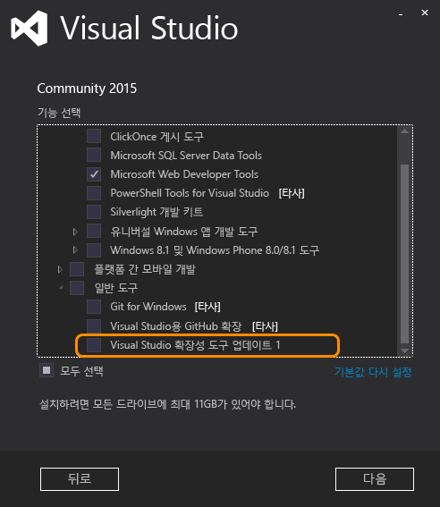

# <a name="installing-the-visual-studio-sdk"></a>Visual Studio SDK 설치
Visual Studio 2015를 시작 하면 설치 하지 마십시오 Visual Studio SDK 다운로드 센터에서. Visual Studio 설치 프로그램의 선택적 기능으로 포함 됩니다. 또한 VS SDK를 나중에 설치할 수 있습니다.  
  
## <a name="installing-the-visual-studio-sdk-as-part-of-a-visual-studio-installation"></a>Visual Studio 설치의 일부로 Visual Studio SDK 설치  
 VSSDK Visual Studio 설치에 포함 하려는 경우에 사용자 지정 설치를 수행 해야 합니다.  
  
> [!NOTE]
>  실행 가능한 설치 프로그램을 Visual Studio SDK 라고 **Visual Studio 확장성 도구**합니다.  
  
1.  Visual Studio 2015 설치를 시작 합니다. Visual studio Express 제외한 모든 버전을 설치할 수 있습니다.  
  
2.  첫 번째 화면에서 선택 **사용자 지정**이 아니라 **기본**합니다. **다음**을 클릭합니다.  
  
3.  사용자 지정 기능 트리 뷰로 표시 됩니다. 열기 **일반 도구**합니다. 표시 되어야 **Visual Studio 확장성 도구** 합니다.  
  
       
  
4.  확인 **Visual Studio 확장성 도구** 를 클릭 한 다음 **다음** 설치를 계속 합니다.  
  
## <a name="installing-the-visual-studio-sdk-after-installing-visual-studio"></a>Visual Studio를 설치한 후 Visual Studio SDK를 설치 합니다.  
 Visual Studio 설치를 완료 한 후 Visual Studio SDK를 설치 하려는 경우 다음 절차를 따라야 합니다.  
  
1.  이동 **제어판 / 프로그램 / 프로그램 및 기능**를 찾아서 **Visual Studio 2015**합니다. Express 제외 하 고 Visual Studio 2015의 모든 버전에 대 한 Visual Studio SDK를 설치할 수 있습니다.  
  
2.  마우스 오른쪽 단추로 클릭 **Visual Studio 2015**를 클릭 하 고 **변경**합니다. 설치 페이지가 표시 됩니다.  
  
3.  와 동일한 절차에 따라 **Visual Studio 설치의 일부로 Visual Studio SDK 설치** 위에 있습니다.  
  
4.  클릭 된 **Visual Studio 확장성 도구** Visual Studio SDK를 설치 하는 링크입니다.  
  
## <a name="installing-the-visual-studio-sdk-from-a-solution"></a>솔루션에서 Visual Studio SDK를 설치합니다.  
 VSSDK를 먼저 설치 하지 않고 확장성 프로젝트와 솔루션을 열 경우 솔루션 탐색기 위에 강조 표시 된 정보 표시줄에서 묻는 메시지가 나타납니다. 다음과 유사한 출력이 표시 됩니다.  
  
   
  
## <a name="installing-the-visual-studio-sdk-from-the-command-line"></a>명령줄에서 Visual Studio SDK를 설치합니다.  
 사용 하 여 명령줄에서는 VSSDK를 설치할 수는 **/InstallSelectableItems** Visual Studio 설치 프로그램으로 전환 합니다. 설치 관리자 명령줄 매개 변수를 사용 하는 방법에 대 한 자세한 내용은 참조 하십시오. [명령줄 매개 변수를 사용 하 여 Visual Studio 설치](../install/use-command-line-parameters-to-install-visual-studio.md)합니다.  
  
 자동으로 Visual Studio 2015 Community 설치 관리자를 사용 하 여 VSSDK 설치 방법은 다음과 같습니다.  
  
```  
vs_community.exe /s /installSelectableItems VS_SDK_GROUPV1  
```  
  
 참고 여 설치 된 버전의 Visual Studio와 일치 하는 Visual Studio 설치 관리자를 사용 해야 합니다. 예를 들어 컴퓨터에 설치 된 Visual Studio Enterprise를 사용 하도록 설정한 경우에 Visual Studio Enterprise 설치 관리자 (vs_enterprise.exe)를 실행 해야 합니다.
