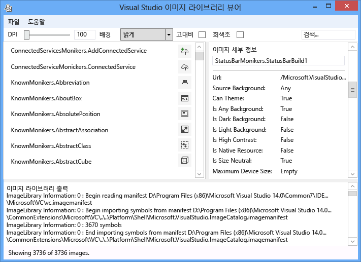
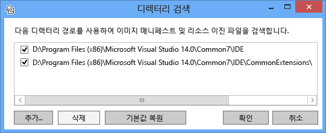
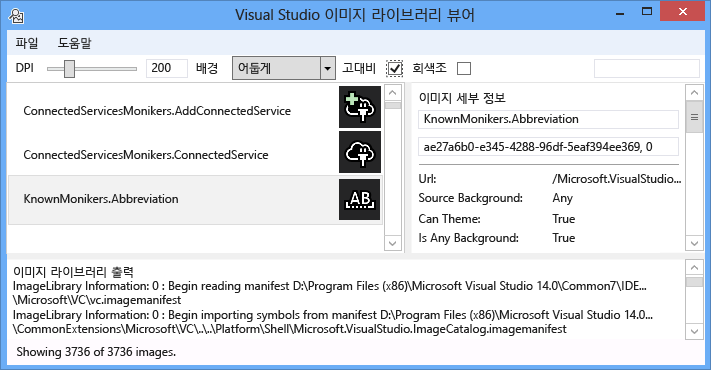
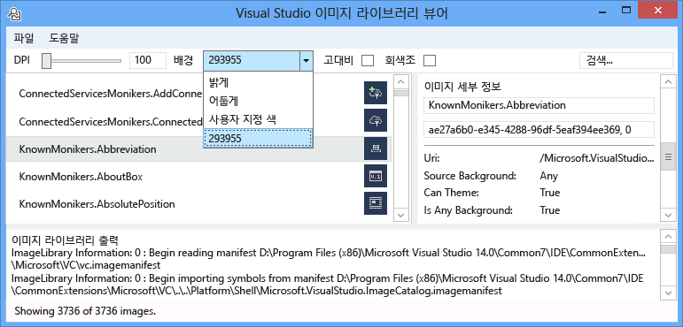
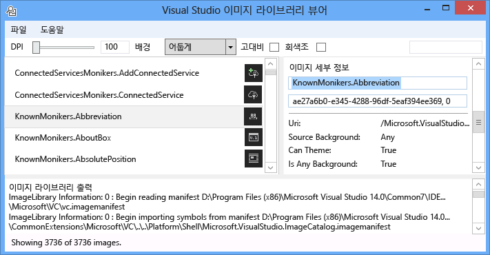
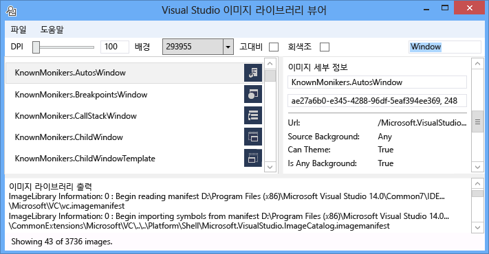
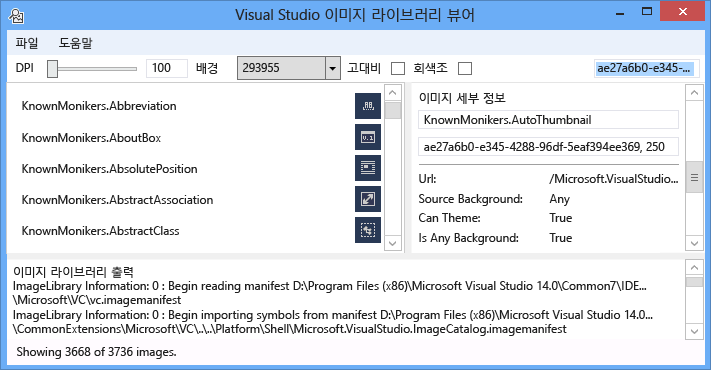
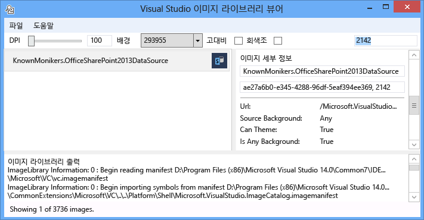

# 이미지 라이브러리 뷰어
[!INCLUDE[vs2017banner](../../code-quality/includes/vs2017banner.md)]

Visual Studio 이미지 라이브러리 뷰어 도구를 로드 하 고 이미지 매니페스트, 사용자가 Visual Studio 동일한 동일한 방식으로 조작할 수 있도록 검색 수 있습니다. 사용자는 배경, 크기, DPI, 고대비 및 기타 설정을 변경할 수 있습니다. 또한 도구는 각 이미지 매니페스트에 대 한 정보를 로드 하을 이미지 매니페스트에서 각 이미지에 대 한 소스 정보를 표시 합니다. 이 도구에 유용합니다.  
  
1.  오류 진단  
  
2.  사용자 지정 이미지 매니페스트에 보장 특성이 올바르게 설정 되어  
  
3.  Visual Studio 확장 Visual Studio의 스타일에 맞게 이미지를 사용할 수 있도록 Visual Studio 이미지 카탈로그에는 이미지에 대 한 검색  
  
   
  
 **이미지 모니커**  
  
 이미지 모니커 (또는 줄여서 모니커)는 고유 하 게 식별 된 이미지 자산 또는 이미지 라이브러리에서 이미지 목록 자산 GUID:ID 쌍.  
  
 **이미지의 매니페스트 파일**  
  
 이미지 (.imagemanifest) 매니페스트 파일은 이러한 자산 및 실제 이미지 또는 각 자산을 나타내는 이미지를 나타내는 모니커 이미지 자산의 집합을 정의 하는 XML 파일. 레거시 UI 지원에 대 한 이미지 목록 또는 이미지 매니페스트 독립 실행형 이미지를 정의할 수 있습니다. 또한, 시기 및 해당 자산을 표시 하는 방법을 변경 하려면 각각의 자산 뒤 개별 이미지 또는 자산에서 설정할 수 있는 속성이 있습니다.  
  
 **이미지 매니페스트 스키마**  
  
 이미지 완료 매니페스트는 다음과 같습니다.  
  
```xml  
<ImageManifest>  
      <!-- zero or one Symbols elements -->  
      <Symbols>  
        <!-- zero or more Guid, ID, or String elements -->  
      </Symbols>  
      <!-- zero or one Images elements -->  
      <Images>  
        <!-- zero or more Image elements -->  
      </Images>  
      <!-- zero or one ImageLists elements -->  
      <ImageLists>  
        <!-- zero or more ImageList elements -->  
      </ImageLists>  
</ImageManifest>  
```  
  
 **기호**  
  
 가독성과 유지 관리 지원, 이미지 매니페스트 기호 특성 값에 사용할 수 있습니다. 기호는 다음과 같이 정의 됩니다.  
  
```xml  
<Symbols>  
      <Import Manifest="manifest" />  
      <Guid Name="ShellCommandGuid" Value="8ee4f65d-bab4-4cde-b8e7-ac412abbda8a" />  
      <ID Name="cmdidSaveAll" Value="1000" />  
      <String Name="AssemblyName" Value="Microsoft.VisualStudio.Shell.UI.Internal" />  
</Symbols>  
```  
  
|||  
|-|-|  
|**하위 요소**|**정의**|  
|가져오기|현재 매니페스트에서 사용 하기 위해 지정된 된 매니페스트 파일의 기호를 가져옵니다.|  
|Guid|GUID를 나타내는 기호와 GUID 서식 지정과 일치 해야 합니다.|  
|ID|ID를 나타내는 기호와 음수가 아닌 정수 여야 합니다.|  
|문자열|기호는 임의의 문자열 값을 나타냅니다.|  
  
 기호는 대/소문자 구분, 및 $(symbol-name) 구문을 사용 하 여 참조입니다.  
  
```xml  
<Image Guid="$(ShellCommandGuid)" ID="$(cmdidSaveAll)" >  
      <Source Uri="/$(AssemblyName);Component/Resources/image.xaml" />  
</Image>  
```  
  
 일부 기호는 모든 매니페스트에 대 한 미리 정의 되어 있습니다. 이러한 Uri 특성에 사용할 수는 \< 소스> 또는 \< 가져오기> 요소는 로컬 컴퓨터에서 참조 경로입니다.  
  
|||  
|-|-|  
|**기호**|**설명**|  
|CommonProgramFiles|% CommonProgramFiles % 환경 변수 값|  
|LocalAppData|% LocalAppData % 환경 변수 값|  
|ManifestFolder|매니페스트 파일을 포함 하는 폴더|  
|내 문서|현재 사용자의 내 문서 폴더의 전체 경로|  
|ProgramFiles|% ProgramFiles % 환경 변수 값|  
|System|Windows\System32 폴더|  
|WinDir|% WinDir % 환경 변수 값|  
  
 **이미지**  
  
 \< 이미지> 요소는 moniker에서 참조 될 수 있는 이미지를 정의 합니다. GUID 및 ID 전체적으로 볼 이미지 모니커를 형성 합니다. 모니커는 이미지에 대 한 전체 이미지 라이브러리의 고유 해야 합니다. 라이브러리를 작성 하는 동안 발생 한 첫 번째 이미지가 하나 이상 지정 된 모니커를 갖도록, 인지 보존 되는 것입니다.  
  
 원본을 하나 이상 있어야 합니다. 크기 중립 원본 크기의 광범위 한 범위에서 최상의 결과 제공 합니다, 있지만 필요 하지 않습니다. 서비스에 정의 되지 않은 크기의 이미지에 대 한 요청은 \< 이미지> 요소 및 크기와 무관 소스가 없다는, 서비스는 최상의 크기 관련 소스를 선택 하 고 요청된 된 크기를 조정 합니다.  
  
```xml  
<Image Guid="guid" ID="int" AllowColorInversion="true/false">  
      <Source ... />  
      <!-- optional additional Source elements -->  
</Image>  
```  
  
|||  
|-|-|  
|**특성**|**정의**|  
|Guid|[필수] 이미지 모니커의 GUID 부분|  
|ID|[필수] 이미지 모니커 ID 부분|  
|AllowColorInversion|[선택 사항, 기본값은 true] 이미지에 프로그래밍 방식으로 어두운 배경을 사용 하는 경우 반전 된 색을 가질 수 있는지 여부를 나타냅니다.|  
  
 **소스**  
  
 \< 소스> 요소 (XAML 및 PNG)에 단일 이미지 원본 자산을 정의 합니다.  
  
```xml  
<Source Uri="uri" Background="background">  
      <!-- optional NativeResource element -->  
 </Source>  
```  
  
|||  
|-|-|  
|**특성**|**정의**|  
|URI|[필수] 이미지를 로드할 수 수를 정의 하는 URI입니다. 다음 중 하나일 수 있습니다.<br /><br /> -A [Pack URI](http://msdn.microsoft.com/en-US/library/aa970069\(v=vs.100\).aspx) 응용 프로그램을 사용 하 여: / / / 기관<br /><br /> -절대 구성 요소 리소스 참조<br /><br /> -네이티브 리소스를 포함 하는 파일 경로|  
|배경|[옵션] 소스는 사용 하기 위한 배경의 종류에 대해 무엇을 나타냅니다.<br /><br /> 다음 중 하나일 수 있습니다.<br /><br /> - *Light*: 밝은 배경에서 소스를 사용할 수 있습니다.<br /><br /> - *어두운*:에 어두운 화면에서 소스를 사용할 수 있습니다.<br /><br /> - *고 대비*: 고대비 모드에서는 백그라운드에서 소스를 사용할 수 있습니다.<br /><br /> - *HighContrastLight*: 고대비 모드에서 밝은 배경에서 소스를 사용할 수 있습니다.<br /><br /> -*HighContrastDark*: 고대비 모드에 어두운 화면에서 소스를 사용할 수 있습니다.<br /><br /> 하는 경우는 **배경** 특성을 생략 하면, 모든 백그라운드에서 소스를 사용할 수 있습니다.<br /><br /> 경우 **배경** 는 *빛*, *어두운*, *HighContrastLight*, 또는 *HighContrastDark*, 소스의 색 반전 하지 않습니다. 경우 **배경** 를 생략할지 또는로 설정 *고 대비*, 소스의 색 반전 이미지의에 의해 제어 됩니다 **AllowColorInversion** 특성입니다.|  
  
 A \< 소스> 요소는 다음과 같은 선택적 하위 요소 중 하나만 포함할 수 있습니다.  
  
||||  
|-|-|-|  
|**요소**|**특성 (모두 필수)**|**정의**|  
|\< 크기>|값|소스 장치 단위로 지정된 된 크기의 이미지에 대 한 사용 됩니다. 이미지는 사각형 됩니다.|  
|\< SizeRange>|MinSize, 최대 크기|소스 장치 단위로 MaxSize MinSize에서 이미지에 대 한 포괄적 사용 됩니다. 이미지는 사각형 됩니다.|  
|\< 차원>|너비, 높이|지정 된 너비와 높이 (장치 단위)의 이미지에 대 한 소스 사용 됩니다.|  
|\< DimensionRange>|MinWidth, MinHeight<br /><br /> 최대 너비, 최대 높이|원본 최소 너비/높이에서 최대 너비/높이 (장치 단위)에 이미지에 대 한 포괄적 사용 됩니다.|  
  
 A \< 소스> 요소는 선택적 있을 수도 있습니다 \< NativeResource> 정의 하는 하위 요소는 \< 소스> 관리 되는 어셈블리 보다는 네이티브 어셈블리에서 로드 되는 합니다.  
  
```xml  
<NativeResource Type="type" ID="int" />  
```  
  
|||  
|-|-|  
|**특성**|**정의**|  
|형식|[필수] 네이티브 리소스가 XAML 또는 PNG 형식|  
|ID|[필수] 네이티브 리소스의 정수 ID 부분|  
  
 **이미지 목록**  
  
 \< ImageList> 요소 단일 줄에 반환 될 수 있는 이미지의 컬렉션을 정의 합니다. 필요에 따라 주문형, 스트립이 빌드됩니다.  
  
```xml  
<ImageList>  
      <ContainedImage Guid="guid" ID="int" External="true/false" />  
      <!-- optional additional ContainedImage elements -->  
 </ImageList>  
```  
  
|||  
|-|-|  
|**특성**|**정의**|  
|Guid|[필수] 이미지 모니커의 GUID 부분|  
|ID|[필수] 이미지 모니커 ID 부분|  
|외부|[선택 사항, 기본값은 false] 이미지 모니커 현재 매니페스트에서 이미지를 참조 하는지 여부를 나타냅니다.|  
  
 포함 된 이미지에 대 한 moniker 현재 매니페스트에서 정의 되는 이미지를 참조할 필요가 없습니다. 이미지 라이브러리에 포함 된 이미지를 찾지 못하면 빈 자리 표시자 이미지가 그 자리에 사용 됩니다.  
  
## <a name="how-to-use-the-tool"></a>이 도구를 사용 하는 방법  
 **사용자 지정 이미지 매니페스트 유효성 검사**  
  
 사용자 지정 매니페스트를 만들려면 자동 생성 된 매니페스트 ManifestFromResources 도구를 사용 하는 것이 좋습니다. 사용자 지정 매니페스트 유효성을 검사 하려면 이미지 라이브러리 뷰어를 시작 하 고 파일을 선택 > 경로 설정 중... 검색 디렉터리 대화 상자를 엽니다. 도구는 이미지 매니페스트를 로드 하는 검색 디렉터리를 사용 하지만 또한을 사용 합니다는 매니페스트에서 이미지를 포함 하는.dll 파일을 검색할 수 있으므로 포함 되었는지 확인에서 매니페스트 및 DLL 디렉터리가이 대화 상자에서.  
  
   
  
 클릭 **추가...** 매니페스트 및 해당 해당 Dll에 대 한 검색 하는 새 검색 디렉터리를 선택 합니다. 도구에서 기억 하므로 이러한 검색 디렉터리 며 있습니다 수 설정 또는 해제 하거나 디렉터리를 선택 취소 합니다.  
  
 기본적으로이 도구는 Visual Studio 설치 디렉터리를 찾아 검색 디렉터리 목록에 해당 디렉터리를 추가 하려고 합니다. 이 도구를 찾지 못하면 디렉터리를 수동으로 추가할 수 있습니다.  
  
 전환 하는 도구를 사용할 수 모든 매니페스트 로드 되 면 **배경** 색, **DPI**, **고대비**, 또는 **색상 및 농도가 \** 이미지에 대 한 사용자 확인 하려면 이미지 자산을 시각적으로 확인할 수 있도록 되 고 올바르게 렌더링 되며 다양 한 설정에 대 한 합니다.  
  
   
  
 배경색 조명, 어둡게, 또는 사용자 지정 값을 설정할 수 있습니다. "사용자 지정 색"을 선택 하는 색 선택 대화 상자를 열고를 쉽게 회수 나중에 대 한 배경 콤보 상자 맨 아래에 해당 사용자 지정 색을 추가 합니다.  
  
   
  
 이미지 모니커를 선택 하면 오른쪽에 있는 이미지 세부 정보 창에서 해당 모니커 뒤에 각 실제 이미지에 대 한 정보를 표시 합니다. 창에서 수행할 수도 있습니다 또는 원시 GUID:ID 값 이름으로는 모니커를 복사 합니다.  
  
   
  
 각 이미지 원본에 대해 표시 되는 정보 테마가 지원 될 수 있는지를 표시 하도록 배경의 종류를 포함 하거나 고대비에는 사용할 수 있는 크기를 지원 또는 크기 중립적 인지 하 고 이미지는 네이티브 어셈블리에서 제공 하는 여부.  
  
   
  
 이미지 매니페스트 유효성을 검사할 때 매니페스트 및 DLL의 실제 위치에 이미지를 배포 하는 것이 좋습니다. 상대 경로로 올바르게 작동 하는지 및 이미지 라이브러리를 찾을 하 고 매니페스트 및 DLL 이미지를 불러올 수를 확인 합니다.  
  
 **KnownMonikers 이미지 카탈로그에 대 한 검색**  
  
 Visual Studio 스타일을 더 잘 일치 Visual Studio 확장은 Visual Studio 이미지 카탈로그 보다는 만들고 자체를 사용 하 여 이미지 사용 수 있습니다. 이러한 이미지를 유지 하지 않고 장점이 있으며 이미지 들이 있는 높은 DPI 백업 이미지를 지 원하는 Visual Studio는 모든 DPI 설정에서 올바른 보여야 하므로 보장 합니다.  
  
 이미지 라이브러리 뷰어 매니페스트를 사용자 이미지 자산을 나타내는 모니커를 찾을 하 고 코드에서 해당 모니커를 사용할 수 있도록 검색 될 수 있습니다. 이미지를 검색 하려면 검색 상자에 원하는 검색 용어를 입력 하 고 Enter 키를 누릅니다. 맨 아래에 있는 상태 표시줄 매니페스트의 모든 총 이미지 수가 일치 하는 항목이 표시 됩니다.  
  
   
  
 기존 매니페스트에 이미지 모니커를 검색할 때 검색만 Visual Studio 이미지 카탈로그의 모니커, 의도적으로 공개적으로 액세스할 수 있는 다른 모니커 또는 사용자 고유의 사용자 지정 모니커를 사용 하는 것이 좋습니다. Public이 아닌 모니커를 사용 하는 경우 사용자 지정 UI를 손상 될 수 있습니다 없거나 해당 이미지 변경 예기치 못한 방식으로 또는 이러한 public이 아닌 모니커 및 이미지 변경 하거나 업데이트할 때.  
  
 또한 GUID를 통해 검색 불가능 합니다. 이 유형의 검색 단일 매니페스트를 목록에서 아래로 필터링에 유용 또는 여러 Guid가 포함 하는 경우 해당 매니페스트 매니페스트의 단일 하위 섹션입니다.  
  
   
  
 마지막으로, ID가 검색 가능한도 됩니다.  
  
   
  
## <a name="notes"></a>노트  
  
-   기본적으로이 도구는 Visual Studio 설치 디렉터리에 있는 여러 이미지 매니페스트에 끌어옵니다. 공개적으로 사용할 수 있도록 모니커를 가진 중 하나만 사용 되는 **Microsoft.VisualStudio.ImageCatalog** 매니페스트. GUID: ae27a6b0-e345-4288-96df-5eaf394ee369 (수행 **하지** 이 GUID에 사용자 지정 매니페스트 재정의) 유형: KnownMonikers  
  
-   이 도구는 실제로 표시 하도록 응용 프로그램에 대 한 몇 초가 걸릴 수 있으므로 찾으면 모든 이미지 매니페스트를 로드 하는 시작 시 시도 합니다. 느리거나 응답이 없는 매니페스트를 로드 하는 동안도 수 있습니다.  
  
## <a name="sample-output"></a>샘플 출력  
 이 도구는 모든 출력을 생성 하지 않습니다.