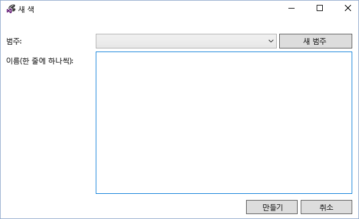
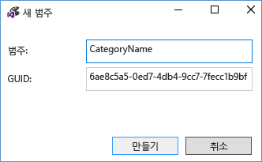
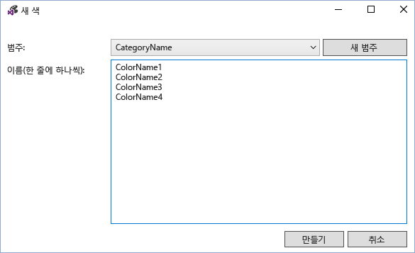
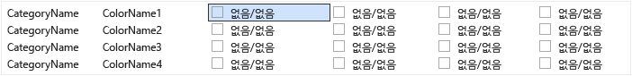
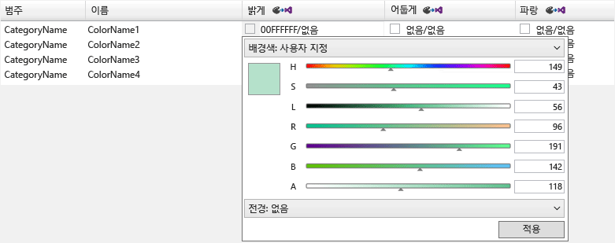
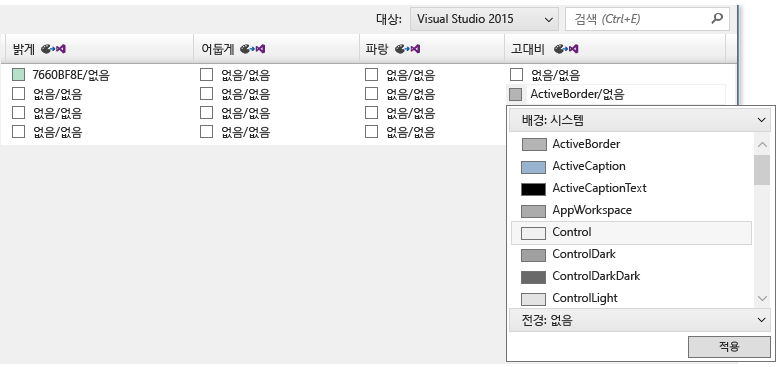
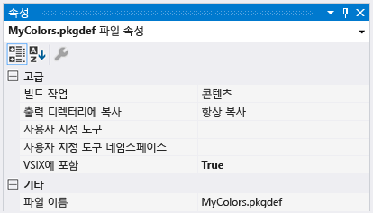
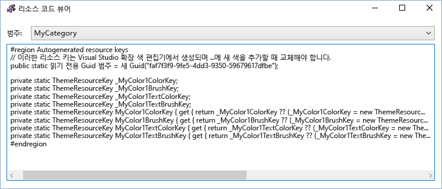
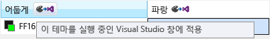

# VSIX 색 편집기
[!INCLUDE[vs2017banner](../../code-quality/includes/vs2017banner.md)]

Visual Studio 확장 색 편집기 도구를 만들고 Visual Studio에 대 한 사용자 지정 색을 편집할 수 있습니다. 이 도구는 코드에서 색을 사용할 수 있도록 테마 리소스 키를 생성할 수도 있습니다. 이 도구는 Visual Studio 확장을 지 원하는 테마에 대 한 색을 만드는 데 유용 합니다. 이 도구는.pkgdef 및.xml 파일을 열 수 있습니다. Visual Studio 테마 \(.vstheme 파일\)를.xml으로 파일 확장명을 변경 하 여 Visual Studio 확장 색 편집기로 사용할 수 있습니다. 또한 현재.xml 파일로.vstheme 파일을 가져올 수 있습니다.  
  
   
  
 **패키지 정의 파일**  
  
 패키지 정의 \(.pkgdef\) 파일은 테마를 정의 하는 파일입니다. 자체 색.pkgdef 파일으로 컴파일되는 테마 색.xml 파일에 저장 됩니다. .Pkgdef 파일이 Visual Studio 검색할 수 있는 위치에 배포, 런타임 시 처리 되 고 테마를 정의 하는 병합 있습니다.  
  
 **색 토큰**  
  
 색 토큰 네 가지 요소로 구성 됩니다.  
  
-   **범주 이름:** 색 집합에 대 한 논리적 그룹화입니다. 기존 범주 이름을 사용 하 여 이미 있을 경우 원하는 UI 요소 또는 UI 요소에는 그룹에만 적용 되는 색입니다.  
  
-   **토큰 이름:** 색 토큰 및 토큰 집합에 대 한 설명이 포함 된 이름입니다. 집합의 모든 상태 뿐만 아니라 배경 및 전경 \(텍스트\) 토큰 이름을 포함 하 고 이러한 이름을 지정 해야 하는 쌍 및 상태를 적용할 때 쉽게 식별할 수 있도록 합니다.  
  
-   **색 값 \(또는 색상\):** 각 색이 지정 된 테마에 대 한 필요 합니다. 항상 만들기 배경 및 텍스트 색 값 쌍에서입니다. 색 \(전경색\) 텍스트 색은 항상 그릴는 배경 색에 대해 읽을 수 있도록 백그라운드\/전경에 대 한 이루고 있습니다. 이러한 색 연결 되 고 UI에 함께 사용 됩니다. 텍스트와 함께 사용 하기 위해 백그라운드 없는 경우에 전경색을 정의 하지 않습니다.  
  
-   **시스템 색 이름을:** 고대비 표시에 사용 합니다.  
  
## 이 도구를 사용 하는 방법  
 가능한 만큼 적절 한 경우 새로 만들지 않고 기존 Visual Studio 색상을 다시 사용할 해야 합니다. 그러나 없는 적절 한 색 정의 되어 있는 경우에 대 한 사용자 지정 색 만들어야 확장 테마 호환 되도록 합니다.  
  
 **새 색 토큰 만들기**  
  
 Visual Studio 확장 색 편집기를 사용 하 여 사용자 지정 색을 만들려면 다음이 단계를 따르십시오.  
  
1.  새 색 토큰에 대 한 범주 및 토큰 이름을 결정 합니다.  
  
2.  UI 요소에서 고대비 각 테마 및 시스템 색에 사용할 색상을 선택 합니다.  
  
3.  새 색 토큰을 만들려면 색 편집기를 사용 합니다.  
  
4.  Visual Studio 확장에서 색을 사용 합니다.  
  
5.  Visual Studio에서 변경 내용을 테스트 합니다.  
  
 **1 단계: 새 색 토큰에 대 한 토큰 이름과 범주를 확인 합니다.**  
  
 VSColor에 대 한 구성표에 기본 명명 **\[Category\] \[UI 유형\] \[State\]**합니다. 중복 된 것 이므로 VSColor 이름에 "color" 라는 단어를 사용 하지 마십시오.  
  
 범주 이름 논리적 그룹화를 제공 및으로 가능한 구체적으로 정의 해야 합니다. 예를 들어 단일 도구 창의 이름, 범주 이름을 변경할 수 있지만 전체 비즈니스 단위 또는 프로젝트 팀의 이름은 아닙니다. 항목 범주로 그룹화 이름이 같은 색의 혼동을 방지할 수 있습니다.  
  
 요소 형식 및의 경우 또는 "상태를"는 색이 적용 될 토큰 이름을 명확 하 게 나타내야 합니다. 예를 들어 한 활성 데이터 팁의 **\[UI 유형\]** 이름을 지정할 수 있습니다 "**DataTip**" 고 **\[State\]** 이름을 지정할 수 있습니다 "**활성**,"의 색 이름이 "**DataTipActive**." 데이터 팁 텍스트가는 전경색과 배경색을 모두 정의 해야 합니다. 배경\/전경 쌍을 사용 하 여 색 편집기에서 자동으로 만듭니다 색 "**DataTipActive**" 배경에 대 한 및 "**DataTipActiveText**" 전경.  
  
 UI의 부분에 하나의 상태는 **\[State\]** 이름 부분을 생략할 수 있습니다. 예를 들어, 검색 상자에 있는 테두리 테두리의 색에 영향을 주지 상태 변경 사항이 없는 경우 다음 테두리의 색 토큰에 대 한 이름을 간단히 호출할 수 있습니다 "**SearchBoxBorder**."  
  
 다음과 같은 몇 가지 일반적인 상태 이름을  
  
-   활성  
  
-   비활성  
  
-   MouseOver  
  
-   MouseDown  
  
-   선택함  
  
-   포커스가 있는  
  
 목록 항목 컨트롤의 부분에 대 한 몇 가지 토큰 이름의 예:  
  
-   ListItem  
  
-   ListItemBorder  
  
-   ListItemMouseOver  
  
-   ListItemMouseOverBorder  
  
-   ListItemSelected  
  
-   ListItemSelectedBorder  
  
-   ListItemDisabled  
  
-   ListItemDisabledBorder  
  
 **2 단계: UI 요소에서 고대비 각 테마 및 시스템 색에 사용할 색상을 선택 합니다.**  
  
 UI에 대 한 사용자 지정 색을 선택할 때 비슷한 기존 UI 요소를 선택 하 고를 기준으로 해당 색을 사용 합니다. 상자에서 UI 요소에 대 한 색 종류 검토 및 테스트에 적절 한 표시 및 모든 테마에서 올바르게 작동 하도록 합니다.  
  
 **3 단계: 새 색 토큰을 만들 색 편집기를 사용 합니다.**  
  
 색 편집기를 시작 하 고 열거나 새 사용자 지정 테마 색.xml 파일을 만듭니다. 선택 **편집 \> 새로운 색** 메뉴에서 합니다. 그러면 해당 범주 내의 색 항목에 대 한 하나 이상의 이름 및 범주를 지정 하는 대화 상자에 표시 됩니다.  
  
   
  
 기존 범주를 선택 하거나 선택 **새 범주** 새 범주를 만들 수 있습니다. 새 범주 이름을 만들기 대화 상자가 열립니다.  
  
   
  
 새 범주에서 사용할 수 있는 될는 **새로운 색** 범주 드롭다운 메뉴. 범주를 선택한 후 각 새 색 토큰에 대 한 줄당 하나의 이름을 입력 하 고 완료 되 면 "만들기"를 선택 합니다.  
  
   
  
 색상 값은 "없음"으로 나타내는 색 정의 되지 않은 백그라운드\/전경 쌍에 표시 됩니다. 참고: 색 텍스트 색\/배경 색 쌍이 없는 경우 다음 백그라운드만 정의 해야 합니다.  
  
   
  
 색 토큰을 편집 하려면 해당 토큰의 테마 \(열\)에 대 한 색 항목을 선택 합니다. 8 자리 ARGB 형식에 16 진수 색 값을 입력, 셀에 시스템 색 이름을 입력 하거나 색 슬라이더의 집합 또는 시스템 색 목록을 통해 원하는 색을 선택 하려면 드롭다운 메뉴를 사용 하 여 색 값을 추가 합니다.  
  
   
  
   
  
 텍스트를 표시 하는 필요 하지 않은 구성 요소에 대 한 색상 값을 입력 합니다: 배경색입니다. 그렇지 않으면 슬래시로 구분 된 텍스트와 배경 색에 대 한 값을 입력 합니다.  
  
 고대비에 대 한 값을 입력할 때 올바른 Windows 시스템 색 이름을 입력 합니다. 하드 코드 된 ARGB 값을 입력 하지 마십시오. 색 값 드롭다운 메뉴에서 "배경:: 시스템" 또는 "전경:: 시스템"를 선택 하 여 유효한 시스템 색 이름 목록을 볼 수 있습니다. 텍스트 구성 요소를 가진 요소를 만들 때 올바른 배경\/텍스트 시스템 색 쌍을 사용 하거나 텍스트를 읽을 수 없습니다.  
  
 만들기, 설정 및 색 토큰을 편집을 마치면 원하는.xml 또는.pkgdef 형식으로 저장 합니다. 모두 배경의 색 토큰도 전경 집합은 빈 색.xml 형식에서으로 저장 하지만.pkgdef 형식에서 삭제 됩니다. 대화 상자는 경고 색 손실의 빈 색.pkgdef 파일에 저장 하려는 경우.  
  
 **4 단계: Visual Studio 확장에서 색을 사용 합니다.**  
  
 새로운 색을 정의한 후에 토큰을 "빌드 동작" "콘텐츠"로 설정 된 프로젝트 파일에는.pkgdef를 포함 하 고 "VSIX에 포함" 설정 "True"를 선택 합니다.  
  
   
  
 Visual Studio 확장 색 편집기에서 파일을 선택 \> WPF 기반 UI에서 사용자 지정 액세스에 사용 되는 코드를 보려면 보기 리소스 코드 색입니다.  
  
   
  
 프로젝트에서 정적 클래스에이 코드를 포함 합니다. 에 대 한 참조 **Microsoft.VisualStudio.Shell. \< VSVersion \>.0.dll** 사용 하 여 프로젝트에 추가 해야 하는 **ThemeResourceKey** 유형입니다.  
  
```c#  
namespace MyCustomColors { public static class MyCategory { #region Autogenerated resource keys // These resource keys are generated by Visual Studio Extension Color Editor, and should be replaced when new colors are added to this category. public static readonly Guid Category = new Guid("faf7f3f9-9fe5-4dd3-9350-59679617dfbe"); private static ThemeResourceKey _MyColor1ColorKey; private static ThemeResourceKey _MyColor1BrushKey; private static ThemeResourceKey _MyColor1TextColorKey; private static ThemeResourceKey _MyColor1TextBrushKey; public static ThemeResourceKey MyColor1ColorKey { get { return _MyColor1ColorKey ?? (_MyColor1ColorKey = new ThemeResourceKey(Category, "MyColor1", ThemeResourceKeyType.BackgroundColor)); } } public static ThemeResourceKey MyColor1BrushKey { get { return _MyColor1BrushKey ?? (_MyColor1BrushKey = new ThemeResourceKey(Category, "MyColor1", ThemeResourceKeyType.BackgroundBrush)); } } public static ThemeResourceKey MyColor1TextColorKey { get { return _MyColor1TextColorKey ?? (_MyColor1TextColorKey = new ThemeResourceKey(Category, "MyColor1", ThemeResourceKeyType.ForegroundColor)); } } public static ThemeResourceKey MyColor1TextBrushKey { get { return _MyColor1TextBrushKey ?? (_MyColor1TextBrushKey = new ThemeResourceKey(Category, "MyColor1", ThemeResourceKeyType.ForegroundBrush)); } } #endregion } }  
```  
  
 이 XAML 코드의 색상에 액세스할 수 있으며 UI 테마 변경에 응답할 수 있습니다.  
  
```xaml  
<UserControl x:Class="NewTestProject.TestPackageControl" Name="MyToolWindow" xmlns="http://schemas.microsoft.com/winfx/2006/xaml/presentation" xmlns:x="http://schemas.microsoft.com/winfx/2006/xaml" xmlns:ns="clr-namespace:MyCustomColors"> <Grid> <TextBlock Background="{DynamicResource {x:Static ns:MyCategory.MyColor1BrushKey}}" Foreground="{DynamicResource {x:Static ns:MyCategory.MyColor1TextBrushKey}}" >Sample Text</TextBlock> </Grid> </UserControl>  
```  
  
 **5 단계: Visual Studio에서 변경 내용을 테스트 합니다.**  
  
 일시적으로 색 편집기 확장 패키지를 다시 작성 하지 않고 색 실시간 변경 내용을 확인 하는 Visual Studio의 실행 중인 인스턴스를 색 토큰을 적용할 수 있습니다. 이렇게 하려면 각 테마 열 머리글에 있는 "Visual Studio windows를 실행 하려면이 테마 적용" 단추를 클릭 합니다. 이 임시 테마는 사라집니다 VSIX 색 편집기를 닫을 때.  
  
   
  
 변경 내용을 영구적, 다시 작성 한.pkgdef 파일을 새로운 색을 추가 하 고 해당 색을 사용 하는 코드를 작성 한 후 Visual Studio 확장을 다시 배포 합니다. Visual Studio 확장을 다시 작성 하 여 새 색상에 대 한 레지스트리 값은 테마의 나머지 부분에 병합 됩니다. 다음 Visual Studio를 다시 시작 하 고 UI를 보고 새로운 색 예상 대로 나타나는지 확인 합니다.  
  
## 참고  
 이 도구는 사용자 지정 테마를 Visual Studio의 색은 편집 또는 기존 Visual Studio 테마에 대 한 사용자 지정 색을 만드는 데 사용 하는 데 사용 됩니다. 사용자 지정 하는 전체 Visual Studio 테마를 만들려면 다운로드는 [Visual Studio 색 테마 편집기 확장](http://visualstudiogallery.msdn.microsoft.com/6f4b51b6-5c6b-4a81-9cb5-f2daa560430b) Visual Studio 확장 갤러리에서.  
  
## 샘플 출력  
 **XML 색 출력**  
  
 이 도구에 의해 생성 된.xml 파일은 다음과 유사 하 게 됩니다.  
  
```xml  
<Themes> <Theme Name="Light" GUID="{de3dbbcd-f642-433c-8353-8f1df4370aba}"> <Category Name="CategoryName" GUID="{eee9d521-dac2-48d9-9a5e-5c625ba2040c}"> <Color Name="ColorName1"> <Background Type="CT_RAW" Source="FFFFFFFF" /> </Color> <Color Name="ColorName2"> <Background Type="CT_RAW" Source="FFFFFFFF" /> <Foreground Type="CT_RAW" Source="FF000000" /> </Color> <Color Name="ColorName3"> <Background Type="CT_RAW" Source="FFFF0000" /> </Color> <Color Name="ColorName4"> <Background Type="CT_RAW" Source="FF000088" /> <Foreground Type="CT_RAW" Source="FFFFFFFF" /> </Color> </Category> </Theme> <Theme Name="Dark" GUID="{1ded0138-47ce-435e-84ef-9ec1f439b749}">...</Theme> <Theme Name="Blue" GUID="{a4d6a176-b948-4b29-8c66-53c97a1ed7d0}">...</Theme> <Theme Name="HighContrast" GUID="{a5c004b4-2d4b-494e-bf01-45fc492522c7}">...</Theme> </Themes>  
  
```  
  
 **PKGDEF 컬러 출력**  
  
 도구에서 생성 하는.pkgdef 파일은 다음과 유사 하 게 됩니다.  
  
```  
[$RootKey$\Themes\{de3dbbcd-f642-433c-8353-8f1df4370aba}\CategoryName] "Data"=hex:78,00,00,00,0b,00,00,00,01,00,00,00,21,d5,e9,ee,c2,da,d9,48,9a,5e,5c,62,5b,a2,04,0c,04,00,00,00,0a,00,00,00,43,6f,6c,6f,72,4e,61,6d,65,31,01,ff,ff,ff,ff,00,0a,00,00,00,43,6f,6c,6f,72,4e,61,6d,65,32,01,ff,ff,ff,ff,01,00,00,00,ff,0a,00,00,00,43,6f,6c,6f,72,4e,61,6d,65,33,01,ff,00,00,ff,00,0a,00,00,00,43,6f,6c,6f,72,4e,61,6d,65,34,01,00,00,88,ff,01,ff,ff,ff,ff [$RootKey$\Themes\{1ded0138-47ce-435e-84ef-9ec1f439b749}\CategoryName] "Data"=hex:... [$RootKey$\Themes\{a4d6a176-b948-4b29-8c66-53c97a1ed7d0}\CategoryName] "Data"=hex:... [$RootKey$\Themes\{a5c004b4-2d4b-494e-bf01-45fc492522c7}\CategoryName] "Data"=hex:...  
  
```  
  
 **C\# 리소스 키 래퍼**  
  
 도구에서 생성 하는 색 리소스 키 다음과 유사 하 게 됩니다.  
  
```c#  
namespace MyNamespace { public static class MyColors { #region Autogenerated resource keys // These resource keys are generated by Visual Studio Extension Color Editor, and should be replaced when new colors are added to this category. public static string ColorName1ColorKey { get { return "ColorName1ColorKey"; } } public static string ColorName1BrushKey { get { return "ColorName1BrushKey"; } } public static string ColorName2ColorKey { get { return "ColorName2ColorKey"; } } public static string ColorName2BrushKey { get { return "ColorName2BrushKey"; } } public static string ColorName2TextColorKey { get { return "ColorName2TextColorKey"; } } public static string ColorName2TextBrushKey { get { return "ColorName2TextBrushKey"; } } public static string ColorName3ColorKey { get { return "ColorName4ColorKey"; } } public static string ColorName3BrushKey { get { return "ColorName4BrushKey"; } } public static string ColorName3TextColorKey { get { return "ColorName4TextColorKey"; } } public static string ColorName3TextBrushKey { get { return "ColorName4TextBrushKey"; } } #endregion } }  
```  
  
 **WPF 리소스 사전 래퍼**  
  
 색 **ResourceDictionary** 도구에서 생성 된 키 다음과 유사 하 게 됩니다.  
  
```xaml  
<ResourceDictionary xmlns="http://schemas.microsoft.com/winfx/2006/xaml/presentation" xmlns:x="http://schemas.microsoft.com/winfx/2006/xaml" xmlns:colors="clr-namespace:MyNamespace"> <SolidColorBrush x:Key="{x:Static colors:MyColors.ColorName1BrushKey}" Color="#FFFFFFFF" /> <Color x:Key="{x:Static colors:MyColors.ColorName1ColorKey}" A="255" R="255" G="255" B="255" /> <SolidColorBrush x:Key="{x:Static colors:MyColors.ColorName2BrushKey}" Color="#FFFFFFFF" /> <Color x:Key="{x:Static colors:MyColors.ColorName2ColorKey}" A="255" R="255" G="255" B="255" /> <SolidColorBrush x:Key="{x:Static colors:MyColors.ColorName2TextBrushKey}" Color="#FF000000" /> <Color x:Key="{x:Static colors:MyColors.ColorName2TextColorKey}" A="255" R="0" G="0" B="0" /> <SolidColorBrush x:Key="{x:Static colors:MyColors.ColorName3BrushKey}" Color="#FFFF0000" /> <Color x:Key="{x:Static colors:MyColors.ColorName3ColorKey}" A="255" R="255" G="0" B="0" /> <SolidColorBrush x:Key="{x:Static colors:MyColors.ColorName4BrushKey}" Color="#FF000088" /> <Color x:Key="{x:Static colors:MyColors.ColorName4ColorKey}" A="255" R="0" G="0" B="136" /> <SolidColorBrush x:Key="{x:Static colors:MyColors.ColorName4TextBrushKey}" Color="#FFFFFFFF" /> <Color x:Key="{x:Static colors:MyColors.ColorName4TextColorKey}" A="255" R="255" G="255" B="255" /> </ResourceDictionary>  
```