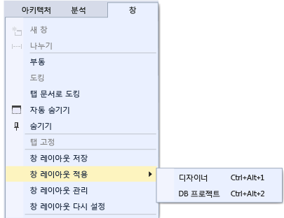

# Visual Studio에서 창 레이아웃 사용자 지정
Visual Studio에서 창의 위치, 크기 및 동작을 사용자 지정하여 다양한 개발 워크플로에 가장 적합한 창 레이아웃을 만들 수 있습니다. 레이아웃을 사용자 지정할 때 IDE에서는 레이아웃을 기억합니다. 예를 들어 **솔루션 탐색기** 의 도킹 위치를 변경한 후 Visual Studio를 닫고 다음에 다시 시작하면 다른 컴퓨터에서 작업하고 있는 경우에도 **솔루션 탐색기** 가 같은 위치에 도킹됩니다. 또한 사용자 지정 레이아웃에 이름을 지정하고 저장한 다음 단일 명령으로 레이아웃 간을 전환할 수 있습니다. 예를 들어 편집용 레이아웃과 디버그용 레이아웃을 만들고 **창 &#124; 창 레이아웃 적용** 메뉴 명령을 사용하여 레이아웃 간에 전환할 수 있습니다.  

## 창 종류  

### 도구 및 문서 창  
 IDE에는 두 가지 기본적인 창 유형인 *도구 창* 과 *문서 창*이 있습니다. 도구 창에는 솔루션 탐색기, 서버 탐색기, 출력 창, 오류 목록, 디자이너, 디버거 창 등이 포함됩니다. 문서 창에는 소스 코드 파일, 임의의 텍스트 파일, 구성 파일 등이 포함됩니다. 도구 창은 크기를 조정하고 제목 표시줄을 사용하여 끌 수 있습니다. 문서 창은 탭을 사용하여 끌 수 있습니다. 탭이나 제목 표시줄을 마우스 오른쪽 단추로 클릭하여 창에 대한 다른 옵션을 설정할 수 있습니다.  

 **창** 메뉴에는 IDE에서 창을 도킹하고, 부동 창으로 변경하고, 숨기기 위한 옵션이 표시됩니다. 창 탭이나 제목 표시줄을 마우스 오른쪽 단추로 클릭하여 해당 특정 창에 대한 추가 옵션을 표시할 수 있습니다. 특정 도구 창의 인스턴스를 한번에 두 개 이상 표시할 수 있습니다. 예를 들어 웹 브라우저 창을 두 개 이상 표시할 수 있으며 **창** 메뉴에서 **새 창** 을 선택하여 일부 도구 창의 인스턴스를 추가로 만들 수 있습니다.  

### 미리 보기 탭(문서 창)  
 미리 보기 탭에서, 파일을 열지 않고 편집기에서 파일을 볼 수 있습니다. 검색 결과를 탐색할 때와 파일을 한 단계씩 실행할 때 정의로 이동을 사용하여 디버깅 중에 **솔루션 탐색기**에서 파일을 선택하여 미리 볼 수 있습니다. 미리 보기 파일은 문서 탭 저장소의 오른쪽에 있는 탭에 나타납니다. 파일을 수정하거나 **열기**를 선택하는 경우 편집할 수 있도록 파일이 열립니다.  

### 탭 그룹  
 탭 그룹은 IDE에서 문서를 두 개 이상 열어 놓고 작업하는 동안 제한된 작업 영역을 관리하는 기능을 확장합니다. 여러 문서 창과 도구 창을 세로 또는 가로 탭 그룹으로 구성하고 한 탭 그룹의 문서를 다른 탭 그룹에 섞을 수 있습니다.  

### 분할 창  
 문서에서 한번에 두 위치를 보거나 편집해야 하는 경우 창을 분할할 수 있습니다. 문서를 독립적으로 스크롤되는 두 섹션으로 나누려면 **창** 메뉴에서 **분할** 을 클릭합니다. **창** 메뉴에서 **나누지 않음** 을 클릭하여 단일 뷰를 복원할 수 있습니다.  

### 도구 모음  
 도구 모음은 끌거나 **사용자 지정** 대화 상자를 사용하여 정렬할 수 있습니다. 도구 모음을 배치하고 사용자 지정하는 방법에 대한 자세한 내용은 [방법: 메뉴 및 도구 모음 사용자 지정](../ide/how-to-customize-menus-and-toolbars-in-visual-studio.md)을 참조하세요.  

## 창 정렬 및 고정  
 문서 창과 도구 창 모두 *도킹*될 수 있으므로 IDE 창 프레임 내에서 위치와 크기를 갖고 있거나 IDE와 독립적인 별도의 부동 창으로 표시됩니다. 도구 창은 IDE 프레임 내의 원하는 위치에 도킹될 수 있습니다. 일부 도구 창은 편집기 프레임에서 탭 창으로 도킹될 수 있습니다. 문서 창은 편집기 프레임 내에서 도킹될 수 있으며 탭 순서의 현재 위치에 고정될 수 있습니다. 여러 창을 도킹하여 IDE 위나 외부에서 함께 부동 창으로 표시할 수 있습니다. 또한 도구 창을 숨기거나 최소화할 수도 있습니다.  

 다음과 같은 방법으로 창을 정렬할 수 있습니다.  

-   탭 저장소의 왼쪽에 문서 창을 고정합니다.  

-   편집 프레임에 창을 탭으로 도킹합니다.  

-   IDE의 프레임 가장자리에 도구 창을 도킹합니다.  

-   IDE 위나 외부에 문서 또는 도구 창을 부동 창으로 만듭니다.  

-   IDE의 가장자리를 따라 도구 창을 숨깁니다.  

-   여러 모니터에 창을 표시합니다.  

-   기본 레이아웃 또는 저장된 사용자 지정 레이아웃으로 창 배치를 다시 설정합니다.  

 도구 및 문서 창은 끌거나, **창** 메뉴에서 명령을 사용하거나, 정렬할 창의 제목 표시줄을 마우스 오른쪽 단추로 클릭하여 정렬할 수 있습니다.  

> [!NOTE]
>  일부 Visual Studio 사용자 인터페이스 요소의 경우 다음 지침에 설명된 것과 다른 이름 또는 위치가 시스템에 표시될 수 있습니다. 이러한 요소는 사용하는 Visual Studio 버전 및 설정에 따라 결정됩니다. 자세한 내용은 [Visual Studio에서 개발 설정 사용자 지정](http://msdn.microsoft.com/en-us/22c4debb-4e31-47a8-8f19-16f328d7dcd3)을 참조하세요.  

### 창 도킹  
 도구 창의 제목 표시줄이나 문서 창의 탭을 클릭하고 끌면 안내 다이아몬드가 나타납니다. 끌기 작업 중에 마우스 커서가 다이아몬드의 화살표 중 하나 위에 있을 때 지금 마우스 단추를 놓으면 창이 도킹될 위치를 보여 주는 음영 영역이 나타납니다.  

 도킹 가능한 창을 맞추지 않고 이동하려면 Ctrl 키를 선택한 상태에서 창을 끕니다.  

 도구 창이나 문서 창을 가장 최근의 도킹된 위치로 되돌리려면 **Ctrl** 키를 누른 상태에서 창의 제목 표시줄이나 탭을 두 번 클릭합니다.  

 다음 그림에서는 편집 프레임 내에서만 도킹될 수 있는 문서 창의 안내 다이아몬드를 보여 줍니다.  

   

 도구 창은 IDE의 프레임 한쪽이나 편집 프레임 내에서 고정될 수 있습니다. 안내 다이아몬드는 도구 창을 다른 위치로 끌 때 창을 쉽게 다시 도킹할 수 있도록 나타납니다.  

 도구 창의 안내 다이아몬드  

   

 다음 그림에서는 새로운 위치에 도킹되는 솔루션 탐색기를 보여 줍니다. 파란색 음영 영역으로 표시되어 있습니다.  

   

### 도구 창 닫기 및 자동 숨기기  
 제목 표시줄의 오른쪽 위에서 X를 클릭하여 도구 창을 닫을 수 있습니다. 창을 다시 열려면 바로 가기 키나 메뉴 명령을 사용합니다. 도구 창은 다른 창을 사용할 때 방해가 되지 않도록 창을 이동시키는 자동 숨기기라는 기능을 지원합니다. 창이 자동으로 숨겨지면 창의 이름이 IDE의 가장자리에 있는 탭에 나타납니다. 창을 다시 사용하려면 창이 다시 표시되도록 탭을 가리킵니다.  

   

> [!NOTE]
>  자동 숨기기가 도구 창에서 개별적으로 작동하는지 아니면 도킹된 그룹으로 작동하는지를 설정하려면 **옵션** 대화 상자에서 **Auto Hide button affects active tool windows only(자동 숨기기 단추가 활성 도구 창에만 영향을 미침)** 을 선택하거나 선택 취소합니다. 자세한 내용은 [옵션 대화 상자, 환경, 일반](../ide/reference/general-environment-options-dialog-box.md)을 참조하세요.  

> [!NOTE]
>  자동 숨기기를 사용하도록 설정된 도구 창은 포커스가 있을 때 일시적으로 표시될 수 있습니다. 창을 다시 숨기려면 현재 창 외부에서 항목을 선택합니다. 창이 포커스를 잃으면 다시 표시되지 않습니다.  

### 두 번째 모니터 지정  
 모니터가 하나 더 있고 운영 체제에서 해당 모니터를 지원하는 경우 창을 표시하는 모니터를 선택할 수 있습니다. 여러 창을 다른 모니터에서 함께 그룹화할 수도 있습니다.  

> [!TIP]
>  **솔루션 탐색기** 의 인스턴스를 여러 개 만들고 다른 모니터로 이동할 수 있습니다. 창을 마우스 오른쪽 단추로 클릭하고 **새 솔루션 탐색기 뷰**를 선택합니다. Ctrl 키를 선택한 상태에서 두 번 클릭하여 모든 창을 원래 모니터로 되돌릴 수 있습니다.  

### 창 레이아웃 다시 설정, 이름 지정 및 전환  
 **창 레이아웃 다시 설정** 명령을 사용하여 설정 컬렉션에 대한 원래 창 레이아웃으로 IDE를 되돌릴 수 있습니다. 이 명령을 실행하면 다음과 같은 작업이 발생합니다.  

-   모든 창이 기본 위치로 이동합니다.  

-   기본 창 레이아웃에서 닫혀 있는 창이 닫힙니다.  

-   기본 창 레이아웃에서 열려 있는 창이 열립니다.  

### 사용자 지정 레이아웃 만들기 및 저장  
 Visual Studio에서는 사용자 지정 창 레이아웃을 최대 10개까지 저장하고 창 간을 빠르게 전환할 수 있습니다. 다음 단계에서는 고정 도구 창 및 부동 도구 창이 있는 여러 개의 모니터를 사용하는 사용자 지정 레이아웃을 만들고 저장, 호출 및 관리하는 방법을 보여 줍니다.  

 먼저 각각 최적의 레이아웃이 있는 두 개의 프로젝트가 포함된 테스트 솔루션을 만들어 보겠습니다.  

##### UI 프로젝트 만들기 및 레이아웃 사용자 지정  

1.  **새 프로젝트** 대화 상자에서 Visual C# WPF 데스크톱 응용 프로그램을 만들고 원하는 이름을 지정합니다. 이 프로젝트에서 사용자 인터페이스에 대한 작업을 수행한다고 가정하고 디자이너 창의 공간을 최대화하고 다른 도구 창은 방해가 되지 않도록 이동합니다.  

2.  모니터가 여러 개 있는 경우 **솔루션 탐색기** 창 및 **속성** 창을 두 번째 모니터로 가져옵니다. 단일 모니터 시스템의 경우 디자이너를 제외한 모든 창을 닫습니다.  

3.  **Ctrl+Alt+X** 를 눌러 도구 상자를 표시합니다. 창이 고정되어 있는 경우 두 모니터 중 하나로 끌어서 배치하려는 위치에 부동 창으로 놓습니다.  

4.  F5 키를 눌러 Visual Studio를 디버깅 모드로 전환합니다. 자동, 호출 스택 및 출력 디버깅 창의 위치를 원하는 방식으로 조정합니다. 만들려는 레이아웃은 편집 모드와 디버깅 모드에 모두 적용됩니다.  

5.  디버깅 모드와 편집 모드에서 레이아웃이 원하는 방식으로 배치되었으면 기본 메뉴에서 **창 > 창 레이아웃 저장**을 선택합니다. 이 레이아웃을 "Designer"라고 하겠습니다.  

     새 레이아웃에는 예약된 목록 Ctrl+Alt+1...0에 있는 바로 가기 키가 지정됩니다.  

##### 데이터베이스 프로젝트 및 레이아웃 만들기  

1.  솔루션에 새 **SQL Server Database** 프로젝트를 추가합니다.  

2.  솔루션 탐색기에서 새 프로젝트를 마우스 오른쪽 단추로 클릭하고 **개체 탐색기에서 보기**를 선택합니다. 테이블, 뷰 및 데이터베이스의 기타 개체에 액세스할 수 있는 **SQL Server 개체 탐색기** 창이 표시됩니다. 이 창을 부동 창으로 변경하거나 고정된 상태로 둘 수 있습니다. 다른 도구 창을 원하는 방식으로 조정합니다. 현실감을 높이기 위해 실제 데이터베이스를 추가할 수 있지만 이 연습에서 꼭 필요한 것은 아닙니다.  

3.  원하는 방식으로 레이아웃이 만들어졌으면 기본 메뉴에서 **창 > 창 레이아웃 저장**을 선택합니다. 이 레이아웃을 "DB Project"라고 하겠습니다. 이 프로젝트의 경우 디버그 모드 레이아웃에 대해서는 신경 쓰지 않겠습니다.  

##### 레이아웃 간 전환  

1.  레이아웃 간을 전환하려면 바로 가기 키를 사용하거나 기본 메뉴에서 **창 > 창 레이아웃 적용**을 선택합니다.  

       

     UI 레이아웃을 적용한 후 편집 모드와 디버깅 모드에서 레이아웃이 유지되는 점에 주목하세요.  

     사무실에는 다중 모니터가 설정되어 있고 집에는 단일 모니터 랩톱이 있는 경우 각 컴퓨터에 최적화된 레이아웃을 만들 수 있습니다.  

     참고: 단일 모니터 시스템에서 다중 모니터 레이아웃을 적용한 경우 두 번째 모니터에 배치한 부동 창은 Visual Studio 창 뒤로 숨겨집니다. Alt+Tab을 눌러 창을 전면으로 가져올 수 있습니다. 나중에 다중 모니터에서 Visual Studio를 열 경우 레이아웃을 다시 적용하여 지정된 위치로 창을 복원할 수 있습니다.  

##### 레이아웃 관리 및 로밍  

1.  **창 > 창 레이아웃 관리**를 선택하여 사용자 지정 레이아웃을 제거하거나 이름을 바꾸거나 다시 정렬할 수 있습니다. 레이아웃을 이동하면 목록의 새 위치를 반영하도록 키 바인딩이 자동으로 조정됩니다. 바인딩은 수정할 수 없으므로 한 번에 저장할 수 있는 레이아웃의 수는 최대 10개입니다.  

       

     각 레이아웃에 할당된 바로 가기 키를 기억하기 쉽도록 **창 > 창 레이아웃 적용**을 선택합니다.  

     이러한 레이아웃은 Visual Studio 버전 간에, 서로 다른 컴퓨터에 있는 Blend 인스턴스 간에, 그리고 Express 버전에서 다른 Express 조직으로 자동으로 로밍됩니다. 하지만 Visual Studio, Blend 및 Express 간에는 레이아웃이 로밍되지 않습니다.  

## 관련 항목  

[방법: IDE에서 이동](../ide/how-to-move-around-in-the-visual-studio-ide.md)

<!--HONumber=Feb17_HO4-->

