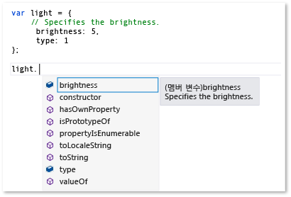
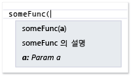
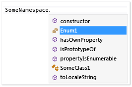

# JavaScript IntelliSense 확장
[!INCLUDE[vs2017banner](../code-quality/includes/vs2017banner.md)]

JavaScript IntelliSense의 확장성 기능에서 타사 라이브러리의 JavaScript 편집기의 IntelliSense 결과 사용자 지정할 수 있습니다.  이 이러한 라이브러리를 사용 하는 개발자의 환경을 향상 시킬 수 있습니다.  
  
 JavaScript 언어 서비스 프로젝트에 추가 하는 JavaScript 라이브러리를 제 3 자에 대 한 IntelliSense 기능을 제공 합니다.  대부분의 라이브러리에 대 한 문 완성 언어 서비스에서 자동으로 제공 됩니다.  다음 그림에서는 문 완성을 보여 줍니다.  
  
   
  
 라이브러리 설명 변수, 함수 및 개체의 표준 JavaScript 주석 태그에 포함 되어 있는 경우 \(\/ \/\)를 자동으로 완성 목록에서 요소의 오른쪽에 나타나는 또는 함수 호출에 괄호를 입력 하면 팝업 상자에 설명이 포함 된 정보를 제공 하는 IntelliSense 확장성 기능에서 기본적으로 장점입니다.  팝업 상자에 주석을 멤버의 설명에 포함 되어 있습니다.  다음 예제에 대 한 완성 목록 팝업 상자를 보여 줍니다.  
  
   
  
 개발자의 작업 환경을 더 향상 시키려면 개발자 팝업 상자에서에 형식 정보를 제공 하려는 수도 있습니다.  Javascript를 사용 하 여 형식 정보를 제공할 수 있습니다 [XML 문서 주석](../ide/xml-documentation-comments-javascript.md) 표준 주석 태그를 대신 합니다.  삼중 슬래시 주석에 태그 \(\/ \/ \/\) 및 정의 된 집합의 XML 요소를 사용 하 여 XML 문서 주석을 추가할 수 있습니다.  
  
 또한 JavaScript IntelliSense의 확장성을 사용 하 여 형식 정보를 제공할 수 있습니다.  이 기능을 사용 하면 IntelliSense 결과 JavaScript 확장 만들기 및 스크립트 컨텍스트를 추가 하 여 사용자 지정할 수 있습니다.  JavaScript 파일은 확장명에 의해 노출 되는 이벤트 구독에 `intellisense` 언어 서비스입니다.  JavaScript IntelliSense 확장성 라이브러리에 대해 권장된 되는 솔루션은 동작 패턴 라이브러리에서 원하는 수준의 IntelliSense 지원 제공 JavaScript 언어 서비스를 하지 못하도록 하 고 또한 선언적 XML 문서 주석 대신 필요한 경우입니다.  IntelliSense 결과 사용자 지정 하 여 언어 서비스의 기본 기능을 제한할 수 있습니다 행동에 관계 없이 최우선 IntelliSense 경험을 만들 수 있습니다.  자세한 내용은 [식별자 문 완성](../ide/statement-completion-for-identifiers.md)을 참조하십시오.  
  
## 스크립트 컨텍스트를 추가 하는 확장  
 IntelliSense 확장이 실행 될 스크립트를 현재 컨텍스트에 추가 해야 합니다.  확장 자동 검색 메커니즘에 의해 스크립트 컨텍스트를 자동으로 추가할 수 또는 확장 스크립트 컨텍스트를 수동으로 참조 그룹 또는 reference 지시문을 사용 하 여 추가 해야 합니다.  
  
 파일 명명 규칙을 따라야 하는 확장명을 자동으로 찾으려면 언어 서비스는 자동 검색 메커니즘을 사용  *libraryname*. intellisense.js을 하 고 있는 동일한 디렉터리에 적용 되는 확장 라이브러리입니다.  예를 들어, jQuery 라이브러리에 대 한 유효한 확장명 jQuery.intellisense.js 수 있습니다.  보다 제한적인 jQuery 확장에 대 한 jQuery\-1.7.1.intellisense.js \(버전별 확장명\) 또는 jQuery.ui.intellisense.js \(확장 범위 jQuery 라이브러리에 대 한\)와 같은 파일 이름을 사용할 수 있습니다.  가장 제한적인 버전 확장의 확장명을 하나 이상 지정 된 라이브러리를 찾을 수 없는 경우에 사용 됩니다.  
  
 모든 JavaScript 프로젝트 파일에 대 한 확장을 사용 하려는 경우 대신 확장 참조 그룹에 추가할 수 있습니다.  여러 종류의 참조 그룹이 두 암시적 참조가 포함과 전용된 작업자 참조가 포함 되어 있습니다.  확장명을 추가 하려면, 일반적으로 파일은 암시적 참조 그룹으로 추가할 하면  **\(Windows\) 암시적**,  **\(웹\) 암시적**.  범위 코드 편집기에서 연 모든.js 파일에 대 한 암시적 참조가 있습니다.  이 메서드를 사용 하면 확장 및 확장 보완 된 파일 모두를 추가 해야 합니다.  
  
 사용은  **IntelliSense** 의 페이지는  **옵션** 확장 이름으로 참조 그룹 추가 대화 상자.  액세스할 수 있는  **IntelliSense** 선택 하 여 페이지  **도구**,  **옵션** 메뉴 모음 및 다음 선택  **텍스트 편집기**,  **JavaScript**,  **IntelliSense**,  **참조**.  참조 그룹에 대 한 자세한 내용은 [JavaScript IntelliSense](../ide/javascript-intellisense.md) 및 [옵션, 텍스트 편집기, JavaScript, IntelliSense](../ide/reference/options-text-editor-javascript-intellisense.md).  
  
 파일의 특정 집합에 대해 확장을 사용 하려는 경우 reference 지시문을 사용 합니다.  이 메서드를 사용 하면 확장 및 확장 보완 된 파일 모두 참조 해야 합니다.  Reference 지시문을 사용 하는 방법에 대 한에 대 한 자세한 내용은 [JavaScript IntelliSense](../ide/javascript-intellisense.md).  
  
## IntelliSense 이벤트 처리  
 확장성 기능 결과 IntelliSense와 같은 이벤트를 구독 하 여 사용자 지정할 수 있습니다에서 `statementcompletion` 언어 서비스의 이벤트 `intellisense` 개체입니다.  다음 예제에서는 문 완성에서 밑줄로 시작 하는 멤버를 숨기려면 언어 서비스에 사용 되는 간단한 확장을 보여 줍니다.  이 코드는 underscorefilter.js에 포함 된 고 인은 \\\\*Visual Studio 설치 경로*\\JavaScript\\References 폴더입니다.  
  
```javascript  
intellisense.addEventListener('statementcompletion', function (event) {  
    if (event.targetName === "this") return;  
  
    var filterRegex;  
  
    if (event.target === undefined || event.target === window)  
        filterRegex = /^_.*\d{2,}/;  
    else  
        filterRegex = /^_.*/;  
  
    event.items = event.items.filter(function (item) {  
        return !filterRegex.test(item.name);  
    });  
});  
```  
  
 위의 코드에서 확장 검사는 [targetName 속성](#TargetName) 및 [대상 속성](#Target) 속성을는 `statementcompletion` event 개체와 같은 개체를 제외 하려면 `this` 및 `window`, 유효한 문 완성 목록을 식별할 수 있도록 하 고.  완성 목록을 확인할 수 있습니다 경우 문 완성 기능 확장을 업데이트 [항목 속성](#Items) 밑줄로 시작 하는 멤버를 필터링 하 여 수집 합니다.  
  
 찾는 위치에 대 한 추가 예는 \\\\*Visual Studio 설치 경로*\\JavaScript\\References 폴더입니다.  ShowPlainComments.js 파일을이 폴더에 다른 이벤트를 사용 하 여 표준 JavaScript 주석 태그에 대 한 기본 IntelliSense 지원을 제공 하는 예제를 제공 합니다. \(\/ \/\).  같은 underscorefilter.js, showPlainComments.js, 작업 확장명으로 이미 가능 하 고 변수, 함수 및 개체에 대 한 코드에서 주석 태그를 사용 하면 결과 IntelliSense 정보를 볼 수 있습니다.  다른 예제를 보려면 [코드 예제](#CodeExamples)를 참조하십시오.  
  
> [!WARNING]
>  Visual Studio 포함 된 확장 파일을 수정 하는 경우에 JavaScript IntelliSense 또는 확장에 의해 지원 되는 기능을 해제할 수 있습니다.  
  
 사용 하 여 확장 코드에는 다음 이벤트 형식에 대 한 처리기를 만들 수 있습니다 `addEventListener`.  
  
-   `statementcompletion`한 문 완성 하는 이벤트에 대 한 처리기를 추가 합니다.  마침표 \(.\) 같은 특수 문자를 입력 한 후 나타나는 특정 형식에 대 한 구성원 또는 입력할 때 하거나 J. ctrl 키를 누를 때 표시 되는 목록 식별자의 문 완성 기능을 제공  처리기 이벤트 형식의 개체를 받는 `CompletionEvent`, 다음과 같은 멤버를 지원: [항목 속성](#Items), [대상 속성](#Target), [targetName 속성](#TargetName), 및 [범위 속성](#Scope).  
  
-   `signaturehelp`IntelliSense 매개 변수 정보에 대 한 처리기를 추가 합니다.  매개 변수 정보 개수, 이름 및 필요한 함수에 의해 매개 변수의 형식에 대 한 정보를 제공 합니다.  처리기 이벤트 형식의 개체를 받는 `SignatureHelpEvent`, 다음과 같은 멤버를 지원: [대상 속성](#Target), [parentObject 속성](#ParentObject), [functionComments 속성](#FunctionComments), [functionHelp 속성](#FunctionHelp).  
  
-   `statementcompletionhint`IntelliSense 요약 정보에 대 한 처리기를 추가 합니다.  요약 정보 팝업 상자 식별자에 대 한 전체 선언을 코드에서 보여 줍니다.  처리기 이벤트 형식의 개체를 받는 `CompletionHintEvent`, 다음과 같은 멤버를 지원: [completionItem 속성](#CompletionItem), 및 [symbolHelp 속성](#SymbolHelp).  
  
 문 완성, 매개 변수 정보 및 요약 정보 같은 IntelliSense 기능을 표시 하는 예제를 보려면 [IntelliSense 사용](../ide/using-intellisense.md).  
  
> [!NOTE]
>  Javascript에서 완성 목록 오른쪽에 나타나는 팝업 상자에 요약 정보를 의미 합니다.  요약 정보를 직접 호출할 수 없습니다.  
  
##  <a name="intellisenseObject"></a> intellisense 개체  
 다음 표에서 사용할 수 있는 함수를 보여 주는 `intellisense` 개체입니다.  `intellisense` 개체는 디자인 타임에만 사용할 수 있습니다.  
  
|Function|설명|  
|--------------|--------|  
|`addEventListener(type, handler);`|IntelliSense 이벤트에 대 한 이벤트 처리기를 추가합니다.<br /><br /> `type`문자열 값이입니다.  Valid values include `statementcompletion`, `signaturehelp`, and `statementcompletionhint`.<br /><br /> `handler`event 개체는 다음 형식 중 하나를 수신 하는 이벤트 처리기 함수는 다음과 같습니다.<br /><br /> -   `CompletionEvent`사용 되는 `statementcompletion` 이벤트입니다.<br />-   `SignatureHelpEvent`사용 되는 `signaturehelp` 이벤트입니다.<br />-   `CompletionHintEvent`사용 되는 `statementcompletionhint` 이벤트입니다.<br /><br /> 이 함수를 사용 하는 예제를 보려면 [코드 예제](#CodeExamples).|  
|`annotate(obj, doc);`|문서 개체에 대 한 문서 주석을 한 개체에서 다른 개체로 복사 하 여 지정 합니다.<br /><br /> `obj`설명서를 복사할 대상 개체를 지정 합니다.<br /><br /> `doc`설명서를 복사할 객체를 지정 합니다.<br /><br /> 이 함수를 사용 하는 방법에 대 한 예를 참조 하십시오. [IntelliSense 주석 추가](#Annotations).|  
|`getFunctionComments(func);`|지정 된 함수에 대 한 설명을 반환합니다.<br /><br /> `func`에 대 한 설명을 반환 하는 함수를 지정 합니다.<br /><br /> 설정할 수 있는 `func` 매개 변수를 사용 하 여 `completionItem.value`.<br /><br /> 반환 된 `functionComments` 개체에서는 다음과 같은 멤버를 포함 합니다: `above`, `inside`, 및 `paramComment`.  자세한 내용은 [functionComments 속성](#FunctionComments) 속성을 참조하십시오.<br /><br /> `getFunctionComments`만 사용 하 여 등록 된 이벤트 처리기 중 하나에서 호출할 수 있습니다 `addEventListener`.<br /><br /> 이 함수를 사용 하는 방법에 대 한 예를 참조 하십시오: \\\\*Visual Studio 설치 경로*\\JavaScript\\References\\showPlainComments.js.|  
|`logMessage(msg);`|진단 메시지를 출력 창으로 보냅니다.<br /><br /> `msg`메시지를 포함 하는 문자열이입니다.<br /><br /> 이 함수를 사용 하는 방법에 대 한 예를 참조 하십시오. [출력 창에 메시지 보내기](#Logging).|  
|`nullWithCompletionsOf(value);`|특수를 완성 목록이 결정 됩니다 전달 된 개체가 null 값을 반환 된 `value` 매개 변수입니다.<br /><br /> `value`완성 목록에 반환 되는 값을 결정합니다.  `value`모든 형식을 사용할 수 있습니다.<br /><br /> Null 반환 값을 null 디자인 타임 취급 하지만 반환 값에 대 한 완성 목록에 완성 목록이 동일의 `value` 매개 변수입니다.<br /><br /> 이 함수에 대 한 사용 됩니다 반환 형식이 런타임에 예측할 수 있지만 값을 반환 하는 경우 반환 값에 대 한 IntelliSense를 제공 하도록 `null` 디자인 타임.|  
|`redirectDefinition(func, definition);`|IntelliSense에서 제공 된 정의 함수 매개 변수 도움말 원래 func 함수를 대신 사용 하도록 지시 또는  **정의로 이동** 요청 합니다.<br /><br /> `func`대상 함수에 지정합니다.<br /><br /> `definition`대신 대상 함수 매개 변수 정보를 사용 하는 함수를 지정 하 고  **정의로 이동**.|  
|`setCallContext(func, thisArg);`|호출 컨텍스트 또는 지정 된 함수에 대 한 범위를 설정합니다.<br /><br /> `func`대 범위를 설정 하는 함수를 지정 합니다.<br /><br /> `thisArg`개체인 리터럴입니다는 `this` 키워드 참조할 수, 구성원에 대해 새 범위를 지정 합니다.  예를 들어이 매개 변수에 전달 하는 인수를 포함할 수 있습니다,`intellisense.setCallContext(func, { thisArg: "", args: [23,2] });`<br /><br /> `setCallContext`비슷한 동작을 제공 `Function.prototype.bind`디자인 타임 IntelliSense 지원에 사용 되는 경우를 제외 하 고.  사용 하면 `setCallContext` 함수를 호출할 수 있도록 그렇지 않은 경우 연결할, 코드에 대 한 호출을 시뮬레이션 하는 경우 함수 범위를 설정 하려면 함수 호출의 정확한 범위와 인수가 포함 됩니다.|  
|`undefinedWithCompletionsOf(value);`|완성 목록을 결정 전달 된 개체에서 특별 한 정의 되지 않은 값을 반환 된 `value` 매개 변수입니다.<br /><br /> `value`완성 목록에 반환 되는 값을 결정합니다.  `value`모든 형식을 사용할 수 있습니다.<br /><br /> 정의 되지 않은 반환 값 취급으로 완료 되지만 디자인 타임에 정의 되지 않은 반환 값에 대 한 목록을 완성 목록에 대 한 동일은 `value` 매개 변수.<br /><br /> 한 용도로이 함수 반환 형식을 런타임 시 예측 가능한 반환 값 디자인 타임에 정의 되지 않은 경우 반환 값에 대 한 IntelliSense를 제공할 것입니다.|  
|`version()`|Visual Studio 버전을 반환합니다.|  
  
## 이벤트 멤버  
 다음 단원에서는 다음 이벤트에 대 한 이벤트 개체에서 노출 되는 멤버: `statementcompletion`, `signaturehelp`, 및 `statementcompletionhint`.  
  
###  <a name="CompletionItem"></a> completionItem 속성  
 요약 정보 팝업 상자를 요청한 완료 항목으로 알려진 식별자를 반환 합니다.  이 속성을 사용할 수는 `statementcompletionhint` 이벤트 개체 및는 [항목 속성](#Items) 속성의 `statementcompletion` 이벤트 개체.  
  
 반환 값: `completionItem` 개체  
  
 다음은의 멤버는 `completionItem` 개체:  
  
-   `name`.  사용 하는 경우 읽기\/쓰기는 `items` 컬렉션입니다. 그렇지 않으면, 읽기 전용입니다.  완료 항목을 식별 하는 문자열을 반환 합니다.  
  
-   `kind`.  사용 하는 경우 읽기\/쓰기는 `items` 컬렉션입니다. 그렇지 않으면, 읽기 전용입니다.  완료 항목 유형을 나타내는 string을 반환 합니다.  가능한 값은 메서드, 필드, 속성, 매개 변수, 변수 및 예약.  
  
-   `glyph`.  사용 하는 경우 읽기\/쓰기는 `items` 컬렉션입니다. 그렇지 않으면, 읽기 전용입니다.  완성 목록에 표시 되는 아이콘을 나타내는 string을 반환 합니다.  가능한 값 `glyph` 다음과 같은 형식을 사용: vs:*glyphType*,  *glyphType* 언어 독립적인 구성원에 해당는 <xref:Microsoft.VisualStudio.Language.Intellisense.StandardGlyphGroup> 열거형입니다.  예를 들어, `vs:GlyphGroupMethod` 의 값 중 하나입니다 `glyph`.  때 `glyph` 설정 되어는 `kind` 속성의 기본 아이콘을 결정 합니다.  
  
-   `parentObject`.  읽기 전용입니다.  부모 개체를 반환합니다.  
  
-   `value`.  읽기 전용입니다.  완료 항목의 값을 나타내는 개체를 반환 합니다.  
  
-   `comments`.  읽기 전용입니다.  필드 또는 변수 위에 있는 주석이 들어 있는 문자열을 반환 합니다.  
  
-   `scope`.  읽기 전용입니다.  완료 항목의 범위를 반환합니다.  가능한 값은 매개 변수, 전역, 지역 및 멤버입니다.  
  
###  <a name="Items"></a> 항목 속성  
 완성 항목 문에 배열을 가져오거나 설정 합니다.  배열의 각 요소는 [completionItem 속성](#CompletionItem) 개체입니다.  `items` 속성은 사용할 수 있는 `statementcompletion` 이벤트 개체.  
  
 반환 값: 배열  
  
###  <a name="FunctionComments"></a> functionComments 속성  
 함수에 대 한 설명을 반환합니다.  이 속성에 사용할 수 있는 `signaturehelp` 이벤트 개체.  
  
 반환 값: `comments` 개체  
  
 다음은의 멤버는 `comments` 개체:  
  
-   `above`.  함수 위에 주석을 반환합니다.  
  
-   `inside`.  함수, 내 의견은 일반적으로 VSDoc 형식으로 반환합니다.  
  
-   `paramComments`.  각 매개 변수는 함수에서에 대 한 메모를 나타내는 배열을 반환 합니다.  배열의 멤버는 다음과 같습니다.  
  
    -   `name`.  매개 변수 이름을 나타내는 문자열을 반환 합니다.  
  
    -   `comment`.  매개 변수 설명을 포함 하는 문자열을 반환 합니다.  
  
###  <a name="FunctionHelp"></a> functionHelp 속성  
 함수에 대 한 도움말을 반환합니다.  이 속성에 사용할 수 있는 `signaturehelp` 이벤트 개체.  
  
 반환 값: `functionHelp` 개체  
  
 다음은의 멤버는 `functionHelp` 개체:  
  
-   `functionName`.  읽기\/쓰기입니다.  함수 이름이 들어 있는 문자열을 반환 합니다.  
  
-   `signatures`.  읽기\/쓰기입니다.  함수 시그니처가 배열을 가져오거나 설정 합니다.  배열의 각 요소는 `signature` 개체입니다.  일부 `signature` 속성 같은 `locid`에 공통적으로 해당 [XML 문서 주석](../ide/xml-documentation-comments-javascript.md) 특성.  
  
     멤버는 `signature` 개체를 포함:  
  
    -   `description`.  읽기\/쓰기입니다.  기능을 설명 하는 문자열을 반환 합니다.  
  
    -   `locid`.  읽기\/쓰기입니다.  함수에 대 한 지역화 정보를 포함 하는 문자열 식별자를 반환 합니다.  
  
    -   `helpKeyword`.  읽기\/쓰기입니다.  도움말 키워드가 포함 된 string을 반환 합니다.  
  
    -   `externalFile`.  읽기\/쓰기입니다.  구성원 ID를 포함 하는 파일을 나타내는 string을 반환 합니다.  
  
    -   `externalid`.  읽기\/쓰기입니다.  함수 멤버 ID를 나타내는 string을 반환 합니다.  
  
    -   `params`.  읽기\/쓰기입니다.  함수에 대 한 매개 변수 배열을 가져오거나 설정 합니다.  매개 변수 배열의 각 요소는 `parameter` 의 특성에 해당 하는 속성을 가진 개체는 [\<param\>](../ide/param-javascript.md) 요소:  
  
        -   `name`.  읽기\/쓰기입니다.  매개 변수 이름을 나타내는 문자열을 반환 합니다.  
  
        -   `type`.  읽기\/쓰기입니다.  매개 변수 형식을 나타내는 문자열을 반환 합니다.  
  
        -   `elementType`.  읽기\/쓰기입니다.  형식이 면 `Array`를 배열에 있는 요소의 유형을 나타내는 문자열을 반환 합니다.  
  
        -   `description`.  읽기\/쓰기입니다.  매개 변수를 설명 하는 문자열을 반환 합니다.  
  
        -   `locid`.  읽기\/쓰기입니다.  함수에 대 한 지역화 정보를 포함 하는 문자열 식별자를 반환 합니다.  
  
        -   `optional`.  읽기\/쓰기입니다.  매개 변수가 선택적 요소 인지 여부를 나타내는 문자열을 반환 합니다.  `true`매개 변수가 선택적 임을 나타냅니다.  `false`이 아님을 나타냅니다.  
  
    -   `returnValue`.  읽기\/쓰기입니다.  반환 값 개체와 해당 속성의 특성을 가져오거나는 [\<returns\>](../ide/returns-javascript.md) 요소:  
  
        -   `type`.  읽기\/쓰기입니다.  반환 형식을 나타내는 문자열을 반환 합니다.  
  
        -   `elementType`.  읽기\/쓰기입니다.  형식이 면 `Array`를 배열에 있는 요소의 유형을 나타내는 문자열을 반환 합니다.  
  
        -   `description`.  읽기\/쓰기입니다.  반환 값을 설명 하는 문자열을 반환 합니다.  
  
        -   `locid`.  읽기\/쓰기입니다.  함수에 대 한 지역화 정보를 포함 하는 문자열 식별자를 반환 합니다.  
  
        -   `helpKeyword`.  읽기\/쓰기입니다.  도움말 키워드가 포함 된 string을 반환 합니다.  
  
        -   `externalFile`.  읽기\/쓰기입니다.  구성원 ID를 포함 하는 파일을 나타내는 string을 반환 합니다.  
  
        -   `externalid`.  읽기\/쓰기입니다.  함수 멤버 ID를 나타내는 string을 반환 합니다.  
  
###  <a name="ParentObject"></a> parentObject 속성  
 멤버의 부모 개체를 반환합니다.  예를 들어, `document.getElementByID`, `parentObject` 반환 된 `document` 개체입니다.  이 속성에 사용할 수 있는 `signaturehelp` 이벤트 개체.  
  
 값을 반환 합니다: 개체  
  
###  <a name="Target"></a> 대상 속성  
 트리거 기호, 마침표 \(.\)의 왼쪽에 있는 항목을 나타내는 개체를 반환 합니다.  함수에 대 한 `target` 에 대 한 매개 변수 정보를 요청 하는 함수를 반환 합니다.  이 속성에 사용할 수 있는 `statementcompletion` 및 `signaturehelp` 이벤트 개체.  
  
 값을 반환 합니다: 개체  
  
###  <a name="TargetName"></a> targetName 속성  
 대상을 나타내는 문자열을 반환 합니다.  예를 들어, "이에 대 한.", `targetName` "this"를 반환 합니다.  "A.B" 커서를 "B" 다음 \(있는 경우\)에 대 한 `targetName` "B"를 반환 합니다.  이 속성에 사용할 수 있는 `statementcompletion` 이벤트 개체.  
  
 반환 값: 문자열  
  
###  <a name="SymbolHelp"></a> symbolHelp 속성  
 요약 정보 팝업 상자를 요청한 완성 항목을 반환 합니다.  이 속성에 사용할 수 있는 `statementcompletionhint` 이벤트 개체.  
  
 반환 값: `symbolHelp` 개체입니다.  
  
 일부 속성은 `symbolHelp` 같은 개체 `locid`, 공통 및 해당 [XML 문서 주석](../ide/xml-documentation-comments-javascript.md) 특성.  
  
 다음은의 멤버는 `symbolHelp` 개체:  
  
-   `name`.  읽기\/쓰기입니다.  식별자 이름이 들어 있는 문자열을 반환 합니다.  
  
-   `symbolType`.  읽기\/쓰기입니다.  심볼 유형을 나타내는 string을 반환 합니다.  알 수 없는, 부울, 숫자, 문자열, 개체, 함수, 배열, 날짜 및 Regex 가능한 값을 포함합니다.  
  
-   `symbolDisplayType`.  읽기\/쓰기입니다.  표시할 형식 이름을 포함 하는 문자열을 반환 합니다.  If `symbolDisplayType` isn't set, `symbolType` is used.  
  
-   `elementType`.  읽기\/쓰기입니다.  경우는 `symbolType` 는 `Array`, 배열에 있는 요소의 유형을 나타내는 문자열을 반환 합니다.  
  
-   `scope`.  읽기\/쓰기입니다.  심볼의 범위를 나타내는 string을 반환 합니다.  가능한 값 매개 변수, 전역, 지역 및 멤버를 포함합니다.  
  
-   `description`.  읽기\/쓰기입니다.  기호에 대 한 설명을 포함 하는 문자열을 반환 합니다.  
  
-   `locid`.  읽기\/쓰기입니다.  기호에 대 한 지역화 정보를 포함 하는 문자열 식별자를 반환 합니다.  
  
-   `helpKeyword`.  읽기\/쓰기입니다.  도움말 키워드가 포함 된 string을 반환 합니다.  
  
-   `externalFile`.  읽기\/쓰기입니다.  구성원 ID를 포함 하는 파일을 나타내는 string을 반환 합니다.  
  
-   `externalid`.  읽기\/쓰기입니다.  회원 ID의 기호를 나타내는 문자열을 반환 합니다.  
  
-   `functionHelp`.  읽기\/쓰기입니다.  반환 된 [functionHelp 속성](#FunctionHelp), 정보가 포함 될 수 있습니다 때의 `symbolType` 함수입니다.  
  
###  <a name="Scope"></a> 범위 속성  
 완료 이벤트의 범위를 반환합니다.  완료에 대 한 가능한 값은 전역과 멤버 범위.  이 속성에 사용할 수 있는 `statementcompletion` 이벤트 개체.  
  
 반환 값: 문자열  
  
## 디버깅 확장 IntelliSense  
 확장을 디버깅할 수 없습니다 있지만 사용할 수 있는 [intellisense 개체](#intellisenseObject) Visual Studio 출력 창에 정보를 보낼 수 있는 기능.  이 함수를 사용 하는 방법에 대 한 예를 참조 하십시오. [출력 창에 메시지 보내기](#Logging) 이 항목의 뒷부분에 나오는.  에 대 한 `logMessage` 하려면 하나 이상의 이벤트 처리기 확장을 등록 해야 합니다.  
  
##  <a name="CodeExamples"></a> 코드 예제  
 이 단원에서는 IntelliSense 확장성 Api를 사용 하는 방법을 보여 주는 코드 예제가 포함 되어 있습니다.  또한 이러한 Api를 사용 하는 다른 방법입니다.  다음 파일에서 추가 예제를 보려면를 \\\\*Visual Studio 설치 경로*\\JavaScript\\References 폴더입니다.  이러한 예제 JavaScript 언어 서비스에 사용 되는 작업 중입니다.  
  
-   Underscorefilter.js입니다.  이 코드는 private 멤버를 IntelliSense에서 숨겨집니다.  여기에 대 한 이벤트 처리기는 `statementcompletion` 이벤트입니다.  
  
-   Showplaincomments.js입니다.  이 코드에 대 한 표준 주석 IntelliSense 지원을 제공합니다.  여기에 대 한 이벤트 처리기는 `signaturehelp` 및 `statementcompletionhint` 이벤트입니다.  
  
###  <a name="Annotations"></a> IntelliSense 주석 추가  
 다음은 라이브러리를 직접 수정 하지 않고도 타사 라이브러리에 대 한 IntelliSense 설명서 지원을 제공 하는 방법을 보여 줍니다.  이렇게 하려면 사용할 수 있습니다 `intellisense.annotate` 확장에서 합니다.  
  
 이 예제가 작동 하려면 프로젝트에서 다음 JavaScript 파일을 해야 합니다.  
  
-   demoLib.js 타사 라이브러리를 나타내는 프로젝트 파일입니다.  
  
-   Demolib.intellisense.js는 IntelliSense 확장명입니다.  이 Examplelib.js와 같은 폴더에 저장할 필요가 없으면이 파일은 프로젝트에 포함 시킬 필요는 없습니다.  
  
-   appCode.js 응용 프로그램 코드를 표현 하는 프로젝트 파일입니다.  
  
##### IntelliSense 주석을 추가 하려면  
  
1.  Demolib.js에 다음 코드를 추가 합니다.  
  
    ```javascript  
    function someFunc(a) { };  
    var rectangle;  
  
    ```  
  
2.  Demolib.intellisense.js에 다음 코드를 추가 합니다.  
  
    ```javascript  
    intellisense.annotate(someFunc, function (a) {  
        /// <signature>  
        /// <summary>Description of someFunc</summary>  
        /// <param name="a">Param a</param>  
        /// </signature>  
    });  
  
    intellisense.annotate(window, {  
        // This is a comment on a global variable named rectangle.  
        rectangle: undefined  
    });  
    ```  
  
3.  AppCode.js 첫 번째 줄으로 다음 참조 지시문을 추가 합니다.  여기에 사용 되는 경로 JavaScript 파일을 같은 폴더에 있음을 나타냅니다.  
  
    ```javascript  
    /// <reference path="demoLib.js" />  
  
    ```  
  
4.  Appcode.js에 다음 코드를 입력 합니다.  XML 문서 주석을 확장 IntelliSense 매개 변수 정보로 표시를 볼 수 있습니다.  
  
       
  
5.  Appcode.js에 다음 코드를 입력 합니다.  입력할 때 IntelliSense 요약 정보로 표시 되는 확장의 표준 주석을 볼 수 있습니다.  
  
       
  
###  <a name="Logging"></a> 출력 창에 메시지 보내기  
 다음은 출력 창에 메시지를 보내는 방법을 보여 줍니다.  IntelliSense 확장을 디버깅 하는 데 도움이 되는 메시지를 보낼 수 있습니다.  
  
 이 예제가 작동 하려면 프로젝트에서 다음 JavaScript 파일을 해야 합니다.  
  
-   exampleLib.js 타사 라이브러리를 나타내는 프로젝트 파일입니다.  
  
-   Examplelib.intellisense.js는 IntelliSense 확장명입니다.  이 Examplelib.js와 같은 폴더에 저장할 필요가 없으면이 파일은 프로젝트에 포함 시킬 필요는 없습니다.  
  
-   appCode.js 응용 프로그램 코드를 표현 하는 프로젝트 파일입니다.  
  
##### 출력 창에 메시지를 보내려면  
  
1.  Examplelib.js에 다음 코드를 추가 합니다.  
  
    ```javascript  
    var someVar = {  
        a: 1,  
        b: 'hello'  
    };  
    ```  
  
2.  Examplelib.intellisense.js에 다음 코드를 추가 합니다.  
  
    ```javascript  
    intellisense.addEventListener('statementcompletion', function (e) {  
        // Prints out statement completion info: Either (1) the member   
        // list, if the trigger character was typed, or (2) the   
        // statement completion identifiers.  
        // e.target represents the object left of the trigger character.  
        intellisense.logMessage(  
            e.target ? 'member list requested, target: ' + e.targetName : 'statement completion for current scope requested');  
  
        // Prints out all statement completion items.  
        e.items.forEach(function (item) {  
            intellisense.logMessage('[completion item] ' + item.name + ', kind:' + item.kind + ', scope:' + item.scope + ', value:' + item.value);  
        });  
    });  
    ```  
  
3.  AppCode.js 첫 번째 줄으로 다음 참조 지시문을 추가 합니다.  여기에 사용 되는 경로 JavaScript 파일을 같은 폴더에 있음을 나타냅니다.  
  
    ```javascript  
    /// <reference path="exampleLib.js" />  
  
    ```  
  
4.  출력 창에 선택  **JavaScript 언어 서비스** 에  **에서 출력 보기** 목록입니다.  \(출력 창에 표시 하려면 선택  **출력** \[보기\] 메뉴에서.\)  
  
5.  Appcode.js에 다음 코드를 입력 합니다.  입력할 때 언어 서비스에서 메시지를 출력 창에 보여 줍니다.  첫 번째 메시지를 출력 창에서 현재 범위에 대 한 문 완성 되었습니다 나타냅니다.  
  
    ```javascript  
    some  
    ```  
  
     다음 표시 되어야 하는 출력의 부분 뷰입니다.  
  
    ```scr  
    03:16:14.3113: statement completion for current scope requested  
    03:16:14.3113: [completion item] break, kind:reserved, scope:undefined, value:undefined  
    03:16:14.3113: [completion item] case, kind:reserved, scope:undefined, value:undefined  
    03:16:14.3113: [completion item] catch, kind:reserved, scope:undefined, value:undefined  
  
    …  
    ```  
  
6.  선택 된  **모두 지우기** 출력 창에서 단추.  
  
7.  다음과 같은 코드를 입력합니다.  출력 창에 첫 번째 메시지는 멤버 목록을 요청 되었음을 나타냅니다.  
  
    ```javascript  
    someVar.  
    ```  
  
     부분 뷰 표시 되어야 하는 출력 다음과가 같습니다.  
  
    ```scr  
    03:17:43.4032: member list requested, target: someVar  
    03:17:43.4032: [completion item] a, kind:field, scope:member, value:1  
    03:17:43.4032: [completion item] b, kind:field, scope:member, value:hello  
    03:17:43.4032: [completion item] constructor, kind:method, scope:member, value:  
  
    …  
    ```  
  
###  <a name="Icons"></a> IntelliSense 아이콘 변경  
 다음 절차는 IntelliSense에서 기본적으로 표시 되는 아이콘을 변경 하는 방법을 보여 줍니다.  네임 스페이스, 클래스, 인터페이스 및 열거형과 같은 라이브러리의 개념에 대 한 IntelliSense 정보를 제공 하는 경우에 유용할 수 있습니다.  
  
 아이콘을 사용할 수 있는 값에 대해서 <xref:Microsoft.VisualStudio.Language.Intellisense.StandardGlyphGroup>.  
  
 이 예제가 작동 하려면 프로젝트에서 다음 JavaScript 파일을 해야 합니다.  
  
-   exampleLib.js 프로젝트는 해당 represens 타사 라이브러리를 파일입니다.  
  
-   Examplelib.intellisense.js는 IntelliSense 확장명입니다.  이 Examplelib.js와 같은 폴더에 저장할 필요가 없으면이 파일은 프로젝트에 포함 시킬 필요는 없습니다.  
  
-   appCode.js 응용 프로그램 코드를 표현 하는 프로젝트 파일입니다.  
  
##### 아이콘을 변경 하려면  
  
1.  Examplelib.js에 다음 코드를 추가 합니다.  
  
    ```javascript  
    function Namespace(name) {  
        this._isNamespace = true;  
        window[name] = this;  
    };  
  
    function Enum(values) {  
        var e = Object.create(values);  
        e._isEnum = true;  
        return e;  
    };  
  
    var SomeNamespace = new Namespace('SomeNamespace');  
    // A constructor function is considered a class.  
    SomeNamespace.SomeClass1 = function () { }  
    SomeNamespace.Enum1 = new Enum({ VALUE1: 0, VALUE2: 1 });  
    ```  
  
2.  Examplelib.intellisense.js에 다음 코드를 추가 합니다.  
  
    ```javascript  
    intellisense.addEventListener('statementcompletion', function (e) {  
        e.items.forEach(function (item) {  
            // Detect a namespace by using the _isNamespace flag.  
            if (item.value && item.value._isNamespace) {  
                item.glyph = 'vs:GlyphGroupNamespace';  
                }  
  
            if (item.parentObject && item.parentObject._isNamespace) {  
                // The item is a member of a namespace.   
  
                // All constructor functions that are part of a namespace   
                // are considered classes.   
                // A constructor function starts with  
                // an uppercase letter by convention.    
                if (typeof item.value == 'function' && (item.name[0].toUpperCase()   
                    == item.name[0])) {  
                    item.glyph = 'vs:GlyphGroupClass';  
                }  
  
                // Detect an enumeration by using the _isEnum flag.  
                if (item.value && item.value._isEnum) {  
                    item.glyph = 'vs:GlyphGroupEnum';  
                }  
            }  
        });  
    });  
  
    intellisense.addEventListener('statementcompletionhint', function (e) {  
        if (e.completionItem.value) {  
            if (e.completionItem.value._isNamespace) {  
                e.symbolHelp.symbolDisplayType = 'Namespace';  
            }  
            if (e.completionItem.value._isEnum) {  
                e.symbolHelp.symbolDisplayType = 'Enum';  
            }  
        }  
    });  
    ```  
  
3.  AppCode.js 첫 번째 줄으로 다음 참조 지시문을 추가 합니다.  여기에 사용 되는 경로 JavaScript 파일을 같은 폴더에 있음을 나타냅니다.  
  
    ```javascript  
    /// <reference path="exampleLib.js" />  
  
    ```  
  
4.  Appcode.js에 다음 코드를 입력 합니다.  입력할 때 C\#에서 사용 되는 네임 스페이스에 대 한 아이콘 "에 {}" 변경 된 것을 볼 수 있습니다.  
  
       
  
5.  Appcode.js에 다음 코드를 입력 합니다.  입력할 때 새 열거형 아이콘에 Enum1 구성원 및 SomeClass1 구성원에 대해 새 클래스 아이콘을 볼 수 있습니다.  
  
       
  
###  <a name="Overriding"></a> IntelliSense 결과 런타임 효과 방지합니다.  
 JavaScript 언어 서비스 IntelliSense 정보를 동적으로 제공 하는 코드를 실행 합니다.  따라서 런타임 동작이 원하는 결과와 때때로 방해할 수 있습니다.  다음 절차는 IntelliSense 결과 때 잘못 된 IntelliSense에서 런타임 동작을 재정의 하는 방법을 보여 줍니다.  
  
 이 예제가 작동 하려면 프로젝트에서 다음 JavaScript 파일을 해야 합니다.  
  
-   exampleLib.js 타사 라이브러리를 나타내는 프로젝트 파일입니다.  
  
-   Examplelib.intellisense.js는 IntelliSense 확장명입니다.  이 Examplelib.js와 같은 폴더에 저장할 필요가 없으면이 파일은 프로젝트에 포함 시킬 필요는 없습니다.  
  
-   appCode.js 응용 프로그램 코드를 표현 하는 프로젝트 파일입니다.  
  
##### IntelliSense 결과 런타임 효과 피하기 위해  
  
1.  Examplelib.js에 다음 코드를 추가 합니다.  
  
    ```javascript  
    function after(count, func) {  
        return function () {  
            if (--times < 1) {  
                return func.apply(this, arguments);  
            }  
        };  
    };  
    ```  
  
     위의 코드에서 값에 따라 초기 호출을 래핑된 함수를 무시 `count`를 클릭 하 고 결과 반환 하지 않습니다.  
  
2.  AppCode.js 첫 번째 줄으로 다음 참조 지시문을 추가 합니다.  여기에 사용 되는 경로 JavaScript 파일을 같은 폴더에 있음을 나타냅니다.  
  
    ```javascript  
    /// <reference path="exampleLib.js" />  
  
    ```  
  
3.  Appcode.js에 다음 코드를 입력 합니다.  래핑된 함수, 즉 호출 되지 않으므로 대신 IntelliSense 식별자 목록이 표시 되는 `throttled` 함수는 결과 반환 하지 않습니다.  
  
       
  
4.  Examplelib.intellisense.js에 다음 코드를 추가 합니다.  IntelliSense는 래핑된 함수에 대해 표시 되는 것이 디자인 타임 동작을 예상 대로 변경 됩니다.  
  
    ```javascript  
    window.after = function (count, func) {  
        // Just return func.   
        return func;  
    };  
    ```  
  
5.  Appcode.js에서 이전에 입력 한 동일한 코드를 입력 하 여 결과 테스트 합니다.  이 이번에 IntelliSense는 원하는 정보를 제공합니다.  
  
       
  
## 참고 항목  
 [JavaScript IntelliSense](../ide/javascript-intellisense.md)   
 [식별자 문 완성](../ide/statement-completion-for-identifiers.md)