# CodeLens에서 코드 변경 내용 및 기타 기록 찾기
코드에 대한 정보를 찾는 동안 편집기에서 나가지 않고 계속 작업에 집중할 수 있습니다. 코드 참조, 코드 변경 내용, 링크된 버그, 작업 항목, 코드 검토 및 단위 테스트를 확인할 수 있습니다.  
  
> [!NOTE]
>  CodeLens는 Visual Studio Enterprise 및 Visual Studio Professional 버전에서만 사용할 수 있습니다. Visual Studio Community 버전에서는 사용할 수 없습니다.  
  
 솔루션에서 코드의 개별 부분을 사용하는 위치 및 방법 확인:  
  
 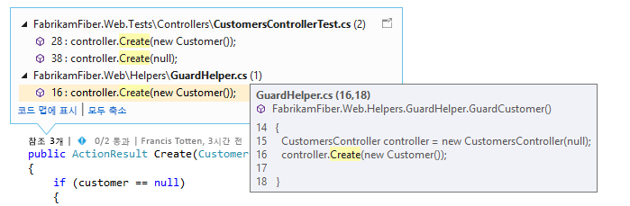  
  
 편집기를 종료하지 않고 코드 변경에 대해 팀에 문의:  
  
 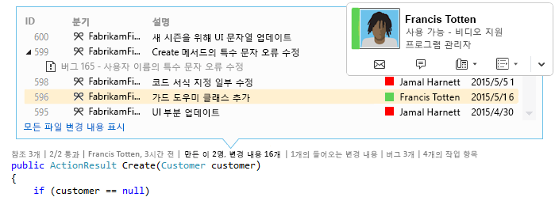  
  
 확인하려는 지표를 선택하거나 CodeLens를 설정 또는 해제하려면 **도구**, **옵션**, **텍스트 편집기**, **모든 언어**, **CodeLens**로 이동합니다.  
  
##   코드에 대한 참조 찾기  
 필요한 사항:  
  
-   Visual Studio Enterprise 또는 Visual Studio Professional  
  
-   Visual C# .NET 또는 Visual Basic .NET 코드  
  
 **참조** 지표를 선택합니다(**Alt + 2**). **0 참조**가 표시된 경우 Visual C# 또는 Visual Basic 코드의 참조가 없습니다. 여기에 XAML, ASPX 파일 등 다른 항목의 참조는 포함되지 않습니다.  
  
 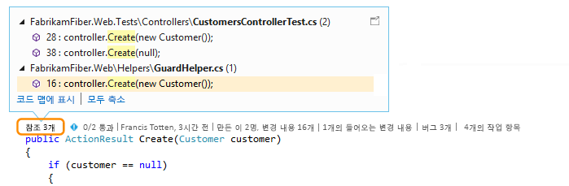  
  
 참조 코드를 보려면 참조 상단으로 마우스를 이동합니다.  
  
   
  
 참조가 포함된 파일을 열려면 참조를 두 번 클릭합니다.  
  
 이 코드와 해당 참조 간의 관계를 확인하려면 [코드 맵을 만들고](../modeling/map-dependencies-across-your-solutions.md) 코드 맵 바로 가기 메뉴에서 **모든 참조 표시**를 선택합니다.  
  
 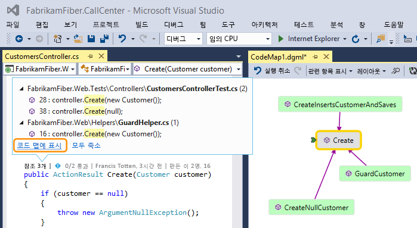  
  
##   코드 기록 및 링크된 항목 찾기  
 코드 기록을 검토하여 코드에 수행된 작업을 확인합니다. 또는 다른 분기의 변경 내용이 코드에 어떤 영향을 미칠 수 있는지 잘 파악할 수 있도록 변경 내용을 코드에 병합하기 전에 검토합니다.  
  
 필요한 사항:  
  
-   Visual Studio Enterprise 또는 Visual Studio Professional  
  
-   Team Foundation Server 2013 이상, Visual Studio Team Services 또는 Git  
  
-   코드 편집기에서 팀에 연락하려는 경우[Lync 2010 이상 또는 비즈니스용 Skype](http://technet.microsoft.com/en-us/lync)  
  
 TFVC(Team Foundation 버전 제어) 또는 Git로 저장된 Visual C# .NET 또는 Visual Basic .NET 코드의 경우 클래스 및 메서드 수준에서 CodeLens 세부 정보를 가져옵니다(*code-element-level* 지표). Git 리포지토리가 TfGit에서 호스트되는 경우 TFS 작업 항목에 대한 링크도 가져올 수 있습니다.  
  
   
  
 Visual Studio 편집기에서 열 수 있는 기타 모든 파일 형식의 경우 창 맨 아래의 한 지점에서(*파일-수준* 지표) 전체 파일에 대한 CodeLens 세부 정보를 가져옵니다.  
  
   
  
 키보드를 사용하여 지표를 선택하려면 **ALT** 키를 길게 눌러 관련 숫자 키를 표시합니다.  
  
   
  
### 코드에서 변경 내용 찾기  
 코드-요소-수준 지표에서 C# 또는 Visual Basic 코드를 변경한 사람 및 변경 내용을 찾습니다. Team Foundation Server 또는 Visual Studio Team Services에서 TFVC(Team Foundation 버전 제어)를 사용하는 경우에 표시됩니다.  
  
   
  
 기본 기간은 지난 12 개월입니다. 코드가 Team Foundation Server에 저장되는 경우 [TFSConfig 명령](http://msdn.microsoft.com/en-us/94424190-3b6b-4f33-a6b6-5807f4225b62) 을 [CodeIndex 명령](../ide/codeindex-command.md) 및 **/indexHistoryPeriod** 플래그와 함께 실행하여 변경할 수 있습니다.  
  
 1년 이상 전의 변경 내용을 포함하여 모든 변경 내용에 대한 자세한 기록을 보려면 **모든 파일 변경 내용 표시**를 선택합니다.  
  
   
  
 그러면 변경 집합에 대한 기록 창이 열립니다.  
  
   
  
 파일이 Git 리포지토리에 있고 코드-요소-수준 변경 지표를 선택하는 경우에 표시됩니다.  
  
   
  
 창 맨 아래의 파일-수준 지표에서 전체 파일(C# 및 Visual Basic 파일 제외)에 대한 변경 내용을 찾습니다.  
  
 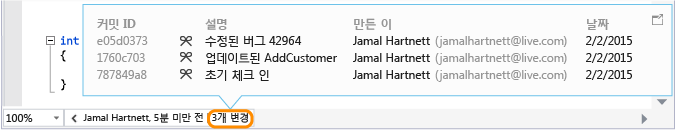  
  
 변경 내용에 대한 자세한 정보를 얻으려면 해당 항목을 마우스 오른쪽 단추로 클릭합니다. TFVC 또는 Git을 사용하는지에 따라 파일의 버전을 비교하고 세부 정보를 보고 변경 집합을 추적하고 선택한 버전의 파일을 가져오고 해당 변경 내용을 작성자에게 메일을 보낼 수 있는 등 여러 옵션을 사용할 수 있습니다. 이러한 세부 정보 중 일부는 팀 탐색기에 표시됩니다.  
  
 시간별로 코드를 변경한 사용자를 확인할 수도 있습니다. 이는 팀의 변경 내용에서 패턴을 찾고 해당 영향을 평가하는 데 도움이 될 수 있습니다.  
  
   
  
#### 현재 분기에서 변경 내용 찾기  
 안정적인 코드를 깰 위험을 줄이기 위해 팀에 여러 분기(Main 분기 및 자식 개발 분기)가 있다고 가정합니다.  
  
 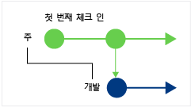  
  
 다음과 같이 Main 분기에서 코드를 변경한 사용자의 수 및 변경된 내용의 수를 찾습니다(**Alt+6**).  
  
 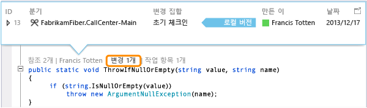  
  
#### 코드가 분기된 시점 찾기  
 여기 예에서의 Dev 분기와 같은 자식 분기의 코드로 이동합니다. 다음과 같이 변경 지표(**Alt + 6**)를 선택합니다.  
  
   
  
#### 다른 분기에서 들어오는 변경 내용 찾기  
   
  
 ...다음 Dev 분기의 버그 수정과 같이 변경된 내용을 찾습니다.  
  
   
  
 다음과 같이 현재 분기(Main)를 벗어나지 않고 변경 내용을 검토할 수 있습니다.  
  
 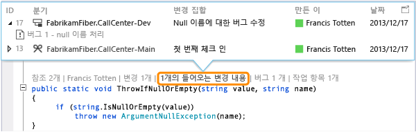  
  
#### 변경 내용이 병합된 경우 찾기  
 따라서 분기에 포함된 변경 내용을 확인할 수 있습니다.  
  
 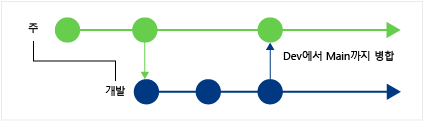  
  
 예를 들어 지금 Main 분기의 코드에는 Dev 분기의 버그 수정이 반영되어 있습니다.  
  
 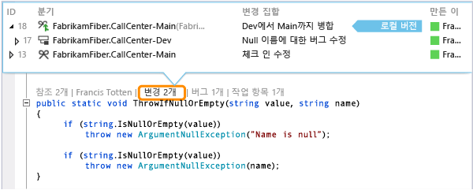  
  
#### 들어오는 변경 내용을 로컬 버전과 비교(Shift + F10)  
 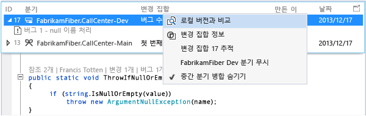  
  
 변경 집합을 두 번 클릭할 수도 있습니다.  
  
#### 아이콘은 무엇을 의미하나요?  
  
|**아이콘**|**변경 내용이 발생한 위치**|  
|--------------|-----------------------------------------|  
||현재 분기|  
||부모 분기|  
||자식 분기|  
||피어 분기|  
||부모, 자식 또는 피어보다 더 먼 분기|  
||부모 분기에서 자식 분기로 병합|  
||자식 분기에서 부모 분기로 병합|  
||관련 없는 분기에서 병합(기본 파일이 없는 병합)|  
  
### 링크된 작업 항목 찾기  
 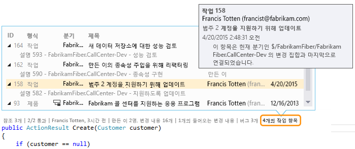  
  
### 링크된 코드 검토 찾기  
 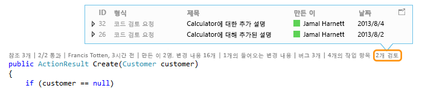  
  
### 링크된 버그 찾기  
 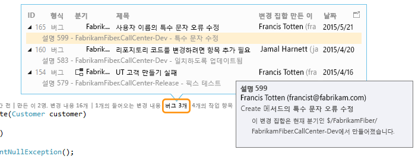  
  
### 항목 소유자에게 문의  
   
  
 연락처 옵션을 보려면 항목에 대한 바로 가기 메뉴를 엽니다. Lync 또는 비즈니스용 Skype를 설치한 경우 이러한 옵션이 표시됩니다.  
  
   
  
##   코드에 대한 단위 테스트 찾기  
 테스트 탐색기를 열지 않고 코드에 대한 단위 테스트 관련 추가 정보를 확인할 수 있습니다. 필요한 사항:  
  
-   Visual Studio Enterprise 또는 Visual Studio Professional  
  
-   Visual C# .NET 또는 Visual Basic .NET 코드  
  
-   응용 프로그램 코드에 대한 단위 테스트가 있는 [단위 테스트 프로젝트](../test/unit-test-your-code.md)  
  
1.  단위 테스트가 있는 응용 프로그램 코드로 이동합니다.  
  
2.  해당 코드에 대한 테스트를 검토합니다(**Alt+3**).  
  
     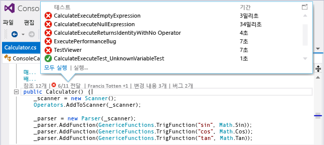  
  
3.   경고 아이콘이 표시되는 경우 테스트를 실행합니다.  
  
     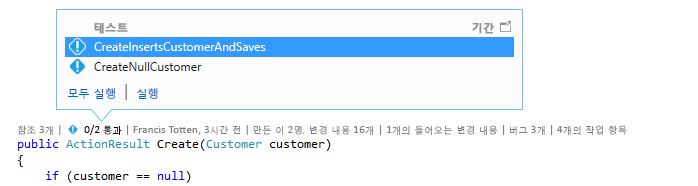  
  
4.  테스트의 정의를 검토하려면 CodeLens 표시기 창에서 테스트 항목을 두 번 클릭하여 편집기에서 코드 파일을 엽니다.  
  
     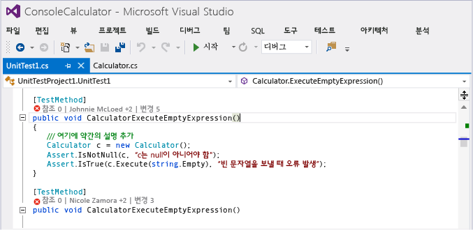  
  
5.  테스트 결과를 검토합니다. 테스트 상태 지표( 또는 )를 선택하거나 **Alt+1**을 누릅니다.  
  
     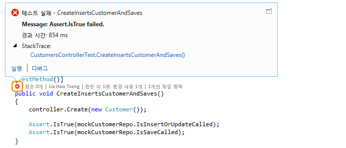  
  
6.  이 테스트를 변경한 사용자와 그 수 또는 이 테스트에 대해 수행된 변경 작업 수를 확인하려면 [코드 기록 및 링크된 항목을 찾아보세요](#FindCodeHistory).  
  
##   Q & A  
  
###   Q: CodeLens를 설정하거나 해제하려면 어떻게 하나요? 또는 확인할 지표는 어떻게 선택하나요?  
 **A:**  참조 지표를 제외하고, 지표를 설정하거나 해제할 수 있습니다. 그렇게 하려면 **도구**, **옵션**, **텍스트 편집기**, **모든 언어**, **CodeLens**로 이동합니다.  
  
 지표가 설정되어 있으면 해당 지표에서 CodeLens 옵션을 열 수도 있습니다.  
  
 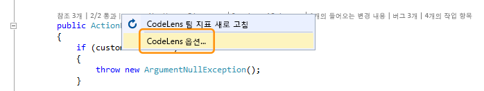  
  
 편집기 창의 맨 아래에 있는 펼침 단추 아이콘을 사용하여 CodeLens 파일 수준 표시기를 켜거나 끕니다.  
  
   
  
###   Q: CodeLens는 어디에 있나요?  
 **A:** CodeLens는 메서드, 클래스, 인덱서 및 속성 수준에서 Visual C# .NET 및 Visual Basic .NET 코드에 표시됩니다. CodeLens는 기타 모든 형식의 파일에 대해 파일 수준에서 표시됩니다.  
  
-   CodeLens가 설정되어 있는지 확인합니다. 그렇게 하려면 **도구**, **옵션**, **텍스트 편집기**, **모든 언어**, **CodeLens**로 이동합니다.  
  
-   코드가 TFS에 저장되는 경우 [CodeIndex 명령](../ide/codeindex-command.md) 과 [TFS 구성 명령](http://msdn.microsoft.com/en-us/94424190-3b6b-4f33-a6b6-5807f4225b62)을 함께 사용하여 코드 인덱싱이 설정되어 있는지 확인합니다.  
  
-   TFS 관련 지표는 작업 항목이 코드와 링크되어 있는 경우 및 링크된 작업 항목을 열 권한이 있는 경우에만 나타납니다. [팀 멤버 권한이 있는지 확인합니다.](http://msdn.microsoft.com/en-us/f58805de-ba61-4d09-8f2d-d3ab9662ecfd)  
  
-   단위 테스트 지표는 응용 프로그램 코드에서 단위 테스트를 하지 않은 경우 나타나지 않습니다. 테스트 상태 지표는 테스트 프로젝트에 자동으로 나타납니다. 응용 프로그램 코드에 단위 테스트가 있지만 테스트 지표가 나타나지 않는 경우 솔루션 빌드를 시도하십시오(**Ctrl + Shift + B**).  
  
### Q: 커밋에 대한 작업 항목 정보가 나타나지 않습니다.  
 **A:** CodeLens가 TFS의 작업 항목을 찾을 수 없기 때문에 이러한 현상이 발생할 수 있습니다. 작업 항목이 포함된 팀 프로젝트에 연결되어 있으며 해당 작업 항목을 볼 수 있는 권한이 있는지 확인하세요. 커밋 설명에 TFS의 작업 항목 ID에 대한 잘못된 정보가 포함된 경우에도 이러한 현상이 발생할 수 있습니다.  
  
###   Q: Lync 또는 Skype 지표가 표시되지 않은 이유는 무엇인가요?  
 **A:** Lync 또는 비즈니스용 Skype에 로그인하지 않았거나, 이들 중 하나를 설치하지 않았거나, 지원되는 구성이 없을 경우 지표가 표시되지 않습니다. 하지만 메일을 보낼 수 있습니다.  
  
 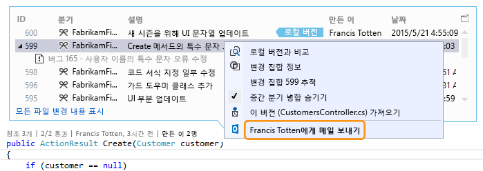  
  
 **어떤 Lync 및 Skype 구성이 지원되나요?**  
  
-   비즈니스용 Skype(32비트 또는 64비트)  
  
-   Lync 2010 이상 독립형(32비트 또는 64비트) 단, Windows 8.1의 Lync Basic 2013 제외  
  
 CodeLens는 다른 버전의 Lync 또는 Skype가 설치되는 것을 지원하지 않습니다. 다른 버전의 Lync 또는 Skype는 Visual Studio의 모든 지역화된 버전에 지역화되지 않을 수 있습니다.  
  
### Q: CodeLens의 글꼴과 색을 변경하려면 어떻게 해야 하나요?  
 **A:** **도구**, **옵션**, **환경**, **글꼴 및 색**으로 이동합니다.  
  
 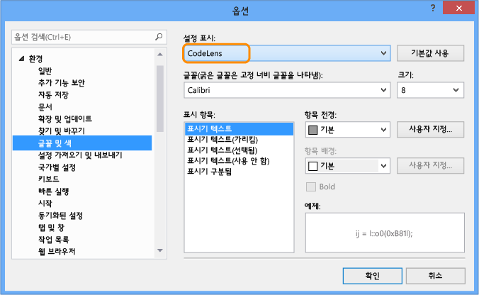  
  
 키보드를 사용하려면  
  
1.  **Alt + T + O** 를 눌러 **옵션** 상자를 엽니다.  
  
2.  **위쪽 화살표** 또는 **아래쪽 화살표** 를 눌러 **환경** 노드로 이동한 다음 **왼쪽 화살표** 를 눌러 노드를 확장합니다.  
  
3.  **아래쪽 화살표** 를 눌러 **글꼴 및 색**으로 이동합니다.  
  
4.  **Tab** 을 눌러 **설정 표시** 목록으로 이동한 다음 **아래쪽 화살표** 를 눌러 **CodeLens**를 선택합니다.  
  
### Q: CodeLens 헤드업 표시를 이동할 수 있습니까?  
 **A:** 예, 을 선택하여 CodeLens를 창으로 도킹합니다.  
  
   
  
   
  
### Q: 지표를 새로 고치려면 어떻게 합니까?  
 **A:** 지표에 따라 다릅니다.  
  
-   **참조**: 이 지표는 코드가 변경될 때 자동으로 업데이트됩니다. 이 지표를 별도 창으로 도킹한 경우 이 지표를 여기에서 수동으로 새로 고칩니다.  
  
     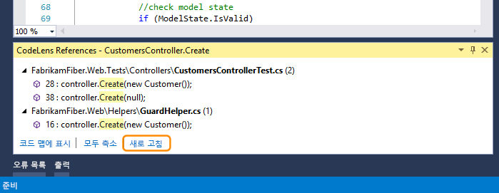  
  
-   **팀**: 이 지표를 여기에서 수동으로 새로 고칩니다.  
  
     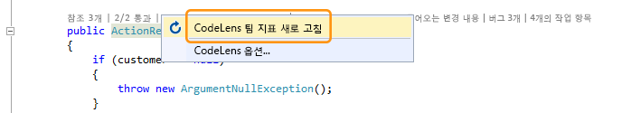  
  
-   **테스트**: [코드에 대한 단위 테스트를 찾아](#FindRunUnitTests) 이 지표를 새로 고칩니다.  
  
###   Q: "로컬 버전"이란 무엇인가요?  
 **A:** **로컬 버전** 화살표는 이 파일의 로컬 버전에 있는 최신 변경 집합을 가리킵니다. 서버에 최신 변경 집합이 있는 경우, 변경 집합을 정렬하는 순서에 따라 **로컬 버전** 화살표의 위 또는 아래에 나타납니다.  
  
### Q: CodeLens가 코드를 처리하여 기록 및 연결된 항목을 표시하는 방법을 관리할 수 있나요?  
 **A:** 예, 코드가 TFS에 있는 경우 [CodeIndex 명령](../ide/codeindex-command.md) 과 [TFS 구성 명령](http://msdn.microsoft.com/en-us/94424190-3b6b-4f33-a6b6-5807f4225b62)을 함께 사용합니다.