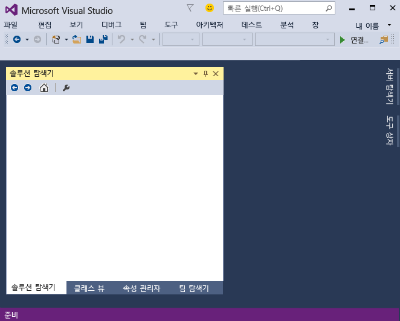
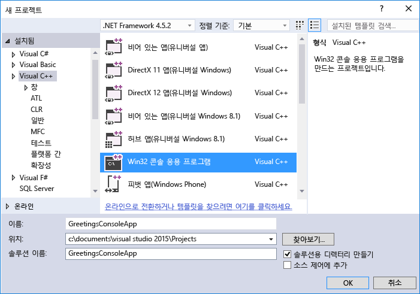
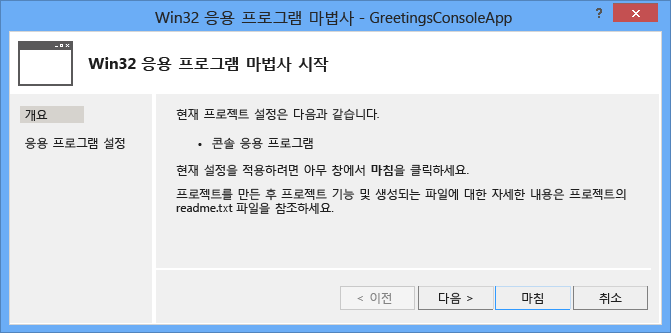
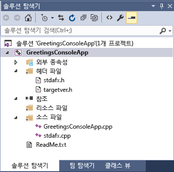
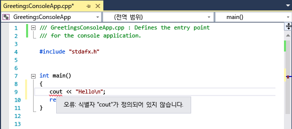
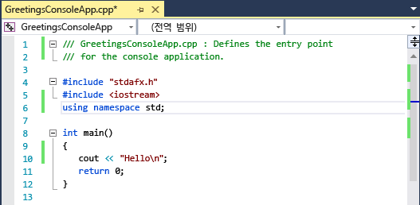

# <a name="getting-started-with-c-in-visual-studio"></a>Visual Studio에서 C++ 시작
이 연습을 완료하면 Visual Studio를 사용하여 응용 프로그램을 개발할 때 사용할 수 있는 여러 도구 및 대화 상자에 익숙해집니다. 간단한 "Hello, World" 스타일 응용 프로그램을 만들면서 IDE(통합 개발 환경)에서 작업하는 방법을 배워 보겠습니다.  
  
 이 항목에는 다음과 같은 단원이 포함되어 있습니다.  
  
 [Visual Studio에 로그인](../ide/getting-started-with-cpp-in-visual-studio.md#BKMK_Configure)  
  
 [간단한 응용 프로그램 만들기](../ide/getting-started-with-cpp-in-visual-studio.md#BKMK_CreateApp)  
  
 [응용 프로그램에 코드 추가](../ide/getting-started-with-cpp-in-visual-studio.md#BKMK_AddCode)  
  
 [응용 프로그램 디버그 및 테스트](../ide/getting-started-with-cpp-in-visual-studio.md#BKMK_DebugTest)  
  
 [앱 릴리스 버전 빌드](../ide/getting-started-with-cpp-in-visual-studio.md#BKMK_BuildRelease)  
  
##  <a name="a-namebkmkconfigurea-sign-in-to-visual-studio"></a><a name="BKMK_Configure"></a> Visual Studio에 로그인  
 Visual Studio를 처음 시작하는 경우 Live 또는 Outlook 같은 Microsoft 계정을 사용하여 로그인할 수 있는 옵션이 제공됩니다. 로그인하면 모든 장치 간에 설정을 동기화할 수 있습니다. 자세한 내용은 [Visual Studio에 로그인](../ide/signing-in-to-visual-studio.md)을 참조하세요.  
  
 그림 1: Visual Studio IDE  
  
   
  
 Visual Studio를 열면 IDE의 세 가지 기본 부분인 도구 창, 메뉴 및 도구 모음, 주 창 공간을 확인할 수 있습니다. **빠른 실행**, 메뉴 모음 및 상단의 표준 도구 모음이 포함된 도구 창은 앱 창 왼쪽과 오른쪽에 도킹되어 있습니다. 응용 프로그램 창의 가운데에는 **시작 페이지**가 있습니다. 솔루션 또는 프로젝트를 열면 편집기와 디자이너가 이 공간에 나타납니다. 응용 프로그램을 개발할 때 이 중앙 영역에서 대부분의 시간을 보냅니다.  
  
##  <a name="a-namebkmkcreateappa-create-a-simple-application"></a><a name="BKMK_CreateApp"></a> 간단한 응용 프로그램 만들기  
 Visual Studio에서 앱을 만들 때 먼저 프로젝트와 솔루션을 만들어야 합니다. 이 예제에서는 Windows 콘솔 응용 프로그램을 만듭니다.  
  
#### <a name="to-create-a-console-app"></a>콘솔 앱을 만들려면  
  
1.  메뉴 모음에서 **파일**, **새로 만들기**, **프로젝트**를 차례로 선택합니다.  
  
       
  
2.  **Visual C++** 범주에서 **Win32 콘솔 응용 프로그램** 템플릿을 선택한 후 프로젝트 이름을 `GreetingsConsoleApp`으로 지정합니다.  
  
       
     설치한 항목에 따라 다른 선택 사항이 대화 상자에 표시될 수 있습니다. Visual C++ 프로젝트 템플릿이 보이지 않는 경우 설치 관리자로 돌아가서 C++ 작업을 설치해야 합니다.
  
3.  Win32 응용 프로그램 마법사가 나타나면 **마침** 단추를 선택합니다.  
  
       
  
 Win32 콘솔 앱용 기본 파일과 함께 GreetingsConsoleApp 프로젝트 및 솔루션이 생성된 후 **솔루션 탐색기**에 자동으로 로드됩니다. GreetingsConsoleApp.cpp 파일이 코드 편집기에서 열립니다. 다음 항목이 **솔루션 탐색기**에 나타납니다.  
  
 그림 4: 프로젝트 항목  
  
   
  
##  <a name="a-namebkmkaddcodea-add-code-to-the-application"></a><a name="BKMK_AddCode"></a> 응용 프로그램에 코드 추가  
 다음으로 콘솔 창에 "Hello"를 표시하는 코드를 추가합니다.  
  
#### <a name="to-display-hello-in-the-console-window"></a>콘솔 창에 "Hello"를 표시하려면  
  
1.  GreetingsConsoleApp.cpp 파일에서 `return 0;` 줄 앞에 빈 줄을 입력하고 다음 코드를 입력합니다.  
  
    ```  
    cout << "Hello\n";  
    ```  
  
     `cout`아래에 빨간색 물결선이 나타납니다. 이 물결선을 가리키면 오류 메시지가 표시됩니다.  
  
       
  
     이 오류 메시지는 **오류 목록** 창에도 나타납니다. 메뉴 모음에서 **보기**, **오류 목록**을 선택하여 이 창을 표시할 수 있습니다.  
  
     [count](/cpp/standard-library/iostream)는 \<iostream> 헤더 파일에 포함되어 있습니다.  
  
2.  Iostream 헤더를 포함하려면 `#include "stdafx.h"`뒤에 다음 코드를 입력합니다.  
  
    ```  
    #include <iostream>  
    using namespace std;  
    ```  
  
     코드를 입력하면 입력한 문자에 대한 추천 단어를 표시하는 상자가 나타나는 것을 확인할 수 있습니다. 이 상자는 C++ IntelliSense의 일부로, 클래스 또는 인터페이스 멤버 및 매개 변수 정보의 나열을 비롯한 코딩 프롬프트를 제공합니다. 또한 미리 정의된 코드 블록인 코드 조각을 사용할 수도 있습니다. 자세한 내용은 [IntelliSense 사용](../ide/using-intellisense.md) 및 [코드 조각](../ide/code-snippets.md)을 참조하세요.  
  
     `cout` 아래의 빨간색 물결선은 오류를 해결하면 사라집니다.  
  
3.  파일의 변경 내용을 저장합니다.  
  
       
  
##  <a name="a-namebkmkdebugtesta-debug-and-test-the-application"></a><a name="BKMK_DebugTest"></a> 응용 프로그램 디버그 및 테스트  
 GreetingsConsoleApp을 디버그하여 단어 "Hello"가 콘솔 창에 표시되는지 여부를 확인할 수 있습니다.  
  
#### <a name="to-debug-the-application"></a>응용 프로그램을 디버그하려면  
  
-   디버거를 시작합니다.  
  
       
  
     디버거가 시작되고 코드가 실행됩니다. 콘솔 창(명령 프롬프트외 비슷한 별도의 창)이 몇 초간 나타나지만 디버거에서 실행이 중지되면 바로 닫힙니다. 텍스트를 보려면 중단점을 설정하여 프로그램 실행을 중지해야 합니다.  
  
#### <a name="to-add-a-breakpoint"></a>중단점을 추가하려면  
  
1.  메뉴 모음에서 `return 0;`줄에 중단점을 추가합니다. 왼쪽 여백을 클릭하여 중단점을 설정할 수도 있습니다.  
  
       
  
     편집기 창의 맨 왼쪽 여백 코드 줄 옆에 빨간색 원이 나타납니다.  
  
2.  F5 키를 선택하여 디버깅을 시작합니다.  
  
     디버거가 시작되고 단어 **Hello**를 표시하는 콘솔 창이 나타납니다.  
  
       
  
3.  Shift+F5를 눌러 디버깅을 중지합니다.  
  
 자세한 내용은 [콘솔 프로젝트](../debugger/debugging-preparation-console-projects.md)를 참조하세요.  
  
##  <a name="a-namebkmkbuildreleasea-build-a-release-version-of-the-app"></a><a name="BKMK_BuildRelease"></a> 앱 릴리스 버전 빌드  
 모든 것이 작동하는 것을 확인했으므로 응용 프로그램의 릴리스 빌드를 준비할 수 있습니다.  
  
#### <a name="to-clean-the-solution-files-and-build-a-release-version"></a>솔루션 파일을 정리하고 릴리스 버전을 빌드하려면  
  
1.  메뉴 모음에서 이전 빌드 중에 생성된 중간 파일 및 출력 파일을 삭제합니다.  
  
       
  
2.  GreetingsConsoleApp의 빌드 구성을 **디버그** 에서 **릴리스**로 변경합니다.  
  
       
  
3.  솔루션을 빌드합니다.  
  
       
  
 이 연습을 완료한 것을 축하 드립니다! 더 많은 예제를 탐색하려는 경우 [Visual Studio 샘플](../ide/visual-studio-samples.md)을 참조하세요.  
  
## <a name="see-also"></a>참고 항목  
 [C++ 데스크톱 개발에 Visual Studio IDE 사용](/cpp/ide/using-the-visual-studio-ide-for-cpp-desktop-development)   
 [연습: Visual C# 또는 Visual Basic으로 간단한 응용 프로그램 만들기](../ide/walkthrough-create-a-simple-application-with-visual-csharp-or-visual-basic.md)   
 [Visual Studio 생산성 팁](../ide/productivity-tips-for-visual-studio.md)   
 [Visual Studio 샘플](../ide/visual-studio-samples.md)   
 [Visual Studio에서 개발 시작](../ide/get-started-developing-with-visual-studio.md)


<!--HONumber=Feb17_HO4-->


