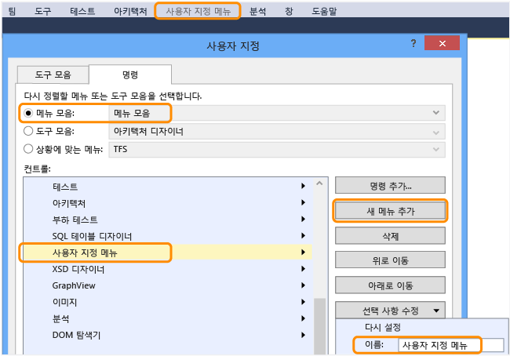
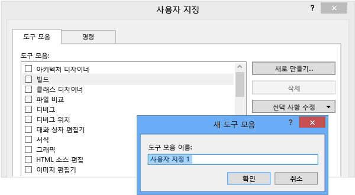
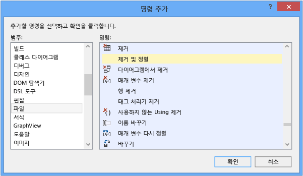

# 방법: Visual Studio에서 메뉴 및 도구 모음 사용자 지정

메뉴 모음의 도구 모음 및 메뉴를 추가 및 제거하는 방법뿐만 아니라 지정된 도구 모음 또는 메뉴의 명령을 제거하여 Visual Studio를 사용자 지정할 수 있습니다.

> [!WARNING]
> 도구 모음 또는 메뉴를 사용자 지정한 후 확인란이 **사용자 지정** 대화 상자에서 선택되었는지 확인합니다. 그렇지 않으면 Visual Studio를 닫았다가 다시 연 후 변경 사항이 유지되지 않습니다.

## 메뉴 모음의 메뉴 추가, 제거 또는 이동

1.  메뉴 모음에서 **도구** > **사용자 지정**을 선택합니다.

     **사용자 지정** 대화 상자가 열립니다.

2.  **명령** 탭에서 **메뉴 모음** 옵션 단추를 선택된 상태로 두고 그 옵션 옆의 목록에서 **메뉴 모음**을 선택한 상태로 둔 후 다음 단계 중 하나를 수행합니다.

    -   메뉴를 추가하려면 **새 메뉴 추가** 단추를 선택하고 **선택 사항 수정** 단추를 선택한 다음 추가할 메뉴의 이름을 지정합니다.

        

    -   메뉴를 제거하려면 **컨트롤** 목록에서 선택한 다음 **삭제** 단추를 선택합니다.

    -   메뉴 모음에서 메뉴를 이동하려면 **컨트롤** 목록에서 메뉴를 선택한 다음 **위로 이동** 또는 **아래로 이동** 단추를 선택합니다.

## 도구 모음 추가, 제거 또는 이동

1.  메뉴 모음에서 **도구** > **사용자 지정**을 선택합니다.

     **사용자 지정** 대화 상자가 열립니다.

2.  **도구 모음** 탭에서 다음 단계 중 하나를 수행합니다.

    -   도구 모음을 추가하려면 **새로 만들기** 단추를 선택하고 추가할 도구 모음의 이름을 지정한 다음 **확인** 단추를 선택합니다.

        

    -   사용자 지정 도구 모음을 제거하려면 **도구 모음** 목록에서 선택한 다음 **삭제** 단추를 선택합니다.

        > [!IMPORTANT]
        > 만든 도구 모음은 삭제할 수 있지만 기본 도구 모음은 삭제할 수 없습니다.

    -   도구 모음을 다른 도킹 위치로 이동하려면 **도구 모음** 목록에서 **선택 사항 수정** 단추를 선택한 다음 나타나는 목록에서 위치를 선택합니다.

        도구 모음의 왼쪽 가장자리를 주 도킹 영역에서 원하는 위치로 끌어 도구 모음을 이동할 수도 있습니다.

        > [!NOTE]
        > 도구 모음의 사용 가능성과 내게 필요한 옵션 기능을 향상시키는 방법에 대한 자세한 내용은 [방법: IDE 내게 필요한 옵션 설정](../ide/reference/how-to-set-ide-accessibility-options.md)을 참조하세요.

## <a name="customizing_menu">메뉴 또는 도구 모음 사용자 지정</a>

1.  메뉴 모음에서 **도구** > **사용자 지정**을 선택합니다.

    **사용자 지정** 대화 상자가 열립니다.

2.  **명령** 탭에서 사용자 지정할 요소의 형식에 대한 옵션 단추를 선택합니다.

3.  해당 요소 형식에 대한 목록에서 사용자 지정할 메뉴 또는 도구 모음을 선택한 후 다음 단계 중 하나를 수행합니다.

    -   명령을 추가하려면 **명령 추가** 단추를 선택합니다.

        **명령 추가** 대화 상자에서 **범주** 목록의 항목을 선택하고 **명령** 목록의 항목을 선택한 다음 **확인** 단추를 선택합니다.

        

    -   명령을 삭제하려면 **컨트롤** 목록에서 선택한 다음 **삭제** 단추를 선택합니다.

    -   명령을 다시 정렬하려면 **컨트롤** 목록에서 명령을 선택한 다음 **위로 이동** 또는 **아래로 이동** 단추를 선택합니다.

    -   가로 선 아래로 명령을 그룹화하려면 **컨트롤** 목록에서 첫 명령을 선택하고 **선택 사항 수정** 버튼을 선택한 다음 나타나는 메뉴에서 **그룹 시작**을 선택합니다.

## 메뉴 또는 도구 모음 다시 설정

1.  메뉴 모음에서 **도구** > **사용자 지정**을 선택합니다.

    **사용자 지정** 대화 상자가 열립니다.

2.  **명령** 탭에서 사용자 다시 설정할 요소의 형식에 대한 옵션 단추를 선택합니다.

3.  해당 요소 형식에 대한 목록에서 다시 설정할 메뉴 또는 도구 모음을 선택합니다.

4.  **선택 사항 수정** 단추를 선택한 다음 나타나는 메뉴에서 **다시 설정**을 선택합니다.

    **모두 다시 설정** 단추를 선택하면 모든 메뉴 및 도구 모음을 다시 설정할 수도 있습니다.

## 참고 항목

- [IDE 개인 설정](../ide/personalizing-the-visual-studio-ide.md)
- [편집기 사용자 지정](../ide/customizing-the-editor.md)