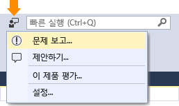
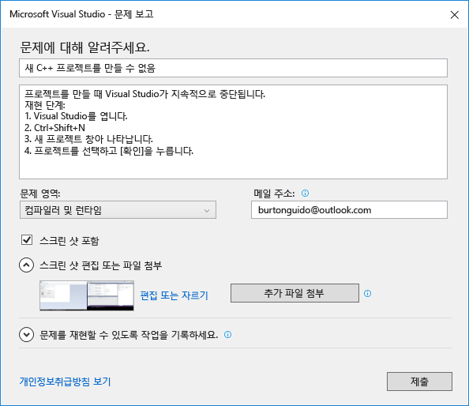
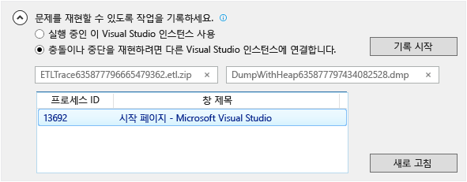

# Visual Studio의 문제를 보고하는 방법
[!INCLUDE[vs2017banner](../code-quality/includes/vs2017banner.md)]

Visual Studio에서 문제가 발생하는 경우 Microsoft에서 문제를 진단하여 해결할 수 있도록 알려 주시기 바랍니다.**문제 보고** 도구에서 단추를 몇 번만 클릭하여 문제에 대한 자세한 정보를 수집한 후 Microsoft로 보낼 수 있습니다.  
  
 Microsoft는 사용자의 개인 정보를 소중히 여깁니다. Microsoft에서 사용자가 보낸 데이터를 취급하는 방법에 대한 자세한 내용은 [Microsoft Visual Studio 제품군 개인 정보 취급 방침](https://www.visualstudio.com/en-us/dn948229)을 참조하세요.  
  
## 문제 보고 도구 열기  
 제목 표시줄에서 **빠른 실행** 옆에 있는 사용자 피드백 아이콘을 클릭하거나 **도움말 &#124; 의견 보내기 &#124; 문제 보고**를 클릭합니다.  
  
   
  
## 문제 설명  
  
###    
  
1.  Visual Studio 내의 올바른 팀에게 전달될 수 있도록 문제에 대한 설명이 포함된 제목을 입력합니다.  
  
2.  추가 세부 정보와 문제를 재현을 위한 단계\(가능한 경우\)를 제공합니다.  
  
3.  드롭다운에서 문제 영역을 선택합니다. 확실하지 않은 경우 최대한 추측하여 선택합니다.  
  
   
  
## 스크린샷 제공\(선택 사항\)  
 현재 화면을 Microsoft로 보내려면 **스크린샷 포함**을 선택합니다. 이 도구를 사용하면 화면에서 문제가 있는 부분만 표시하도록 이미지를 자를 수 있습니다.**추가 파일 첨부** 단추를 클릭하여 추가 스크린샷 또는 다른 파일을 첨부할 수 있습니다.  
  
## 추적 및 힙 덤프 제공\(선택 사항\)  
  
###    
  
1.  추적 및 힙 덤프 파일은 문제를 진단하는 데 매우 유용합니다.   문제 보고 도구를 사용하여 재현 단계를 기록하여 데이터를 Microsoft로 보내 주시면 감사하겠습니다.  
  
2.  **문제를 재현할 수 있도록 작업을 기록하세요.** 옆에 있는 펼침 단추를 클릭합니다. 문제가 발생하여 Visual Studio가 정지하거나 충돌할 경우 Visual Studio의 다른 인스턴스를 열고 목록 보기에서 해당 인스턴스를 선택합니다.  
  
3.  **기록 시작**을 클릭하고 문제를 재현하는 단계를 수행합니다. 완료되면 부동 창에서 **기록 중지** 단추를 클릭합니다.  
  
4.  Visual Studio에서 기록된 정보를 수집하여 패키징하는 동안 몇 분 정도 기다립니다. 수집 프로세스가 완료되면 다음과 같은 대화 상자가 나타납니다.  
  
       
  
## 해결 방법\(있는 경우\) 설명  
 문제를 해결할 수 있는 경우 해당 용도로 제공되는 편집 상자에 해결 방법을 설명하세요. 그러면 Microsoft에서 문제를 진단하는 데 도움이 될 뿐만 아니라 동일한 문제가 발생하는 다른 사용자에게도 도움이 됩니다.  
  
## 보고서 제출  
 제출 단추를 클릭하여 이미지와 추적 또는 덤프 파일과 함께 보고서를 보냅니다.**제출** 단추가 회색으로 표시되는 경우 제목과 설명을 입력했는지 확인합니다.  
  
## 참고 항목  
 [의견 보내기](../ide/talk-to-us.md)