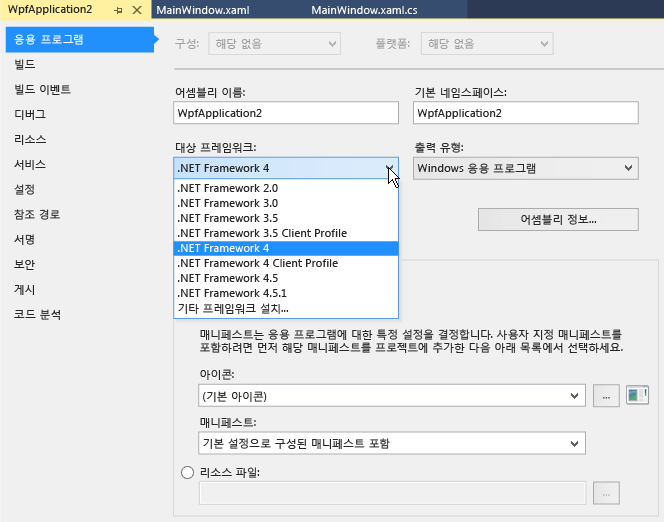

# 방법: 한 버전의 .NET Framework를 대상으로 지정
이 문서에서는 프로젝트를 만들 때 특정 버전의 .NET Framework를 대상으로 지정하는 방법 및 기존 Visual Basic, Visual C# 또는 Visual F# 프로젝트에서 대상 버전을 변경하는 방법에 대해 설명합니다.  
  
> [!IMPORTANT]
>  C++ 프로젝트의 대상 버전을 변경하는 방법에 대한 자세한 내용은 [방법: 대상 프레임워크 및 플랫폼 도구 집합 수정](http://msdn.microsoft.com/Library/031b1d54-e6e1-4da7-9868-3e75a87d9ffe)을 참조하세요.  
  
 **항목 내용**  
  
-   [프로젝트를 만들 때 버전 대상 지정](../ide/how-to-target-a-version-of-the-dotnet-framework.md#bkmk_new)  
  
-   [대상 버전 변경](../ide/how-to-target-a-version-of-the-dotnet-framework.md#bkmk_existing)  
  
##   프로젝트를 만들 때 버전 대상 지정  
 프로젝트를 만들 때 대상으로 지정하는 .NET Framework 버전에 따라 사용할 수 있는 템플릿 종류가 결정됩니다.  
  
> [!NOTE]
>  Visual Studio Express 버전에서는 먼저 프로젝트를 만든 다음 이 항목의 뒷부분에서 설명하는 [대상 버전 변경](../ide/how-to-target-a-version-of-the-dotnet-framework.md#bkmk_existing)에 따라 대상을 변경할 수 있습니다.  
  
#### 프로젝트를 만들 때 버전을 대상으로 지정하려면  
  
1.  메뉴 모음에서 **파일**, **새로 만들기**, **프로젝트**를 차례로 선택합니다.  
  
2.  **새 프로젝트** 대화 상자 위쪽의 목록에서 프로젝트의 대상으로 지정할 .NET Framework 버전을 선택합니다.  
  
    > [!NOTE]
    >  일반적으로 한 가지 버전의 .NET Framework만 Visual Studio와 함께 설치됩니다. 다른 버전을 대상으로 지정하려면 먼저 해당 버전이 설치되어 있는지 확인해야 합니다. [Visual Studio 멀티 타기팅 개요](../ide/visual-studio-multi-targeting-overview.md)를 참조하세요.  
  
3.  설치된 템플릿 목록에서 만들려는 프로젝트의 형식을 선택하고 프로젝트 이름을 지정한 다음 **확인** 단추를 선택합니다.  
  
     템플릿 목록에는 선택한 .NET Framework 버전에서 지원하는 프로젝트만 표시됩니다.  
  
##   대상 버전 변경  
 이 절차를 수행하여 Visual Basic, Visual C# 또는 Visual F# 프로젝트에서 .NET Framework의 대상 버전을 변경할 수 있습니다.  
  
#### 대상 버전을 변경하려면  
  
1.  **솔루션 탐색기**에서 변경하려는 프로젝트의 바로 가기 메뉴를 연 후 **속성**을 선택합니다.  
  
       
  
    > [!IMPORTANT]
    >  C++ 프로젝트의 대상 버전을 변경하는 방법에 대한 자세한 내용은 [방법: 대상 프레임워크 및 플랫폼 도구 집합 수정](http://msdn.microsoft.com/Library/031b1d54-e6e1-4da7-9868-3e75a87d9ffe)을 참조하세요.  
  
2.  [속성] 창의 왼쪽 열에서 **응용 프로그램** 탭을 선택합니다.  
  
       
  
    > [!NOTE]
    >  Windows 스토어 앱을 만든 후에는 Windows 또는 .NET Framework의 대상 버전을 변경할 수 없습니다.  
  
3.  **대상 프레임워크** 목록에서 원하는 버전을 선택합니다.  
  
4.  [확인] 대화 상자가 나타나면 **예** 단추를 선택합니다.  
  
     프로젝트가 언로드됩니다. 다시 로드되면 이 프로젝트는 방금 선택한 .NET Framework 버전을 대상으로 지정합니다.  
  
    > [!NOTE]
    >  코드에 사용자가 대상으로 지정한 것과 다른 버전의 .NET Framework에 대한 참조가 포함된 경우, 코드를 컴파일하거나 실행할 때 오류 메시지가 나타날 수 있습니다. 이러한 오류를 해결하려면 참조를 수정해야 합니다. [.NET Framework 대상 지정 오류 문제 해결](../msbuild/troubleshooting-dotnet-framework-targeting-errors.md)을 참조하세요.  
  
## 참고 항목  
 [Visual Studio 멀티 타기팅 개요](../ide/visual-studio-multi-targeting-overview.md)   
 [ASP.NET 웹 프로젝트에 대한 .NET Framework 멀티 타기팅](http://msdn.microsoft.com/Library/8b8145a9-62f6-4fc4-8a83-47b0487cbe76)   
 [.NET Framework 대상 지정 오류 문제 해결](../msbuild/troubleshooting-dotnet-framework-targeting-errors.md)   
 [프로젝트 디자이너, 응용 프로그램 페이지(C#)](../ide/reference/application-page-project-designer-csharp.md)   
 [프로젝트 디자이너, 응용 프로그램 페이지(Visual Basic)](../ide/reference/application-page-project-designer-visual-basic.md)   
 [프로젝트 구성](http://msdn.microsoft.com/Library/a1489abb-6294-4f8f-b71f-2cb126393526)   
 [방법: 대상 프레임워크 및 플랫폼 도구 집합 수정](http://msdn.microsoft.com/Library/031b1d54-e6e1-4da7-9868-3e75a87d9ffe)
