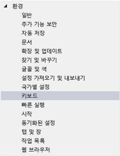
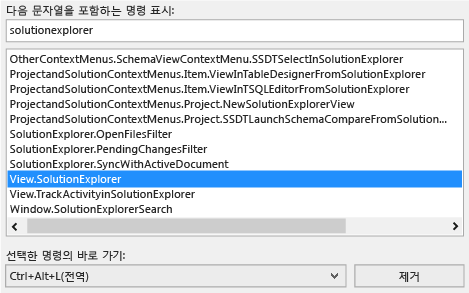
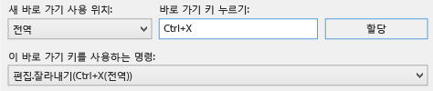
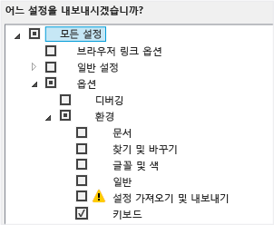
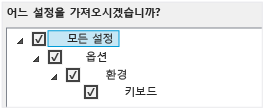

# Visual Studio에서 바로 가기 키 식별 및 사용자 지정

Visual Studio 명령에 대한 바로 가기 키를 확인하고, 해당 바로 가기 키를 사용자 지정하고, 다른 사용자가 사용하도록 내보낼 수 있습니다. 대부분의 바로 가기는 항상 동일한 명령을 호출하지만, 바로 가기 동작은 다음 조건에 따라 달라질 수 있습니다.

- 일반 개발 환경 설정 또는 Visual C# 환경 설정 등의 Visual Studio를 처음으로 실행했을 때 선택한 기본 환경 설정 종류

- 바로 가기의 동작의 사용자 지정 여부

- 바로 가기를 선택한 컨텍스트 위치. 예를 들어, **F2** 바로 가기는 **설정 디자이너**를 사용 중인 경우 `Edit.EditCell` 명령을 호출하고, **팀 탐색기**를 사용 중인 경우 `File.Rename` 명령을 호출합니다.

설정, 사용자 지정 여부 및 컨텍스트에 관계없이 언제든지 **옵션** 대화 상자에서 바로 가기 키를 찾아 변경할 수 있습니다. 또한 [자주 사용되는 명령의 기본 바로 가기 키](../ide/default-keyboard-shortcuts-for-frequently-used-commands-in-visual-studio.md)에서 수십 가지 명령에 대한 기본 바로 가기 키를 확인할 수 있으며, 모든 기본 바로 가기의 전체 목록(**일반 개발 설정** 기준)은 [기본 바로 가기 키](../ide/default-keyboard-shortcuts-in-visual-studio.md)에서 찾을 수 있습니다.

바로 가기가 전역 컨텍스트의 명령에 할당되었고 기타 컨텍스트가 없는 경우, 해당 바로 가기는 항상 해당 명령을 호출합니다. 하지만 바로 가기가 전역 컨텍스트에서 한 명령에 할당되고 특정 컨텍스트에서는 다른 명령에 할당될 수도 있습니다. 특정 컨텍스트에서 이러한 바로 가기를 사용하는 경우, 바로 가기는 전역 컨텍스트가 아닌 특정 컨텍스트의 명령을 호출합니다.

> [!NOTE]
> 사용자 설정 및 Visual Studio 버전에 따라 메뉴 명령과 대화 상자에 표시되는 옵션의 이름 및 위치가 변경될 수 있습니다. 이 항목에서는 **일반 개발 설정**을 기반으로 합니다.

## 바로 가기 키 식별

1. 메뉴 모음에서 **도구** > **옵션**을 선택합니다.

2. **환경**을 확장한 다음 **키보드**를 선택합니다.

   

3. **다음 문자열을 포함하는 명령 표시** 상자에 명령 이름의 전부 또는 일부를 공백 없이 입력합니다.

   예를 들어 `solutionexplorer`에 대한 명령을 찾을 수 있습니다.

4. 목록에서 해당 명령을 선택합니다.

    예를 들어 `View.SolutionExplorer`을 선택할 수 있습니다.

5. 명령에 바로 가기 키가 있는 경우, **선택한 명령의 바로 가기** 목록에 표시됩니다.

   

## 바로 가기 키 사용자 지정

1. 메뉴 모음에서 **도구** > **옵션**을 선택합니다.

2. **환경** 폴더를 확장한 다음 **키보드**를 선택합니다.

3. 선택 사항: **다음 문자열을 포함하는 명령 표시** 상자에 명령 이름의 전부 또는 일부를 공백 없이 입력하여 명령 목록을 필터링합니다.

4. 목록에서 바로 가기 키를 할당하려는 명령을 선택합니다.

    **새 바로 가기 사용 위치** 목록에서 바로 가기를 사용할 기능 영역을 선택합니다.

    예를 들어, 모든 컨텍스트에서 바로 가기가 동작하도록 하려면 **전역**을 선택할 수 있습니다. 다른 편집기에 전역으로 매핑되어 있지 않은 모든 바로 가기를 사용할 수 있습니다. 그렇지 않으면 편집기에서 바로 가기를 무시합니다.

    > [!NOTE]
    > Print Screen/Sys Rq 키, Scroll Lock 키, Pause/Break 키, Tab 키, Caps Lock 키, Insert 키, Home 키, End 키, Page Up 키, Page Down 키, Windows 로고 키, 응용 프로그램 키, 모든 화살표 키, Enter 키, 숫자 키패드의 Num Lock 키, Del 키, Clear 키, Ctrl+Alt+Delete 키 조합 등은 **전역** 바로 가기 키의 일부로 할당할 수 없습니다.

6. **바로 가기 키 누르기** 상자에 사용하려는 바로 가기를 입력합니다.

    > [!NOTE]
    > **Alt** 키, **Ctrl** 키 또는 둘 다와 함께 문자를 조합하여 바로 가기를 만들 수 있습니다. 또한 **Alt** 키, **Ctrl** 키 또는 둘 다와 함께 **Shift** 키 및 문자를 조합하여 바로 가기를 만들 수 있습니다.

     다른 명령에 이미 할당된 바로 가기의 경우 **이 바로 가기 키를 사용하는 명령** 상자에 나타납니다. 이 경우, 다른 바로 가기를 넣어 보기 전에 **백스페이스 키**를 선택하여 해당 바로 가기를 삭제하십시오.

    

7. **할당** 단추를 선택합니다.

    > [!NOTE]
    > 명령에 다른 바로 가기를 지정하는 경우 **할당** 단추를 클릭한 다음 **취소** 단추를 선택하면 대화 상자가 닫히지만 변경 사항은 취소되지 않습니다.

## 사용자 지정 바로 가기 키 공유

사용자 지정 바로 가기 키를 파일로 내보낸 다음 데이터를 가져올 수 있도록 다른 사용자에게 이 파일을 제공하여 공유할 수 있습니다.

### 바로 가기 키만 내보내려면

1. 메뉴 모음에서 **도구** > **설정 가져오기 및 내보내기**를 선택합니다.

2. **선택한 환경 설정 내보내기**를 선택하고 **다음** 단추를 선택합니다.

3. **어느 설정을 내보내시겠습니까?** 아래에서 **모든 설정** 확인란의 선택을 취소하고 **옵션** 및 **환경**을 차례로 확장합니다.

4. **키보드** 확인란을 선택하고 **다음** 단추를 선택합니다.

    

5. **설정 파일 이름을 지정하시겠습니까?** 및 **이 디렉터리에 사용자 설정 파일 저장** 상자에서 기본값을 그대로 두거나 다른 값을 지정한 다음 **마침** 단추를 선택합니다.

    기본적으로 바로 가기는 *%USERPROFILE%\Documents\Visual Studio 2017\Settings* 폴더에 파일로 저장됩니다. 파일 이름에는 설정을 내보낸 날짜가 반영되며, 확장명은 *.vssettings*입니다.

### 바로 가기 키만 가져오려면

1. 메뉴 모음에서 **도구** > **설정 가져오기 및 내보내기**를 선택합니다.

2. **선택한 환경 설정 가져오기** 옵션 단추를 선택하고 **다음** 단추를 선택합니다.

3. **아니요, 새 설정을 가져와 현재 설정을 덮어씁니다.** 옵션 단추를 선택하고 **다음** 단추를 선택합니다.

4. **사용자 설정** 아래에서 가져올 바로 가기가 포함된 파일을 선택하거나 **찾아보기** 단추를 선택하여 올바른 파일을 찾습니다.

5. **다음** 단추를 선택합니다.

6.  **어느 설정을 가져오시겠습니까?** 아래에서 **모든 설정** 확인란의 선택을 취소하고 **옵션** 및 **환경**을 차례로 확장합니다.

7. **키보드** 확인란을 선택하고 **마침** 단추를 선택합니다.

    

## 참고 항목

- [Visual Studio의 접근성 기능](../ide/reference/accessibility-features-of-visual-studio.md)