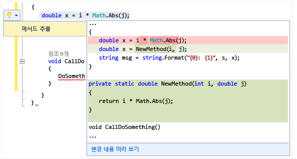

# 전구를 사용하여 빠른 작업 수행
전구는 Visual Studio의 생산성 기능입니다. 전구는 Visual Studio 편집기에 나타나고 리팩터링 및 오류 해결과 같은 빠른 작업을 수행하기 위해 클릭할 수 있는 아이콘입니다. 전구는 오류 해결 및 리팩터링 지원을 한곳에 집중화하며 대개는 현재 입력하고 있는 줄이 여기에 해당합니다.  

   

 C# 및 Visual Basic에서는 빨간색 오류 표시선이 나타나는 경우 전구가 표시되며 Visual Studio에서는 문제 해결 방법에 대한 제안이 나타납니다. 예를 들어 빨간색 오류 표시선으로 나타난 오류가 있는 경우 해당 오류에 대한 해결 방법을 사용할 수 있을 때 전구가 나타납니다. C++의 경우 헤더 파일에 새 함수를 추가하면 해당 함수에 대한 스텁 구현을 만들 것을 제안하는 전구가 표시됩니다. 어떤 언어든지 타사에서 SDK에 포함하는 방식 등을 통해 사용자 지정 진단 및 제안을 제공할 수 있으며 Visual Studio 전구는 이러한 규칙을 기반으로 켜집니다.  

## 전구를 표시하려면  

1.  대부분의 경우 전구는 오류 지점에 마우스를 가져갈 때 자연스럽게 나타나거나 오류가 있는 줄로 캐럿을 이동할 때 편집기의 왼쪽 여백에 자동으로 나타납니다. 빨간색 오류 표시선이 보이면 마우스로 가리켜 전구를 표시할 수 있습니다. 줄에서 오류가 발생한 위치로 이동하기 위해 마우스나 키보드를 사용할 때 전구가 표시되도록 할 수도 있습니다.  

2.  **Ctrl +** 줄의 임의 위치를 눌러 전구를 호출하고 잠재적 해결 방법 목록으로 바로 이동합니다.  

   

## 잠재적 해결 방법을 보려면  
 아래쪽 화살표나 잠재적 해결 방법 표시 링크를 클릭하여 전구가 수행할 수 있는 빠른 작업 목록을 표시합니다.  

   

## 리팩터링을 수행하려면  
 마우스 오른쪽 단추를 클릭하고 상황에 맞는 메뉴를 표시하여 리팩터링을 수행할 수 있지만 Ctrl+.를 눌러 리팩터링 옵션을 표시할 수도 있습니다. 다음 그림에서는 Ctrl+.를 누른 후 `Math.Abs` 호출이 포함된 줄의 임의 위치에서 메서드 추출 리팩터링이 제공됩니다.  

 

