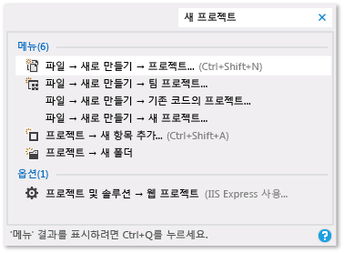

# Visual Studio 생산성 팁

이 항목에는 코드를 더 빠르고 효율적으로 작성, 탐색 및 디버그하는 데 도움이 되는 다양한 팁이 있습니다.

일반 바로 가기 키에 대한 자세한 내용은 [키보드 팁](../ide/tips-and-tricks-for-visual-studio.md)을 참조하세요. 전체 키보드 바로 가기 키 목록은 [바로 가기 키 식별 및 사용자 지정](../ide/identifying-and-customizing-keyboard-shortcuts-in-visual-studio.md) 및 [기본 바로 가기 키](../ide/default-keyboard-shortcuts-in-visual-studio.md)를 참조하세요.

## 코드 작성

다음 기능을 사용하여 더욱 신속하게 코드를 작성합니다.

- **유용한 명령을 사용**합니다. Visual Studio에는 일반적인 편집 작업을 더 빠르게 수행하는 데 도움이 되는 다양한 명령이 있습니다. 예를 들어, **Visual Studio 2017 버전 15.6** 이상에서는 코드 줄을 복사하지 않고도 쉽게 복제하여 커서 위치를 변경한 다음, 붙여넣는 명령을 선택할 수 있습니다. **편집** > **복제**를 선택하거나 **Ctrl**+**E**,**V**를 누릅니다. 또한 **편집** > **고급** > **선택 영역 확장** 또는 **편집** > **고급** > **선택 영역 축소**를 선택하거나 **Shift**+**Alt**+**=** 또는 **Shift**+**Alt**+**-**(**Visual Studio 2017 버전 15.5** 이상에서 사용 가능)를 눌러 텍스트 선택 영역을 빠르게 확장하거나 축소할 수도 있습니다.

- **IntelliSense 사용** 코드 편집기에 코드를 입력하면 멤버 목록, 매개 변수 정보, 요약 정보, 시그니처 도움말 및 단어 자동 완성과 같은 IntelliSense 정보가 나타납니다. 이러한 기능은 텍스트의 퍼지 일치를 지원합니다. 예를 들어, 멤버 목록의 결과 목록에는 사용자가 입력한 문자로 시작하는 항목 뿐만 아니라 이름에 문자 조합이 들어 있는 항목이 포함됩니다. 자세한 내용은 [IntelliSense 사용](../ide/using-intellisense.md)을 참조하세요.

- **코드를 입력할 때 IntelliSense 옵션의 자동 삽입 변경** IntelliSense를 제안 모드로 전환하여 명시적으로 선택할 경우에만 IntelliSense 옵션이 삽입되도록 지정할 수 있습니다.

     제안 모드를 사용하려면 **Ctrl**+**Alt**+**스페이스바**를 선택하거나 메뉴 모음에서 **편집**,  > IntelliSense **,**  > **완료 모드 설정/해제**를 선택합니다.

- **코드 조각 사용** 기본 제공된 코드 조각을 사용하거나 직접 코드 조각을 만들 수 있습니다.

     코드 조각을 삽입하려면 메뉴 모음에서 **편집** > **IntelliSense** > **코드 조각 삽입** 또는 **코드 감싸기**를 선택하거나 파일의 바로 가기 메뉴를 열고 **코드 조각** > **코드 조각 삽입** 또는 **코드 감싸기**를 선택합니다. 자세한 내용은 [코드 조각](../ide/code-snippets.md)을 참조하세요.

- **코드 오류를 인라인으로 수정** 빠른 작업을 사용하면 단일 작업으로 쉽게 코드를 리팩터링하거나, 생성하거나, 수정할 수 있습니다. 이 작업은 스크루드라이버 또는 전구 아이콘을 사용하거나 커서가 적절한 코드 줄에 있을 때 **Alt**+**Enter** 또는 **Ctrl**+**.** 를 눌러 적용할 수 있습니다. 자세한 내용은 [빠른 작업](quick-actions.md)을 참조하세요.

- **코드 요소의 정의 표시 및 편집** 멤버, 변수 또는 로컬 같은 코드 요소가 정의된 모듈을 신속하게 표시하고 편집할 수 있습니다.

    팝업 창에서 정의를 열려면 요소를 강조 표시하고 **Alt**+**F12**를 선택하거나 요소의 바로 가기 메뉴를 열고 **정의 피킹(Peeking)** 을 선택합니다. 별도의 코드 창에서 정의를 열려면 해당 요소의 바로 가기 메뉴를 열고 **정의로 이동**을 선택합니다.

- **샘플 응용 프로그램 사용** [Microsoft Developer Network](https://code.msdn.microsoft.com/)에서 응용 프로그램 예제를 다운로드 및 설치하여 응용 프로그램 개발 시간을 단축할 수 있습니다. 해당 영역의 샘플 팩을 다운로드 및 탐색하여 특정한 기술이나 프로그래밍 개념을 익힐 수도 있습니다.

## 코드 내에서 탐색

 다양한 기술을 사용하여 코드에서 특정 위치를 신속하게 찾고 이동할 수 있습니다.

- **코드 줄에 책갈피 지정** 책갈피를 사용하여 파일의 특정 코드 줄로 신속하게 이동할 수 있습니다.

    책갈피를 설정하려면 메뉴 모음에서 **편집** > **책갈피** > **책갈피 설정/해제**를 선택합니다. **책갈피** 창에서 솔루션의 모든 책갈피를 볼 수 있습니다. 자세한 내용은 [코드에서 책갈피 설정](../ide/setting-bookmarks-in-code.md)을 참조하세요.

- **파일에서 기호 정의 검색** 솔루션 안에서 기호 정의와 파일 이름을 검색할 수 있지만 검색 결과에 네임스페이스나 지역 변수는 포함되지 않습니다.

   이 기능에 액세스하려면 메뉴 모음에서 **편집** > **탐색**을 차례로 선택합니다.

- **코드의 전체 구조 찾아보기** **솔루션 탐색기**에서 프로젝트의 클래스와 해당 형식 및 멤버를 검색하고 찾아볼 수 있습니다. 기호를 검색하고 메서드의 호출 계층 구조를 확인하며 기호 참조를 찾아 다른 작업을 수행할 수도 있습니다. **솔루션 탐색기**에서 코드 요소를 선택할 경우 **미리 보기** 탭에 관련 파일이 열리고 커서가 파일의 요소로 이동합니다. 자세한 내용은 [코드 구조 보기](../ide/viewing-the-structure-of-code.md)를 참조하세요.

## 항목 더 빨리 찾기

현재 작업에 대한 관련 정보만 표시하도록 도구 창의 내용을 필터링하는 것 외에 IDE에서 명령, 파일 및 옵션을 검색할 수 있습니다.

- **도구 창의 내용 필터링** **도구 상자**, **속성** 창 및 **솔루션 탐색기** 같은 여러 도구 창의 내용을 검색할 수 있지만 이름에 지정된 문자가 있는 항목만 표시할 수 있습니다.

- **해결하려는 오류만 표시** **오류 목록** 도구 모음에서 **필터** 단추를 선택하면 **오류 목록** 창에 나타나는 오류 수를 줄일 수 있습니다. 편집기에서 열려 있는 파일의 오류만, 현재 파일의 오류만 또는 현재 프로젝트의 오류만 표시할 수 있습니다. 특정 오류를 찾기 위해 **오류 목록** 창 내에서 검색할 수도 있습니다.

- **대화 상자, 메뉴 명령 및 옵션 찾기** [빠른 실행](../ide/reference/quick-launch-environment-options-dialog-box.md) 상자에 검색하려는 항목의 키워드나 문구를 입력합니다. 예를 들어 `new project`를 입력하면 다음 옵션이 나타납니다.

    

    **빠른 실행**에는 **새 프로젝트** 대화 상자, **새 항목 추가** 대화 상자 및 **옵션** 대화 상자의 **프로젝트 및 솔루션** 페이지에 대한 링크가 표시됩니다. 빠른 실행 결과에 프로젝트 파일 및 도구 창이 포함될 수 있습니다.

## 코드 디버그

디버깅은 시간이 오래 걸릴 수 있지만 다음 팁을 참고하여 처리 시간을 줄일 수 있습니다.

- **여러 브라우저에서 같은 페이지, 응용 프로그램 또는 사이트 테스트** 코드를 디버그할 때 **브라우저 선택** 대화 상자를 열지 않고도 [페이지 검사기(Visual Studio)](http://msdn.microsoft.com/Library/65880969-1ad2-47be-85b9-bb12c81bf209) 등의 설치된 웹 브라우저 간에 쉽게 전환할 수 있습니다. **디버깅 시작** 단추 옆에 있는 **표준** 도구 모음에서 **디버그 대상** 목록을 사용하여 디버그 또는 보기 페이지로 사용 중인 브라우저를 빠르게 확인할 수 있습니다.

    

- **임시 중단점 설정** 코드의 현재 줄에 임시 중단점을 만들고 디버거를 동시에 시작할 수 있습니다. 해당 코드 줄에 도달하면 디버거 중단 모드가 시작됩니다. 자세한 내용은 [디버거로 코드 탐색](../debugger/navigating-through-code-with-the-debugger.md)을 참조하세요.

    이 기능을 사용하려면 **Ctrl**+**F10** 키를 선택하거나 중단할 코드 줄의 바로 가기 메뉴를 열고 **커서까지 실행**을 선택합니다.

- **디버그하는 동안 실행 지점 이동** 현재 실행 지점을 코드의 다른 섹션으로 이동하고 해당 지점에서 디버깅을 다시 시작할 수 있습니다. 이 기술은 해당 섹션에 도달하는 데 필요한 모든 단계를 다시 만들 필요 없이 코드 섹션을 디버깅하려는 경우 유용합니다. 자세한 내용은 [디버거로 코드 탐색](../debugger/navigating-through-code-with-the-debugger.md)을 참조하세요.

     실행 지점을 이동하려면 노란색 화살표를 같은 소스 파일에서 다음 명령문을 설정할 위치로 끌어온 다음 **F5** 키를 선택하여 디버깅을 계속합니다.

- **변수에 대한 정보 캡처** 디버깅이 완료된 후 변수에 대해 마지막으로 알려진 값에 액세스할 수 있도록 DataTip을 노드에 있는 변수에 추가하고 고정할 수 있습니다. 자세한 내용은 [데이터 팁의 데이터 값 보기](../debugger/view-data-values-in-data-tips-in-the-code-editor.md)를 참조하세요.

     DataTip을 추가하려면 디버거가 중단 모드여야 합니다. 커서를 변수에 놓고 나타나는 DataTip에서 핀 단추를 선택합니다. 디버깅이 중지되면 소스 파일에서 변수가 들어 있는 코드 줄 옆에 파란색 핀 아이콘이 나타납니다. 파란색 핀을 가리키면 최근 디버깅 세션의 변수 값이 나타납니다.

- **직접 실행 창 지우기** 디자인 타임에 `>cls` 또는 `>Edit.ClearAll`를 입력하여 [직접 실행 창](../ide/reference/immediate-window.md)의 내용을 지울 수 있습니다.

     추가 명령에 대한 자세한 내용은 [Visual Studio 명령 별칭](../ide/reference/visual-studio-command-aliases.md)을 참조하세요.

## Visual Studio 도구에 액세스

개발자 명령 프롬프트 또는 다른 Visual Studio 도구를 시작 화면이나 작업 표시줄에 고정하여 더욱 신속하게 액세스할 수 있습니다.

1. Windows 탐색기에서 `%ProgramData%\Microsoft\Windows\Start Menu\Programs\Visual Studio 2017\Visual Studio Tools`로 이동합니다.

1. **개발자 명령 프롬프트**를 마우스 오른쪽 단추로 클릭하거나 상황에 맞는 메뉴를 열고 **시작 화면에 고정** 또는 **작업 표시줄에 고정**을 선택합니다.

## 파일, 도구 모음 및 창 관리

응용 프로그램을 개발할 때 여러 코드 파일로 작업하면서 여러 도구 창 사이를 이동하는 경우가 있습니다. 다음 팁을 사용하여 구성을 유지할 수 있습니다.

- **자주 사용하는 파일을 편집기에 계속 표시** 편집기에 열린 파일 수에 관계없이 파일이 표시되도록 탭 왼쪽에 고정할 수 있습니다.

     파일을 고정하려면 해당 파일의 탭을 선택하고 **고정 상태 설정/해제** 단추를 선택합니다.

- **문서 및 창을 다른 모니터로 이동** 응용 프로그램을 개발할 때 모니터를 2개 이상 사용하는 경우 편집기에서 연 파일을 다른 모니터로 이동하면 응용 프로그램 부분별로 쉽게 작업할 수 있습니다. 디버거 창 같은 도구 창을 다른 모니터로 이동하고 도킹 문서와 도구 창을 함께 탭하여 “래프트”를 만들 수도 있습니다. 자세한 내용은 [Visual Studio에서 창 레이아웃 사용자 지정](../ide/customizing-window-layouts-in-visual-studio.md)을 참조하세요.

     **솔루션 탐색기**의 다른 인스턴스를 만들고 다른 모니터로 이동하여 파일을 더욱 쉽게 관리할 수도 있습니다. **솔루션 탐색기**의 다른 인스턴스를 만들려면 **솔루션 탐색기**에서 바로 가기 메뉴를 열고 **새 솔루션 탐색기 뷰**를 선택합니다.

- **Visual Studio에 표시되는 글꼴 사용자 지정** IDE에서 텍스트에 사용되는 글꼴, 글꼴 크기 및 글꼴 색을 변경할 수 있습니다. 예를 들어, 편집기의 특정 코드 요소의 색과 도구 창 또는 IDE 전체에서 글꼴을 사용자 지정할 수 있습니다. 자세한 내용은 [방법: 글꼴 및 색 변경](../ide/how-to-change-fonts-and-colors-in-visual-studio.md) 및 [방법: 편집기에서 글꼴 및 색 변경](../ide/reference/how-to-change-fonts-and-colors-in-the-editor.md)을 참조하세요.

## 참고 항목

- [자주 사용되는 명령의 기본 바로 가기 키](../ide/default-keyboard-shortcuts-for-frequently-used-commands-in-visual-studio.md)
- [방법: 메뉴 및 도구 모음 사용자 지정](../ide/how-to-customize-menus-and-toolbars-in-visual-studio.md)
- [연습: 간단한 응용 프로그램 만들기](../ide/walkthrough-create-a-simple-application-with-visual-csharp-or-visual-basic.md)
- [접근성 팁과 요령](../ide/reference/accessibility-tips-and-tricks.md)