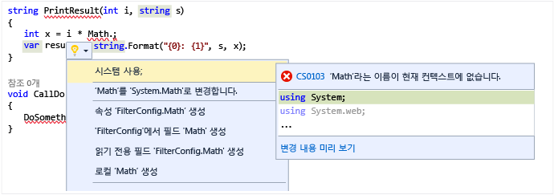

# <a name="quick-actions"></a>빠른 작업

[빠른 작업](refactoring-code-generation-quick-actions.md#quick-actions)을 사용하면 단일 작업으로 쉽게 코드를 리팩터링하거나, 생성하거나, 수정할 수 있습니다. 빠른 작업은 C#, [C++](/cpp/ide/writing-and-refactoring-code-cpp) 및 Visual Basic 코드 파일에 사용할 수 있습니다. 일부 작업은 특정 언어에 국한되며, 나머지 작업은 모든 언어에 적용됩니다. 빠른 작업은 전구 아이콘 을 사용하거나 커서가 적절한 코드 줄에 있을 때 **Ctrl** + **.**를 눌러 적용할 수 있습니다.

빨간색 오류 표시선이 나타나는 경우 전구가 표시되며 Visual Studio에서는 문제 해결 방법에 대한 제안이 나타납니다. 예를 들어 빨간색 오류 표시선으로 나타난 오류가 있는 경우 해당 오류에 대한 해결 방법을 사용할 수 있을 때 전구가 나타납니다. 어떤 언어든지 타사에서 SDK에 포함하는 방식 등을 통해 사용자 지정 진단 및 제안을 제공할 수 있으며 Visual Studio 전구는 이러한 규칙을 기반으로 켜집니다.

## <a name="to-see-a-light-bulb"></a>전구를 표시하려면

1. 대부분의 경우 전구는 오류 지점에 마우스를 가져갈 때 자연스럽게 나타나거나 오류가 있는 줄로 캐럿을 이동할 때 편집기의 왼쪽 여백에 자동으로 나타납니다. 빨간색 오류 표시선이 보이면 마우스로 가리켜 전구를 표시할 수 있습니다. 줄에서 오류가 발생한 위치로 이동하기 위해 마우스나 키보드를 사용할 때 전구가 표시되도록 할 수도 있습니다.

1. 줄의 임의 위치에서 **Ctrl** + **.**를 눌러 줄의 임의 위치를 눌러 전구를 호출하고 잠재적 해결 방법 목록으로 바로 이동합니다.

   

## <a name="to-see-potential-fixes"></a>잠재적 해결 방법을 보려면

아래쪽 화살표나 잠재적 해결 방법 표시 링크를 클릭하여 전구가 수행할 수 있는 빠른 작업 목록을 표시합니다.



## <a name="common-quick-actions"></a>일반적인 빠른 작업

다음은 C# 및 Visual Basic 코드 모두에 적용할 수 있는 일반적인 빠른 작업 중 일부입니다.

- [오류를 수정하는 작업](#fix)
- [불필요한 코드를 제거하는 작업](#remove)
- [누락된 코드를 추가하는 작업](#add)
- [코드 변환](#transform)

### <a id="fix"></a>오류를 수정하는 작업

#### <a name="correct-misspelled-symbol-or-keyword"></a>철자가 틀린 기호 또는 키워드 수정

|  오류 ID | 해당 언어 |  지원되는 버전 |
| ------- | -------------------- | ----------------  |
| CS0103, BC30002 | C# 및 Visual Basic | Visual Studio 2015 업데이트 2 |

Visual Studio에서 실수로 형식 또는 키워드의 철자를 잘못 입력한 경우 이 빠른 작업은 자동으로 수정합니다. 이러한 항목은 전구 메뉴에 **“Change ‘*misspelled word*’ to ‘*correct word*(‘철자가 잘못된 단어’을(를) ‘올바른 형식’(으)로 변경)**로 표시됩니다.  예:

```csharp
// Before
private viod MyMethod()
{
}

// Change 'viod' to 'void'

// After
private void MyMethod()
{
}
```

```vb
' Before
Function MyFunction as Intger
End Function

' Change 'Intger' to 'Integer'

' After
Function MyFunction as Integer
End Function
```

#### <a name="resolve-git-merge-conflict"></a>Git 병합 충돌 해결

|  오류 ID | 해당 언어 |  지원되는 버전 |
| ------- | -------------------- | ----------------  |
| CS8300, BC37284  | C# 및 Visual Basic | Visual Studio 2017 15.3 버전 |

이러한 빠른 작업을 통해 충돌 코드 및 표식을 제거하는 "변경을 적용"하여 Git 병합 충돌을 해결할 수 있습니다.  

```csharp
// Before
private void MyMethod()
{
<<<<<<< HEAD
    if (true)
    {

    }
=======
    if (false)
    {

    }
>>>>>>> upstream
}

// Take changes from 'HEAD'

// After
private void MyMethod()
{
    if (true)
    {

    }
}
```

#### <a name="make-method-synchronous"></a>메서드 동기화

|  오류 ID | 해당 언어 |  지원되는 버전 |
| ------- | -------------------- | ----------------  |
| CS1998, BC42356 | C# 및 Visual Basic | Visual Studio 2015 업데이트 2 |

메서드에서 `async` 또는 `Async` 키워드를 사용하면 해당 메서드 내 어딘가에서 `await` 또는 `Await` 키워드도 사용될 것으로 예상됩니다.  그러나 그렇지 않을 경우 빠른 작업은 `async` 또는 `Async` 키워드를 제거하고 반환 형식을 변경하여 메서드를 동기화할 수 있음을 나타냅니다. [빠른 작업] 메뉴에서 **Make method synchronous**(메서드 동기화) 옵션을 사용합니다.

```csharp
// Before
async Task<int> MyAsyncMethod()
{
    return 3;
}

// Make method synchronous

// After
int MyAsyncMethod()
{
    return 3;
}
```

```vb
' Before
Async Function MyAsyncMethod() As Task(Of Integer)
    Return 3
End Function

' Make method synchronous

' After
Function MyAsyncMethod() As Integer
    Return 3
End Function
```

#### <a name="make-method-asynchronous"></a>메서드 비동기화

|  오류 ID | 해당 언어 |  지원되는 버전 |
| ------- | -------------------- | ----------------  |
| CS4032, BC37057 | C# 및 Visual Basic | Visual Studio 2017 |

메서드 내에서 `await` 또는 `Await` 키워드를 사용하는 경우 메서드 자체가 `async` 또는 `Async` 키워드로 표시되는 것으로 예상됩니다.  그러나 그렇지 않을 경우 빠른 작업은 메서드를 비동기화할 수 있음을 나타냅니다. [빠른 작업] 메뉴에서 **Make method/Function asynchronous**(메서드/함수 비동기화) 옵션을 사용합니다.

```csharp
// Before
int MyAsyncMethod()
{
    return await Task.Run(...);
}

// Make method asynchronous

// After
async Task<int> MyAsyncMethod()
{
    return await Task.Run(...);
}
```

```vb
' Before
Function MyAsyncMethod() as Integer
    Return  Await Task.Run(...)
End Function

' Make method asynchronous

' After
Async Function MyAsyncMethod() As Task(Of Integer)
    Return Await Task.Run(...)
End Function
```

### <a id="remove"></a>불필요한 코드를 제거하는 작업

#### <a name="remove-unnecesary-usingsimports"></a>불필요한 using/Import 제거

|  해당 언어 |  지원되는 버전 |
|  -------------------- | ----------------  |
|  C# 및 Visual Basic | Visual Studio 2015 RTW |

**Remove Unnecessary Usings/Imports**(불필요한 Using/Import 제거) 빠른 작업은 현재 파일에 대해 사용되지 않은 `using` 및 `Import` 문을 제거합니다.  이 항목을 선택하면 사용되지 않은 네임스페이스 가져오기가 바로 제거됩니다.

#### <a name="remove-unnecessary-cast"></a>불필요한 캐스트 제거

|  진단 ID | 해당 언어 |  지원되는 버전 |
| ------- | -------------------- | ----------------  |
| IDE0004 | C# 및 Visual Basic | Visual Studio 2015 RTW |

형식을 캐스트가 필요 없는 다른 형식으로 캐스트하는 경우 **불필요한 캐스트 제거** 빠른 작업 항목은 코드에서 캐스트를 제거합니다.

```csharp
// before
int number = (int)3;

// Remove Unnecessary Cast

// after
int number = 3;
```

```vb
' Before
Dim number as Integer = CType(3, Integer)

' Remove Unnecessary Cast

' After
Dim number as Integer = 3
```

#### <a name="remove-unused-variables"></a>사용하지 않는 변수 제거

|  진단 ID | 해당 언어 |  지원되는 버전 |
| ------- | -------------------- | ----------------  |
| CS0219, BC42024 | C# 및 Visual Basic | Visual Studio 2017 15.3 버전 |

이 빠른 작업을 통해 코드에서 사용된 적이 없고 사용되지 않는 변수를 제거할 수 있습니다.

```csharp
// Before
public MyMethod()
{
    var unused = 8;
    var used = 1;
    return DoStuff(used);
}

// Remove unused variables

// After
public MyMethod()
{
    var used = 1;
    return DoStuff(used);
}
```

#### <a name="remove-type-from-default-value-expression"></a>**기본** 값 식에서 형식 제거

|  진단 ID | 해당 언어 |  지원되는 버전 |
| ------- | -------------------- | ----------------  |
| IDE0034 | C# 7.1+ | Visual Studio 2017 15.3 버전 |

이 빠른 작업은 기본 값 식에서 값 형식을 제거하고 컴파일러가 식의 형식을 유추할 수 있는 경우 [`default` 리터럴](/dotnet/csharp/programming-guide/statements-expressions-operators/default-value-expressions#default-literal-and-type-inference)을 사용합니다.

```csharp
// Before
void DoWork(CancellationToken cancellationToken = default(CancellationToken)) { ... }

// Simplify default expression

// After
void DoWork(CancellationToken cancellationToken = default) { ... }

```

### <a id="add"></a>누락된 코드를 추가하는 작업

#### <a name="add-usingsimports-for-types-in-reference-assemblies-nuget-packages-or-other-types-in-your-solution"></a>참조 어셈블리나 NuGet 패키지의 형식 또는 솔루션의 다른 형식에 대해 using/Import 추가

|  진단 ID | 해당 언어 |  지원되는 버전 |
| ------- | -------------------- | ----------------  |
| CS0103, BC30451 | C# 및 Visual Basic| Visual Studio 2015 업데이트 2 |

솔루션의 다른 프로젝트에 있는 형식을 사용하면 빠른 작업이 자동으로 표시되지만 **도구 > 옵션 > C#** 또는 **Basic > 고급** 탭에서 다른 작업을 사용하도록 설정해야 합니다.

- 참조 어셈블리의 형식에 대해 using/import 제안
- NuGet 패키지의 형식에 대해 using/import 제안

사용하도록 설정한 경우 현재 가져오지 않고 참조 어셈블리 또는 NuGet 패키지에 있는 네임스페이스의 형식을 사용하면 using/import 문이 생성됩니다.

```csharp
// Before
Debug.WriteLine("Hello");

// using System.Diagnostics;

// After
using System.Diagnostics;

Debug.WriteLine("Hello");
```

```vb
' Before
Debug.WriteLine("Hello")

' Imports System.Diagnostics

// After
Imports System.Diagnostics

Debug.WriteLine("Hello")
```

#### <a name="add-missing-casesdefault-caseboth"></a>누락된 사례/기본 사례/모두 추가

|  진단 ID | 해당 언어 |  지원되는 버전 |
| ------- | -------------------- | ----------------  |
| IDE0010 | C# 및 Visual Basic| Visual Studio 2017 15.3 버전 |

C#의 `switch` 문이나 Visual Basic의 `Select Case` 문을 만들 때 코드 동작을 사용하여 누락된 사례 항목, 기본 사례 문 또는 모두를 자동으로 추가할 수 있습니다.

다음 열거형 및 빈 `switch` 또는 `Select Case` 문을 고려하세요.

```csharp
enum MyEnum
{
    Item1,
    Item2,
    Item3
}

...

MyEnum myEnum = MyEnum.Item1;

switch(myEnum)
{
}
```

```vb
Enum MyEnum
    Item1
    Item2
    Item3
End Enum

...

Dim myEnum as MyEnum = MyEnum.Item1

Select Case myEnum
End Select
```

**Add Both**(둘 다 추가)를 사용하면 빠른 작업에서 누락된 사례를 채우고 기본 사례를 추가합니다.

```csharp
switch(myEnum)
{
    case MyEnum.Item1:
        break;
    case MyEnum.Item2:
        break;
    case MyEnum.Item3:
        break;
    default:
        break;
}
```

```vb
Select Case myEnum
    Case MyEnum.Item1
        Exit Select
    Case MyEnum.Item2
        Exit Select
    Case Else
        Exit Select
End Select
```

#### <a name="add-null-checks-for-parameters"></a>매개 변수에 대한 null 검사 추가

| 해당 언어 |  지원되는 버전 |
| -------------------- | ----------------  |
| C# 및 Visual Basic| Visual Studio 2017 15.3 버전 |

빠른 작업을 통해 매개 변수가 null인지 알려주는 검사를 코드에 추가할 수 있습니다.

```csharp
// Before
class MyClass
{
    public string MyProperty { get; set; }

    public MyClass(string myProperty) // cursor inside myProperty
    {
        MyProperty = myProperty;
    }
}

// Add null check

// After
class MyClass
{
    public string MyProperty { get; set; }

    public MyClass(string myProperty)
    {
        MyProperty = myProperty ?? throw new ArgumentNullException(nameof(myProperty));
    }
}
```

#### <a name="add-argument-name"></a>인수 이름 추가

| 해당 언어 |  지원되는 버전 |
| -------------------- | ----------------  |
| C# 및 Visual Basic| Visual Studio 2017 15.3 버전 |

```csharp
// Before
var date = new DateTime(1997, 7, 8);

// Include argument name 'year' (include trailing arguments)

// After
var date = new DateTime(year: 1997, month: 7, day: 8);
```

#### <a name="add-braces"></a>중괄호 추가

|  진단 ID | 해당 언어 |  지원되는 버전 |
| ------- | -------------------- | ----------------  |
| IDE0011 | C# | Visual Studio 2017 RTW |

중괄호 추가 빠른 작업은 한 줄 `if` 문 앞뒤에 중괄호를 래핑합니다.

```csharp
// Before
if (true)
    return "hello,world";

// Add braces

// After
if (true)
{
    return "hello,world";
}
```

#### <a name="add-and-order-modifiers"></a>한정자 추가 및 정렬

|  진단 ID | 해당 언어 |  지원되는 버전 |
| ------- | -------------------- | ----------------  |
| IDE0036 | C# 및 Visual Basic| Visual Studio 2017 15.5 버전 |
| IDE0040 | C# 및 Visual Basic| Visual Studio 2017 15.5 버전 |

이러한 빠른 작업을 통해 기존 한정자를 정렬하고 누락된 액세스 가능성 한정자를 추가하여 한정자를 구성할 수 있습니다.

```csharp
// Before
enum Color
{
    Red, White, Blue
}

// Add accessibility modifiers

// After
internal enum Color
{
    Red, White, Blue
}
```

```csharp
// Before
static private int thisFieldIsPublic;

// Order modifiers

// After
private static int thisFieldIsPublic;
```

### <a id="transform"></a>코드 변환

#### <a name="convert-if-construct-to-switch"></a>**if** 구문을 **switch**로 변환

| 해당 언어 |  지원되는 버전 |
| -------------------- | ----------------  |
| C# 및 Visual Basic| Visual Studio 2017 15.3 버전 |

이 빠른 작업을 통해 **if-then-else** 구문을 **switch** 구문으로 변환할 수 있습니다.

```csharp
// Before
if (obj is string s)
{
  Console.WriteLine("obj is a string: " + s);
}

else if (obj is int i && i > 10)
{
  Console.WriteLine("obj is an int greater than 10");
}

// Convert to switch

// After
switch (obj)
{
  case string s:
    Console.WriteLine("Obj is a string: " + s);
    break;
  case int i when i > 10:
    Console.WriteLine("obj is an int greater than 10");
    break;
}
```

```vb
' Before
If TypeOf obj Is String s Then
    Console.WriteLine("obj is a string: " + s)
Else If TypeOf obj Is Integer i And i > 10 Then
    Console.WriteLine("obj is an int greater than 10")
End If

' Convert to switch

' After
Select Case obj
  Case String s
    Console.WriteLine("Obj is a string: " + s)
    Exit Sub
  Case Integer i when i > 10
    Console.WriteLine("obj is an int greater than 10")
    Exit Sub
End Select
```

#### <a name="convert-to-interpolated-string"></a>보간된 문자열로 변환

| 해당 언어 |  지원되는 버전 |
| -------------------- | ----------------  |
| C# 6.0 이상 및 Visual Basic 14 이상 | Visual Studio 2017 RTW |

[보간된 문자열](/dotnet/csharp/language-reference/keywords/interpolated-strings)은 포함된 변수로 문자열을 표현하는 간단한 방법이며, **[String.Format](https://msdn.microsoft.com/library/system.string.format.aspx)** 메서드와 유사합니다.  이 빠른 작업은 문자열이 연결되는 사례를 인식하거나 **String.Format**을 사용하여 사용법을 보간된 문자열로 변경합니다.

```csharp
// Before
int num = 3;
string s = string.Format("My string with {0} in the middle", num);

// Convert to interpolated string

// After
int num = 3;
string s = $"My string with {num} in the middle";
```

```vb
' Before
Dim num as Integer = 3
Dim s as String = String.Format("My string with {0} in the middle", num)

' Convert to interpolated string

' After
Dim num as Integer = 3
Dim s As String = $"My string with {num} in the middle"
```

#### <a name="use-object-initializers"></a>개체 이니셜라이저 사용

| 진단 ID | 해당 언어 | 지원되는 버전 |
| ------- | -------------------- | ----------------  |
| IDE0017 | C# 및 Visual Basic | Visual Studio 2017 RTW |

이 빠른 작업을 사용하면 생성자를 호출하고 대입문의 줄을 추가하는 대신 [개체 이니셜라이저](/dotnet/csharp/programming-guide/classes-and-structs/object-and-collection-initializers.md)를 사용할 수 있습니다.

```csharp
// Before
var c = new Customer();
c.Age = 21;

// Object initialization can be simplified

// After
var c = new Customer() { Age = 21 };
```

```vb
' Before
Dim c = New Customer()
c.Age = 21

' Object initialization can be simplified

' After
Dim c = New Customer() With {.Age = 21}
```

#### <a name="use-collection-initializers"></a>컬렉션 이니셜라이저 사용

| 진단 ID | 해당 언어 | 지원되는 버전 |
| ------- | -------------------- | ----------------  |
| IDE0028 | C# 및 Visual Basic | Visual Studio 2017 RTW |

이 빠른 작업을 사용하면 클래스의 `Add` 메서드를 여러 번 호출하는 대신 [컬렉션 이니셜라이저](/dotnet/csharp/programming-guide/classes-and-structs/object-and-collection-initializers.md)를 사용할 수 있습니다.

```csharp
// Before
var list = new List<int>();
list.Add(1);
list.Add(2);
list.Add(3);

// Collection initialization can be simplified

// After
var list = new List<int> { 1, 2, 3 };
```

```vb
' Before
Dim list = New List(Of Integer)
list.Add(1)
list.Add(2)
list.Add(3)

' Collection initialization can be simplified

' After
Dim list = New List(Of Integer) From {1, 2, 3}

```

#### <a name="convert-auto-property-to-full-property"></a>자동 속성을 전체 속성으로 변환

|  해당 언어 |  지원되는 버전 |
|  -------------------- | ----------------  |
| C# 및 Visual Basic | Visual Studio 2017 15.5 버전 |

이 빠른 작업을 통해 자동 속성을 전체 속성으로 변환하거나 그 반대로도 변환할 수 있습니다.

```csharp
// Before
private int MyProperty { get; set; }

// Convert to full property

// After
private int MyProperty
{
    get { return _myProperty; }
    set { _myProperty = value; }
}
```

```vb
' Before
Public Property Name As String

' Convert to full property

' After
Private _Name As String

Public Property Name As String
    Get
        Return _Name
    End Get
    Set
        _Name = Value
    End Set
End Property
```

#### <a name="convert-block-body-to-expression-bodied-member"></a>블록 본문을 식 본문 멤버로 변환

|  진단 ID | 해당 언어 |  지원되는 버전 |
| ------- | -------------------- | ----------------  |
| IDE0021-27 | C# 6.0+ | Visual Studio 2017 RTW |

이 빠른 작업을 사용하면 메서드, 생성자, 연산자, 속성, 인덱서 및 접근자의 경우 블록 본문을 식 본문 멤버로 변환할 수 있습니다.

```csharp
//Before
class MyClass4
{
    private int _myProperty;

    public int MyProperty
    {
        get { return _myProperty; }
        set
        {
            _myProperty = value;
        }
    }

    public MyClass4(int myProperty)
    {
        MyProperty = myProperty;
    }

    public void PrintProperty()
    {
        Console.WriteLine(MyProperty);
    }
}

// Use expression body for accessors/constructors/methods

// After
class MyClass4
{
    private int _myProperty;

    public int MyProperty
    {
        get => _myProperty;
        set => _myProperty = value;
    }

    public MyClass4(int myProperty) => MyProperty = myProperty;

    public void PrintProperty() => Console.WriteLine(MyProperty);
}
```

#### <a name="convert-anonymous-function-to-local-function"></a>익명 함수를 로컬 함수로 변환

|  진단 ID | 해당 언어 |  지원되는 버전 |
| ------- | -------------------- | ----------------  |
| IDE0039 | C# 7.0+ | Visual Studio 2017 15.5 버전 |

이 빠른 작업은 익명 함수를 로컬 함수로 변환합니다.

```csharp
// Before
Func<int, int> fibonacci = null;
fibonacci = (int n) =>
{
    return n <= 1 ? 1 : fibonacci(n - 1) + fibonacci(n - 2);
};

// Use local function

// After
int fibonacci(int n)
{
    return n <= 1 ? 1 : fibonacci(n-1) + fibonacci(n-2);
}
```

#### <a name="convert-referenceequals-to-is-null"></a>`ReferenceEquals`를 `is null`로 변환

|  진단 ID | 해당 언어 |  지원되는 버전 |
| ------- | -------------------- | ----------------  |
| IDE0041 | C# 7.0+ | Visual Studio 2017 15.5 버전 |

이 빠른 작업은 가능한 경우 ```ReferenceEquals``` 코딩 패턴보다는 [패턴 일치](/dotnet/csharp/pattern-matching)를 사용하도록 제안합니다.

```csharp
// Before
var value = "someString";
if (object.ReferenceEquals(value, null))
{
    return;
}

// Use 'is null' check

// After
var value = "someString";
if (value is null)
{
    return;
}
```

#### <a name="introduce-pattern-matching"></a>패턴 일치 소개

| 진단 ID | 해당 언어 | 지원되는 버전 |
| ------- | -------------------- | ----------------  |
| IDE0020 | C# 7.0+ | Visual Studio 2017 RTW |
| IDE0019 | C# 7.0+ | Visual Studio 2017 RTW |

이 빠른 작업은 C#의 캐스트 및 null 검사를 포함한 [패턴 일치](/dotnet/csharp/pattern-matching)를 사용하도록 제안합니다.   

```csharp
// Before
if (o is int)
{
    var i = (int)o;
    ...
}

// Use pattern matching

// After
if (o is int i)
{
    ...
}

```

```csharp
// Before
var s = o as string;
if (s != null)
{
    ...
}

// Use pattern matching

// After
if (o is string s)
{
    ...
}
```

#### <a name="change-base-for-numeric-literals"></a>숫자 리터럴에 대한 기본 변경

| 해당 언어 | 지원되는 버전 |
| ------- | -------------------- | ----------------  |
| C# 7.0+ 및 Visual Basic 14+ | Visual Studio 2017 15.3 버전 |

이 빠른 작업을 통해 기본 숫자 시스템 간에 숫자 리터럴을 변환할 수 있습니다. 예를 들어 숫자를 16진수 또는 이진 형식으로 변경할 수 있습니다. 

```csharp
// Before
int countdown = 2097152;

// Convert to hex

// After
int countdown = 0x200000;
```

```vb
' Before
Dim countdown As Integer = 2097152

' Convert to hex

' After
Dim countdown As Integer = &H200000
```

#### <a name="insert-digit-separators-into-literals"></a>자릿수 구분 기호를 리터럴로 삽입

| 해당 언어 | 지원되는 버전 |
| ------- | -------------------- | ----------------  |
| C# 7.0+ 및 Visual Basic 14+ | Visual Studio 2017 15.3 버전 |

이 빠른 작업을 통해 구분 기호 문자를 리터럴 값으로 추가할 수 있습니다.

```csharp
// Before
int countdown = 1000000;

// Separate thousands

// After
int countdown = 1_000_000;
```

```vb
' Before
Dim countdown As Integer = 1000000

' Separate thousands

' After
Dim countdown As Integer = 1_000_000
```

#### <a name="use-explicit-tuple-names"></a>명시적 튜플 이름 사용

| 진단 ID | 해당 언어 | 지원되는 버전 |
| ------- | -------------------- | ----------------  |
| IDE0033 | C# 7.0+ 및 Visual Basic 15+ | Visual Studio 2017 RTW |

이 빠른 작업은 Item1, Item2 대신 명시적 튜플 이름을 사용할 수 있는 영역을 식별합니다.

```csharp
// Before
(string name, int age) customer = GetCustomer();
var name = customer.Item1;

// Use explicit tuple name

// After
(string name, int age) customer = GetCustomer();
var name = customer.name;
```

```vb
' Before
Dim customer As (name As String, age As Integer) = GetCustomer()
Dim name = customer.Item1

' Use explicit tuple name

' After
Dim customer As (name As String, age As Integer) = GetCustomer()
Dim name = customer.name
```

#### <a name="use-inferred-names"></a>유추된 이름 사용

| 진단 ID | 해당 언어 | 지원되는 버전 |
| ------- | -------------------- | ----------------  |
| IDE0037 | C# | Visual Studio 2017 v. 15.5 |
| IDE0037 | C# 7.1+ | Visual Studio 2017 v. 15.5 |

이러한 빠른 작업은 사용자가 익명 형식의 유추된 멤버 이름을 사용할 수 있는 경우 또는 C# 7.1의 유추된 튜플 요소 이름을 사용할 수 있는 경우를 가려냅니다.

```csharp
// Before
var anon = new { age = age, name = name };

// Use inferred member name

// After
var anon = new { age, name };
```

```csharp
// Before
var tuple = (age: age, name: name);

// Use inferred tuple element name

// After
var tuple = (age, name);
```

#### <a name="deconstruct-tuple-declaration"></a>튜플 선언 해체

| 진단 ID | 해당 언어 | 지원되는 버전 |
| ------- | -------------------- | ----------------  |
| IDE0042 | C# 7.0+ | Visual Studio 2017 v. 15.5 |

이 빠른 작업을 사용하면 튜플 변수 선언을 해체할 수 있습니다. 

```csharp
// Before
var person = GetPersonTuple();
Console.WriteLine($"{person.name} {person.age}");

(int x, int y) point = GetPointTuple();
Console.WriteLine($"{point.x} {point.y}");

//Deconstruct variable declaration

// After
var (name, age) = GetPersonTuple();
Console.WriteLine($"{name} {age}");

(int x, int y) = GetPointTuple();
Console.WriteLine($"{x} {y}");
```

## <a name="see-also"></a>참고 항목

[코드 스타일 및 빠른 작업](code-styles-and-quick-actions.md)  
[코드 작성 및 리팩터링(C++)](/cpp/ide/writing-and-refactoring-code-cpp)
