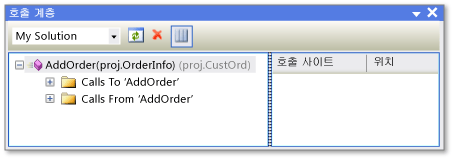

# 호출 계층 구조 보기

코드의 호출 계층 구조를 보면 선택한 메서드, 속성 또는 생성자에서 모든 호출을 탐색할 수 있습니다. 이렇게 하면 코드가 흐르는 방식을 더 잘 이해하고 코드에 대한 변경 내용의 영향을 평가할 수 있습니다. 메서드 호출의 복합 체인과 코드에 대한 추가적인 진입점을 보기 위해 여러 수준의 코드를 검토할 수 있습니다. 이렇게 하면 모든 가능한 실행 경로를 탐색할 수 있습니다.

Visual Studio에서 디자인 타임에 호출 계층 구조를 볼 수 있습니다. 이는 런타임 호출 스택을 보기 위해 중단점을 설정하고 디버거를 시작할 필요가 없음을 의미합니다.

## 호출 계층 구조 창 사용

**호출 계층 구조** 창을 표시하려면 메서드, 속성 또는 생성자 호출의 이름을 마우스 오른쪽 단추로 클릭한 다음 **호출 계층 구조 보기**를 클릭합니다.

트리 뷰 창의 **호출 계층 구조** 창에 멤버 이름이 나타납니다. 멤버 노드를 확장하는 경우 ‘멤버 이름’**에 대한 호출** 및 ‘멤버 이름’**에서의 호출** 하위 노드가 나타납니다. 다음 그림은 **호출 계층 구조** 창에서 이러한 노드를 보여줍니다.

- **호출 대상** 노드를 확장할 경우 선택한 멤버를 호출하는 모든 멤버가 표시됩니다.

- **호출 시작** 노드를 확장할 경우 선택한 멤버가 호출하는 모든 멤버가 표시됩니다.

그런 다음, 이러한 각각의 하위 멤버를 **호출 대상** 및 **호출 시작** 노드로 확장할 수 있습니다. 이렇게 하면 다음 그림에 나와 있는 것처럼 호출자 스택을 탐색할 수 있습니다.

가상 또는 추상으로 정의된 멤버의 경우 **메서드 이름 재정의** 노드가 표시됩니다. 인터페이스 멤버의 경우 **메서드 이름 구현** 노드가 표시됩니다. 이러한 확장 가능한 노드는 **호출 대상** 및 **호출 시작** 노드와 같은 수준에서 표시됩니다.

도구 모음의 **검색 범위**에는 **내 솔루션**, **현재 프로젝트** 및 **현재 문서**에 대한 선택 사항이 포함되어 있습니다.

**호출 계층 구조** 트리 뷰 창에서 자식 멤버를 선택할 경우:

- **호출 계층 구조** 세부 정보 창은 상위 멤버에서 호출되는 해당 자식 멤버에 코드의 모든 라인을 표시합니다.

- **코드 정의 창**이 열려 있는 경우 선택한 멤버에 대한 코드가 표시됩니다(C++에만 해당). 이 창에 대한 자세한 내용은 [코드 구조 보기](../../ide/viewing-the-structure-of-code.md)를 참조하세요.

> [!NOTE]
> 호출 계층 구조 기능은 메서드가 이벤트 처리기로 추가되거나 대리자에 할당되는 위치가 포함된 메서드 그룹 참조를 찾지 않습니다. 메서드에 대한 모든 참조를 찾으려면 **모든 참조 찾기** 명령을 사용할 수 있습니다.

### 바로 가기 메뉴 항목

다음 표는 트리 뷰 창에서 노드를 마우스 오른쪽 단추로 클릭할 때 사용할 수 있는 여러 가지 바로 가기 메뉴 옵션을 설명합니다.

|상황에 맞는 메뉴 항목|설명|
|-----------------------|-----------------|
|**새 루트로 추가**|선택한 노드를 새 루트 노드로 트리 뷰 창에 추가합니다. 이를 통해 특정 하위 트리에 집중할 수 있습니다.|
|**루트 제거**|트리 뷰 창에서 선택한 루트 노드를 제거합니다. 이 옵션은 루트 노드에서만 사용할 수 있습니다.   또한 **루트 제거** 도구 모음 단추를 선택하여 선택한 루트 노드를 제거할 수도 있습니다.|
|**정의로 이동**|선택한 노드에서 정의로 이동 명령을 실행합니다. 멤버 호출 또는 가변 정의에 대한 원래 정의로 이동합니다.   정의로 이동 명령을 실행하려면 선택한 노드를 두 번 클릭 하거나 선택한 노드에서 F12 키를 누를 수 있습니다.|
|**모든 참조 찾기**|선택한 노드에서 모든 참조 찾기 명령을 실행합니다. 그러면 클래스 또는 멤버를 참조하는 프로젝트에서 모든 코드 줄을 찾습니다.   또한 SHIFT+F12를 사용하여 선택한 노드에서 모든 참조 찾기 명령을 실행할 수도 있습니다.|
|**복사**|선택한 노드(하위 노드 제외)의 내용을 복사합니다.|
|**새로 고침**|선택한 노드를 축소한 다음 다시 확장하면 현재 정보가 표시됩니다.|